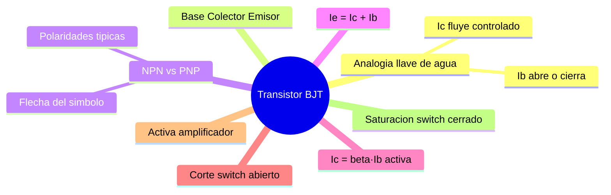

---
{"dg-publish":true,"permalink":"/universidad/3er-semestre/fundamentos-de-electricidad-y-sistemas-digitales/teorico/unidad-2-introduccion-a-la-electronica/03-transistor-bjt/","dg-note-properties":{}}
---


# ⚙️ Transistor BJT — Switch o Amplificador

## 🎯 Introducción

> [!info] ⚙️ ¿Qué es el transistor?
> 
> El **transistor BJT (Bipolar Junction Transistor)** es un elemento semiconductor de tres terminales formado por dos uniones P-N (ver [[Universidad/3er Semestre/Fundamentos de Electricidad y Sistemas Digitales/Teórico/Unidad 2 - Introducción a la Electrónica/02 - El Diodo - Unión P-N\|02 - El Diodo - Unión P-N]]). Puede operar como **interruptor (switch)** o como **amplificador de señal**.
> 
> |Terminal|Símbolo|Función|
> |---|---|---|
> |**Base (B)**|Control|Controla la corriente de colector|
> |**Colector (C)**|Principal|Por donde entra la corriente principal|
> |**Emisor (E)**|Salida|Por donde sale la corriente total|

---

## 🧠 ¿Cómo funciona, en palabras simples?

> [!tip] 🚰 Analogía de la llave de agua
> 
> Imagina una tubería principal con una llave de paso. Girar la llave requiere muy poca fuerza (tu mano), pero controla un chorro de agua mucho más grande que fluye por la tubería.
> 
> El transistor hace exactamente eso, pero con corriente eléctrica:
> 
> - La **Base** es como la llave: una corriente pequeña ($I_B$) es todo lo que necesitas para "abrir" o "cerrar" el paso.
> - El **Colector → Emisor** es la tubería principal: por ahí fluye la corriente grande ($I_C$), que puede ser cientos de veces mayor que $I_B$.
> - Cuánto abras la llave (cuánto $I_B$ metas) determina cuánta agua pasa (cuánto $I_C$ circula) — eso es **amplificar**.
> - Si cierras la llave del todo, no pasa agua (**corte**). Si la abres al máximo, pasa todo lo que la tubería permite (**saturación**).
> 
> > 💡 En una unión (Emisor-Base) el transistor está "abierto" a propósito (como un diodo en directa) para que la corriente entre; en la otra unión (Base-Colector) está "cerrado" a propósito (como un diodo en inversa) para que la corriente no se escape por ahí, sino que sea "succionada" hacia el Colector.

---

## 🔀 Estructura NPN vs PNP

> [!note] 🔀 Dos sabores del mismo dispositivo
> 
> El NPN y el PNP funcionan bajo el mismo principio (una corriente pequeña de base controla una corriente grande), pero con los materiales y las corrientes invertidas entre sí.
> 
> |Aspecto|NPN|PNP|
> |---|---|---|
> |**Estructura**|N — P — N|P — N — P|
> |**Portador mayoritario**|Electrones|Huecos|
> |**Flecha en el símbolo (emisor)**|Apunta hacia afuera de la base|Apunta hacia adentro de la base|
> |**Polaridades típicas para conducir**|$V_C > V_B > V_E$|$V_E > V_B > V_C$|
> |**Uso más común**|El más usado en la práctica|Complementa al NPN en algunos diseños (ej. push-pull)|
> 
> **Cómo leer la flecha del símbolo — el truco fácil:**
> 
> - **NPN:** "**N**ot **P**ointing i**N**" → la flecha **no apunta hacia adentro** (sale de la base).
> - **PNP:** la flecha **sí apunta hacia adentro** (entra hacia la base).

---

## 📐 Relaciones Fundamentales de Corriente

> [!note] 📐 Ecuaciones base
> 
> En números: toda la corriente que entra por el Emisor sale repartida entre Base y Colector. Y mientras el transistor está "amplificando" (región activa), la corriente de Colector es simplemente beta veces la de Base.
> 
> $$\boxed{I_E = I_C + I_B} \quad \text{(siempre — KCL)}$$
> 
> $$\boxed{I_C = beta \cdot I_B} \quad \text{(solo en zona activa)}$$
> 
> Donde beta es la **ganancia de corriente** (típicamente entre 20 y 500).

---

## 🔄 Regiones de Operación

> [!note] 🔄 Corte, Activa y Saturación
> 
> Siguiendo la analogía de la llave: **corte** = llave cerrada (nada pasa), **activa** = llave a medio abrir (tú controlas cuánto pasa), **saturación** = llave abierta al máximo (ya no puedes controlar más, pasa todo lo que la tubería permite).
> 
> ```mermaid
> graph TD
>     A{Estado del<br/>transistor} --> B[CORTE<br/>Ib = 0<br/>Ic ~ 0<br/>Vce = Vcc]
>     A --> C[ACTIVA<br/>Ic = beta·Ib<br/>Vce variable]
>     A --> D[SATURACION<br/>Ic = Icmax<br/>Vce ~ 0]
> 
>     B --> B1[Switch ABIERTO]
>     C --> C1[AMPLIFICADOR]
>     D --> D1[Switch CERRADO]
> 
>     style B fill:#ffe1e1
>     style C fill:#fff4e1
>     style D fill:#e1ffe1
>     style B1 fill:#ffe1e1
>     style C1 fill:#fff4e1
>     style D1 fill:#e1ffe1
> ```
> 
> |Región|Condición|$I_C$|$V_{CE}$|Uso|
> |---|---|---|---|---|
> |**Corte**|$I_B = 0$|$\approx 0$|$V_{CC}$|Switch abierto|
> |**Activa**|$I_B > 0$, sin saturar|$beta \cdot I_B$|Variable|Amplificador|
> |**Saturación**|$I_B$ suficientemente grande|$I_{C_{max}}$|$\approx 0$|Switch cerrado|

---

## 🧮 Metodología para Análisis como Switch

> [!warning] 🧮 Pasos para determinar la región de operación
> 
> ```mermaid
> graph TD
>     P1[1 Asumir region activa<br/>Ic = beta·Ib] --> P2
>     P2[2 Calcular Ib<br/>con KVL en malla de base] --> P3
>     P3[3 Calcular Ic = beta·Ib] --> P4
>     P4[4 Calcular Vce<br/>con KVL en malla de colector] --> P5
>     P5{Vce > Vce_sat?}
>     P5 -->|Si| P6[Region ACTIVA confirmada]
>     P5 -->|No| P7[Transistor en SATURACION<br/>Vce = Vce_sat]
> 
>     style P1 fill:#e1f5ff
>     style P2 fill:#e1ffe1
>     style P3 fill:#fff4e1
>     style P4 fill:#e1f5ff
>     style P6 fill:#e1ffe1
>     style P7 fill:#ffe1e1
> ```
> 
> **Datos típicos del problema:**
> 
> - $V_{BEON}$: tensión base-emisor en conducción ($\approx 0.7\text{ V}$ para Si)
> - $V_{CEsat}$: tensión colector-emisor en saturación ($\approx 0.2\text{ V}$)
> - beta: ganancia de corriente

> [!tip] 📌 Regla práctica para forzar saturación
> 
> Para garantizar que el transistor entre en saturación, la corriente de base debe cumplir:
> 
> $$I_B >= \frac{I_{C(sat)}}{beta_{forzada}}$$
> 
> Donde $beta_{forzada}$ es un valor reducido (entre 5 y 10) que introduce un **margen de seguridad**.

---

## Metas de Aprendizaje

> [!note] Nivel Basico
> - [ ] Identifico terminales B, C, E y leo la flecha del simbolo para distinguir NPN vs PNP.
> - [ ] Escribo IE = IC + IB y en activa IC = beta·IB con beta tipico 20-500.
> - [ ] Distingo corte (IB=0, switch abierto), activa (amplificador) y saturacion (VCE 0.2 V, switch cerrado).

> [!note] Nivel Intermedio
> - [ ] Aplico la metodologia de 5 pasos (asumir activa -> KVL base -> IC -> KVL colector -> verificar VCE).
> - [ ] Calculo ICsat = (VCC-VCEsat)/(RC+RE) y verifico si ICactiva > ICsat para declarar saturacion.
> - [ ] Aplico la regla de saturacion forzada con beta forzada 5-10 para garantizar margen.

> [!note] Nivel Avanzado
> - [ ] Diseno la RB o VIN minima para forzar saturacion dado VCC, RC, RE y beta.
> - [ ] Justifico por que la union EB debe estar en directa y BC en inversa para amplificar.
> - [ ] Predigo el modo de un BJT en un circuito mixto y uso la analogia de la llave de agua.

---

## 📊 Resumen Visual



---

> [!quote] 📖 Fuentes consultadas
> 
> [1] A. Sedra y K. Smith, _Microelectronic Circuits_, 7th ed. New York, USA: Oxford University Press, 2015, pp. 139–220.

> [!quote] 🔗 Conexiones
> 
> - [[Universidad/3er Semestre/Fundamentos de Electricidad y Sistemas Digitales/Teórico/Unidad 2 - Introducción a la Electrónica/02 - El Diodo - Unión P-N\|02 - El Diodo - Unión P-N]] — el transistor BJT combina dos uniones P-N.
> - [[Universidad/3er Semestre/Fundamentos de Electricidad y Sistemas Digitales/Teórico/Unidad 2 - Introducción a la Electrónica/01 - Semiconductores y Bandas de Energía\|01 - Semiconductores y Bandas de Energía]] — base física de las regiones N y P.


> [!quote] 🔗 Conexiones
> - Previo: [[Universidad/3er Semestre/Fundamentos de Electricidad y Sistemas Digitales/Teórico/Unidad 2 - Introducción a la Electrónica/02 - El Diodo - Unión P-N\|02 - El Diodo - Unión P-N]] y [[Universidad/3er Semestre/Fundamentos de Electricidad y Sistemas Digitales/Teórico/Unidad 2 - Introducción a la Electrónica/01 - Semiconductores y Bandas de Energía\|01 - Semiconductores y Bandas de Energía]]
> - Siguiente: [[Universidad/3er Semestre/Fundamentos de Electricidad y Sistemas Digitales/Teórico/Unidad 2 - Introducción a la Electrónica/04 - Circuitos de Filtrado y Fuentes Lineales\|04 - Circuitos de Filtrado y Fuentes Lineales]] — donde el BJT conmuta
> - Adelante: [[Universidad/3er Semestre/Fundamentos de Electricidad y Sistemas Digitales/Teórico/Unidad 3 - Introducción a los circuitos integrados/02 - Aplicaciones de los OPAMs - Minimización de Ruido\|02 - Aplicaciones de los OPAMs - Minimización de Ruido]]

---

**Tags:** #transistor #BJT #NPN #PNP #switch #amplificador #saturacion #EYAG1037 #FESD #ESPOL #unidad2
