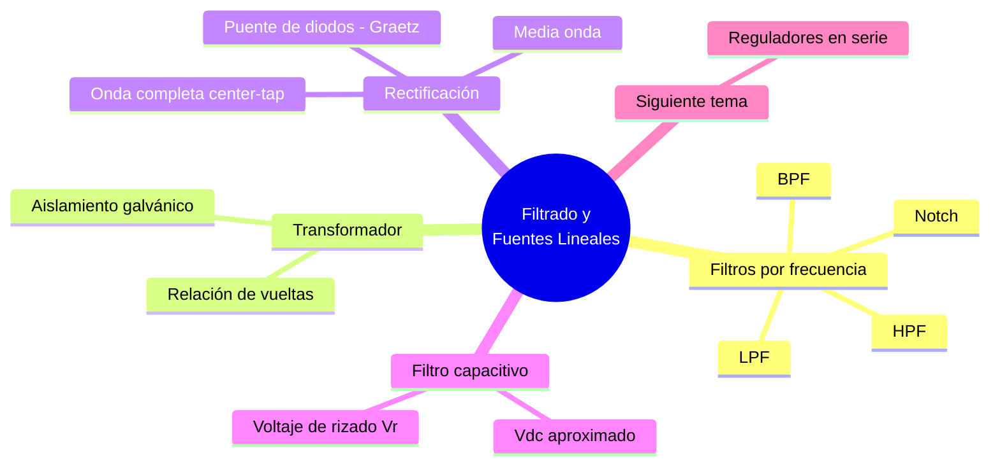

---
{"dg-publish":true,"permalink":"/universidad/3er-semestre/fundamentos-de-electricidad-y-sistemas-digitales/teorico/unidad-2-introduccion-a-la-electronica/04-circuitos-de-filtrado-y-fuentes-lineales/","dg-note-properties":{}}
---

# 🔋 Circuitos de Filtrado y Fuentes Lineales

## 🎯 Introducción

> [!info] 💡 ¿Para qué sirve una fuente lineal?
> 
> Los circuitos electrónicos casi siempre necesitan corriente directa (CD) estable, pero la red eléctrica entrega corriente alterna (CA). Una **fuente de alimentación lineal** convierte CA en CD utilizable, encadenando cuatro etapas: transformación, rectificación, filtrado y regulación.
> 
> Este enfoque —anterior a las fuentes conmutadas (switching)— sigue siendo relevante en equipos de audio de alta fidelidad, instrumentación de precisión y aplicaciones donde el ruido eléctrico debe ser mínimo, precisamente porque no genera la interferencia de alta frecuencia típica de un convertidor conmutado.
> 
> ```mermaid
> graph LR
>     A[CA de línea<br/>110V/220V] --> B[Transformador]
>     B --> C[Rectificador]
>     C --> D[Filtro]
>     D --> E[Regulador]
>     E --> F[CD estable<br/>a la carga]
> 
>     style A fill:#ffe1e1
>     style C fill:#fff4e1
>     style D fill:#e1f5ff
>     style E fill:#e1ffe1
> ```
> 
> |Etapa|Función|Elemento típico|
> |---|---|---|
> |**Transformador**|Adaptar el voltaje de línea|Núcleo + devanados|
> |**Rectificador**|CA → CD pulsante|Diodo(s)|
> |**Filtro**|Suavizar el rizado|Capacitor|
> |**Regulador**|Mantener voltaje constante|Zener, transistor o IC|

---

## 🎛️ Filtros: Concepto General y Clasificación por Frecuencia

> [!info] 🎛️ ¿Qué es un filtro?
> 
> Un **filtro** es un elemento que atenúa o discrimina una gama de frecuencias de una señal eléctrica que lo atraviesa, modificando su amplitud ($A$) y/o su fase ($\Phi$). Pueden ser **pasivos** (solo R, L, C) o **activos** (incluyen elementos activos como amplificadores operacionales).
> 
> Cada circuito de filtrado tiene una **función de transferencia** que relaciona el voltaje de salida con el de entrada; la forma de esa función y sus parámetros determinan la respuesta en frecuencia del filtro.
> 
> Según la banda de frecuencias que dejan pasar, se clasifican en cuatro tipos:

> [!note] 🔉 Pasa bajo (LPF - Low Pass Filter)
> 
> Deja pasar las frecuencias por debajo de la frecuencia de corte $f_c$ y atenúa las superiores.
> 
> $$\frac{V_o}{V_{in}} = \frac{\omega_c}{s+\omega_c}$$
> 
> $$\omega_c = \frac{1}{RC} \qquad \omega_c = \frac{R}{L} \qquad \omega = 2\pi f$$
> 
> Circuito RC (R en serie, C a tierra en la salida) o circuito RL (L en serie, R a tierra en la salida).

> [!note] 🔊 Pasa alto (HPF - High Pass Filter)
> 
> Deja pasar las frecuencias por encima de $f_c$ y atenúa las inferiores.
> 
> $$\frac{V_o}{V_{in}} = \frac{s}{s+\omega_c}$$
> 
> $$\omega_c = \frac{1}{RC} \qquad \omega_c = \frac{R}{L}$$
> 
> Circuito RC (C en serie, R a tierra en la salida) o circuito RL (R en serie, L a tierra en la salida) — es el complemento del LPF.

> [!note] 📶 Pasa banda (BPF - Band Pass Filter)
> 
> Deja pasar solo una banda de frecuencias entre $\omega_1$ y $\omega_2$, atenuando tanto las bajas como las altas fuera de ese rango.
> 
> $$\omega_1 = \frac{1}{R_1 C_1} \qquad \omega_2 = \frac{1}{R_2 C_2}$$
> 
> Se puede armar en cascada combinando un HPF (define $\omega_1$) seguido de un LPF (define $\omega_2$).

> [!note] 🚫 Rechaza banda (Notch)
> 
> Es el opuesto al BPF: atenúa fuertemente una banda estrecha alrededor de una frecuencia central $f_{NOTCH}$ (por ejemplo, para eliminar el ruido de 60 Hz de la red eléctrica) y deja pasar el resto del espectro.

> [!success] 📊 Resumen de filtros pasivos
> 
> |Tipo|Deja pasar|Atenúa|Parámetro clave|
> |---|---|---|---|
> |**LPF**|$f < f_c$|$f > f_c$|$\omega_c = 1/RC$|
> |**HPF**|$f > f_c$|$f < f_c$|$\omega_c = 1/RC$|
> |**BPF**|$\omega_1 < f < \omega_2$|Fuera de la banda|$\omega_1, \omega_2$|
> |**Notch**|Todo excepto $f_{NOTCH}$|$f \approx f_{NOTCH}$|$f_{NOTCH}$|
> 📌 El **filtro capacitivo** de una fuente lineal (visto más abajo) es, en esencia, una aplicación de un LPF: busca dejar pasar la componente CD y atenuar la componente de rizado (AC) de alta frecuencia relativa.

---

## 🔄 El Transformador

> [!note] 🔄 Rol del transformador en la fuente lineal
> 
> Es la primera etapa: adapta el voltaje de la red (110V o 220V) a un nivel más bajo, adecuado para el circuito que se va a alimentar, y **aísla eléctricamente** la carga de la red — protección importante en caso de falla.
> 
> $$\frac{V_p}{V_s} = \frac{N_p}{N_s}$$
> 
> Donde $V_p, N_p$ son voltaje y número de vueltas del primario, y $V_s, N_s$ los del secundario.
> 
> |Tipo de transformador|Uso en la fuente lineal|
> |---|---|
> |**Simple (2 terminales en secundario)**|Alimenta un rectificador de media onda o un puente de diodos|
> |**Con derivación central (center-tap)**|Alimenta un rectificador de onda completa de 2 diodos|
> 
> > 📌 El voltaje pico que llega al rectificador es $V_m = \sqrt{2}\cdot V_{s(rms)}$, ya que el transformador entrega un valor RMS pero el rectificador y el filtro trabajan con el valor pico de la onda.

---

## 🔌 Rectificación

> [!note] 🔌 Rectificador de media onda
> 
> El circuito más simple: un solo diodo en serie con la carga (ver [[Universidad/3er Semestre/Fundamentos de Electricidad y Sistemas Digitales/Teórico/Unidad 2 - Introducción a la Electrónica/02 - El Diodo - Unión P-N\|02 - El Diodo - Unión P-N]]). Solo deja pasar el semiciclo positivo (o negativo, según orientación) de la señal de entrada.
> 
> ```mermaid
> graph LR
>     A["Vin = Vm·sen(wt)"] --> B((Diodo)) --> C[Carga RL]
> 
>     style B fill:#fff4e1
> ```
> 
> $$V_{DC} = \frac{V_m}{\pi} \approx 0.318 \times V_m$$
> 
> - Frecuencia de rizado = frecuencia de línea ($f$).
> - Poco eficiente: se desperdicia medio ciclo completo.
> - PIV (voltaje inverso pico) que debe soportar el diodo: $PIV = V_m$.

> [!note] 🔌 Rectificador de onda completa
> 
> Aprovecha ambos semiciclos de la señal, duplicando la frecuencia de rizado y la eficiencia frente al de media onda. Existen dos variantes:
> 
> **Con transformador de derivación central (center-tap):**
> 
> - Usa 2 diodos y un transformador con toma central.
> - $PIV = 2V_m$ (el doble que en media onda).
> 
> **Puente de diodos (bridge), también llamado Puente de Graetz:**
> 
> - Usa 4 diodos, sin necesidad de derivación central.
> - $PIV = V_m$ (mejor que el center-tap).
> - Es la configuración más común en la práctica.
> - En el semiciclo positivo conducen 2 diodos (p. ej. D1 y D3) y en el negativo los otros 2 (D2 y D4), de modo que la carga siempre recibe corriente en el mismo sentido.
> 
> $$V_{DC} = \frac{2V_m}{\pi} \approx 0.636 \times V_m$$
> 
> - Frecuencia de rizado = $2f$ (el doble de la línea).
>     
> 
> > 📌 Diodos rectificadores comerciales típicos para esta configuración: **1N4007** (1 A, hasta 1000 V pol. inversa) y **1N5408** (3 A, hasta 700 V pol. inversa) — la elección depende de la corriente de carga esperada.

> [!success] 📊 Comparación de rectificadores
> 
> |Característica|Media onda|Onda completa (center-tap)|Onda completa (puente)|
> |---|---|---|---|
> |**N.º de diodos**|1|2|4|
> |**Transformador**|Simple|Con derivación central|Simple|
> |**$V_{DC}$**|$0.318 V_m$|$0.636 V_m$|$0.636 V_m$|
> |**Frecuencia de rizado**|$f$|$2f$|$2f$|
> |**PIV del diodo**|$V_m$|$2V_m$|$V_m$|
> |**Eficiencia**|Baja|Alta|Alta|

---

## 🌊 Filtro Capacitivo

> [!note] 🌊 ¿Cómo suaviza el rizado un capacitor?
> 
> Un capacitor en paralelo con la carga se carga hasta el pico de la señal rectificada y se descarga lentamente a través de $R_L$ mientras el rectificador no conduce, "rellenando" el valle entre pulsos.
> 
> ```mermaid
> graph TD
>     A[Salida del<br/>rectificador] --> B["Capacitor C<br/>en paralelo con RL"]
>     B --> C[Carga en picos]
>     B --> D[Descarga entre picos<br/>a través de RL]
>     C --> E[Voltaje de rizado Vr]
>     D --> E
> 
>     style B fill:#e1f5ff
>     style E fill:#fff4e1
> ```
> 
> **Voltaje de rizado pico a pico:**
> 
> $$V_r(pp) \approx \frac{I_{DC}}{f \cdot C}$$
> 
> Donde $f$ es la frecuencia de rizado (no la de línea) — recuerda que en onda completa $f_{rizado} = 2f_{línea}$.
> 
> **Voltaje CD aproximado con filtro:**
> 
> $$V_{DC} \approx V_p - \frac{V_r(pp)}{2}$$
> 
> > 📌 A mayor capacitancia $C$ o mayor frecuencia de rizado $f$, menor rizado. Por eso el puente de diodos (que duplica $f$) siempre da menos rizado que el rectificador de media onda para la misma $C$.

> [!warning] ⚠️ Error común
> 
> Olvidar que $f$ en la fórmula del rizado es la **frecuencia de rizado**, no la frecuencia de la red. Usar $f_{línea}$ en vez de $2f_{línea}$ en un rectificador de onda completa da un rizado calculado el doble de grande del real.

---

## 🛡️ El Regulador (adelanto)

> [!note] 🛡️ ¿Qué hace, sin entrar en el cómo?
> 
> Después del filtro, el voltaje ya es CD pero todavía **varía** — cambia si la carga consume más o menos corriente, o si el voltaje de línea fluctúa. El **regulador** es la etapa final: se encarga de tomar ese voltaje variable y entregar un voltaje de salida **fijo y seguro** para los demás componentes del circuito, sin importar esas variaciones.
> 
> > 📌 El detalle de cómo lo logra (Zener, transistor en serie, IC 78xx/79xx, LM317/LM337) se desarrolla en [[Universidad/3er Semestre/Fundamentos de Electricidad y Sistemas Digitales/Teórico/Unidad 2 - Introducción a la Electrónica/05 - Reguladores en Fuentes Lineales\|05 - Reguladores en Fuentes Lineales]].


---

## 🧭 Diagrama de Decisión — Elección del Rectificador

> [!note] 🧭 Cómo elegir la configuración
> 
> ```mermaid
> graph TD
>     A{¿Cuánto rizado<br/>tolera la carga?} -->|Poco rizado| B{¿Se dispone de<br/>transformador con<br/>derivación central?}
>     A -->|Rizado aceptable| C[Media onda +<br/>filtro capacitivo]
>     B -->|Sí| D[Onda completa<br/>center-tap]
>     B -->|No| E[Puente de diodos]
> 
>     style C fill:#fff4e1
>     style D fill:#e1ffe1
>     style E fill:#e1f5ff
> ```
> 
> > 📌 La etapa de **regulación** (Zener, serie o IC) es un tema aparte — ver [[Universidad/3er Semestre/Fundamentos de Electricidad y Sistemas Digitales/Teórico/Unidad 2 - Introducción a la Electrónica/05 - Reguladores en Fuentes Lineales\|05 - Reguladores en Fuentes Lineales]].

---

## 🧪 Ejercicios Prácticos

> [!example]- ✏️ Ejercicio 1 — Rectificador de media onda con filtro
> 
> **Dato:** $V_m = 20\text{ V}$, $f_{línea} = 60\text{ Hz}$, $R_L = 1\text{ k}\Omega$, $C = 100\ \mu F$.
> 
> |Paso|Acción|
> |---|---|
> |**1**|$I_{DC} \approx \dfrac{V_m}{R_L} = \dfrac{20}{1000} = 20\text{ mA}$|
> |**2**|Media onda → $f_{rizado} = f_{línea} = 60\text{ Hz}$|
> |**3**|$V_r(pp) = \dfrac{I_{DC}}{f \cdot C} = \dfrac{0.02}{60 \times 100\times10^{-6}} \approx 3.33\text{ V}$|
> |**4**|$V_{DC} \approx V_m - \dfrac{V_r(pp)}{2} = 20 - 1.67 \approx 18.33\text{ V}$|

> [!example]- ✏️ Ejercicio 2 — Puente rectificador con filtro
> 
> **Dato:** mismos valores que el Ejercicio 1, pero con **puente de diodos** en vez de media onda.
> 
> |Paso|Acción|
> |---|---|
> |**1**|$I_{DC} \approx 20\text{ mA}$ (igual)|
> |**2**|Onda completa → $f_{rizado} = 2f_{línea} = 120\text{ Hz}$|
> |**3**|$V_r(pp) = \dfrac{0.02}{120 \times 100\times10^{-6}} \approx 1.67\text{ V}$|
> |**4**|$V_{DC} \approx 20 - 0.83 \approx 19.17\text{ V}$|
> 
> > 📌 Con el doble de frecuencia de rizado, el rizado se reduce a la mitad usando el mismo capacitor — el puente es claramente superior con el mismo costo de filtrado.

---

## ✅ Metas de Aprendizaje

> [!note] 🎯 Nivel Básico
> 
> - [ ] Identifico las 4 etapas de una fuente lineal y su orden.
> - [ ] Calculo el voltaje de secundario de un transformador dada su relación de vueltas.
> - [ ] Distingo un rectificador de media onda de uno de onda completa por su circuito.
> - [ ] Sé qué hace un capacitor de filtro en el circuito.
> - [ ] Explico en una frase qué función cumple el regulador, sin necesidad de conocer su circuito interno todavía.

> [!note] 🎯 Nivel Intermedio
> 
> - [ ] Calculo $V_{DC}$ para media onda y onda completa dado $V_m$.
> - [ ] Calculo el voltaje de rizado $V_r(pp)$ dado $I_{DC}$, $f$ y $C$, identificando correctamente la frecuencia de rizado según el tipo de rectificador.
> - [ ] Elijo la capacitancia $C$ necesaria para cumplir un rizado máximo permitido.

> [!note] 🎯 Nivel Avanzado
> 
> - [ ] Comparo PIV, eficiencia y rizado entre las tres configuraciones de rectificador para elegir la más adecuada a un requerimiento dado.
> - [ ] Explico el trade-off entre capacitancia del filtro, corriente de carga y rizado tolerado.
> - [ ] Identifico las limitaciones de un filtro puramente capacitivo (sin regulación) frente a variaciones de carga.

---

## 📊 Resumen Visual



---

> [!quote] 📖 Fuentes consultadas
> 
> [1] A. Sedra y K. Smith, _Microelectronic Circuits_, 7th ed. New York, USA: Oxford University Press, 2015, pp. 221–260.
> 
> [2] R. L. Boylestad y L. Nashelsky, _Electrónica: Teoría de Circuitos y Dispositivos Electrónicos_, 10th ed. México: Pearson, 2009, pp. 81–130.
> 
> [3] A. R. Hambley, _Electrical Engineering: Principles and Applications_, 7th ed. Hoboken, NJ, USA: Pearson, 2018, pp. 510–540.

> [!quote] 🔗 Conexiones
> 
> - [[Universidad/3er Semestre/Fundamentos de Electricidad y Sistemas Digitales/Teórico/Unidad 2 - Introducción a la Electrónica/02 - El Diodo - Unión P-N\|02 - El Diodo - Unión P-N]] — el rectificador es una aplicación directa del diodo en polarización directa/inversa.
> - [[Universidad/3er Semestre/Fundamentos de Electricidad y Sistemas Digitales/Teórico/Unidad 2 - Introducción a la Electrónica/01 - Semiconductores y Bandas de Energía\|01 - Semiconductores y Bandas de Energía]] — fundamento físico de los diodos usados en la rectificación.
> - [[Universidad/3er Semestre/Fundamentos de Electricidad y Sistemas Digitales/Teórico/Unidad 2 - Introducción a la Electrónica/05 - Reguladores en Fuentes Lineales\|05 - Reguladores en Fuentes Lineales]] — tema siguiente de la unidad: reguladores en serie fijos (78xx/79xx) y ajustables (LM317/LM337/LM137).

---

**Tags:** #fuentesLineales #rectificacion #filtroCapacitivo #filtros #EYAG1037 #FESD #ESPOL #unidad2