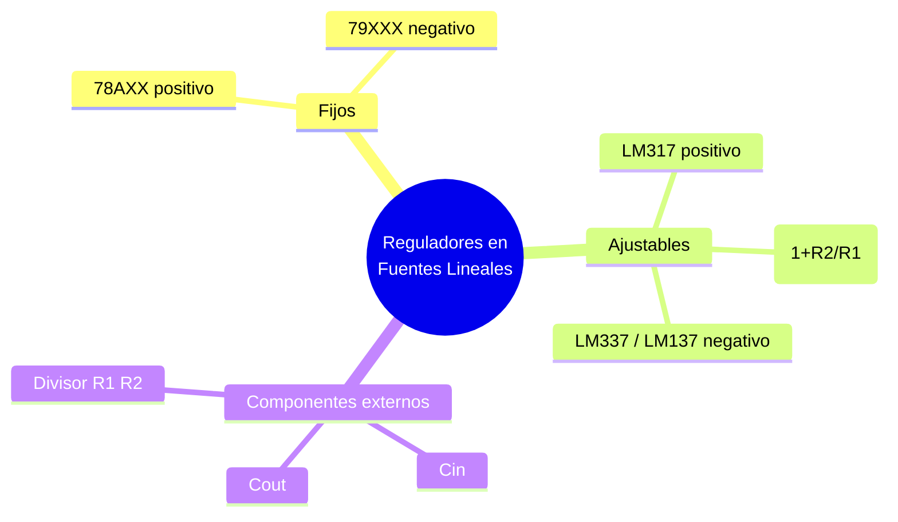

---
{"dg-publish":true,"permalink":"/universidad/3er-semestre/fundamentos-de-electricidad-y-sistemas-digitales/teorico/unidad-2-introduccion-a-la-electronica/05-reguladores-en-fuentes-lineales/","dg-note-properties":{}}
---

# 🛡️ Reguladores en Fuentes Lineales

## 🎯 Introducción

> [!info] 💡 ¿Por qué no basta el filtro capacitivo?
> 
> El [[Universidad/3er Semestre/Fundamentos de Electricidad y Sistemas Digitales/Teórico/Unidad 2 - Introducción a la Electrónica/04 - Circuitos de Filtrado y Fuentes Lineales\|filtro capacitivo]] deja un voltaje CD con un rizado residual, y ese voltaje además **varía** si cambia la corriente que consume la carga o si fluctúa el voltaje de la red. El **regulador** es la cuarta y última etapa de la fuente lineal: fija la tensión de salida a un valor constante y seguro, sin importar esas variaciones de entrada o de carga.
> 
> ```mermaid
> graph LR
>     A[V3: CD con<br/>rizado] --> B[Regulador]
>     B --> C[Vs: CD estable<br/>a la carga]
> 
>     style A fill:#e1f5ff
>     style B fill:#e1ffe1
> ```
> 
> Pueden ser tan sencillos como un diodo Zener, o circuitos integrados dedicados — que son la solución más común en la práctica.

---

## 🔒 Reguladores en Serie Fijos (78xx / 79xx)

> [!note] 🔒 Familia 78xx / 79xx
> 
> Son circuitos integrados de 3 terminales (entrada, tierra, salida) que entregan un voltaje de salida **fijo** predefinido por el número de parte.
> 
> |Familia|Función|Rango típico|
> |---|---|---|
> |**78AXX**|Tensiones positivas|3.3 V a 24 V / 0.1 A a 10 A|
> |**79XXX**|Tensiones negativas|Equivalente en negativo|
> 
> ```mermaid
> graph LR
>     A[Input] --> B[LM78XX]
>     B --> C[Output]
>     B --- D[GND]
> 
>     style B fill:#e1ffe1
> ```
> 
> - Capacitor de entrada ($C_I$, típico 0.33 µF): estabiliza si el regulador queda alejado del filtro capacitivo principal.
>     
> - Capacitor de salida ($C_O$, típico 0.1 µF): mejora la respuesta transitoria.
>     
> 
> > 📌 Los dos últimos dígitos del número de parte indican el voltaje de salida (p. ej. 7805 → 5 V, 7812 → 12 V).

---

## 🎚️ Reguladores en Serie Ajustables (LM317 / LM337 / LM137)

> [!note] 🎚️ LM317 (positivo) y LM337 / LM137 (negativo)
> 
> A diferencia de la familia 78xx/79xx, estos reguladores permiten **ajustar** el voltaje de salida mediante un divisor resistivo externo, en vez de tener un valor fijo de fábrica.
> 
> ```mermaid
> graph LR
>     A[Vin] --> B[LM317]
>     B --> C[Vout]
>     B --> D[Adjust] --> E[R2] --> F[GND]
>     C --> G[R1] --> D
> 
>     style B fill:#e1ffe1
> ```
> 
> $$V_O = 1.25 \cdot \left(1 + \frac{R_2}{R_1}\right)$$
> 
> Donde 1.25 V es el voltaje de referencia interno entre la salida y el pin Adjust. El LM317 regula tensiones positivas; el **LM337** y el **LM137** son sus equivalentes para tensiones negativas.
> 
> - $C_{in}$ (típico 0.1 µF) a la entrada.
> - $C_O$ (típico 1.0 µF) a la salida, para estabilidad.
> - $R_1$ suele fijarse en un valor pequeño (p. ej. 240 Ω) y $R_2$ es la resistencia (o potenciómetro) que define el voltaje deseado.

> [!success] 📊 Fijos vs. ajustables
> 
> |Característica|78xx/79xx (fijos)|LM317/LM337/LM137 (ajustables)|
> |---|---|---|
> |**Voltaje de salida**|Predefinido por el número de parte|Configurable con R1 y R2|
> |**Componentes externos**|Mínimos (capacitores de desacople)|Divisor resistivo (R1, R2) + capacitores|
> |**Flexibilidad**|Baja (un valor por IC)|Alta (un solo IC sirve para varios voltajes)|
> |**Uso típico**|Voltajes estándar conocidos (5V, 12V, etc.)|Prototipos, fuentes de banco, voltajes no estándar|


---

## 🧪 Ejercicio Práctico

> [!example]- ✏️ Ejercicio — Diseño con LM317
> 
> **Dato:** Se requiere un voltaje de salida $V_O = 9\text{ V}$ usando un LM317 con $R_1 = 240\ \Omega$. Calcular $R_2$.
> 
> |Paso|Acción|
> |---|---|
> |**1**|Partir de $V_O = 1.25\cdot(1 + R_2/R_1)$|
> |**2**|Despejar: $R_2 = R_1\left(\dfrac{V_O}{1.25} - 1\right)$|
> |**3**|$R_2 = 240\cdot\left(\dfrac{9}{1.25} - 1\right) = 240\times(7.2-1) = 240\times6.2 \approx 1488\ \Omega$|
> |**4**|En la práctica se usaría un potenciómetro cercano a 1.5 kΩ (o una combinación fija + trimmer) para ajuste fino.|

---

## ✅ Metas de Aprendizaje

> [!note] 🎯 Nivel Básico
> 
> - [ ] Explico qué función cumple el regulador dentro de la fuente lineal.
> - [ ] Distingo un regulador fijo (78xx/79xx) de uno ajustable (LM317/LM337/LM137).
> - [ ] Identifico los terminales típicos de un regulador de 3 pines (entrada, tierra/ajuste, salida).

> [!note] 🎯 Nivel Intermedio
> 
> - [ ] Calculo $R_2$ dado $R_1$ y el $V_O$ deseado en un LM317 (o viceversa).
> - [ ] Explico para qué sirven los capacitores de entrada y salida en estos reguladores.
> - [ ] Sé cuándo usar 79xx/LM337/LM137 en vez de 78xx/LM317 (tensiones negativas).

> [!note] 🎯 Nivel Avanzado
> 
> - [ ] Comparo el criterio de selección entre un regulador fijo y uno ajustable para un diseño dado.
> - [ ] Relaciono esta etapa con las anteriores (transformador, rectificador, filtro) para diseñar una fuente lineal completa.

---

## 📊 Resumen Visual



---

> [!quote] 📖 Fuentes consultadas
> 
> [1] A. Sedra y K. Smith, _Microelectronic Circuits_, 7th ed. New York, USA: Oxford University Press, 2015, pp. 221–260.
> 
> [2] R. L. Boylestad y L. Nashelsky, _Electrónica: Teoría de Circuitos y Dispositivos Electrónicos_, 10th ed. México: Pearson, 2009, pp. 81–130.
> 
> [3] A. R. Hambley, _Electrical Engineering: Principles and Applications_, 7th ed. Hoboken, NJ, USA: Pearson, 2018, pp. 510–540.

> [!quote] 🔗 Conexiones
> 
> - [[Universidad/3er Semestre/Fundamentos de Electricidad y Sistemas Digitales/Teórico/Unidad 2 - Introducción a la Electrónica/04 - Circuitos de Filtrado y Fuentes Lineales\|04 - Circuitos de Filtrado y Fuentes Lineales]] — etapas previas de la fuente lineal (transformador, rectificador, filtro capacitivo) que entregan el voltaje que este regulador estabiliza.
> - [[Universidad/3er Semestre/Fundamentos de Electricidad y Sistemas Digitales/Teórico/Unidad 2 - Introducción a la Electrónica/02 - El Diodo - Unión P-N\|02 - El Diodo - Unión P-N]] — el diodo Zener, mencionado como alternativa sencilla de regulación, es una aplicación de la unión PN en polarización inversa.


> [!quote] 🔗 Conexiones
> - Previo: [[Universidad/3er Semestre/Fundamentos de Electricidad y Sistemas Digitales/Teórico/Unidad 2 - Introducción a la Electrónica/04 - Circuitos de Filtrado y Fuentes Lineales\|04 - Circuitos de Filtrado y Fuentes Lineales]] — rizado que regula
> - Siguiente: [[Universidad/3er Semestre/Fundamentos de Electricidad y Sistemas Digitales/Teórico/Unidad 2 - Introducción a la Electrónica/06 - Ruido Electrónico e Interferencia\|06 - Ruido Electrónico e Interferencia]] — lo que filtra
> - Adelante: [[Universidad/3er Semestre/Fundamentos de Electricidad y Sistemas Digitales/Teórico/Unidad 3 - Introducción a los circuitos integrados/01 - Introducción a los Circuitos Integrados No Programables\|01 - Introducción a los Circuitos Integrados No Programables]] — el 7805 como CI

---

**Tags:** #reguladores #fuentesLineales #EYAG1037 #FESD #ESPOL #unidad2