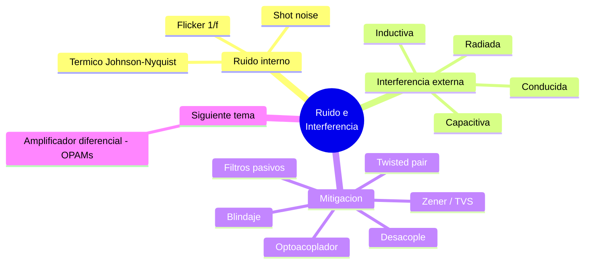

---
{"dg-publish":true,"permalink":"/universidad/3er-semestre/fundamentos-de-electricidad-y-sistemas-digitales/teorico/unidad-2-introduccion-a-la-electronica/06-ruido-electronico-e-interferencia/","dg-note-properties":{}}
---

# 📡 Ruido Electrónico e Interferencia

## 🎯 Introducción

> [!info] 💡 ¿Por qué importa el ruido en un circuito?
> 
> Toda señal eléctrica real viaja acompañada de perturbaciones no deseadas que se suman a la información útil. A esa suma de perturbaciones se le llama **ruido electrónico** (cuando se origina dentro de los propios componentes) o **interferencia electromagnética — EMI** (cuando proviene de una fuente externa que se acopla al circuito).
> 
> Este tema conecta directamente con lo visto en [[Universidad/3er Semestre/Fundamentos de Electricidad y Sistemas Digitales/Teórico/Unidad 2 - Introducción a la Electrónica/04 - Circuitos de Filtrado y Fuentes Lineales\|04 - Circuitos de Filtrado y Fuentes Lineales]] (el rizado de una fuente lineal es, en el fondo, un tipo de ruido de baja frecuencia) y sirve de puente hacia las aplicaciones de amplificadores operacionales para minimización de ruido de la Unidad 3.
> 
> ```mermaid
> graph LR
>     A[Perturbación] --> B{¿Origen?}
>     B -->|Interno<br/>del componente| C[Ruido electrónico]
>     B -->|Externo<br/>al circuito| D[Interferencia EMI/RFI]
>     C --> E[Señal degradada]
>     D --> E
> 
>     style C fill:#fff4e1
>     style D fill:#ffe1e1
>     style E fill:#e1f5ff
> ```

---

## 🌡️ Ruido Electrónico (origen interno)

> [!note] 🌡️ Ruido térmico (Johnson-Nyquist)
> 
> Se genera por la agitación aleatoria de los electrones dentro de cualquier resistencia debido a la temperatura, incluso sin que circule corriente neta. Es inevitable mientras la temperatura sea mayor a 0 K.
> 
> $$V_n = \sqrt{4 \cdot k \cdot T \cdot R \cdot B}$$
> 
> Donde $k$ = constante de Boltzmann ($1.38\times10^{-23}$ J/K), $T$ = temperatura absoluta (K), $R$ = resistencia (Ω), $B$ = ancho de banda (Hz).
> 
> > 📌 A mayor resistencia, mayor temperatura o mayor ancho de banda de trabajo, mayor ruido térmico — por eso los circuitos de bajo ruido buscan resistencias pequeñas y anchos de banda acotados al mínimo necesario.

> [!note] 🎯 Ruido de disparo (Shot noise)
> 
> Aparece en uniones semiconductoras (diodos, transistores) por la naturaleza discreta de los portadores de carga al cruzar una barrera de potencial (como la unión P-N vista en [[Universidad/3er Semestre/Fundamentos de Electricidad y Sistemas Digitales/Teórico/Unidad 2 - Introducción a la Electrónica/02 - El Diodo - Unión P-N\|02 - El Diodo - Unión P-N]]). Es proporcional a la raíz de la corriente CD que atraviesa el dispositivo.

> [!note] 🔀 Ruido flicker (ruido 1/f)
> 
> Predomina a bajas frecuencias y es característico de los semiconductores; su densidad de potencia decrece aproximadamente de forma inversamente proporcional a la frecuencia. Es relevante en instrumentación de precisión donde se trabaja con señales de CD o muy baja frecuencia.

> [!success] 📊 Comparación de ruido interno
> 
> |Tipo|Origen|Depende de|Relevante en|
> |---|---|---|---|
> |**Térmico**|Agitación térmica en resistencias|$T$, $R$, $B$|Cualquier circuito con resistencias|
> |**Shot**|Cruce de portadores en uniones PN|Corriente CD|Diodos, transistores, uniones|
> |**Flicker (1/f)**|Defectos superficiales en semiconductores|Frecuencia (baja)|Instrumentación de precisión, CD|

---

## 🌐 Interferencia Electromagnética (origen externo)

> [!note] 🌐 Modos de acoplamiento de la interferencia
> 
> Una señal de ruido externa (motores, líneas de potencia, radiofrecuencia, conmutación digital) puede acoplarse al circuito de cuatro maneras:
> 
> ```mermaid
> graph TD
>     A[Fuente de<br/>interferencia] --> B[Conducido<br/>por cables compartidos]
>     A --> C[Capacitivo<br/>campos eléctricos]
>     A --> D[Inductivo<br/>campos magnéticos]
>     A --> E[Radiado<br/>ondas electromagnéticas]
> 
>     style A fill:#ffe1e1
> ```
> 
> |Modo|Mecanismo|Mitigación típica|
> |---|---|---|
> |**Conducido**|Comparte cables de alimentación o tierra con la fuente de ruido|Filtros de línea, desacople|
> |**Capacitivo**|Acoplamiento por campo eléctrico entre conductores cercanos|Blindaje (shielding), separación física|
> |**Inductivo**|Acoplamiento por campo magnético (bucles de corriente)|Cables trenzados (twisted pair), minimizar área de lazo|
> |**Radiado**|Ondas EM que induce corriente en el circuito a distancia|Blindaje, filtros ferrite|

---

## 🛠️ Técnicas de Mitigación con Semiconductores y Componentes Pasivos

> [!note] 🛠️ Herramientas prácticas de reducción de ruido
> 
> |Técnica|Componente|Qué logra|
> |---|---|---|
> |**Desacople (decoupling)**|Capacitor cerámico cerca de cada IC|Absorbe picos de corriente de conmutación antes de que se propaguen|
> |**Filtro de línea**|LPF pasivo (ver [[Universidad/3er Semestre/Fundamentos de Electricidad y Sistemas Digitales/Teórico/Unidad 2 - Introducción a la Electrónica/04 - Circuitos de Filtrado y Fuentes Lineales\|04 - Circuitos de Filtrado y Fuentes Lineales]])|Atenúa ruido de alta frecuencia conducido por la alimentación|
> |**Diodo Zener / TVS**|Diodo en polarización inversa|Recorta (clamping) picos de voltaje transitorios que superan un umbral|
> |**Optoacoplador**|LED + fototransistor|Aísla galvánicamente dos circuitos, evitando lazos de tierra comunes|
> |**Ferrite bead / bobina de choque**|Núcleo de ferrita en serie|Atenúa ruido de alta frecuencia sin afectar la CD|
> |**Blindaje (shielding)**|Malla o carcasa conductora conectada a tierra|Bloquea acoplamiento capacitivo e inductivo externo|
> |**Cable trenzado (twisted pair)**|Par de conductores entrelazados|Cancela el acoplamiento inductivo entre ambos conductores|
> 
> > 📌 Muchas de estas técnicas ya las conoces de unidades anteriores: el diodo Zener regulador de [[Universidad/3er Semestre/Fundamentos de Electricidad y Sistemas Digitales/Teórico/Unidad 2 - Introducción a la Electrónica/05 - Reguladores en Fuentes Lineales\|05 - Reguladores en Fuentes Lineales]] y el filtro capacitivo de la fuente lineal cumplen, de hecho, una función de reducción de ruido además de su función original.

> [!note] 🔁 Adelanto: rechazo de modo común
> 
> Una de las técnicas más potentes contra el ruido —sobre todo el que se acopla igual a dos líneas de señal— es amplificar solo la **diferencia** entre dos entradas y rechazar lo que sea común a ambas (modo común). Esto se logra con un **amplificador diferencial** basado en amplificadores operacionales, tema que se profundiza en la Unidad 3 (Aplicaciones de los OPAMs — Minimización de ruido).


---

## 🧪 Ejercicio Práctico

> [!example]- ✏️ Ejercicio — Ruido térmico de una resistencia
> 
> **Dato:** Una resistencia $R = 10\text{ k}\Omega$ trabaja a temperatura ambiente $T = 300\text{ K}$, en un circuito con ancho de banda $B = 20\text{ kHz}$.
> 
> |Paso|Acción|
> |---|---|
> |**1**|$V_n = \sqrt{4kTRB}$|
> |**2**|$V_n = \sqrt{4 \times 1.38\times10^{-23} \times 300 \times 10000 \times 20000}$|
> |**3**|$V_n \approx \sqrt{3.312\times10^{-12}} \approx 1.82\ \mu V$|
> |**4**|Este es el piso de ruido térmico mínimo que tendrá cualquier medición con esa resistencia y ese ancho de banda, independientemente de qué tan buenos sean los demás componentes.|

---

## ✅ Metas de Aprendizaje

> [!note] 🎯 Nivel Básico
> 
> - [ ] Distingo ruido electrónico (interno) de interferencia electromagnética (externa).
> - [ ] Nombro los tres tipos principales de ruido interno: térmico, shot y flicker.
> - [ ] Identifico los cuatro modos de acoplamiento de interferencia: conducido, capacitivo, inductivo y radiado.

> [!note] 🎯 Nivel Intermedio
> 
> - [ ] Calculo el voltaje de ruido térmico dado $R$, $T$ y $B$.
> - [ ] Relaciono cada técnica de mitigación (desacople, blindaje, twisted pair, optoacoplador, TVS) con el tipo de acoplamiento que combate.
> - [ ] Explico por qué el filtro capacitivo y el regulador Zener, vistos antes, también actúan como mitigadores de ruido.

> [!note] 🎯 Nivel Avanzado
> 
> - [ ] Propongo una estrategia de mitigación completa para un circuito expuesto a varios tipos de interferencia simultáneamente.
> - [ ] Explico el concepto de rechazo de modo común como antesala al amplificador diferencial de la Unidad 3.

---

## 📊 Resumen Visual



---

> [!quote] 📖 Fuentes consultadas
> 
> [1] A. Sedra y K. Smith, _Microelectronic Circuits_, 7th ed. New York, USA: Oxford University Press, 2015 — capítulos sobre ruido en dispositivos semiconductores.
> 
> [2] R. L. Boylestad y L. Nashelsky, _Electrónica: Teoría de Circuitos y Dispositivos Electrónicos_, 10th ed. México: Pearson, 2009.
> 
> [3] A. R. Hambley, _Electrical Engineering: Principles and Applications_, 7th ed. Hoboken, NJ, USA: Pearson, 2018 — sección de compatibilidad electromagnética y técnicas de blindaje.

> [!quote] 🔗 Conexiones
> 
> - [[Universidad/3er Semestre/Fundamentos de Electricidad y Sistemas Digitales/Teórico/Unidad 2 - Introducción a la Electrónica/04 - Circuitos de Filtrado y Fuentes Lineales\|04 - Circuitos de Filtrado y Fuentes Lineales]] — el filtro capacitivo y los conceptos de LPF/HPF ya vistos son la base de varias técnicas de mitigación de ruido.
> - [[Universidad/3er Semestre/Fundamentos de Electricidad y Sistemas Digitales/Teórico/Unidad 2 - Introducción a la Electrónica/05 - Reguladores en Fuentes Lineales\|05 - Reguladores en Fuentes Lineales]] — el diodo Zener regulador reaparece aquí como elemento de recorte de transitorios (TVS).
> - [[Universidad/3er Semestre/Fundamentos de Electricidad y Sistemas Digitales/Teórico/Unidad 2 - Introducción a la Electrónica/02 - El Diodo - Unión P-N\|02 - El Diodo - Unión P-N]] — el ruido de disparo (shot noise) se origina en la misma unión P-N estudiada ahí.
> - Siguiente tema (Unidad 3): Aplicaciones de los OPAMs para minimización de ruido — amplificador diferencial y rechazo de modo común.

---

**Tags:** #ruidoElectronico #interferenciaEMI #fuentesLineales #EYAG1037 #FESD #ESPOL #unidad2