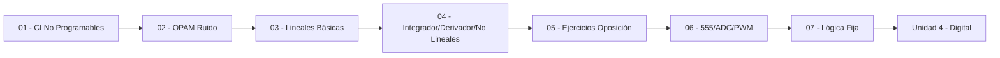

---
{"dg-publish":true,"permalink":"/universidad/3er-semestre/fundamentos-de-electricidad-y-sistemas-digitales/teorico/unidad-3-circuitos-integrados/00-indice-unidad-3/","tags":["FESD","unidad3","indice","EYAG1037"],"dg-note-properties":{"tags":["FESD","unidad3","indice","EYAG1037"]}}
---

# 🗺️ Unidad 3 — Circuitos Integrados — Índice

> [!info] ℹ️ Índice manual
> Se actualiza a mano para que funcione igual en Obsidian y en Digital Garden.

## 📑 Notas de la Unidad (orden oficial)

- [[Universidad/3er Semestre/Fundamentos de Electricidad y Sistemas Digitales/Teórico/Unidad 3 - Circuitos integrados/01 - CI no programables\|01 - CI no programables]]
- [[Universidad/3er Semestre/Fundamentos de Electricidad y Sistemas Digitales/Teórico/Unidad 3 - Circuitos integrados/02 - Aplicaciones de los OPAMs - Minimización de Ruido\|02 - Aplicaciones de los OPAMs - Minimización de Ruido]]
- [[Universidad/3er Semestre/Fundamentos de Electricidad y Sistemas Digitales/Teórico/Unidad 3 - Circuitos integrados/03 - Configuraciones Lineales Básicas del OPAM\|03 - Configuraciones Lineales Básicas del OPAM]]
- [[Universidad/3er Semestre/Fundamentos de Electricidad y Sistemas Digitales/Teórico/Unidad 3 - Circuitos integrados/04 - Integrador, Derivador y Circuitos No Lineales\|04 - Integrador, Derivador y Circuitos No Lineales]]
- [[Universidad/3er Semestre/Fundamentos de Electricidad y Sistemas Digitales/Teórico/Unidad 3 - Circuitos integrados/05 - Ejercicios Resueltos y de Oposición\|05 - Ejercicios Resueltos y de Oposición]]
- [[Universidad/3er Semestre/Fundamentos de Electricidad y Sistemas Digitales/Teórico/Unidad 3 - Circuitos integrados/06 - Aplicaciones de Integrados 555 - ADC - PWM\|06 - Aplicaciones de Integrados 555 - ADC - PWM]]
- [[Universidad/3er Semestre/Fundamentos de Electricidad y Sistemas Digitales/Teórico/Unidad 3 - Circuitos integrados/07 - Lógica fija y tablas de verdad\|07 - Lógica fija y tablas de verdad]]

## 📊 Mapa de conexiones — Bloque OPAM + 555 + Lógica

> [!quote] 🔗 Conexiones
> - Previo: [[Universidad/3er Semestre/Fundamentos de Electricidad y Sistemas Digitales/Teórico/Unidad 2 - Introducción a la Electrónica/06 - Ruido Electrónico e Interferencia\|06 - Ruido Electrónico e Interferencia]] (Unidad 2)
> - Siguiente: [[Universidad/3er Semestre/Fundamentos de Electricidad y Sistemas Digitales/Teórico/Unidad 4 - Sistemas Digitales/01 - Introducción a la Electrónica Digital\|01 - Introducción a la Electrónica Digital]] (Unidad 4)
> - MOC general: [[Universidad/3er Semestre/Fundamentos de Electricidad y Sistemas Digitales/Fundamentos de Electricidad y Sistemas Digitales\|Fundamentos de Electricidad y Sistemas Digitales]]

---
**Tags:** #FESD #unidad3 #indice
