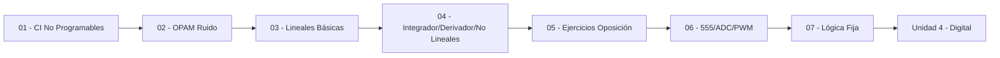

---
{"dg-publish":true,"permalink":"/universidad/3er-semestre/fundamentos-de-electricidad-y-sistemas-digitales/teorico/unidad-3-introduccion-a-los-circuitos-integrados/00-indice-unidad-3/","tags":["FESD","unidad3","indice","EYAG1037"],"dg-note-properties":{"tags":["FESD","unidad3","indice","EYAG1037"]}}
---

# 🗺️ Unidad 3 — Circuitos Integrados — Índice

> [!info] ℹ️ Índice auto-actualizable con Dataview — cubre las 7 notas que acabamos de reorganizar

## 📑 Notas de la Unidad (orden oficial)

| Nota                                                                                                                                                                                                                                                                   | Actualizado | Salientes | Entrantes |
| ---------------------------------------------------------------------------------------------------------------------------------------------------------------------------------------------------------------------------------------------------------------------- | ----------- | --------- | --------- |
| [[Universidad/3er Semestre/Fundamentos de Electricidad y Sistemas Digitales/Teórico/Unidad 3 - Introducción a los circuitos integrados/01 - Introducción a los Circuitos Integrados No Programables\|01 — Introducción a los Circuitos Integrados No Programables]] | 2026-08-26  | 8         | 8         |
| [[Universidad/3er Semestre/Fundamentos de Electricidad y Sistemas Digitales/Teórico/Unidad 3 - Introducción a los circuitos integrados/02 - Aplicaciones de los OPAMs - Minimización de Ruido\|02 — Aplicaciones de los OPAMs — Minimización de Ruido]]             | 2026-08-26  | 12        | 8         |
| [[Universidad/3er Semestre/Fundamentos de Electricidad y Sistemas Digitales/Teórico/Unidad 3 - Introducción a los circuitos integrados/03 - Configuraciones Lineales Básicas del OPAM\|03 — Configuraciones Lineales Básicas del OPAM]]                             | 2026-08-26  | 9         | 6         |
| [[Universidad/3er Semestre/Fundamentos de Electricidad y Sistemas Digitales/Teórico/Unidad 3 - Introducción a los circuitos integrados/04 - Integrador, Derivador y Circuitos No Lineales\|04 — Integrador, Derivador y Circuitos No Lineales]]                     | 2026-08-26  | 10        | 7         |
| [[Universidad/3er Semestre/Fundamentos de Electricidad y Sistemas Digitales/Teórico/Unidad 3 - Introducción a los circuitos integrados/05 - Ejercicios Resueltos y de Oposición\|05 — Ejercicios Resueltos y de Oposición]]                                         | 2026-08-26  | 9         | 6         |
| [[Universidad/3er Semestre/Fundamentos de Electricidad y Sistemas Digitales/Teórico/Unidad 3 - Introducción a los circuitos integrados/06 - Aplicaciones de Integrados 555 - ADC - PWM\|06 — Aplicaciones de Integrados 555 — ADC — PWM]]                           | 2026-08-26  | 7         | 7         |
| [[Universidad/3er Semestre/Fundamentos de Electricidad y Sistemas Digitales/Teórico/Unidad 3 - Introducción a los circuitos integrados/07 - Circuitos Integrados de Logica Fija y Tablas de Verdad\|07 — Circuitos Integrados de Logica Fija y Tablas de Verdad]]   | 2026-08-26  | 6         | 8         |

{ .block-language-dataview}

## ✅ Avance — Metas de Aprendizaje (todas las unidades 3 juntas)

# [[Universidad/3er Semestre/Fundamentos de Electricidad y Sistemas Digitales/Teórico/Unidad 3 - Introducción a los circuitos integrados/01 - Introducción a los Circuitos Integrados No Programables\|01 - Introducción a los Circuitos Integrados No Programables]]

    - [ ] Explico qué es un circuito integrado y su ventaja frente a un circuito discreto.
    - [ ] Distingo un CI programable de uno no programable con un ejemplo de cada uno.
    - [ ] Reconozco los encapsulados DIP, SOIC y TO-220.
    - [ ] Clasifico un CI dado como analógico, digital o mixto.
    - [ ] Ubico un CI dentro de la escala de integración (SSI, MSI, LSI, VLSI).
    - [ ] Explico por qué el LM317 (visto en fuentes lineales) es un ejemplo de CI no programable ajustable.
    - [ ] Justifico la elección entre un CI no programable de función fija y uno programable para un diseño dado, según flexibilidad y costo.
    - [ ] Anticipo qué tipo de CI no programable (OPAM, 555, lógica fija) conviene para un requerimiento específico de acondicionamiento de señal.
# [[Universidad/3er Semestre/Fundamentos de Electricidad y Sistemas Digitales/Teórico/Unidad 3 - Introducción a los circuitos integrados/02 - Aplicaciones de los OPAMs - Minimización de Ruido\|02 - Aplicaciones de los OPAMs - Minimización de Ruido]]

    - [ ] Explico para qué sirve un seguidor de tensión frente al problema de carga (loading).
    - [ ] Explico qué significa "modo común" y por qué el amplificador diferencial lo rechaza.
    - [ ] Reconozco cuándo usar un comparador con histéresis en vez de uno simple.
    - [ ] Calculo la salida de un amplificador diferencial dado el ruido de modo común y la señal diferencial útil.
    - [ ] Explico la ventaja de un amplificador de instrumentación (3 OPAMs) sobre un diferencial simple.
    - [ ] Relaciono el integrador OPAM con un filtro LPF activo.
    - [ ] Diseño una cadena de acondicionamiento de señal (buffer + diferencial/instrumentación + filtro activo) para un sensor ruidoso dado.
    - [ ] Justifico la elección entre comparador simple y con histéresis según el nivel de ruido esperado en la señal de entrada.
    - [ ] Resuelvo redes de OPAMs en cascada (2 o 3 etapas) aplicando $V_+\approx V_-$ e $I_+=I_-=0$ nodo por nodo, identificando la configuración de cada etapa.
# [[Universidad/3er Semestre/Fundamentos de Electricidad y Sistemas Digitales/Teórico/Unidad 3 - Introducción a los circuitos integrados/03 - Configuraciones Lineales Básicas del OPAM\|03 - Configuraciones Lineales Básicas del OPAM]]

    - [ ] Escribo sin dudar $v_o=-(R_2/R_1)v_i$ (inversor) y $v_o=(1+R_2/R_1)v_i$ (no inversor).
    - [ ] Explico por qué el no inversor tiene alta $Z_{in}$ y el inversor $Z_{in}\approx R_1$.
    - [ ] Identifico un sumador ponderado y predigo su signo.
    - [ ] Calculo la salida de un sumador no inversor ponderado con 3 entradas.
    - [ ] Explico el rol del condensador en el amplificador con eliminación de DC y su FDT.
    - [ ] Distingo convertidor V-I vs I-V y amplificador de intensidad con carga flotante.
    - [ ] Diseño un sumador inversor que haga $v_o=-(2v_1+0.5v_2)$ eligiendo $R,R_1,R_2$.
    - [ ] Predigo a qué frecuencia el circuito con $R_pC$ deja de atenuar la continua.
    - [ ] Eligo entre inversor / no inversor / convertidor según si la fuente es de tensión, corriente, alta o baja impedancia.
# [[Universidad/3er Semestre/Fundamentos de Electricidad y Sistemas Digitales/Teórico/Unidad 3 - Introducción a los circuitos integrados/04 - Integrador, Derivador y Circuitos No Lineales\|04 - Integrador, Derivador y Circuitos No Lineales]]

    - [ ] Escribo $v_o=-(1/RC)\int v_i dt$ (integrador) y $v_o=-RC\,\dot v_i$ (derivador).
    - [ ] Reconozco un comparador en lazo abierto y predigo $\pm V_{sat}$.
    - [ ] Distingo rectificador de media onda vs onda completa.
    - [ ] Explico por qué el integrador puro se satura y cómo se corrige con $R$ en paralelo con $C$.
    - [ ] Calculo los niveles limitados por Zener ($V_Z+0.7$) y el umbral $V_{ref}$.
    - [ ] Deduzco $v_o=-V_T\ln(v_i/(R I_S))$ a partir de $I_D$.
    - [ ] Diseño un integrador que genere rampa de $1$ V/ms a partir de $1$ V DC eligiendo $RC$.
    - [ ] Justifico cuándo usar comparador con histéresis vs paso por cero según el ruido esperado.
    - [ ] Explico por qué el derivador amplifica ruido y cómo mitigarlo.
# [[Universidad/3er Semestre/Fundamentos de Electricidad y Sistemas Digitales/Teórico/Unidad 3 - Introducción a los circuitos integrados/05 - Ejercicios Resueltos y de Oposición\|05 - Ejercicios Resueltos y de Oposición]]

    - [ ] Aplico $V_+\approx V_-$ y $I\approx0$ sin dudar.
    - [ ] Escribo KCL en el nodo inversor y despejo $V_o$.
    - [ ] Calculo $R_{in}=V_s/I_1$ y $V_C$ en nodos intermedios.
    - [ ] Aplico Thevenin visto desde la fuente para simplificar la red de entrada.
    - [ ] Resuelvo sumadores e instrumentación con la fórmula directa.
    - [ ] Resuelvo cualquier red del PDF (incluidas las 3 etapas de la Tarea #2 en [[Universidad/3er Semestre/Fundamentos de Electricidad y Sistemas Digitales/Teórico/Unidad 3 - Introducción a los circuitos integrados/02 - Aplicaciones de los OPAMs - Minimización de Ruido\|02 - Aplicaciones de los OPAMs - Minimización de Ruido]]) nodo por nodo sin memorizar fórmulas.
    - [ ] Resuelvo problemas de oposición bajo tiempo, identificando la topología (inversor/sumador/instrumentación/corriente) en segundos.
# [[Universidad/3er Semestre/Fundamentos de Electricidad y Sistemas Digitales/Teórico/Unidad 3 - Introducción a los circuitos integrados/06 - Aplicaciones de Integrados 555 - ADC - PWM\|06 - Aplicaciones de Integrados 555 - ADC - PWM]]

    - [ ] Identifico los pines y modos de operación básicos del 555 (astable, monoestable, biestable).
    - [ ] Explico qué representa el ciclo de trabajo (duty cycle) en una señal PWM.
    - [ ] Describo en una frase qué hace un ADC y por qué es necesario entre el mundo analógico y el digital.
    - [ ] Identifico qué pines del 555 funcionan como SET y RESET en modo biestable.
    - [ ] Calculo $f$ y $D$ de un 555 astable dados $R_1$, $R_2$ y $C$.
    - [ ] Calculo $t$ de un 555 monoestable dados $R$ y $C$.
    - [ ] Calculo la resolución (LSB) de un ADC dado su número de bits y $V_{ref}$.
    - [ ] Explico por qué el modo biestable no necesita red RC de temporización, a diferencia de los otros dos modos.
    - [ ] Diseño un 555 astable para cumplir una frecuencia y duty cycle objetivo.
    - [ ] Explico el compromiso entre resolución, velocidad y complejidad al elegir un tipo de ADC.
    - [ ] Relaciono el teorema de Nyquist con el fenómeno de aliasing en un sistema de muestreo real.
    - [ ] Predigo el estado de salida de un 555 biestable ante una secuencia arbitraria de pulsos en Trigger y Reset.
# [[Universidad/3er Semestre/Fundamentos de Electricidad y Sistemas Digitales/Teórico/Unidad 3 - Introducción a los circuitos integrados/07 - Circuitos Integrados de Logica Fija y Tablas de Verdad\|07 - Circuitos Integrados de Logica Fija y Tablas de Verdad]]

    - [ ] Construyo la tabla de verdad de las compuertas básicas (AND, OR, NOT, NAND, NOR, XOR, XNOR).
    - [ ] Identifico la diferencia general entre lógica fija y lógica programable.
    - [ ] Reconozco algunos CI comerciales de la familia 74xx y su función.
    - [ ] Construyo la tabla de verdad de una función booleana compuesta con varias entradas.
    - [ ] Comparo las familias TTL y CMOS en términos de voltaje, consumo y velocidad.
    - [ ] Explico por qué NAND y NOR son compuertas funcionalmente completas.
    - [ ] Implemento una función booleana dada usando únicamente compuertas NAND (o NOR).
    - [ ] Selecciono la familia lógica adecuada (TTL vs. CMOS) según requerimientos de consumo, velocidad e inmunidad al ruido.
    - [ ] Relaciono una tabla de verdad con su posible simplificación algebraica como paso previo a Karnaugh (Unidad 4).

{ .block-language-dataview}

## 📈 Progreso por nota

| Nota                                                                                                                                                                                                                                                                   | Hechas | Total | % |
| ---------------------------------------------------------------------------------------------------------------------------------------------------------------------------------------------------------------------------------------------------------------------- | ------ | ----- | - |
| [[Universidad/3er Semestre/Fundamentos de Electricidad y Sistemas Digitales/Teórico/Unidad 3 - Introducción a los circuitos integrados/01 - Introducción a los Circuitos Integrados No Programables\|01 - Introducción a los Circuitos Integrados No Programables]] | 0      | 8     | 0 |
| [[Universidad/3er Semestre/Fundamentos de Electricidad y Sistemas Digitales/Teórico/Unidad 3 - Introducción a los circuitos integrados/02 - Aplicaciones de los OPAMs - Minimización de Ruido\|02 - Aplicaciones de los OPAMs - Minimización de Ruido]]             | 0      | 9     | 0 |
| [[Universidad/3er Semestre/Fundamentos de Electricidad y Sistemas Digitales/Teórico/Unidad 3 - Introducción a los circuitos integrados/03 - Configuraciones Lineales Básicas del OPAM\|03 - Configuraciones Lineales Básicas del OPAM]]                             | 0      | 9     | 0 |
| [[Universidad/3er Semestre/Fundamentos de Electricidad y Sistemas Digitales/Teórico/Unidad 3 - Introducción a los circuitos integrados/04 - Integrador, Derivador y Circuitos No Lineales\|04 - Integrador, Derivador y Circuitos No Lineales]]                     | 0      | 9     | 0 |
| [[Universidad/3er Semestre/Fundamentos de Electricidad y Sistemas Digitales/Teórico/Unidad 3 - Introducción a los circuitos integrados/05 - Ejercicios Resueltos y de Oposición\|05 - Ejercicios Resueltos y de Oposición]]                                         | 0      | 7     | 0 |
| [[Universidad/3er Semestre/Fundamentos de Electricidad y Sistemas Digitales/Teórico/Unidad 3 - Introducción a los circuitos integrados/06 - Aplicaciones de Integrados 555 - ADC - PWM\|06 - Aplicaciones de Integrados 555 - ADC - PWM]]                           | 0      | 12    | 0 |
| [[Universidad/3er Semestre/Fundamentos de Electricidad y Sistemas Digitales/Teórico/Unidad 3 - Introducción a los circuitos integrados/07 - Circuitos Integrados de Logica Fija y Tablas de Verdad\|07 - Circuitos Integrados de Logica Fija y Tablas de Verdad]]   | 0      | 9     | 0 |

{ .block-language-dataview}

## ⚠️ Notas huérfanas

{ .block-language-dataview}

## 📊 Mapa de conexiones — Bloque OPAM + 555 + Lógica

> [!quote] 🔗 Conexiones
> - Previo: [[Universidad/3er Semestre/Fundamentos de Electricidad y Sistemas Digitales/Teórico/Unidad 2 - Introducción a la Electrónica/06 - Ruido Electrónico e Interferencia\|06 - Ruido Electrónico e Interferencia]] (Unidad 2)
> - Siguiente: [[Universidad/3er Semestre/Fundamentos de Electricidad y Sistemas Digitales/Teórico/Unidad 4 - Sistemas Digitales/01 - Introducción a la Electrónica Digital\|01 - Introducción a la Electrónica Digital]] (Unidad 4)
> - MOC general: [[Universidad/3er Semestre/Fundamentos de Electricidad y Sistemas Digitales/Fundamentos de Electricidad y Sistemas Digitales\|Fundamentos de Electricidad y Sistemas Digitales]]

---
**Tags:** #FESD #unidad3 #indice
