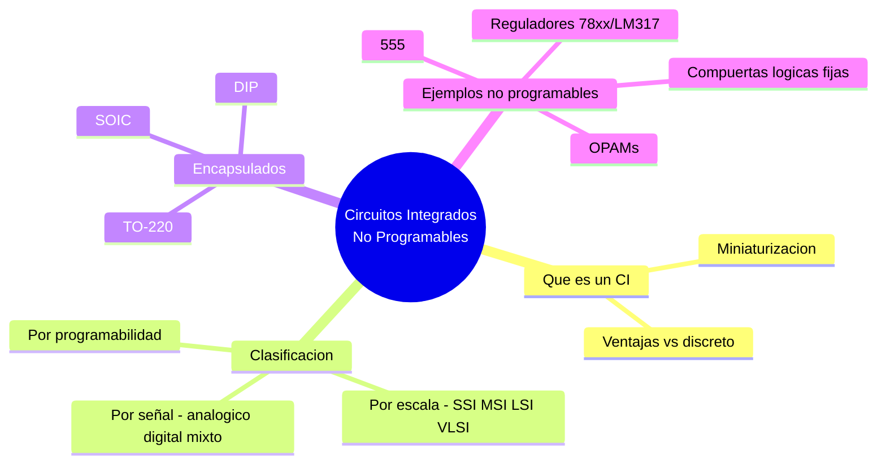

---
{"dg-publish":true,"permalink":"/universidad/3er-semestre/fundamentos-de-electricidad-y-sistemas-digitales/teorico/unidad-3-introduccion-a-los-circuitos-integrados/01-introduccion-a-los-circuitos-integrados-no-programables/","dg-note-properties":{}}
---

# 🧩 Introducción a los Circuitos Integrados No Programables

## 🎯 Introducción

> [!info] 💡 ¿Qué es un circuito integrado?
> 
> Un **circuito integrado (CI o IC)** es un conjunto de componentes electrónicos —transistores, diodos, resistencias, capacitores— fabricados sobre una sola pastilla (chip) de material semiconductor, generalmente silicio. En vez de armar un circuito conectando componentes discretos uno por uno (como en las unidades anteriores con diodos y BJTs sueltos), el CI empaqueta toda esa funcionalidad en un solo encapsulado con unos pocos terminales externos.
> 
> Este tema cierra el círculo de lo visto en la Unidad 2: los diodos ([[Universidad/3er Semestre/Fundamentos de Electricidad y Sistemas Digitales/Teórico/Unidad 2 - Introducción a la Electrónica/02 - El Diodo - Unión P-N\|02 - El Diodo - Unión P-N]]), transistores BJT ([[Universidad/3er Semestre/Fundamentos de Electricidad y Sistemas Digitales/Teórico/Unidad 2 - Introducción a la Electrónica/03 - Transistor BJT\|03 - Transistor BJT]]) y los circuitos de filtrado/regulación ([[Universidad/3er Semestre/Fundamentos de Electricidad y Sistemas Digitales/Teórico/Unidad 2 - Introducción a la Electrónica/04 - Circuitos de Filtrado y Fuentes Lineales\|04 - Circuitos de Filtrado y Fuentes Lineales]], [[Universidad/3er Semestre/Fundamentos de Electricidad y Sistemas Digitales/Teórico/Unidad 2 - Introducción a la Electrónica/05 - Reguladores en Fuentes Lineales\|05 - Reguladores en Fuentes Lineales]]) que estudiaste como componentes o etapas discretas, en la práctica suelen venir **ya integrados** dentro de un solo chip (por ejemplo, el propio regulador 7805 que viste es en sí mismo un circuito integrado).
> 
> ```mermaid
> graph LR
>     A[Componentes discretos<br/>diodos, transistores, R, C] -->|Miniaturización| B[Circuito Integrado - CI]
>     B --> C[Mismo comportamiento<br/>menor tamaño y costo]
> 
>     style A fill:#ffe1e1
>     style B fill:#e1ffe1
> ```

---

## 📐 Ventajas de la Integración

> [!success] 📊 Discreto vs. Integrado
> 
> |Característica|Circuito discreto|Circuito integrado|
> |---|---|---|
> |**Tamaño**|Grande (componentes individuales)|Muy reducido|
> |**Costo por unidad (alto volumen)**|Alto|Bajo|
> |**Consistencia entre unidades**|Variable (tolerancias distintas)|Alta (mismo proceso de fabricación)|
> |**Consumo de potencia**|Mayor|Menor|
> |**Facilidad de reparación**|Componente por componente|Se reemplaza el chip completo|
> |**Velocidad/parásitos**|Mayor inductancia/capacitancia parásita por cableado|Menor, por la cercanía física de los elementos|

---

## 🗂️ Clasificación de los Circuitos Integrados

> [!note] 🗂️ Por tipo de señal que procesan
> 
> |Tipo|Procesa|Ejemplos|
> |---|---|---|
> |**Analógicos**|Señales continuas|Amplificadores operacionales, comparadores, reguladores de voltaje|
> |**Digitales**|Señales binarias (0/1)|Compuertas lógicas, flip-flops, microcontroladores|
> |**Mixtos (mixed-signal)**|Ambas, en el mismo chip|Convertidores ADC/DAC, temporizador 555 (tiene etapas analógicas y salida digital)|

> [!note] 🗂️ Por escala de integración
> 
> Según la cantidad de transistores equivalentes dentro del chip:
> 
> |Escala|Sigla|Orden de transistores|Ejemplo típico|
> |---|---|---|---|
> |Integración a pequeña escala|**SSI**|Decenas|Compuertas lógicas simples (74xx básicas)|
> |Integración a media escala|**MSI**|Cientos|Contadores, decodificadores|
> |Integración a gran escala|**LSI**|Miles|Memorias pequeñas, ALUs simples|
> |Integración a muy gran escala|**VLSI**|Millones o más|Microcontroladores, microprocesadores|

> [!note] 🗂️ Por programabilidad — la clasificación clave de esta unidad
> 
> ```mermaid
> graph TD
>     A[Circuitos Integrados] --> B[No programables]
>     A --> C[Programables]
>     B --> D["Función fija de fábrica<br/>(no se puede reprogramar)"]
>     C --> E["Función definida por el usuario<br/>mediante software/configuración"]
> 
>     style B fill:#e1ffe1
>     style C fill:#fff4e1
> ```
> 
> |Tipo|Definición|Ejemplos|
> |---|---|---|
> |**No programables**|Su función queda fija desde la fabricación; el diseñador solo elige componentes externos (resistencias, capacitores) para ajustar parámetros, pero no puede cambiar la lógica interna|Amplificadores operacionales (LM741, LM358), comparadores, reguladores (7805, LM317 — ya vistos), temporizador 555, compuertas lógicas de la familia 74xx/40xx, ADC/DAC de función fija|
> |**Programables**|Su comportamiento se define después de fabricado, mediante software o configuración cargada por el usuario|Microcontroladores, FPGAs, CPLDs, memorias programables|
> 
> > 📌 Esta unidad se enfoca exclusivamente en los **no programables**: su lógica interna es inmodificable, pero siguen siendo enormemente versátiles porque su comportamiento externo se puede ajustar con componentes pasivos — exactamente como ya viste con el LM317, donde $R_1$ y $R_2$ definen el voltaje de salida sin alterar el chip en sí.

---

## 📦 Encapsulados Comunes

> [!note] 📦 Cómo se presenta físicamente un CI
> 
> |Encapsulado|Descripción|Uso típico|
> |---|---|---|
> |**DIP (Dual In-line Package)**|Dos filas paralelas de pines, para montaje en protoboard o socket|Prototipado, laboratorio (555, op-amps clásicos)|
> |**SOIC / SMD**|Montaje superficial, mucho más pequeño|Producción en serie, PCBs compactas|
> |**TO-220 / TO-92**|Con pines robustos, a veces con disipador|Reguladores de potencia (7805, LM317), transistores de potencia|

---

## 🔭 Vista Previa: Qué Viene en Esta Unidad

> [!note] 🔭 Los CI no programables que se estudiarán a continuación
> 
> |Próxima nota|CI protagonista|Función|
> |---|---|---|
> |**02 — Aplicaciones de los OPAMs**|Amplificador operacional|Minimización de ruido (amplificador diferencial, seguidor de tensión, filtros activos)|
> |**03 — Configuraciones Lineales Básicas del OPAM**|Amplificador operacional|Inversor, no inversor, sumadores, eliminación de DC, convertidores V-I/I-V|
> |**04 — Integrador, Derivador y No Lineales**|Amplificador operacional|Integrador, derivador, comparadores, rectificadores, log/antilog|
> |**05 — Ejercicios Resueltos y de Oposición**|Amplificador operacional|Análisis nodal, Thevenin y problemas de oposición|
> |**06 — Aplicaciones de 555 / ADC / PWM**|Temporizador 555, convertidores ADC, generación de PWM|Acondicionamiento de señales|
> |**07 — Lógica fija**|Compuertas lógicas (familias 74xx/40xx)|Circuitos combinacionales y tablas de verdad|


---

## 🧪 Ejercicio Práctico

> [!example]- ✏️ Ejercicio — Clasificar circuitos integrados
> 
> **Dato:** Clasifica los siguientes CI como programables o no programables, e indica si son analógicos, digitales o mixtos: (a) LM358, (b) Arduino Uno (ATmega328P), (c) NE555, (d) 74HC08 (compuertas AND).
> 
> |CI|Programable / No programable|Tipo de señal|
> |---|---|---|
> |**(a) LM358**|No programable|Analógico (amplificador operacional doble)|
> |**(b) ATmega328P**|Programable|Digital (microcontrolador)|
> |**(c) NE555**|No programable|Mixto (comparadores analógicos internos, salida digital)|
> |**(d) 74HC08**|No programable|Digital (compuertas AND fijas)|

---

## ✅ Metas de Aprendizaje

> [!note] 🎯 Nivel Básico
> 
> - [ ] Explico qué es un circuito integrado y su ventaja frente a un circuito discreto.
> - [ ] Distingo un CI programable de uno no programable con un ejemplo de cada uno.
> - [ ] Reconozco los encapsulados DIP, SOIC y TO-220.

> [!note] 🎯 Nivel Intermedio
> 
> - [ ] Clasifico un CI dado como analógico, digital o mixto.
> - [ ] Ubico un CI dentro de la escala de integración (SSI, MSI, LSI, VLSI).
> - [ ] Explico por qué el LM317 (visto en fuentes lineales) es un ejemplo de CI no programable ajustable.

> [!note] 🎯 Nivel Avanzado
> 
> - [ ] Justifico la elección entre un CI no programable de función fija y uno programable para un diseño dado, según flexibilidad y costo.
> - [ ] Anticipo qué tipo de CI no programable (OPAM, 555, lógica fija) conviene para un requerimiento específico de acondicionamiento de señal.

---

## 📊 Resumen Visual



---

> [!quote] 📖 Fuentes consultadas
> 
> [1] A. Sedra y K. Smith, _Microelectronic Circuits_, 7th ed. New York, USA: Oxford University Press, 2015.
> 
> [2] R. L. Boylestad y L. Nashelsky, _Electrónica: Teoría de Circuitos y Dispositivos Electrónicos_, 10th ed. México: Pearson, 2009.
> 
> [3] A. R. Hambley, _Electrical Engineering: Principles and Applications_, 7th ed. Hoboken, NJ, USA: Pearson, 2018.

> [!quote] 🔗 Conexiones
> 
> - [[Universidad/3er Semestre/Fundamentos de Electricidad y Sistemas Digitales/Teórico/Unidad 2 - Introducción a la Electrónica/05 - Reguladores en Fuentes Lineales\|05 - Reguladores en Fuentes Lineales]] — el 78xx/79xx y el LM317 son, en sí mismos, ejemplos de CI no programables ya estudiados.
> - [[Universidad/3er Semestre/Fundamentos de Electricidad y Sistemas Digitales/Teórico/Unidad 2 - Introducción a la Electrónica/02 - El Diodo - Unión P-N\|02 - El Diodo - Unión P-N]] y [[Universidad/3er Semestre/Fundamentos de Electricidad y Sistemas Digitales/Teórico/Unidad 2 - Introducción a la Electrónica/03 - Transistor BJT\|03 - Transistor BJT]] — los componentes discretos que un CI integra internamente en un solo chip.
> - Siguiente nota (Unidad 3, punto 2): Aplicaciones de los OPAMs para minimización de ruido.

---

**Tags:** #circuitosIntegrados #CInoProgramable #EYAG1037 #FESD #ESPOL #unidad3