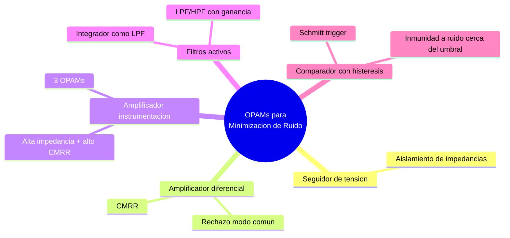

---
{"dg-publish":true,"permalink":"/universidad/3er-semestre/fundamentos-de-electricidad-y-sistemas-digitales/teorico/unidad-3-introduccion-a-los-circuitos-integrados/02-aplicaciones-de-los-opa-ms-minimizacion-de-ruido/","dg-note-properties":{}}
---

# 🔇 Aplicaciones de los OPAMs — Minimización de Ruido

## 🎯 Introducción 

> [!info] 💡 ¿Por qué el OPAM es la herramienta principal contra el ruido?
> 
> En [[Universidad/3er Semestre/Fundamentos de Electricidad y Sistemas Digitales/Teórico/Unidad 2 - Introducción a la Electrónica/06 - Ruido Electrónico e Interferencia\|06 - Ruido Electrónico e Interferencia]] viste que el ruido puede ser interno (térmico, shot, flicker) o externo (EMI acoplada). El **amplificador operacional (OPAM)** es, junto con los componentes pasivos ya vistos, la herramienta activa más versátil para combatirlo: puede aislar impedancias, rechazar señales de modo común, filtrar frecuencias no deseadas y limpiar transiciones ruidosas antes de que lleguen a una etapa digital.
> 
> Como se trata de un **circuito integrado no programable** (ver [[Universidad/3er Semestre/Fundamentos de Electricidad y Sistemas Digitales/Teórico/Unidad 3 - Introducción a los circuitos integrados/01 - Introducción a los Circuitos Integrados No Programables\|01 - Introducción a los Circuitos Integrados No Programables]]), su función interna es fija; lo que cambia según la aplicación es la red de resistencias/capacitores externos que lo rodean — exactamente las configuraciones que se resolvieron en la guía de ejercicios de amplificador operacional.
> 
> ```mermaid
> graph LR
>     A[Señal con ruido] --> B[Configuración OPAM<br/>adecuada]
>     B --> C[Señal limpia<br/>o rechazo de ruido]
> 
>     style A fill:#ffe1e1
>     style B fill:#e1ffe1
>     style C fill:#e1f5ff
> ```

---

## 🔌 Seguidor de Tensión (Buffer) — Aislamiento de Impedancias

> [!note] 🔌 ¿Cómo reduce ruido un simple seguidor?
> 
> El seguidor de tensión ($v_o = v_i$, ganancia unitaria) no amplifica ni filtra nada por sí mismo, pero su función es evitar que una fuente de señal de **alta impedancia** (como un sensor) se vea afectada al conectarse a una carga de **baja impedancia**. Esa caída de tensión por carga (loading effect) es, en la práctica, una fuente de distorsión y ruido de la señal original.
> 
> $$v_o = v_i$$
> 
> - Impedancia de entrada: muy alta (no carga a la fuente).
>     
> - Impedancia de salida: muy baja (puede manejar cargas exigentes sin degradarse).
>     
> 
> > 📌 Es el primer paso de acondicionamiento antes de amplificar o filtrar una señal proveniente de un sensor de alta impedancia (termopar, galga extensiométrica).

---

## ➖ Amplificador Diferencial — Rechazo de Modo Común

> [!note] ➖ El corazón del rechazo de ruido
> 
> Retomando lo anticipado en [[Universidad/3er Semestre/Fundamentos de Electricidad y Sistemas Digitales/Teórico/Unidad 2 - Introducción a la Electrónica/06 - Ruido Electrónico e Interferencia\|06 - Ruido Electrónico e Interferencia]]: si el ruido se acopla **por igual** a dos líneas de señal (modo común), un amplificador diferencial lo cancela porque solo amplifica la diferencia entre sus dos entradas.
> 
> $$v_o = \frac{R_2}{R_1}\cdot(v_2 - v_1)$$
> 
> - Toda tensión diferente entre las dos entradas se amplifica según la ganancia $R_2/R_1$.
>     
> - Toda señal **común** a ambas entradas (típicamente ruido de red, EMI) se cancela.
>     
> - Este comportamiento se cuantifica con la **razón de rechazo en modo común (CMRR)**: cuanto mayor, mejor cancela el ruido común.
>     
> 
> > 📌 Es la base de los sensores de instrumentación (termopares, galgas extensiométricas) mencionados en la guía de ejercicios, precisamente porque el ruido de la red eléctrica suele acoplarse igual a ambos cables de la señal del sensor.

---

## 🎚️ Amplificador de Instrumentación — Precisión con Alta Inmunidad

> [!note] 🎚️ Cuando un solo diferencial no basta
> 
> El amplificador diferencial simple tiene una limitación: su impedancia de entrada no es lo suficientemente alta para sensores muy sensibles, y ajustar su ganancia requiere cambiar dos resistencias a la vez. El **amplificador de instrumentación** resuelve esto con tres OPAMs:
> 
> - Dos seguidores/no inversores en la entrada (alta impedancia, ganancia ajustable con una sola resistencia).
> - Un amplificador diferencial a la salida (rechazo de modo común final).
> 
> $$V_O = \frac{R_3}{R_1}\cdot\left(1+\frac{2\cdot R_2}{R_G}\right)\cdot(V_2-V_1)$$
> 
> > 📌 Es la configuración estándar en instrumentación biomédica e industrial precisamente por su combinación de alta impedancia de entrada + alto CMRR — máxima inmunidad al ruido posible con OPAMs.

---

## 🌊 Filtros Activos — Extendiendo los Filtros Pasivos

> [!note] 🌊 Del filtro pasivo al filtro activo
> 
> En [[Universidad/3er Semestre/Fundamentos de Electricidad y Sistemas Digitales/Teórico/Unidad 2 - Introducción a la Electrónica/04 - Circuitos de Filtrado y Fuentes Lineales\|04 - Circuitos de Filtrado y Fuentes Lineales]] viste los filtros LPF/HPF pasivos (solo R, L, C). Combinando esas mismas redes RC con un OPAM en configuración inversora o no inversora se obtiene un **filtro activo**, con dos ventajas clave para reducir ruido:
> 
> |Ventaja del filtro activo|Efecto sobre el ruido|
> |---|---|
> |**Ganancia adicional** (no solo atenuación)|La señal útil se puede amplificar mientras se filtra el ruido fuera de banda|
> |**Baja impedancia de salida**|La etapa siguiente no carga ni degrada la respuesta del filtro|
> |**Sin bobinas**|Se evita el ruido y las pérdidas asociadas a inductores reales|
> 
> > 📌 Un integrador OPAM (visto en la guía de ejercicios) es, de hecho, un LPF activo de un polo: su respuesta atenúa las frecuencias altas — un mecanismo directo de "suavizado" de ruido de alta frecuencia sobre una señal de CD o baja frecuencia.

---

## 🔲 Comparador con Histéresis — Inmunidad en Señales Digitales

> [!note] 🔲 El problema del comparador simple frente al ruido
> 
> Un comparador ideal cambia de estado exactamente quando $v_i$ cruza un umbral. Pero si esa señal tiene ruido superpuesto cerca del umbral, el comparador puede **oscilar erráticamente** entre sus dos salidas mientras el ruido cruza el umbral varias veces.
> 
> El **comparador con histéresis** (Schmitt trigger) resuelve esto definiendo **dos umbrales distintos** (uno de subida, otro de bajada) mediante realimentación positiva, de modo que un pequeño ruido superpuesto ya no alcanza a provocar conmutaciones falsas.
> 
> ```mermaid
> graph LR
>     A["Señal ruidosa<br/>cerca del umbral"] --> B{Comparador simple}
>     A --> C{Comparador con histéresis}
>     B --> D["Salida oscila<br/>falsamente"]
>     C --> E["Salida estable<br/>una sola transición"]
> 
>     style D fill:#ffe1e1
>     style E fill:#e1ffe1
> ```
> 
> > 📌 Es la configuración recomendada siempre que una señal analógica ruidosa deba convertirse en una señal digital limpia — puente directo hacia el siguiente tema de esta unidad (555, ADC, PWM).


---

## 🧪 Ejercicio Práctico

> [!example]- ✏️ Ejercicio — Amplificador diferencial rechazando ruido de red
> 
> **Dato:** Un sensor entrega $v_1 = 2.000\text{ V}$ y $v_2 = 2.010\text{ V}$ (diferencia útil de 10 mV), pero ambas líneas recogen 50 mV de ruido de red idéntico (modo común). Se usa un amplificador diferencial con $R_1 = 1\text{ k}\Omega$, $R_2 = 100\text{ k}\Omega$.
> 
> |Paso|Acción|
> |---|---|
> |**1**|Señal diferencial real: $v_2-v_1 = 10\text{ mV}$ (el ruido de 50 mV es igual en ambas entradas, así que no aparece en la resta)|
> |**2**|Ganancia: $R_2/R_1 = 100\text{k}/1\text{k} = 100$|
> |**3**|$v_o = 100\times10\text{ mV} = 1\text{ V}$|
> |**4**|El ruido de modo común (50 mV en ambas líneas) **no aparece amplificado** en la salida — solo la diferencia útil de 10 mV se convierte en 1 V. Si en cambio se hubiera amplificado $v_1$ sola con un inversor de ganancia 100, el ruido de 50 mV se habría amplificado a 5 V, mucho mayor que la señal útil.|

---

## ✅ Metas de Aprendizaje

> [!note] 🎯 Nivel Básico
> 
> - [ ] Explico para qué sirve un seguidor de tensión frente al problema de carga (loading).
> - [ ] Explico qué significa "modo común" y por qué el amplificador diferencial lo rechaza.
> - [ ] Reconozco cuándo usar un comparador con histéresis en vez de uno simple.

> [!note] 🎯 Nivel Intermedio
> 
> - [ ] Calculo la salida de un amplificador diferencial dado el ruido de modo común y la señal diferencial útil.
> - [ ] Explico la ventaja de un amplificador de instrumentación (3 OPAMs) sobre un diferencial simple.
> - [ ] Relaciono el integrador OPAM con un filtro LPF activo.

> [!note] 🎯 Nivel Avanzado
> 
> - [ ] Diseño una cadena de acondicionamiento de señal (buffer + diferencial/instrumentación + filtro activo) para un sensor ruidoso dado.
> - [ ] Justifico la elección entre comparador simple y con histéresis según el nivel de ruido esperado en la señal de entrada.

---

## 📊 Resumen Visual



---

> [!quote] 📖 Fuentes consultadas
> 
> [1] A. Sedra y K. Smith, _Microelectronic Circuits_, 7th ed. New York, USA: Oxford University Press, 2015 — capítulos sobre amplificadores operacionales y aplicaciones.
> 
> [2] R. L. Boylestad y L. Nashelsky, _Electrónica: Teoría de Circuitos y Dispositivos Electrónicos_, 10th ed. México: Pearson, 2009.
> 
> [3] Fco. Javier Hernández Canals, _Amplificador Operacional — Ejercicios Resueltos_ (guía de ejercicios: seguidor de tensión, amplificador diferencial, amplificador de instrumentación, comparador con histéresis).

> [!quote] 🔗 Conexiones
> 
> - [[Universidad/3er Semestre/Fundamentos de Electricidad y Sistemas Digitales/Teórico/Unidad 2 - Introducción a la Electrónica/06 - Ruido Electrónico e Interferencia\|06 - Ruido Electrónico e Interferencia]] — el concepto de rechazo de modo común anticipado ahí se desarrolla aquí con el amplificador diferencial.
> - [[Universidad/3er Semestre/Fundamentos de Electricidad y Sistemas Digitales/Teórico/Unidad 2 - Introducción a la Electrónica/04 - Circuitos de Filtrado y Fuentes Lineales\|04 - Circuitos de Filtrado y Fuentes Lineales]] — los filtros pasivos LPF/HPF se retoman aquí en su versión activa con OPAM.
> - [[Universidad/3er Semestre/Fundamentos de Electricidad y Sistemas Digitales/Teórico/Unidad 3 - Introducción a los circuitos integrados/01 - Introducción a los Circuitos Integrados No Programables\|01 - Introducción a los Circuitos Integrados No Programables]] — el OPAM como ejemplo central de CI no programable.
> - Siguiente nota (Unidad 3, punto 3): Aplicaciones de 555 / ADC / PWM.

---

**Tags:** #amplificadorOperacional #minimizacionRuido #EYAG1037 #FESD #ESPOL #unidad3