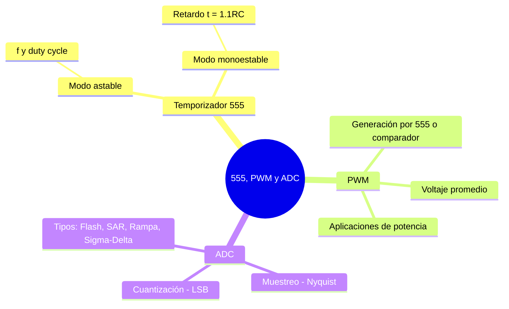

---
{"dg-publish":true,"permalink":"/universidad/3er-semestre/fundamentos-de-electricidad-y-sistemas-digitales/teorico/unidad-3-introduccion-a-los-circuitos-integrados/03-aplicaciones-de-integrados-555-adc-pwm/","dg-note-properties":{}}
---

# ⏱️ Aplicaciones de Integrados 555, ADC y PWM — Acondicionamiento de Señales

## 🎯 Introducción

> [!info] 💡 ¿Qué es el acondicionamiento de señales?
> 
> Muchas señales del mundo real (temperatura, luz, sonido, posición) son **analógicas** y continuas, pero los sistemas digitales solo entienden **unos y ceros**. El **acondicionamiento de señales** es el conjunto de técnicas que adaptan, generan o convierten señales para que puedan ser procesadas, transmitidas o utilizadas por otro circuito.
> 
> En esta sección se cubren tres bloques muy usados en la práctica:
> 
> ```mermaid
> graph LR
>     A[Señal analógica<br/>o temporizada] --> B[555<br/>Temporizador]
>     A --> C[PWM<br/>Modulación]
>     A --> D[ADC<br/>Conversión A/D]
>     B --> E[Temporización,<br/>osciladores, PWM]
>     C --> F[Control de<br/>potencia promedio]
>     D --> G[Dato digital<br/>para un micro]
> 
>     style B fill:#fff4e1
>     style C fill:#e1f5ff
>     style D fill:#e1ffe1
> ```

---

## ⏱️ El Circuito Integrado 555

> [!info] 🔧 ¿Qué es el 555?
> 
> El **555** es un circuito integrado clásico de temporización, formado internamente por dos comparadores, un flip-flop SR y un transistor de descarga. Se alimenta con un rango amplio de voltaje (típicamente 4.5 V a 16 V) y puede operar en dos configuraciones principales: **astable** (oscilador libre) y **monoestable** (disparado por pulso único).

> [!note] 🔁 Modo Astable (oscilador)
> 
> Genera una onda cuadrada continua sin necesidad de señal de disparo externa. Se configura con dos resistencias ($R_1$, $R_2$) y un capacitor ($C$).
> 
> $$f = \frac{1.44}{(R_1 + 2R_2),C}$$
> 
> $$D = \frac{R_1 + R_2}{R_1 + 2R_2}$$
> 
> Donde $D$ es el **ciclo de trabajo (duty cycle)**, siempre mayor a 50 % en la configuración clásica de 3 pines externos (se puede bajar de 50 % agregando un diodo en paralelo con $R_2$).
> 
> - Usos: generación de reloj para lógica digital, parpadeo de LEDs, tonos audibles, base de tiempo para otros circuitos.

> [!note] ⚡ Modo Monoestable (disparado)
> 
> Genera un único pulso de duración fija cada vez que recibe un flanco de disparo en el pin _Trigger_. Se configura con una resistencia $R$ y un capacitor $C$.
> 
> $$t = 1.1, R, C$$
> 
> - Usos: temporizadores de retardo, anti-rebote (debounce) de pulsadores, generación de pulsos de ancho controlado a partir de un evento.

> [!success] 📊 Astable vs. Monoestable
> 
> |Característica|Astable|Monoestable|
> |---|---|---|
> |**Salida**|Onda cuadrada continua|Un solo pulso por disparo|
> |**Componentes clave**|$R_1, R_2, C$|$R, C$|
> |**Fórmula principal**|$f = 1.44/((R_1+2R_2)C)$|$t = 1.1RC$|
> |**Disparo externo**|No requerido|Requerido (flanco en _Trigger_)|
> |**Aplicación típica**|Osciladores, generación de PWM|Retardos, antirrebote|

---

## 🔁 PWM (Modulación por Ancho de Pulso)

> [!info] 🔁 ¿Qué es el PWM?
> 
> El **PWM (Pulse Width Modulation)** es una técnica que representa un nivel de potencia o voltaje promedio variando el **ancho** de un pulso digital, manteniendo su frecuencia fija. Al filtrarse (por la inercia de un motor, un LED o un filtro pasa bajo), el circuito de carga "percibe" un voltaje promedio proporcional al ciclo de trabajo.
> 
> $$V_{prom} = D \times V_{max}$$
> 
> Donde $D$ es el ciclo de trabajo (0 a 1) y $V_{max}$ es el voltaje del pulso en alto.
> 
> ```mermaid
> graph LR
>     A["Onda triangular<br/>(referencia)"] --> C{Comparador}
>     B["Voltaje de control<br/>(nivel deseado)"] --> C
>     C --> D["Salida PWM<br/>(ancho ∝ nivel)"]
> 
>     style C fill:#fff4e1
>     style D fill:#e1ffe1
> ```
> 
> **Formas comunes de generar PWM:**
> 
> |Método|Descripción|
> |---|---|
> |**555 astable modificado**|Variando $R_2$ (o con diodo) se ajusta el duty cycle manteniendo la frecuencia|
> |**Comparador + onda triangular**|Se compara una señal de control con una portadora triangular; el cruce define el ancho del pulso|
> |**Microcontrolador**|Módulos de hardware (Timer/PWM) generan la señal digitalmente|
> 
> > 📌 El PWM es la base de muchas fuentes conmutadas y controladores de motor: en vez de disipar potencia en un elemento resistivo (como en un control lineal), se conmuta a plena carga/apagado, reduciendo drásticamente las pérdidas.

---

## 🔢 ADC (Conversor Analógico-Digital)

> [!info] 🔢 ¿Qué es un ADC?
> 
> Un **ADC (Analog-to-Digital Converter)** transforma una señal analógica continua en un número digital que un sistema digital (microcontrolador, FPGA, etc.) puede procesar. El proceso involucra tres pasos:
> 
> ```mermaid
> graph LR
>     A[Señal analógica] --> B[Muestreo<br/>Sampling]
>     B --> C[Cuantización<br/>Quantization]
>     C --> D[Codificación<br/>Encoding]
>     D --> E[Palabra digital<br/>de n bits]
> 
>     style B fill:#fff4e1
>     style C fill:#e1f5ff
>     style D fill:#e1ffe1
> ```

> [!note] 🎯 Resolución y LSB
> 
> La **resolución** $n$ (en bits) determina cuántos niveles discretos puede representar el conversor:
> 
> $$\text{Niveles} = 2^n$$
> 
> $$LSB = \frac{V_{ref}}{2^n}$$
> 
> Donde $LSB$ (bit menos significativo) es el menor cambio de voltaje que el ADC puede distinguir, y $V_{ref}$ es el voltaje de referencia del conversor.
> 
> > 📌 A mayor número de bits, mayor precisión, pero también mayor tiempo de conversión y complejidad del circuito.

> [!note] ⏱️ Muestreo y Teorema de Nyquist
> 
> Para no perder información de la señal original, la frecuencia de muestreo $f_s$ debe cumplir:
> 
> $$f_s > 2 f_{max}$$
> 
> Donde $f_{max}$ es la componente de mayor frecuencia presente en la señal analógica. Si no se cumple, ocurre **aliasing**: frecuencias altas se "disfrazan" de frecuencias bajas falsas en la señal digitalizada.

> [!success] 📊 Tipos comunes de ADC
> 
> |Tipo|Principio|Velocidad|Complejidad|
> |---|---|---|---|
> |**Flash (paralelo)**|Banco de comparadores simultáneos|Muy alta|Alta (requiere $2^n-1$ comparadores)|
> |**Aproximaciones sucesivas (SAR)**|Búsqueda binaria comparando contra un DAC interno|Media-alta|Media|
> |**Rampa / doble rampa**|Cuenta el tiempo que tarda una rampa en alcanzar la señal|Baja|Baja (pero muy precisa)|
> |**Sigma-Delta**|Sobremuestreo + filtrado digital|Baja-media|Alta precisión, buena para audio/instrumentación|


---

## 🧪 Ejercicios Prácticos

> [!example]- ✏️ Ejercicio 1 — 555 en modo astable
> 
> **Dato:** $R_1 = 1\text{ k}\Omega$, $R_2 = 10\text{ k}\Omega$, $C = 0.1\ \mu F$.
> 
> |Paso|Acción|
> |---|---|
> |**1**|$f = \dfrac{1.44}{(R_1+2R_2)C} = \dfrac{1.44}{(1000+20000)\times 0.1\times10^{-6}} \approx 686\text{ Hz}$|
> |**2**|$D = \dfrac{R_1+R_2}{R_1+2R_2} = \dfrac{1000+10000}{1000+20000} \approx 0.524 ;(52.4%)$|
> |**3**|Conclusión: oscilador de ~686 Hz con duty cycle cercano al 50% , útil como reloj o tono audible|

> [!example]- ✏️ Ejercicio 2 — Resolución de un ADC
> 
> **Dato:** ADC de $n = 10$ bits, $V_{ref} = 5\text{ V}$.
> 
> |Paso|Acción|
> |---|---|
> |**1**|Niveles $= 2^{10} = 1024$|
> |**2**|$LSB = \dfrac{5}{1024} \approx 4.88\text{ mV}$|
> |**3**|Conclusión: el ADC puede distinguir cambios de voltaje de aproximadamente 4.88 mV; una señal de entrada de 2.5 V se codificaría como el código digital $512$ (a mitad de escala)|

---

## ✅ Metas de Aprendizaje

> [!note] 🎯 Nivel Básico
> 
> - [ ] Identifico los pines y modos de operación básicos del 555 (astable, monoestable).
> - [ ] Explico qué representa el ciclo de trabajo (duty cycle) en una señal PWM.
> - [ ] Describo en una frase qué hace un ADC y por qué es necesario entre el mundo analógico y el digital.

> [!note] 🎯 Nivel Intermedio
> 
> - [ ] Calculo $f$ y $D$ de un 555 astable dados $R_1$, $R_2$ y $C$.
> - [ ] Calculo $t$ de un 555 monoestable dados $R$ y $C$.
> - [ ] Calculo la resolución (LSB) de un ADC dado su número de bits y $V_{ref}$.

> [!note] 🎯 Nivel Avanzado
> 
> - [ ] Diseño un 555 astable para cumplir una frecuencia y duty cycle objetivo.
> - [ ] Explico el compromiso entre resolución, velocidad y complejidad al elegir un tipo de ADC.
> - [ ] Relaciono el teorema de Nyquist con el fenómeno de aliasing en un sistema de muestreo real.

---

## 📊 Resumen Visual



---

> [!quote] 📖 Fuentes consultadas
> 
> [1] A. Sedra y K. Smith, _Microelectronic Circuits_, 7th ed. New York, USA: Oxford University Press, 2015, pp. 1085–1120.
> 
> [2] R. L. Boylestad y L. Nashelsky, _Electrónica: Teoría de Circuitos y Dispositivos Electrónicos_, 10th ed. México: Pearson, 2009, pp. 750–780.
> 
> [3] Texas Instruments, _NE555 Precision Timers Datasheet_, 2014.
> 
> [4] A. R. Hambley, _Electrical Engineering: Principles and Applications_, 7th ed. Hoboken, NJ, USA: Pearson, 2018, pp. 610–640.

> [!quote] 🔗 Conexiones
> 
> - [[Universidad/3er Semestre/Fundamentos de Electricidad y Sistemas Digitales/Teórico/Unidad 3 - Introducción a los circuitos integrados/02 - Aplicaciones de los OPAMs - Minimización de Ruido\|02 - Aplicaciones de los OPAMs - Minimización de Ruido]] — tema previo de la unidad: acondicionamiento de señales con amplificadores operacionales.
> - [[Universidad/3er Semestre/Fundamentos de Electricidad y Sistemas Digitales/Teórico/Unidad 3 - Introducción a los circuitos integrados/01 - Introducción a los Circuitos Integrados No Programables\|01 - Introducción a los Circuitos Integrados No Programables]] — fundamento de los CI usados aquí.
> - [[Universidad/3er Semestre/Fundamentos de Electricidad y Sistemas Digitales/Teórico/Unidad 3 - Introducción a los circuitos integrados/04 - Circuitos Integrados de Logica Fija y Tablas de Verdad\|04 - Circuitos Integrados de Logica Fija y Tablas de Verdad]] — siguiente tema de la unidad: lógica digital fija.

---

**Tags:** #circuitosIntegrados #555 #PWM #ADC #acondicionamientoDeSeñales #EYAG1037 #FESD #ESPOL #unidad3