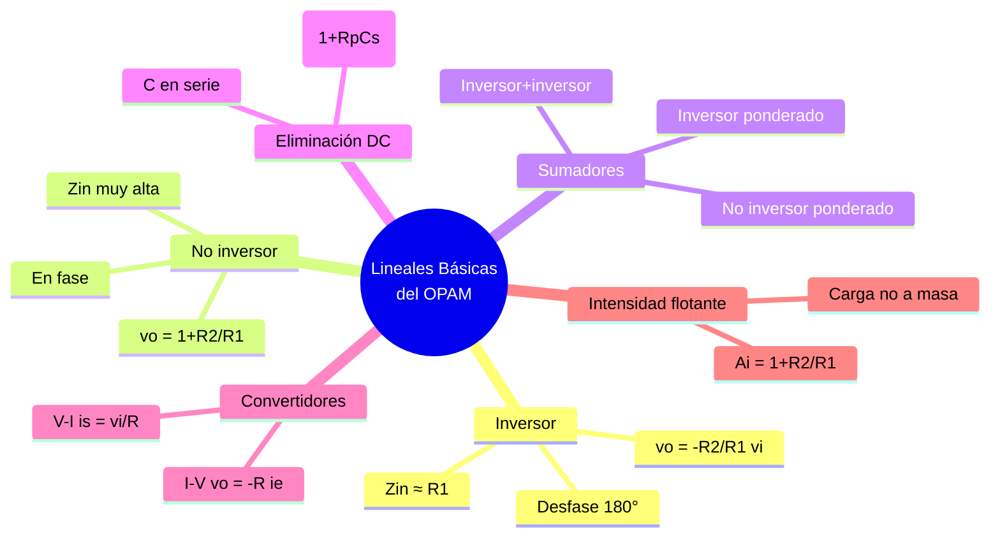

---
{"dg-publish":true,"permalink":"/universidad/3er-semestre/fundamentos-de-electricidad-y-sistemas-digitales/teorico/unidad-3-introduccion-a-los-circuitos-integrados/03-configuraciones-lineales-basicas-del-opam/","dg-note-properties":{}}
---

# 🔧 Configuraciones Lineales Básicas del OPAM — Inversor, No Inversor, Sumadores y Convertidores

## 🎯 Introducción

> [!info] 💡 ¿Por qué estas configuraciones son la base de todo lo demás?
>
> En [[Universidad/3er Semestre/Fundamentos de Electricidad y Sistemas Digitales/Teórico/Unidad 3 - Introducción a los circuitos integrados/02 - Aplicaciones de los OPAMs - Minimización de Ruido\|02 - Aplicaciones de los OPAMs - Minimización de Ruido]] viste el OPAM aplicado a un problema concreto (rechazo de ruido): seguidor de tensión, diferencial, instrumentación y comparador con histéresis. Todas esas topologías derivan de **dos bloques elementales** que *no* se desarrollaron allí de forma standalone: el **amplificador inversor** y el **no inversor**.
>
> Esta nota cierra ese hueco y recoge **todo el bloque lineal básico** del PDF guía *EjREsAmpOp* [3] que faltaba: inversor, no inversor, sumadores ponderados, amplificador con eliminación de nivel DC y convertidores tensión↔corriente — incluido el caso de **ganancia de intensidad con carga flotante** (p. 18 del PDF). Son las piezas con las que luego se construyen integradores, derivadores y los circuitos no lineales de [[Universidad/3er Semestre/Fundamentos de Electricidad y Sistemas Digitales/Teórico/Unidad 3 - Introducción a los circuitos integrados/04 - Integrador, Derivador y Circuitos No Lineales\|04 - Integrador, Derivador y Circuitos No Lineales]].
>
> ```mermaid
> graph LR
>     A[OPAM ideal<br/>V+≈V-, I≈0] --> B[Inversor / No inversor]
>     B --> C[Sumadores<br/>ponderados]
>     B --> D[Eliminación de DC<br/>con C]
>     B --> E[Convertidores<br/>V-I / I-V]
>     E --> F[Amplificador de<br/>intensidad]
>
>     style A fill:#e1ffe1
>     style B fill:#fff4e1
>     style C fill:#e1f5ff
> ```

> [!note] 🗂️ Qué ya viste y qué es nuevo
>
> |Configuración|Estado en tu vault|
> |---|---|
> |Seguidor de tensión ($v_o=v_i$)|Ya en [[Universidad/3er Semestre/Fundamentos de Electricidad y Sistemas Digitales/Teórico/Unidad 3 - Introducción a los circuitos integrados/02 - Aplicaciones de los OPAMs - Minimización de Ruido#🔌 Seguidor de Tensión (Buffer) — Aislamiento de Impedancias\|02 - Buffer]]|
> |Diferencial simple y de instrumentación|Ya en [[Universidad/3er Semestre/Fundamentos de Electricidad y Sistemas Digitales/Teórico/Unidad 3 - Introducción a los circuitos integrados/02 - Aplicaciones de los OPAMs - Minimización de Ruido#➖ Amplificador Diferencial — Rechazo de Modo Común\|02]]|
> |**Inversor, no inversor, sumadores, eliminación DC, convertidores**|**Nuevos aquí (esta nota, PDF pp. 4-13 y 18-20)**|
> |Integrador / Derivador / No lineales|En [[Universidad/3er Semestre/Fundamentos de Electricidad y Sistemas Digitales/Teórico/Unidad 3 - Introducción a los circuitos integrados/04 - Integrador, Derivador y Circuitos No Lineales\|04]]|

---

## 🔄 Amplificador Inversor — El bloque que invierte y escala

> [!note] 🔄 ¿Cómo funciona?
>
> Entrada $v_i$ por resistencia $R_1$ a la entrada **inversora**, entrada **no inversora a masa**, realimentación negativa por $R_2$. Por cortocircuito virtual ($V_+\approx V_- = 0$, $I_+\approx I_-\approx 0$) toda la corriente de entrada debe ir por $R_2$.
>
> $$\boxed{v_o = -\frac{R_2}{R_1}\,v_i}$$
>
> - Signo **negativo**: desfase de $180°$.
> - Ganancia solo depende del cociente $R_2/R_1$ — eliges el valor que quieras.
> - Impedancia de entrada $\approx R_1$ (no es alta como en el no inversor).

> [!success] 📊 Derivación rápida (dos alternativas del PDF p.5)
>
> |Paso|Acción|
> |---|---|
> |**1**|Nodo inversor es tierra virtual ($0$ V). Corrientes: $i_1 = v_i/R_1$, $i_2 = -v_o/R_2$|
> |**2**|KCL: $i_1 = i_2$ (no entra corriente al OPAM) $\Rightarrow v_i/R_1 = -v_o/R_2$|
> |**3**|Despejando: $v_o = -(R_2/R_1)v_i$|

> [!example]- ✏️ Ejemplo — Inversor de ganancia -10
>
> $R_1=10\text{ k}\Omega$, $R_2=100\text{ k}\Omega$, $v_i=0.2\text{ V}$ $\Rightarrow$ $v_o = -10 \times 0.2 = -2\text{ V}$.

---

## ➕ Amplificador No Inversor — Ganancia sin inversión y alta impedancia

> [!note] ➕ Diferencia clave con el inversor
>
> La señal entra **directamente a $V_+$**; la red $R_1$-$R_2$ solo forma un divisor que realimenta una fracción de $v_o$ a $V_-$.
>
> $$\boxed{v_o = \left(1+\frac{R_2}{R_1}\right) v_i}$$
>
> - **Siempre $>1$** (no puede atenuar).
> - **En fase** con $v_i$ (sin inversión).
> - Impedancia de entrada **muy alta** ($\approx$ impedancia del OPAM) — ideal para sensores.

> [!success] 📊 Derivación (PDF p.7)
>
> $$V_- = v_o \cdot \frac{R_1}{R_1+R_2} \approx V_+ = v_i \Rightarrow v_o = \left(1+\frac{R_2}{R_1}\right)v_i$$

> [!warning] ⚠️ Confusión común
>
> No intentes hacer ganancia $<1$ con un no inversor. Para atenuar usa un divisor previo o un inversor con $R_2<R_1$.

---

## ➕➖ Sumadores Ponderados — La generalización lineal

### Sumador Inversor Ponderado (PDF pp. 8-9)

> [!note] ➕ Sumador inversor
>
> Un inversor con **varias ramas $R_1,R_2,R_3$** a la entrada inversora. Cada entrada aporta con peso $R/R_k$.
>
> $$\boxed{v_o = -R\left(\frac{v_1}{R_1}+\frac{v_2}{R_2}+\frac{v_3}{R_3}\right)}$$
>
> Si $R_1=R_2=R_3=R$, entonces $v_o = -(v_1+v_2+v_3)$ — suma pura invertida.

### Sumador No Inversor Ponderado (PDF pp. 10-11)

> [!note] ➕ Sumador no inversor
>
> Las entradas se conectan por resistencias $R_1,R_2,R_3$ a $V_+$ (nodo $v_x$). Luego una etapa no inversora amplifica $v_x$.
>
> $$v_x = \frac{v_1/R_1+v_2/R_2+v_3/R_3}{1/R_1+1/R_2+1/R_3}$$
>
> $$\boxed{v_o = \left(1+\frac{R_B}{R_A}\right) v_x = \left(1+\frac{R_B}{R_A}\right)\frac{\sum v_k/R_k}{\sum 1/R_k}}$$
>
> > 📌 Truco del PDF p.11: puedes construir un sumador no inversor con un **sumador inversor + inversor** en cascada: $v_x=-R\sum v_k/R_k$, $v_o=-(R_5/R_4)v_x$.

> [!example]- ✏️ Ejemplo — Sumador inversor de 2 entradas
>
> $R=20\text{ k}\Omega$, $R_1=10\text{ k}\Omega$, $R_2=20\text{ k}\Omega$, $v_1=1\text{ V}$, $v_2=2\text{ V}$ $\Rightarrow$ $v_o=-20(1/10+2/20)=-20(0.1+0.1)=-4\text{ V}$.

---

## 🌊 Amplificador con Eliminación de Nivel DC — Acoplo AC (PDF pp. 12-13)

> [!note] 🌊 ¿Para qué sirve el condensador?
>
> Añade un **condensador $C$ en serie con resistencia $R_p$** en la rama de entrada. Para **DC ($s\to 0$)**, $C$ es circuito abierto $\Rightarrow$ no pasa continua. Para **AC ($s=j\omega$)**, $C$ es cortocircuito $\Rightarrow$ se comporta como inversor/no inversor normal.
>
> Función de transferencia (PDF p.13, $s=j\omega$):
>
> $$\boxed{\frac{V_o(s)}{V_i(s)} = \left(1+\frac{R_2}{R_1}\right)\frac{R_p C s}{1+R_p C s}}$$
>
> Para $\omega \gg 1/(R_p C)$: $|V_o/V_i|\approx 1+R_2/R_1$ (pasa AC). Para $\omega\to 0$: $|V_o/V_i|\to 0$ (bloquea DC).

> [!warning] ⚠️ No es un filtro activo completo
>
> Este circuito es un **paso alto de primer orden con ganancia**. Para filtros más selectivos ver [[Universidad/3er Semestre/Fundamentos de Electricidad y Sistemas Digitales/Teórico/Unidad 3 - Introducción a los circuitos integrados/02 - Aplicaciones de los OPAMs - Minimización de Ruido#🌊 Filtros Activos — Extendiendo los Filtros Pasivos\|02 - Filtros activos]] y el integrador como LPF en [[Universidad/3er Semestre/Fundamentos de Electricidad y Sistemas Digitales/Teórico/Unidad 3 - Introducción a los circuitos integrados/04 - Integrador, Derivador y Circuitos No Lineales\|04]].

---

## 🔁 Convertidores Tensión-Corriente y Corriente-Tensión (PDF pp. 19-20)

> [!info] 🔁 Fuentes controladas con OPAM
>
> También llamados **fuente de corriente controlada por tensión** y **fuente de tensión controlada por corriente**.

### Convertidor Tensión → Corriente (Howland simplificado)

> [!note] 🔁 V → I
>
> $$i_s = \frac{v_i}{R}$$
>
> La corriente por la carga $R_L$ (a la salida) es proporcional a $v_i$ e **independiente de $R_L$** (dentro del rango lineal del OPAM).

### Convertidor Corriente → Tensión (Transimpedancia)

> [!note] 🔁 I → V
>
> $$\boxed{v_o = -R\,i_e}$$
>
> Un inversor donde la entrada es una corriente $i_e$ inyectada al nodo inversor.

> [!example]- ✏️ Ejemplo — Sensor de corriente
>
> Fotodiodo entrega $i_e=50\ \mu\text{A}$, $R=100\text{ k}\Omega$ $\Rightarrow$ $v_o=-5\text{ V}$ — lectura directa de corriente como tensión.

---

## ⚡ Amplificador de Intensidad con Carga Flotante (PDF p. 18)

> [!note] ⚡ Ganancia de corriente, no de tensión
>
> La carga $R_L$ queda **flotante** entre salida y entrada inversora (no a masa). Ideal para cargas que no pueden ir a tierra.
>
> $$A_i = \frac{i_s}{i_e} = 1+\frac{R_2}{R_1}$$
>
> Misma forma que la ganancia del no inversor, pero en **corriente**.

> [!warning] ⚠️ Carga flotante = cuidado
>
> Ningún terminal de $R_L$ está a masa. No confundir con convertidores donde $R_L$ sí va a masa o a la salida del OPAM.

---

## 🧪 Mini-ejercicios de Cálculo Rápido

> [!example]- ✏️ Ejercicio 1 — Inversor genérico (base para oposiciones Murcia)
>
> $R_1=10\text{ k}$, $R_2=40\text{ k}$, $v_i=0.5\text{ V}$ $\Rightarrow$ $v_o=-4\times0.5=-2\text{ V}$.

> [!example]- ✏️ Ejercicio 2 — No inversor con divisor
>
> $R_1=4.7\text{ k}$, $R_2=10\text{ k}$, $v_i=-0.4\text{ V}$ $\Rightarrow$ $v_o=(1+10/4.7)(-0.4)=3.128\times(-0.4)=-1.25\text{ V}$ (mismo cálculo PDF p.44).

> [!example]- ✏️ Ejercicio 3 — Convertidor I-V
>
> $i_e=2\text{ mA}$, $R=5\text{ k}$ $\Rightarrow$ $v_o=-10\text{ V}$.

---

## ✅ Metas de Aprendizaje

> [!note] 🎯 Nivel Básico
>
> - [ ] Escribo sin dudar $v_o=-(R_2/R_1)v_i$ (inversor) y $v_o=(1+R_2/R_1)v_i$ (no inversor).
> - [ ] Explico por qué el no inversor tiene alta $Z_{in}$ y el inversor $Z_{in}\approx R_1$.
> - [ ] Identifico un sumador ponderado y predigo su signo.

> [!note] 🎯 Nivel Intermedio
>
> - [ ] Calculo la salida de un sumador no inversor ponderado con 3 entradas.
> - [ ] Explico el rol del condensador en el amplificador con eliminación de DC y su FDT.
> - [ ] Distingo convertidor V-I vs I-V y amplificador de intensidad con carga flotante.

> [!note] 🎯 Nivel Avanzado
>
> - [ ] Diseño un sumador inversor que haga $v_o=-(2v_1+0.5v_2)$ eligiendo $R,R_1,R_2$.
> - [ ] Predigo a qué frecuencia el circuito con $R_pC$ deja de atenuar la continua.
> - [ ] Eligo entre inversor / no inversor / convertidor según si la fuente es de tensión, corriente, alta o baja impedancia.

---

## 📊 Resumen Visual



---

> [!quote] 📖 Fuentes consultadas
>
> [1] Fco. Javier Hernández Canals, _Amplificador Operacional — Ejercicios Resueltos_, pp. 4-13 y 18-20 (EjREsAmpOp.pdf).
> [2] A. Sedra y K. Smith, _Microelectronic Circuits_, 7th ed., cap. 2 — configuración inversora/no inversora.
> [3] R. L. Boylestad y L. Nashelsky, _Electrónica: Teoría de Circuitos_, 10th ed., cap. 10.

> [!quote] 🔗 Conexiones
>
> - Previo: [[Universidad/3er Semestre/Fundamentos de Electricidad y Sistemas Digitales/Teórico/Unidad 3 - Introducción a los circuitos integrados/02 - Aplicaciones de los OPAMs - Minimización de Ruido\|02 - Aplicaciones de los OPAMs - Minimización de Ruido]] — seguidor, diferencial e instrumentación (ya cubiertos, no se repiten aquí).
> - Siguiente: [[Universidad/3er Semestre/Fundamentos de Electricidad y Sistemas Digitales/Teórico/Unidad 3 - Introducción a los circuitos integrados/04 - Integrador, Derivador y Circuitos No Lineales\|04 - Integrador, Derivador y Circuitos No Lineales]] — integrador/derivador (extienden estas bases con $C$) y circuitos no lineales.
> - Luego: [[Universidad/3er Semestre/Fundamentos de Electricidad y Sistemas Digitales/Teórico/Unidad 3 - Introducción a los circuitos integrados/05 - Ejercicios Resueltos y de Oposición\|05 - Ejercicios Resueltos y de Oposición]] — problemas numéricos con estas mismas topologías.
> - Después: [[Universidad/3er Semestre/Fundamentos de Electricidad y Sistemas Digitales/Teórico/Unidad 3 - Introducción a los circuitos integrados/06 - Aplicaciones de Integrados 555 - ADC - PWM\|06 - Aplicaciones de Integrados 555 - ADC - PWM]] y [[Universidad/3er Semestre/Fundamentos de Electricidad y Sistemas Digitales/Teórico/Unidad 3 - Introducción a los circuitos integrados/07 - Circuitos Integrados de Logica Fija y Tablas de Verdad\|07 - Circuitos Integrados de Logica Fija y Tablas de Verdad]].

---

**Tags:** #amplificadorOperacional #inversor #noInversor #sumador #convertidorVI #EYAG1037 #FESD #ESPOL #unidad3
