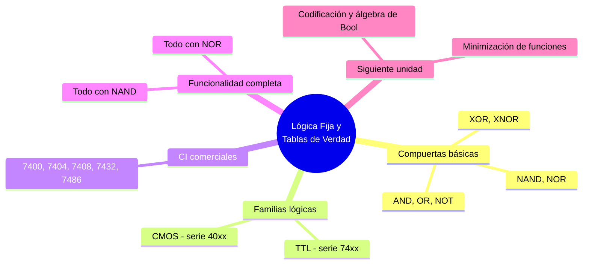

---
{"dg-publish":true,"permalink":"/universidad/3er-semestre/fundamentos-de-electricidad-y-sistemas-digitales/teorico/unidad-3-introduccion-a-los-circuitos-integrados/04-circuitos-integrados-de-logica-fija-y-tablas-de-verdad/","dg-note-properties":{}}
---

# 🔢 Circuitos Integrados de Lógica Fija y Tablas de Verdad

## 🎯 Introducción

> [!info] 💡 ¿Qué es la lógica fija?
> 
> Un **circuito integrado de lógica fija** implementa una función booleana predeterminada por su fabricación (por ejemplo, una compuerta AND o un decodificador), a diferencia de los dispositivos **programables** (como una FPGA), cuya función se define después de fabricados. Son la base de casi todo sistema digital: desde un simple circuito combinacional hasta la lógica de control de un procesador.
> 
> ```mermaid
> graph LR
>     A[Entradas<br/>0 / 1] --> B[Compuerta o CI<br/>de lógica fija]
>     B --> C[Salida<br/>0 / 1]
> 
>     style B fill:#fff4e1
> ```

---

## 🔲 Compuertas Lógicas Básicas

> [!info] 🔲 Álgebra de Boole y compuertas
> 
> Cada compuerta implementa una operación booleana. Su comportamiento se describe completamente mediante una **tabla de verdad**, que enumera todas las combinaciones posibles de entrada y la salida correspondiente.

> [!note] 📋 Tabla de verdad — Compuertas de 2 entradas
> 
> |A|B|AND|OR|NAND|NOR|XOR|XNOR|
> |---|---|---|---|---|---|---|---|
> |0|0|0|0|1|1|0|1|
> |0|1|0|1|1|0|1|0|
> |1|0|0|1|1|0|1|0|
> |1|1|1|1|0|0|0|1|
> 
> - **AND** ($A \cdot B$): salida 1 solo si ambas entradas son 1.
> - **OR** ($A + B$): salida 1 si al menos una entrada es 1.
> - **NAND / NOR**: negación de AND / OR — son **funcionalmente completas** (cualquier función booleana puede construirse solo con NAND, o solo con NOR).
> - **XOR** ($A \oplus B$): salida 1 si las entradas son diferentes.
> - **XNOR**: negación de XOR — salida 1 si las entradas son iguales.

> [!note] 🚫 NOT (inversor)
> 
> Única compuerta de una sola entrada: invierte el valor lógico.
> 
> |A|NOT A|
> |---|---|
> |0|1|
> |1|0|

---

## ⚙️ Familias Lógicas: TTL vs. CMOS

> [!info] ⚙️ ¿Por qué existen distintas familias?
> 
> Las compuertas se fabrican con distintas tecnologías de transistores, lo que da lugar a **familias lógicas** con diferentes características eléctricas. Las dos más relevantes históricamente son **TTL** (transistores bipolares) y **CMOS** (transistores de efecto de campo).

> [!success] 📊 Comparación TTL vs. CMOS
> 
> |Característica|TTL (serie 74xx)|CMOS (serie 40xx / 74HCxx)|
> |---|---|---|
> |**Tecnología**|Transistores bipolares (BJT)|Transistores MOSFET|
> |**Voltaje de alimentación**|5 V (fijo)|3 V a 15 V (flexible)|
> |**Consumo de potencia**|Mayor, incluso en reposo|Muy bajo en reposo|
> |**Velocidad de conmutación**|Alta|Variable según subfamilia|
> |**Inmunidad al ruido**|Moderada|Alta|
> |**Ejemplo de IC**|7400 (NAND), 7408 (AND)|4011 (NAND), 4081 (AND)|

---

## 🔧 Circuitos Integrados de Lógica Fija Comerciales

> [!note] 🔧 Familia 74xx — ejemplos típicos
> 
> |IC|Función|N.º de compuertas|
> |---|---|---|
> |**7400**|4× NAND de 2 entradas|4|
> |**7402**|4× NOR de 2 entradas|4|
> |**7404**|6× NOT (inversor)|6|
> |**7408**|4× AND de 2 entradas|4|
> |**7432**|4× OR de 2 entradas|4|
> |**7486**|4× XOR de 2 entradas|4|
> 
> > 📌 Estos encapsulados suelen venir en formato DIP de 14 pines, con pines de alimentación ($V_{CC}$, GND) compartidos entre todas las compuertas internas.

> [!note] 🧩 Funcionalidad completa con NAND/NOR
> 
> Cualquier función booleana puede implementarse usando **únicamente** compuertas NAND (o únicamente NOR), ya que a partir de ellas se pueden construir NOT, AND, OR y las demás:
> 
> - $NOT\ A = NAND(A, A)$
> - $AND(A,B) = NOT(NAND(A,B))$
> - $OR(A,B) = NAND(NOT\ A, NOT\ B)$
> 
> Esta propiedad es clave en el diseño e implementación económica de circuitos digitales, ya que reduce el número de tipos de CI distintos necesarios.

---

## 🧪 Ejercicios Prácticos

> [!example]- ✏️ Ejercicio 1 — Tabla de verdad de una función compuesta
> 
> **Dato:** $S = (A \cdot B) + \overline{C}$, con $A, B, C$ como entradas.
> 
> |A|B|C|$A\cdot B$|$\overline{C}$|$S$|
> |---|---|---|---|---|---|
> |0|0|0|0|1|1|
> |0|0|1|0|0|0|
> |0|1|0|0|1|1|
> |0|1|1|0|0|0|
> |1|0|0|0|1|1|
> |1|0|1|0|0|0|
> |1|1|0|1|1|1|
> |1|1|1|1|0|1|
> 
> > 📌 $S$ es 1 en 5 de las 8 combinaciones posibles — este tipo de tabla es el punto de partida para simplificar la función con Karnaugh o álgebra de Boole (ver [[Unidad 4 - Fundamentos de sistemas digitales\|Unidad 4 - Fundamentos de sistemas digitales]]).

> [!example]- ✏️ Ejercicio 2 — Circuito construido solo con NAND
> 
> **Dato:** Implementar $S = A + B$ (OR) usando únicamente compuertas NAND.
> 
> |Paso|Acción|
> |---|---|
> |**1**|Invertir cada entrada con NAND en modo inversor: $\overline{A} = NAND(A,A)$, $\overline{B} = NAND(B,B)$|
> |**2**|Aplicar una tercera NAND a las entradas invertidas: $S = NAND(\overline{A}, \overline{B})$|
> |**3**|Verificación: $NAND(\overline{A},\overline{B}) = \overline{\overline{A}\cdot\overline{B}} = A + B$ (por la ley de De Morgan) ✅|

---

## ✅ Metas de Aprendizaje

> [!note] 🎯 Nivel Básico
> 
> - [ ] Construyo la tabla de verdad de las compuertas básicas (AND, OR, NOT, NAND, NOR, XOR, XNOR).
> - [ ] Identifico la diferencia general entre lógica fija y lógica programable.
> - [ ] Reconozco algunos CI comerciales de la familia 74xx y su función.

> [!note] 🎯 Nivel Intermedio
> 
> - [ ] Construyo la tabla de verdad de una función booleana compuesta con varias entradas.
> - [ ] Comparo las familias TTL y CMOS en términos de voltaje, consumo y velocidad.
> - [ ] Explico por qué NAND y NOR son compuertas funcionalmente completas.

> [!note] 🎯 Nivel Avanzado
> 
> - [ ] Implemento una función booleana dada usando únicamente compuertas NAND (o NOR).
> - [ ] Selecciono la familia lógica adecuada (TTL vs. CMOS) según requerimientos de consumo, velocidad e inmunidad al ruido.
> - [ ] Relaciono una tabla de verdad con su posible simplificación algebraica como paso previo a Karnaugh (Unidad 4).

---

## 📊 Resumen Visual



---

> [!quote] 📖 Fuentes consultadas
> 
> [1] M. M. Mano y M. D. Ciletti, _Digital Design_, 6th ed. Boston, USA: Pearson, 2018, pp. 45–90.
> 
> [2] R. L. Boylestad y L. Nashelsky, _Electrónica: Teoría de Circuitos y Dispositivos Electrónicos_, 10th ed. México: Pearson, 2009, pp. 800–830.
> 
> [3] Texas Instruments, _SN74HC00 Quad 2-Input NAND Gate Datasheet_, 2015.

> [!quote] 🔗 Conexiones
> 
> - [[Universidad/3er Semestre/Fundamentos de Electricidad y Sistemas Digitales/Teórico/Unidad 3 - Introducción a los circuitos integrados/03 - Aplicaciones de Integrados 555 - ADC - PWM\|03 - Aplicaciones de Integrados 555 - ADC - PWM]] — tema previo de la unidad.
> - [[Universidad/3er Semestre/Fundamentos de Electricidad y Sistemas Digitales/Teórico/Unidad 3 - Introducción a los circuitos integrados/01 - Introducción a los Circuitos Integrados No Programables\|01 - Introducción a los Circuitos Integrados No Programables]] — fundamento de los CI de lógica fija.
> - Unidad 4 — Fundamentos de sistemas digitales: introduce codificación, álgebra de Bool y minimización de funciones lógicas a partir de estas mismas tablas de verdad.

---

**Tags:** #circuitosIntegrados #logicaFija #tablasVerdad #TTL #CMOS #EYAG1037 #FESD #ESPOL #unidad3