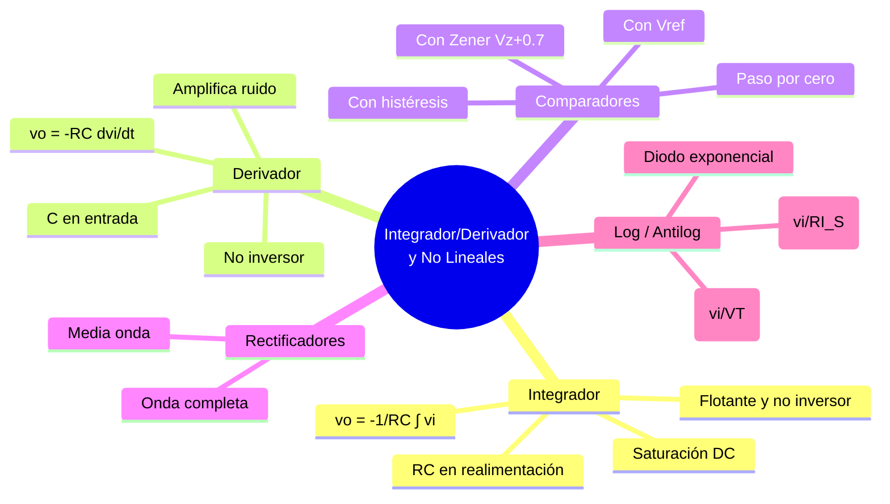

---
{"dg-publish":true,"permalink":"/universidad/3er-semestre/fundamentos-de-electricidad-y-sistemas-digitales/teorico/unidad-3-introduccion-a-los-circuitos-integrados/04-integrador-derivador-y-circuitos-no-lineales/","dg-note-properties":{}}
---

# 🌀 Integrador, Derivador y Circuitos No Lineales del OPAM

## 🎯 Introducción

> [!info] 💡 ¿Por qué separar lineales con memoria y no lineales?
>
> [[Universidad/3er Semestre/Fundamentos de Electricidad y Sistemas Digitales/Teórico/Unidad 3 - Introducción a los circuitos integrados/03 - Configuraciones Lineales Básicas del OPAM\|03 - Configuraciones Lineales Básicas del OPAM]] cubrió circuitos **sin memoria** (solo $R$): su salida depende del valor instantáneo de la entrada. Aquí aparecen dos familias distintas del mismo PDF [3]:
>
> 1. **Con memoria ($C$)**: integrador y derivador — la salida depende de la **historia** de la entrada (integral/derivada en el tiempo).
> 2. **No lineales (saturación, diodos)**: comparadores, rectificadores y log/antilog — el OPAM ya **no está en zona lineal**, satura a $\pm V_{sat}$ o usa la exponencial del diodo.
>
> ```mermaid
> graph TD
>     A[OPAM con R y C] --> B[Integrador<br/>1/sCs en realimentación]
>     A --> C[Derivador<br/>Cs en entrada]
>     D[OPAM en lazo abierto<br/>o con diodo] --> E[Comparadores<br/>paso por cero / Zener / Vref / histéresis]
>     D --> F[Rectificadores<br/>media/onda completa]
>     D --> G[Log / Antilog<br/>con diodo exponencial]
>
>     style B fill:#e1f5ff
>     style C fill:#fff4e1
>     style E fill:#ffe1e1
> ```

---

## ∫ Integrador — La salida es la integral de la entrada

> [!note] ∫ Principio (PDF p. 21)
>
> Un **inversor donde $R_2$ se reemplaza por un condensador $C$**. Por cortocircuito virtual ($V_-=0$):
>
> $$i_R = \frac{v_i}{R} = -i_C = -C\frac{dv_o}{dt}$$
>
> $$\boxed{v_o(t) = -\frac{1}{RC}\int_0^t v_i(\tau)\,d\tau + v_o(0)}$$

> [!success] 📊 Interpretación
>
> |Entrada $v_i$|Salida $v_o$|
> |---|---|
> |Positiva constante|Rampa con pendiente **negativa**|
> |Negativa constante|Rampa con pendiente **positiva**|
> |Cero|$v_o$ se mantiene (memoria)|
> |Sinusoidal|Coseno atenuado por $1/\omega RC$|

### Variante: Integrador Inversor con Condensador Flotante (PDF p. 22)

> [!note] 🧩 Condensador no a masa
>
> El condensador queda **flotante** entre salida y nodo inversor (sin conectar a masa). La ecuación es la misma, pero la condición inicial $v_o(0)$ queda definida por la carga inicial del $C$ flotante.

### Integrador No Inversor (PDF p. 23)

> [!note] ➕ Integrador no inversor
>
> Entrada por $V_+$ con red $R$-$C$; la fórmula gana signo positivo y factor $1/2$ según el divisor del PDF:
>
> $$\boxed{v_o(t) = +\frac{1}{R_{eq}C}\int v_i\,dt}$$
>
> Donde $R_{eq}$ depende de la red resistiva (PDF usa dos $R$ iguales $\Rightarrow$ $v_o = \frac{2}{RC}\int v_i dt$ en esa topología concreta). Lo esencial: **sigue siendo integral, pero sin inversión**.

> [!warning] ⚠️ Saturación en el integrador real
>
> Un $v_i$ con componente DC por pequeña que sea se integra hasta saturar el OPAM ($\pm V_{sat}$). En la práctica se añade una $R$ grande en paralelo con $C$ para dar camino DC y evitar deriva — es el **integrador práctico / LPF activo** que ya viste en [[Universidad/3er Semestre/Fundamentos de Electricidad y Sistemas Digitales/Teórico/Unidad 3 - Introducción a los circuitos integrados/02 - Aplicaciones de los OPAMs - Minimización de Ruido#🌊 Filtros Activos — Extendiendo los Filtros Pasivos\|02 - Filtros activos]].

---

## d/dt Derivador — La salida es la derivada de la entrada

> [!note] d/dt Principio (PDF p. 24)
>
> **Dual del integrador**: $C$ en la entrada, $R$ en la realimentación.
>
> $$i_C = C\frac{dv_i}{dt} = -\frac{v_o}{R}$$
>
> $$\boxed{v_o(t) = -RC\,\frac{dv_i(t)}{dt}}$$

### Derivador Inversor (PDF p. 25)

> [!note] 🔁 Inversor derivador
>
> $$v_o = -RC\,\dot{v}_i$$
>
> Si $v_i$ es rampa $\Rightarrow$ $v_o$ es constante.

### Derivador No Inversor (PDF p. 26)

> [!note] ➕ No inversor derivador
>
> Dos condensadores en el PDF (entrada y realimentación diferenciada):
>
> $$\boxed{v_o = +RC\,\frac{dv_i}{dt}}$$
>
> Signo positivo, misma magnitud.

> [!warning] ⚠️ El derivador puro es ruidoso
>
> Deriva el **ruido de alta frecuencia** (lo amplifica). Por eso en la práctica se añade una $R$ pequeña en serie con $C$ para limitar la ganancia a alta frecuencia — igual que el integrador necesita $R$ en paralelo con $C$.

> [!example]- ✏️ Mini-ejemplo — Integrador vs Derivador
>
> $R=10\text{ k}$, $C=100\text{ nF}$ $\Rightarrow$ $RC=1\text{ ms}$.
> - Integrador: $v_i=1\text{ V}$ DC $\Rightarrow$ $v_o=-1000\,t$ (rampa $-1$ V/ms).
> - Derivador: $v_i=\sin(100t)$ $\Rightarrow$ $v_o=-RC\cdot100\cos(100t)=-0.1\cos(100t)$.

---

## ⚖️ Comparadores — OPAM en lazo abierto (PDF pp. 47-52)

> [!info] ⚖️ Idea central
>
> Sin realimentación negativa el OPAM satura: $v_o = A_{OL}(v_+-v_-)\approx \pm V_{sat}$. Solo distingue **qué entrada es mayor**.

### Detector de Paso por Cero (PDF p. 48)

> [!note] 0️⃣ Paso por cero
>
> Una entrada a $0$ V, la otra es $v_i$. 
> - $v_i>0 \Rightarrow v_o=+V_{sat}$
> - $v_i<0 \Rightarrow v_o=-V_{sat}$
>
> Inversor: $v_o=-A_{OL}v_i$ si $v_i$ va a $V_-$; no inversor: $v_o=+A_{OL}v_i$ si va a $V_+$.

### Comparador con Diodos Zener (PDF p. 49)

> [!note] 🔒 Limitación con Zener
>
> Dos Zener en antiserie a la salida limitan $v_o$ a $\pm(V_Z+0.7\text{ V})$ en vez de $\pm V_{sat}$.
>
> $$v_o = \begin{cases} V_{Z2}+0.7 & v_i>0 \\ -(V_{Z1}+0.7) & v_i<0 \end{cases}$$
>
> Útil para obtener niveles lógicos compatibles.

### Comparador con Tensión de Referencia (PDF pp. 50-51)

> [!note] 🎯 Con $V_{ref}$
>
> $$v_o = A_{OL}(v_i - V_{ref})$$
>
> El umbral ya no es $0$ sino $V_{ref}$ (fijada por divisor o Zener).
> - $v_i>V_{ref}\Rightarrow +V_{sat}$ (limitado por Zener si existe)
> - $v_i<V_{ref}\Rightarrow -V_{sat}$

### Comparador con Histéresis — Schmitt Trigger (PDF p. 52)

> [!note] 🔲 Histéresis (ya viste la motivación en 02)
>
> Realimentación **positiva** por divisor $R_1,R_2$ crea dos umbrales distintos:
>
> $$V_{TH} = \frac{R_1}{R_1+R_2}V_{sat}, \quad V_{TL} = -\frac{R_1}{R_1+R_2}V_{sat}$$
>
> La salida solo cambia cuando $v_i$ supera el umbral correspondiente a su estado actual — **inmunidad a ruido** cerca del umbral.

> [!quote] 🔗 Ya cubierto en parte
>
> El comparador con histéresis y su ventaja frente al ruido se desarrolló a fondo en [[Universidad/3er Semestre/Fundamentos de Electricidad y Sistemas Digitales/Teórico/Unidad 3 - Introducción a los circuitos integrados/02 - Aplicaciones de los OPAMs - Minimización de Ruido#🔲 Comparador con Histéresis — Inmunidad en Señales Digitales\|02 - Comparador con histéresis]]. Aquí lo ves en su forma genérica del PDF.

---

## 🔀 Rectificadores de Precisión con OPAM (PDF pp. 53-54)

> [!info] 🔀 ¿Por qué con OPAM?
>
> Un diodo solo rectifica si $v_i>0.7\text{ V}$. Con OPAM el diodo queda dentro del lazo $\Rightarrow$ **rectifica desde $\mu$V** (rectificador de precisión / superdiodo).

### Media Onda (PDF p. 53)

> [!note] ◐ Media onda
>
> Dos diodos $D_1,D_2$ y dos $R$. Para $v_i>0$, $D_1$ conduce, $D_2$ bloquea $\Rightarrow$ $v_o$ sigue a $v_i$; para $v_i<0$, se invierte el camino $\Rightarrow$ $v_o=0$.

### Onda Completa (PDF p. 54)

> [!note] ◑ Onda completa
>
> Dos OPAMs: el primero es media onda, el segundo es sumador que combina $v_i$ y la salida del primero para obtener $|v_i|$.
>
> Estructura: $R_1,R_2$ en primer OPAM + $R_2,R_2$ en segundo.

> [!warning] ⚠️ No es fuente lineal
>
> Estos rectificadores son para **señal pequeña** (instrumentación). Para rectificar potencia de red ver [[Universidad/3er Semestre/Fundamentos de Electricidad y Sistemas Digitales/Teórico/Unidad 2 - Introducción a la Electrónica/04 - Circuitos de Filtrado y Fuentes Lineales\|04 - Circuitos de Filtrado y Fuentes Lineales]] y [[Universidad/3er Semestre/Fundamentos de Electricidad y Sistemas Digitales/Teórico/Unidad 2 - Introducción a la Electrónica/05 - Reguladores en Fuentes Lineales\|05 - Reguladores en Fuentes Lineales]].

---

## 📈 Amplificadores Logarítmico y Antilogarítmico (PDF pp. 55-58)

### Logarítmico (PDF pp. 55-57)

> [!note] 📈 Log con diodo en realimentación
>
> Diodo en la realimentación del inversor ($V_+$ a masa). Por la ecuación del diodo $I_D=I_S(e^{V_D/V_T}-1)$:
>
> $$v_o = -V_T \ln\left(\frac{v_i}{R_1 I_S}\right)$$
>
> - Solo $v_i>0$.
> - $V_T=kT/q\approx 25\text{ mV}$ a $300\text{ K}$, $I_S$ es corriente de saturación del diodo.
> - Derivación PDF p.57: $v_o/R_1 = I_S e^{-v_o/V_T}$.

> [!warning] ⚠️ Sensible a temperatura
>
> $V_T$ y $I_S$ dependen de $T$. En circuitos reales se compensa con un segundo diodo acoplado térmicamente o se usa un transistor apareado.

### Antilogarítmico / Exponencial (PDF p. 58)

> [!note] 📉 Antilog
>
> Diodo en la **entrada** (en serie con $R_1$), resistencia en realimentación:
>
> $$\boxed{v_o = -R_1 I_S\, e^{v_i/V_T}}$$

> [!success] 📊 Log + Antilog = Multiplicador analógico
>
> Combinando log, sumador y antilog se puede hacer $v_o\propto v_1\cdot v_2$ o $v_1/v_2$ en dominio analógico — aplicación clásica antes del dominio digital.

---

## ✅ Metas de Aprendizaje

> [!note] 🎯 Nivel Básico
>
> - [ ] Escribo $v_o=-(1/RC)\int v_i dt$ (integrador) y $v_o=-RC\,\dot v_i$ (derivador).
> - [ ] Reconozco un comparador en lazo abierto y predigo $\pm V_{sat}$.
> - [ ] Distingo rectificador de media onda vs onda completa.

> [!note] 🎯 Nivel Intermedio
>
> - [ ] Explico por qué el integrador puro se satura y cómo se corrige con $R$ en paralelo con $C$.
> - [ ] Calculo los niveles limitados por Zener ($V_Z+0.7$) y el umbral $V_{ref}$.
> - [ ] Deduzco $v_o=-V_T\ln(v_i/(R I_S))$ a partir de $I_D$.

> [!note] 🎯 Nivel Avanzado
>
> - [ ] Diseño un integrador que genere rampa de $1$ V/ms a partir de $1$ V DC eligiendo $RC$.
> - [ ] Justifico cuándo usar comparador con histéresis vs paso por cero según el ruido esperado.
> - [ ] Explico por qué el derivador amplifica ruido y cómo mitigarlo.

---

## 📊 Resumen Visual



---

> [!quote] 📖 Fuentes consultadas
>
> [1] Fco. Javier Hernández Canals, _Amplificador Operacional — Ejercicios Resueltos_, pp. 21-26 y 47-58 (EjREsAmpOp.pdf).
> [2] A. Sedra y K. Smith, _Microelectronic Circuits_, 7th ed., cap. 2 y 17 — integrador/derivador y no lineales.
> [3] R. L. Boylestad y L. Nashelsky, _Electrónica: Teoría de Circuitos_, 10th ed., cap. 10-11.

> [!quote] 🔗 Conexiones
>
> - Previo: [[Universidad/3er Semestre/Fundamentos de Electricidad y Sistemas Digitales/Teórico/Unidad 3 - Introducción a los circuitos integrados/03 - Configuraciones Lineales Básicas del OPAM\|03 - Configuraciones Lineales Básicas del OPAM]] — inversor/no inversor/sumadores (base sin $C$).
> - Previo ruido: [[Universidad/3er Semestre/Fundamentos de Electricidad y Sistemas Digitales/Teórico/Unidad 3 - Introducción a los circuitos integrados/02 - Aplicaciones de los OPAMs - Minimización de Ruido#🌊 Filtros Activos — Extendiendo los Filtros Pasivos\|02 - Filtros activos]] — integrador visto como LPF activo.
> - Siguiente: [[Universidad/3er Semestre/Fundamentos de Electricidad y Sistemas Digitales/Teórico/Unidad 3 - Introducción a los circuitos integrados/05 - Ejercicios Resueltos y de Oposición\|05 - Ejercicios Resueltos y de Oposición]] — problemas numéricos que usan integrador/derivador.
> - Luego: [[Universidad/3er Semestre/Fundamentos de Electricidad y Sistemas Digitales/Teórico/Unidad 3 - Introducción a los circuitos integrados/06 - Aplicaciones de Integrados 555 - ADC - PWM\|06 - Aplicaciones de Integrados 555 - ADC - PWM]] y [[Universidad/3er Semestre/Fundamentos de Electricidad y Sistemas Digitales/Teórico/Unidad 3 - Introducción a los circuitos integrados/07 - Circuitos Integrados de Logica Fija y Tablas de Verdad\|07 - Circuitos Integrados de Logica Fija y Tablas de Verdad]].

---

**Tags:** #amplificadorOperacional #integrador #derivador #comparador #rectificador #logaritmico #EYAG1037 #FESD #ESPOL #unidad3
