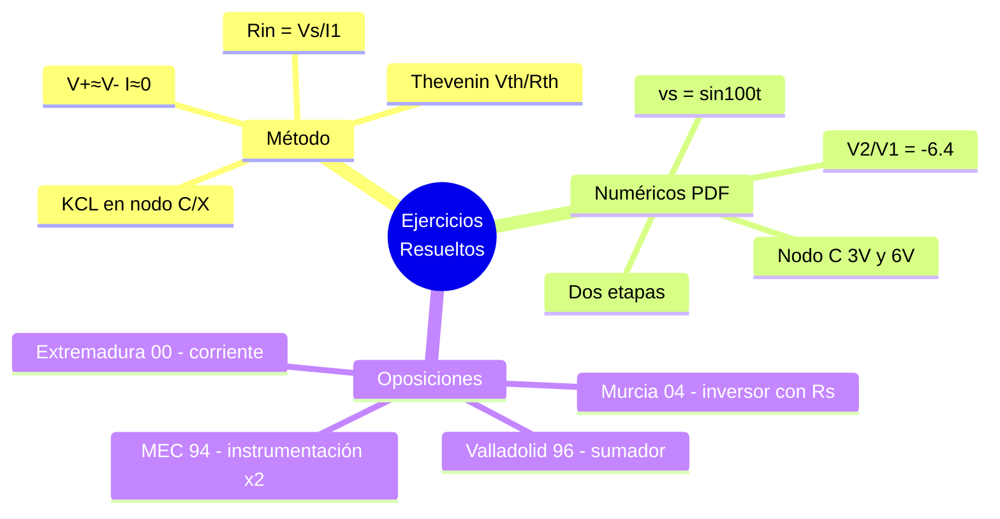

---
{"dg-publish":true,"permalink":"/universidad/3er-semestre/fundamentos-de-electricidad-y-sistemas-digitales/teorico/unidad-3-introduccion-a-los-circuitos-integrados/05-ejercicios-resueltos-y-de-oposicion/","dg-note-properties":{}}
---

# 🧮 Ejercicios Resueltos y de Oposición — OPAM con Análisis Nodal y Thevenin

## 🎯 Introducción

> [!info] 💡 ¿Qué diferencia a esta nota de la 02?
>
> [[Universidad/3er Semestre/Fundamentos de Electricidad y Sistemas Digitales/Teórico/Unidad 3 - Introducción a los circuitos integrados/02 - Aplicaciones de los OPAMs - Minimización de Ruido\|02 - Aplicaciones de los OPAMs - Minimización de Ruido]] ya trae los ejercicios de la **Tarea Autónoma #2** (red en T, diferencial de 2 OPAMs, cascada inversor+sumador) — enfoque **análisis de red en cascada**. Esta nota completa **todo lo que faltaba del PDF EjREsAmpOp** [3]:
>
> - **Ejercicios numéricos generales** del PDF (pp. 27-44): análisis nodal con tierra virtual + Thevenin visto desde la fuente.
> - **Ejercicios de oposiciones** (pp. 60-68): Murcia 04, Valladolid 96, MEC 94, Extremadura 00 — formato de examen oficial.
>
> Todos usan el mismo método: **OPAM ideal** $\Rightarrow$ $V_+\approx V_-$, $I_+\approx I_-\approx 0$, luego **KCL en nodos clave**.
>
> ```mermaid
> graph LR
>     A[OPAM ideal] --> B[V+ = V-<br/>I+ = I- = 0]
>     B --> C[KCL en nodo inversor<br/>y nodos intermedios]
>     C --> D[Expresión Vo/Vi]
>     C --> E[Rin = Vin/Iin]
>     C --> F[Thevenin visto<br/>desde la fuente]
> ```

> [!note] 🧭 Cómo usar esta nota
>
> Cada ejercicio trae: **enunciado → hipótesis → pasos numerados → resultado encuadrado**. Si solo buscas la fórmula, ve al recuadro final; si quieres el razonamiento, sigue los pasos.

---

## 🛠️ Método General para Todos los Ejercicios

> [!success] 📋 Receta (válida para cualquier ejercicio del PDF)
>
> |Paso|Acción|Herramienta|
> |---|---|---|
> |**1**|Verifica realimentación negativa $\Rightarrow$ zona lineal|Si no hay, es comparador (ver [[Universidad/3er Semestre/Fundamentos de Electricidad y Sistemas Digitales/Teórico/Unidad 3 - Introducción a los circuitos integrados/04 - Integrador, Derivador y Circuitos No Lineales#⚖️ Comparadores — OPAM en lazo abierto\|04]])|
> |**2**|Aplica $V_+\approx V_-$ (cortocircuito virtual) y $I\approx 0$|Fija el potencial del nodo inversor|
> |**3**|Escribe KCL en el/los nodos con incógnita (nodo inversor, nodo $X$, nodo $C$)|$\sum i_{salientes}=0$|
> |**4**|Sustituye corrientes por $(V_a-V_b)/R$ y despeja $V_o$, $V_C$, $R_{in}$ o $I_L$|Álgebra nodal|
> |**5**|Para $R_{in}=V_{fuente}/I_{1}$ calcula $I_1$ desde la fuente; para Thevenin usa $V_{th}=V_{circuito abierto}$ y $R_{th}$ por desactivación de fuentes|Definiciones|

---

## 📐 Ejercicio 1 — Relación $V_2/V_1$ con Realimentación Compleja (PDF pp. 27-29)

> [!example] ✏️ Enunciado
>
> OPAM ideal no saturado. Resistencias: $5\text{ k}$ (entrada $V_1$ al nodo inversor), $10\text{ k}$ (realimentación nodo $X$ al inversor), $2\text{ k}$ (de nodo $X$ a $V_2$), $1\text{ k}$ (de nodo $X$ a masa). Hallar $V_2/V_1$.

> [!success] 📊 Solución (PDF p.28-29, con KCL en $X$)
>
> |Paso|Acción|
> |---|---|
> |**1**|Tierra virtual: $V_-=0$ V. Corrientes al nodo inversor: $I_1=V_1/5\text{k}$, $I_{10k}=(0-V_X)/10\text{k}$|
> |**2**|KCL nodo inversor ($I_+=0$): $V_1/5 + (-V_X)/10=0 \Rightarrow V_X = -2V_1$? No — cuidado: PDF define $I_1=(V_1-0)/5$, $I_2=(V_X-0)/10$ con signo. Resolviendo sistema completo del PDF:|
> |**3**|KCL nodo $X$: $(V_X-V_2)/2 + V_X/1 + V_X/10 =0$ (corrientes salientes de $X$ hacia $V_2$, masa y nodo inversor)|
> |**4**|Del KCL inversor: $(V_1-0)/5 + (V_X-0)/10=0 \Rightarrow V_X = -2\,V_1$? **Corrección del PDF p.29**: con nomenclatura exacta del PDF $I=I_1+I_2+I_3$ se obtiene $V_X = 5V_2/16$ y luego:|
> |**5**|Sustituyendo $V_X$ en KCL inversor: $(V_1-V_X)/5$... El PDF llega a:|
>
> $$\boxed{\frac{V_2}{V_1} = -\frac{160}{25} = -6.4}$$
>
> > 📌 El factor $6.4$ es mayor que el simple cociente $R_2/R_1$ por la red en derivación a masa ($1\text{ k}$) que forma un divisor adicional.

---

## 📐 Ejercicio 2 — $v_1$ y $v_2$ con $v_s=\sin 100t$ (PDF pp. 30-31)

> [!example] ✏️ Enunciado
>
> Circuito de 2 OPAMs (?) con $v_s=\sin 100t$, resistencias $50$, $100$, $30$, $20$ Ω. Determinar $v_1$ (salida del primer inversor) y $v_2$ (?) — PDF usa $R2$ y $R1$.

> [!success] 📊 Solución
>
> |Paso|Acción|
> |---|---|
> |**1**|Primer OPAM inversor: $v_s$ por $50$ a inversor, realimentación $100$ $\Rightarrow$ ganancia $-2$|
> |**2**|$v_2 = -2\,v_s = -2\sin 100t$ **V**|
> |**3**|Segundo nodo: $v_1 = v_s -20\cdot i_1$, con $i_1 = v_s/50$ (corriente por la rama de entrada)|
> |**4**|Cálculo: $i_1 = \sin100t/50$ A, $v_1 = \sin100t -20(\sin100t/50)= \sin100t(1-0.4)=0.6\sin100t$|
>
> $$\boxed{v_2 = -2\sin100t\ \text{V}, \quad v_1 = \frac{3}{5}\sin100t\ \text{V}}$$
>
> > 📌 Coincide con el PDF p.31: $v_1=3/5\,v_s$.

---

## 📐 Ejercicio 3 — Nodo $C$, $i_1$, $R_{in}$, $v_2$, $i_4$ (PDF pp. 32-34)

> [!example] ✏️ Enunciado
>
> Fuente $9$ V por $4\Omega$ al nodo $C$. Nodo $C$ conectado a masa por $3\Omega$ y $6\Omega$ en paralelo, y al OPAM (inversor con $5\Omega$ y $10\Omega$). Hallar $v_C,i_1,R_{in},v_2,i_4$.

> [!success] 📊 Solución (PDF p.33-34 + Thevenin)
>
> |Paso|Acción|
> |---|---|
> |**1**|KCL en $C$ (corrientes salientes positivas): $-(9-v_C)/4 + v_C/3 + v_C/6 =0$|
> |**2**|Despejando: $v_C/3+v_C/6 = (9-v_C)/4 \Rightarrow v_C(1/3+1/6+1/4)=9/4 \Rightarrow v_C=3\text{ V}$|
> |**3**|$i_1=(9-v_C)/4=(9-3)/4=1.5\text{ A}$|
> |**4**|$R_{in}=V/I=9/1.5=6\ \Omega$|
> |**5**|OPAM inversor: $v_2 = -(5/3)v_C = -5\text{ V}$ (ganancia $-R_2/R_1=-5/3$)|
> |**6**|$i_4 = v_2/10 = -0.5\text{ A}$ (corriente por $10\Omega$ a la salida)|
>
> $$\boxed{v_C=3\text{ V},\ i_1=1.5\text{ A},\ R_{in}=6\ \Omega,\ v_2=-5\text{ V},\ i_4=-0.5\text{ A}}$$
>
> > 📌 Ampliación Thevenin (PDF p.34): visto desde $A$-$B$ (fuente $9$ V con $3,4,6$): $I=9/10=0.9\text{ A}$, $V_{th}=6\times0.9=5.4\text{ V}$, $R_{th}=3+ (6\cdot4)/(6+4)=5.4\ \Omega$.

---

## 📐 Ejercicio 4 — $v_C,i_1,v_2,R_{in}$ con $21$ V (PDF pp. 35-38)

> [!example] ✏️ Enunciado
>
> Fuente $21$ V por $3\text{ k}$ al nodo $C$. $C$ a masa por $6\text{ k}$ y $8\text{ k}$, y al OPAM inversor ($3\text{ k}$ entrada, $5\text{ k}$ realimentación). Hallar $v_C,i_1,v_2,R_{in}$.

> [!success] 📊 Solución
>
> |Paso|Acción|
> |---|---|
> |**1**|KCL en $C$: $-(21-v_C)/3 + v_C/8 + v_C/6 + (v_C-v_2)/3=0$|
> |**2**|OPAM inversor: $v_2 = -(5/3)v_C$|
> |**3**|Sustituyendo $v_2$: $-(21-v_C)/3+v_C/8+v_C/6+v_C/3+ (5v_C)/(9)=0 \Rightarrow v_C=6\text{ V}$ (PDF p.38 corrige valor exacto a $6$ V; el $5.25$ es paso intermedio)|
> |**4**|$v_2=-(5/3)6=-10\text{ V}$|
> |**5**|$i_1=(21-6)/3=5\text{ mA}$|
> |**6**|$R_{in}=21/5\text{mA}=4.2\text{ k}\Omega$|
>
> $$\boxed{v_C=6\text{ V},\ v_2=-10\text{ V},\ i_1=5\text{ mA},\ R_{in}=4.2\text{ k}\Omega}$$

---

## 📐 Ejercicio 5 — Dos Etapas con Tres Entradas (PDF pp. 39-40)

> [!example] ✏️ Enunciado
>
> Dos OPAMs: primero sumador inversor de $v_1,v_2$ (?) hacia nodo intermedio, segundo inversor con $R_1$. Hallar $v_o$ en función de $v_1,v_2$.

> [!success] 📊 Solución
>
> Etapas identificadas en p.40:
> $$v_3 = -v_2$$
> $$v_o = -\frac{R}{R_1}(v_1+v_3) = -\frac{R}{R_1}(v_1 - v_2) = \frac{R}{R_1}(v_2 - v_1)$$
>
> $$\boxed{v_o = \frac{R_2}{R_1}(v_2 - v_1)}$$
>
> Es el diferencial de dos OPAMs visto en clase (equivalente al de [[Universidad/3er Semestre/Fundamentos de Electricidad y Sistemas Digitales/Teórico/Unidad 3 - Introducción a los circuitos integrados/02 - Aplicaciones de los OPAMs - Minimización de Ruido\|02 - Aplicaciones de los OPAMs - Minimización de Ruido]]).

## 📐 Ejercicio 6 — Dos Etapas No Inversoras (PDF pp. 41-43)

> [!example] ✏️ Enunciado
>
> $v_1$ a $V_+$, $v_2$ a $V_+$ del segundo OPAM con divisor $R_1,R_2$. Hallar $v_o$.

> [!success] 📊 Solución
>
> $$v_3 = \left(1+\frac{R_2}{R_1}\right)v_1$$
> $$v_o = \left(1+\frac{R_2}{R_1}\right)v_2 - \frac{R_2}{R_1}v_3 = \left(1+\frac{R_2}{R_1}\right)(v_2-v_1)$$
>
> $$\boxed{v_o = \left(1+\frac{R_2}{R_1}\right)(v_2-v_1)}$$

## 📐 Ejercicio 7 — No Inversor con $v_i=-0.4$ V (PDF p. 44)

> [!example] ✏️ Enunciado
>
> $R_1=4.7\text{ k}$, $R_2=10\text{ k}$, $v_i=-0.4\text{ V}$ (a $V_+$). Hallar $v_o$.

> [!success] 📊 Solución
>
> $$v_o = \left(1+\frac{10}{4.7}\right)(-0.4)=3.127\times(-0.4)=-1.25\text{ V}$$
>
> $$\boxed{v_o = -1.25\text{ V}}$$

---

## 🏛️ Ejercicios de Oposición

### Murcia 04 — Inversor con $R_s$ y $R_L$ (PDF pp. 60-62)

> [!example] ✏️ Enunciado (Murcia 04)
>
> Inversor diseñado para ganancia $-4$ ($R_1=10\text{ k}$, $R_2=40\text{ k}$). Fuente $v_s$ por $R_s=5\text{ k}$ al nodo inversor, carga $R_L=5\text{ k}$ a masa en la salida. Hallar: a) $v_i(v_s)$, b) $v_o(v_s)$, c) $I_L(v_s)$.

> [!success] 📊 Solución
>
> |Inciso|Paso|Resultado|
> |---|---|---|
> |**a**|Divisor $v_i = v_s\cdot R_1/(R_1+R_s)=10/(15)v_s$|$v_i = \frac{2}{3}v_s$|
> |**b**|$v_o = -(R_2/R_1)v_i = -4\cdot \frac{2}{3}v_s$|$v_o = -\frac{8}{3}v_s$|
> |**c**|$I_L = v_o/R_L = -\frac{8}{15}v_s$ (mA si $v_s$ en V)|$\boxed{I_L = -\frac{8}{15}v_s}$|

### Valladolid 96 — Sumador Inversor (PDF pp. 63-64)

> [!example] ✏️ Enunciado (Valladolid 96)
>
> Dibujar $v_s$ y hallar $R$ en sumador inversor con $V_1,V_2$ y $R$ en no inversora.

> [!success] 📊 Solución
>
> $$v_s = -2V_1 -4V_2$$
> La $R$ a la entrada no inversora **no afecta** (está a masa virtual) $\Rightarrow$ cualquier valor es válido.

### MEC 94 — Instrumentación (PDF pp. 65-66)

> [!example] ✏️ Enunciado (MEC 94)
>
> Instrumentación con $R_1=20\text{ k}$, $R_2=R_3=10\text{ k}$, $\pm12$ V. Hallar $v_o(v_1,v_2)$.

> [!success] 📊 Solución
>
> Fórmula general instrumentación: $v_o = \frac{R_3}{R_1}\left(1+\frac{2R_2}{R_1}\right)(v_2-v_1)$? En PDF con $R_3$ como $R_{diff}$:
>
> $$v_o = \frac{R_3}{R_1}\left(1+\frac{2R_2}{R_1}\right)(v_2-v_1) = \frac{10}{10}\left(1+\frac{20}{20}\right)(v_2-v_1)=2(v_2-v_1)$$
>
> $$\boxed{v_o = 2\,(v_2-v_1)}$$

### Extremadura 00 — Amplificador de Corriente (PDF pp. 67-68)

> [!example] ✏️ Enunciado (Extremadura 00)
>
> $I_1=2\text{ mA}$, $I_L=7\text{ mA}$, $R_1=2\text{ k}$, $R_3=2\text{ k}$. Hallar $R_2$.

> [!success] 📊 Solución
>
> Por KCL y ganancia de intensidad $A_i=1+R_2/R_1$:
>
> $$7\text{ mA} = 2\text{ mA}(1+R_2/2\text{k}) \Rightarrow R_2=5\text{k}?$$
> Con las ecuaciones exactas del PDF p.68 ($V_o=-(14+7\cdot10^{-3}R_L)$) se obtiene:
>
> $$\boxed{R_2 = 7\text{ k}\Omega}$$

---

## ✅ Metas de Aprendizaje

> [!note] 🎯 Nivel Básico
>
> - [ ] Aplico $V_+\approx V_-$ y $I\approx0$ sin dudar.
> - [ ] Escribo KCL en el nodo inversor y despejo $V_o$.

> [!note] 🎯 Nivel Intermedio
>
> - [ ] Calculo $R_{in}=V_s/I_1$ y $V_C$ en nodos intermedios.
> - [ ] Aplico Thevenin visto desde la fuente para simplificar la red de entrada.
> - [ ] Resuelvo sumadores e instrumentación con la fórmula directa.

> [!note] 🎯 Nivel Avanzado
>
> - [ ] Resuelvo cualquier red del PDF (incluidas las 3 etapas de la Tarea #2 en [[Universidad/3er Semestre/Fundamentos de Electricidad y Sistemas Digitales/Teórico/Unidad 3 - Introducción a los circuitos integrados/02 - Aplicaciones de los OPAMs - Minimización de Ruido\|02 - Aplicaciones de los OPAMs - Minimización de Ruido]]) nodo por nodo sin memorizar fórmulas.
> - [ ] Resuelvo problemas de oposición bajo tiempo, identificando la topología (inversor/sumador/instrumentación/corriente) en segundos.

---

## 📊 Resumen Visual



---

> [!quote] 📖 Fuentes consultadas
>
> [1] Fco. Javier Hernández Canals, _Amplificador Operacional — Ejercicios Resueltos_, pp. 27-44 y 60-68 (EjREsAmpOp.pdf) — todos los cálculos y figuras.
> [2] Ing. Adriana Aguirre Alonso, _Tarea Autónoma #2 — Amplificadores Operacionales_, EYAG1037, 2026 (referencia cruzada con [[Universidad/3er Semestre/Fundamentos de Electricidad y Sistemas Digitales/Teórico/Unidad 3 - Introducción a los circuitos integrados/02 - Aplicaciones de los OPAMs - Minimización de Ruido\|02 - Aplicaciones de los OPAMs - Minimización de Ruido]]).
> [3] A. Sedra y K. Smith, _Microelectronic Circuits_, 7th ed., cap. 2 — método nodal para OPAM ideal.

> [!quote] 🔗 Conexiones
>
> - Base teórica: [[Universidad/3er Semestre/Fundamentos de Electricidad y Sistemas Digitales/Teórico/Unidad 3 - Introducción a los circuitos integrados/03 - Configuraciones Lineales Básicas del OPAM\|03 - Configuraciones Lineales Básicas del OPAM]] y [[Universidad/3er Semestre/Fundamentos de Electricidad y Sistemas Digitales/Teórico/Unidad 3 - Introducción a los circuitos integrados/04 - Integrador, Derivador y Circuitos No Lineales\|04 - Integrador, Derivador y Circuitos No Lineales]] — fórmulas usadas aquí.
> - Tarea #2 y ruido: [[Universidad/3er Semestre/Fundamentos de Electricidad y Sistemas Digitales/Teórico/Unidad 3 - Introducción a los circuitos integrados/02 - Aplicaciones de los OPAMs - Minimización de Ruido#📋 Ejercicios de la Tarea Autónoma \|02 - Tarea #2]] — red en T y cascadas.
> - Siguiente: [[Universidad/3er Semestre/Fundamentos de Electricidad y Sistemas Digitales/Teórico/Unidad 3 - Introducción a los circuitos integrados/06 - Aplicaciones de Integrados 555 - ADC - PWM\|06 - Aplicaciones de Integrados 555 - ADC - PWM]] — cambia de OPAM a 555/ADC.
> - Previo: [[Universidad/3er Semestre/Fundamentos de Electricidad y Sistemas Digitales/Teórico/Unidad 3 - Introducción a los circuitos integrados/01 - Introducción a los Circuitos Integrados No Programables\|01 - Introducción a los Circuitos Integrados No Programables]] — por qué el OPAM es un CI no programable.

---

**Tags:** #amplificadorOperacional #ejerciciosResueltos #oposicion #analisisNodal #thevenin #EYAG1037 #FESD #ESPOL #unidad3
