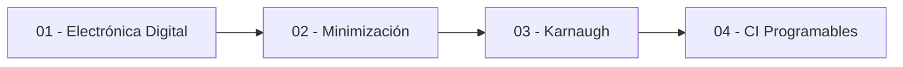

---
{"dg-publish":true,"permalink":"/universidad/3er-semestre/fundamentos-de-electricidad-y-sistemas-digitales/teorico/unidad-4-sistemas-digitales/00-indice-unidad-4/","tags":["FESD","unidad4","indice","EYAG1037"],"dg-note-properties":{"tags":["FESD","unidad4","indice","EYAG1037"]}}
---

# 🗺️ Unidad 4 — Sistemas Digitales — Índice

> [!info] ℹ️ Índice auto-actualizable con Dataview

## 📑 Notas de la Unidad

| Nota                                                                                                                                                                                                          | Actualizado | Salientes | Entrantes |
| ------------------------------------------------------------------------------------------------------------------------------------------------------------------------------------------------------------- | ----------- | --------- | --------- |
| [[Universidad/3er Semestre/Fundamentos de Electricidad y Sistemas Digitales/Teórico/Unidad 4 - Sistemas Digitales/01 - Introducción a la Electrónica Digital\|01 — Introducción a la Electrónica Digital]] | 2026-08-26  | 5         | 4         |
| [[Universidad/3er Semestre/Fundamentos de Electricidad y Sistemas Digitales/Teórico/Unidad 4 - Sistemas Digitales/02 - Minimización de Funciones Lógicas\|02 — Minimización de Funciones Lógicas]]         | 2026-08-26  | 5         | 2         |

{ .block-language-dataview}

## ✅ Avance — Metas de Aprendizaje

# [[Universidad/3er Semestre/Fundamentos de Electricidad y Sistemas Digitales/Teórico/Unidad 4 - Sistemas Digitales/01 - Introducción a la Electrónica Digital\|01 - Introducción a la Electrónica Digital]]

    - [ ] Explico la notación $(N)_r$ y qué representa la base de un sistema de numeración.
    - [ ] Convierto un número decimal entero a binario usando divisiones sucesivas.
    - [ ] Codifico un número decimal en BCD, dígito por dígito.
    - [ ] Convierto un número decimal con parte fraccionaria a binario (parte entera y fraccionaria por separado).
    - [ ] Distingo lógica positiva de lógica negativa y asocio cada una con su resistor de polarización (pull-down/pull-up).
    - [ ] Aplico la equivalencia de lógica mixta ($A.H \leftrightarrow \overline{A}.L$) para traducir una señal entre convenciones.
    - [ ] Resuelvo un circuito lógico de varias etapas (como el ejercicio $N_1$–$N_4$) obteniendo la expresión booleana final y evaluándola para valores concretos.
    - [ ] Diseño la tabla de verdad de un sistema real (como la alarma) a partir de una descripción en lenguaje natural.
    - [ ] Decido correctamente qué convención de lógica (positiva, negativa o mixta) usar dado un conjunto de señales de entrada con distintas polaridades.
# [[Universidad/3er Semestre/Fundamentos de Electricidad y Sistemas Digitales/Teórico/Unidad 4 - Sistemas Digitales/02 - Minimización de Funciones Lógicas\|02 - Minimización de Funciones Lógicas]]

    - [ ] Construyo el minterm y el maxterm correspondientes a una combinación de entrada dada.
    - [ ] Distingo la forma SOP de la forma POS y sé cuándo se construye cada una (a partir de 1's o de 0's).
    - [ ] Aplico el teorema de adyacencia ($AB+\overline{A}B=B$) para simplificar un par de términos.
    - [ ] Construyo un mapa de Karnaugh de 3 o 4 variables a partir de una lista de minterms.
    - [ ] Identifico grupos válidos de $2^k$ celdas adyacentes, incluyendo adyacencias por borde/esquina.
    - [ ] Implemento AND, OR o NOT usando únicamente compuertas NAND o únicamente NOR.
    - [ ] Minimizo una función de 4 variables completa usando MK, identificando los grupos primos esenciales.
    - [ ] Utilizo condiciones "don't care" en un mapa de Karnaugh para lograr una minimización más simple.
    - [ ] Reimplemento un circuito lógico de varias etapas usando una sola familia de compuertas (solo NAND o solo NOR).

{ .block-language-dataview}

## ⚠️ Notas huérfanas

{ .block-language-dataview}

## 📊 Mapa de conexiones

> [!quote] 🔗 Conexiones
> - Previo: [[Universidad/3er Semestre/Fundamentos de Electricidad y Sistemas Digitales/Teórico/Unidad 3 - Introducción a los circuitos integrados/07 - Circuitos Integrados de Logica Fija y Tablas de Verdad\|07 - Circuitos Integrados de Logica Fija y Tablas de Verdad]] (Unidad 3)
> - MOC general: [[Universidad/3er Semestre/Fundamentos de Electricidad y Sistemas Digitales/Fundamentos de Electricidad y Sistemas Digitales\|Fundamentos de Electricidad y Sistemas Digitales]]

---
**Tags:** #FESD #unidad4 #indice
