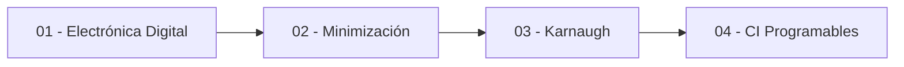

---
{"dg-publish":true,"permalink":"/universidad/3er-semestre/fundamentos-de-electricidad-y-sistemas-digitales/teorico/unidad-4-sistemas-digitales/00-indice-unidad-4/","tags":["FESD","unidad4","indice","EYAG1037"],"dg-note-properties":{"tags":["FESD","unidad4","indice","EYAG1037"]}}
---

# 🗺️ Unidad 4 — Sistemas Digitales — Índice

> [!info] ℹ️ Índice manual

## 📑 Notas de la Unidad

- [[Universidad/3er Semestre/Fundamentos de Electricidad y Sistemas Digitales/Teórico/Unidad 4 - Sistemas Digitales/01 - Introducción a la Electrónica Digital\|01 - Introducción a la Electrónica Digital]]
- [[Universidad/3er Semestre/Fundamentos de Electricidad y Sistemas Digitales/Teórico/Unidad 4 - Sistemas Digitales/02 - Minimización de Funciones Lógicas\|02 - Minimización de Funciones Lógicas]]

## 📊 Mapa de conexiones

```mermaid
graph LR
    A[01 - Electrónica Digital] --> B[02 - Minimización]
    B --> C[03 - Karnaugh]
    C --> D[04 - CI Programables]
```

> [!quote] 🔗 Conexiones
> - Previo: [[Universidad/3er Semestre/Fundamentos de Electricidad y Sistemas Digitales/Teórico/Unidad 3 - Introducción a los circuitos integrados/07 - Circuitos Integrados de Logica Fija y Tablas de Verdad\|07 - Circuitos Integrados de Logica Fija y Tablas de Verdad]] (Unidad 3)
> - MOC general: [[Universidad/3er Semestre/Fundamentos de Electricidad y Sistemas Digitales/Fundamentos de Electricidad y Sistemas Digitales\|Fundamentos de Electricidad y Sistemas Digitales]]

---
**Tags:** #FESD #unidad4 #indice
