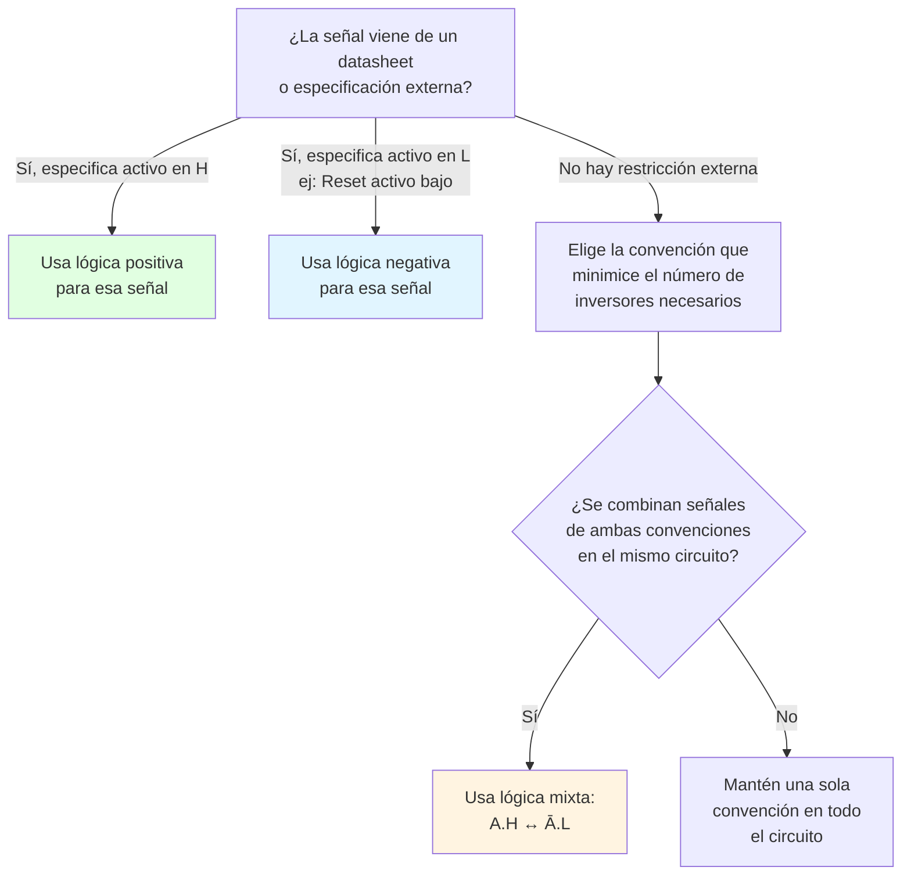
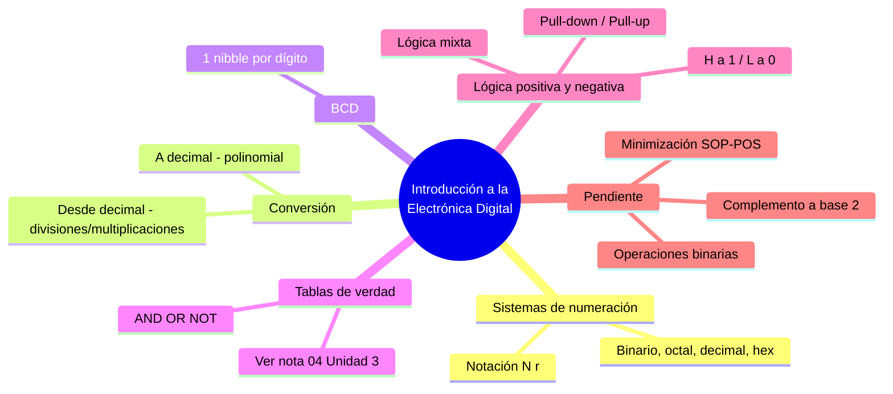

---
{"dg-publish":true,"permalink":"/universidad/3er-semestre/fundamentos-de-electricidad-y-sistemas-digitales/teorico/unidad-4-sistemas-digitales/01-introduccion-a-la-electronica-digital/","dg-note-properties":{}}
---

# 🔢 Introducción a la Electrónica Digital

## 🎯 Introducción

> [!info] 💡 ¿Por qué representar todo en binario?
>
> La electrónica digital nació de una necesidad muy concreta: los circuitos electrónicos son mucho más confiables y baratos de fabricar cuando solo necesitan distinguir **dos** estados (encendido/apagado, alto/bajo voltaje) en vez de un rango continuo de valores. De ahí que el **sistema binario** —heredero de la lógica booleana de mediados del siglo XIX y de los primeros relés telefónicos y computadoras de relés de los años 1930-40— se convirtiera en el lenguaje nativo de todo sistema digital moderno: microprocesadores, memorias, comunicaciones digitales, y los propios circuitos integrados no programables que ya viste en la Unidad 3 (555, ADC, compuertas fijas).
>
> Esta nota abre la Unidad 4 retomando esa conexión: un **ADC** (Unidad 3) no hace otra cosa que traducir una señal analógica del mundo real a un número representado en binario, y las **compuertas lógicas** (Unidad 3, nota 04) operan precisamente sobre esos unos y ceros. Aquí formalizamos cómo se representan, convierten y codifican esos números, y cómo se interpretan eléctricamente los niveles de voltaje que los transportan.
>
> ```mermaid
> graph LR
>     A[Magnitud del mundo real<br/>continua] --> B[ADC<br/>Unidad 3]
>     B --> C[Número binario<br/>discreto]
>     C --> D[Compuertas lógicas<br/>procesan 0 y 1]
>     D --> E[Niveles de voltaje<br/>H / L]
>
>     style B fill:#fff4e1
>     style C fill:#e1ffe1
>     style D fill:#e1f5ff
> ```

---

## 🔟 Sistemas de Numeración

> [!note] 📋 Notación general
>
> Un número en base $r$ se escribe:
>
> $$(N)_r = (\text{Entero.fracción})$$
>
> Donde $N$ es el número y $r$ es la **base** del sistema (cantidad de dígitos posibles). El sistema **binario** es el caso $r=2$: solo existen 2 dígitos posibles, $\{0, 1\}$, y se denota $(\ )_2$.

> [!success] 📊 Sistemas de numeración más usados en electrónica digital
>
> |Sistema|Base $r$|Dígitos válidos|Uso típico|
> |---|---|---|---|
> |**Binario**|2|0, 1|Representación nativa de los circuitos digitales (H/L)|
> |**Octal**|8|0–7|Notación compacta de grupos de 3 bits (menos común hoy)|
> |**Decimal**|10|0–9|Sistema natural humano; punto de partida para conversión|
> |**Hexadecimal**|16|0–9, A–F|Notación compacta de grupos de 4 bits (direcciones de memoria, colores, registros)|

---

## 🔁 Conversión Entre Sistemas

> [!note] 📋 Técnica — De cualquier base a decimal
>
> 1. **Notación polinomial**: cada dígito se multiplica por la base elevada a la posición que ocupa.
> 2. **Usar aritmética decimal** para sumar esos términos.

> [!note] 📋 Técnica — De decimal a otra base: parte entera
>
> 1. **Divisiones sucesivas** entre la base deseada.
> 2. El **primer residuo** obtenido es el bit menos significativo (**LSB**); el **último residuo** (cuando el cociente ya es 0) es el bit más significativo (**MSB**).

> [!note] 📋 Técnica — De decimal a otra base: parte fraccionaria
>
> 1. **Multiplicar** la parte fraccionaria sucesivamente por la base (2, en el caso binario).
> 2. En cada paso, la **parte entera** del resultado es el siguiente bit (el primero obtenido es el más significativo de la fracción); la **parte fraccionaria** restante se vuelve a multiplicar.

> [!example]- 🟢 Ejemplo — Conversión de la parte entera: $(173)_{10} \to (\ )_2$
>
> Se divide sucesivamente entre 2, registrando cada residuo:
>
> | División | Cociente | Residuo |
> |---|---|---|
> | 173 ÷ 2 | 86 | 1 (LSB) |
> | 86 ÷ 2 | 43 | 0 |
> | 43 ÷ 2 | 21 | 1 |
> | 21 ÷ 2 | 10 | 1 |
> | 10 ÷ 2 | 5 | 0 |
> | 5 ÷ 2 | 2 | 1 |
> | 2 ÷ 2 | 1 | 0 |
> | 1 ÷ 2 | 0 | 1 (MSB) |
>
> Leyendo los residuos de abajo hacia arriba (MSB → LSB):
>
> $$(173)_{10} = (10101101)_2$$

> [!example]- 🟢 Ejemplo — Conversión con parte fraccionaria: $(4.824)_{10} \to (\ )_2$ (aproximado)
>
> **Parte entera** $(4)_{10}$: por divisiones sucesivas, $4 = (100)_2$.
>
> **Parte fraccionaria** $(0.824)_{10}$: multiplicando sucesivamente por 2 y separando la parte entera en cada paso:
>
> | Operación | Resultado | Bit (parte entera) |
> |---|---|---|
> | 0.824 × 2 | 1.648 | 1 |
> | 0.648 × 2 | 1.296 | 1 |
> | 0.296 × 2 | 0.592 | 0 |
> | 0.592 × 2 | 1.184 | 1 |
> | 0.184 × 2 | 0.368 | 0 |
>
> Tomando los primeros 5 bits obtenidos (el proceso puede no terminar exactamente, igual que $1/3$ no termina en decimal):
>
> $$(4.824)_{10} \approx (100.11010)_2$$

> [!tip]- 🖥️ Aplicación práctica
>
> Esta es exactamente la lógica que usa un microcontrolador al leer un valor de un **ADC** (Unidad 3, nota 03): el conversor entrega un código binario de $n$ bits, y para mostrarlo como un número "humano" en una pantalla, el firmware hace la conversión inversa (binario → decimal) usando notación polinomial. En programación, funciones como `bin()` en Python o los operadores de desplazamiento de bits (`<<`, `>>`) en C automatizan estas mismas divisiones/multiplicaciones sucesivas.

> [!note]- 📋 Pendiente — Operaciones binarias y complemento a base 2
>
> El material de esta sesión señala como repaso pendiente las operaciones aritméticas en binario (suma, resta) y el **complemento a base 2** (usado para representar negativos). Se ampliará en una nota posterior cuando se cubra en clase.

---

## 🔤 Codificación Binaria: BCD

> [!note] 📋 Código BCD (Binary-Coded Decimal)
>
> Cada **dígito decimal** se representa de forma independiente con **1 nibble (4 bits)**, usando su equivalente binario puro (0000 a 1001); las combinaciones de 4 bits del 1010 al 1111 no se usan.
>
> | Dígito decimal | BCD |
> |---|---|
> | 0 | 0000 |
> | 1 | 0001 |
> | 2 | 0010 |
> | 3 | 0011 |
> | 4 | 0100 |
> | 5 | 0101 |
> | 6 | 0110 |
> | 7 | 0111 |
> | 8 | 1000 |
> | 9 | 1001 |
>
> > 📌 A diferencia de la conversión binaria pura, en BCD **cada dígito se codifica por separado**: el número 24 no es "24 convertido a binario" (11000), sino "2" y "4" codificados cada uno en su propio nibble: `0010 0100`.

---

## ✅ Tablas de Verdad y Compuertas Básicas

> [!note] 📋 Tabla de verdad — Concepto
>
> Una **tabla de verdad** enumera todas las combinaciones posibles de entrada de un circuito lógico y la salida correspondiente. Los valores lógicos se representan indistintamente como `True/False`, `V/F` o `1/0`.
>
> ```mermaid
> graph LR
>     A["Entrada A"] --> F["Circuito<br/>lógico"]
>     B["Entrada B"] --> F
>     F --> S["Salida F"]
> ```

> [!note] 📋 Las tres compuertas fundamentales
>
> |Compuerta|CI típico (familia 74xx)|Operación|Equivale a|
> |---|---|---|---|
> |**AND**|7408|$F = A \cdot B$|Multiplicación — 1 solo si A **y** B son 1|
> |**OR**|7432|$F = A + B$|Suma — 1 si A **o** B (o ambas) son 1|
> |**NOT**|7404|$F = \overline{A}$|Negación — invierte el valor|
>
> > 🔗 Las compuertas derivadas (**NAND, NOR, XOR, XNOR**) junto con sus tablas de verdad completas y los CI comerciales de la familia 74xx ya están documentadas en detalle en [[Universidad/3er Semestre/Fundamentos de Electricidad y Sistemas Digitales/Teórico/Unidad 3 - Introducción a los circuitos integrados/07 - Circuitos Integrados de Logica Fija y Tablas de Verdad\|07 - Circuitos Integrados de Logica Fija y Tablas de Verdad]] (Unidad 3) — no se repiten aquí para evitar duplicidad.

> [!warning] ⚠️ Error común
>
> No confundir la **compuerta** (el símbolo/CI físico) con el **operador booleano** (la notación matemática $\cdot$, $+$, $\overline{\ \ }$). Ambos representan la misma operación, pero en un esquemático usarás el símbolo de compuerta; en una ecuación booleana, el operador.

---

## ⚡ Lógica Positiva y Negativa

> [!info] 💡 El mismo circuito, dos interpretaciones posibles
>
> Los niveles de voltaje **H** (alto) y **L** (bajo) son hechos físicos del circuito; los valores lógicos **0** y **1** son una interpretación que el diseñador les asigna. Esa asignación se llama **convención de lógica**, y afecta cómo se lee la "lógica de la señal" a partir de la "lógica de la puerta".

> [!success] 📊 Lógica positiva vs. negativa
>
> |Convención|L (bajo)|H (alto)|Resistor asociado|
> |---|---|---|---|
> |**Lógica positiva**|0|1|Pull-down|
> |**Lógica negativa**|1|0|Pull-up|

> [!note] 📋 Lógica mixta
>
> Cuando conviene combinar ambas convenciones dentro de un mismo circuito (por ejemplo, para aprovechar que una compuerta es más eficiente interpretando una entrada como activa en bajo), se usan **señales equivalentes**:
>
> $$A.H \leftrightarrow \overline{A}.L$$
>
> Es decir, "A en lógica positiva (activo en alto)" es la misma señal física que "$\overline{A}$ en lógica negativa (activo en bajo)". Esto permite, por ejemplo, leer una compuerta AND con salida negada como si fuera una OR en lógica negativa — el circuito físico no cambia, cambia la interpretación.


---

## 🏠 Ejemplo de Aplicación: Sistema de Alarma

> [!example]- 🟢 Ejemplo — Diseño de una alarma con sensores de puerta/ventana/garaje
>
> **Problema:** diseñar la lógica para que suene la alarma de una casa cuando **cualquier** puerta o ventana esté abierta. Se tienen 3 sensores tipo interruptor: $V$ (ventana), $P$ (puerta), $G$ (garaje).
>
> **Solución conceptual:**
>
> 1. Cada sensor es un interruptor conectado a una fuente, con un **resistor pull-down** hacia tierra en cada línea — exactamente la configuración de **lógica positiva** vista arriba: sensor abierto → línea en H → 1 lógico.
> 2. Las tres líneas ($V$, $P$, $G$) entran a un circuito digital (CD) que implementa la función "cualquiera activo → salida activa" — es decir, una compuerta **OR** de 3 entradas.
> 3. La salida activa (Act) del circuito digital dispara el parlante de la alarma.
>
> $$F_{alarma} = V + P + G$$
>
> > 📌 Este es el mismo patrón que usarás una y otra vez: **sensor + resistor pull-down/pull-up → nivel H/L → interpretación lógica → compuerta.**

---

## 🔀 Diagrama de Decisión: ¿Qué convención de lógica usar?



---

## 📝 Ejercicios Propuestos

> [!question] 📋 Nivel 1 — Básico
>
> **1.** Convierte $(58)_{10}$ a binario usando divisiones sucesivas.
>
> **2.** Codifica el número decimal **47** en BCD (un nibble por dígito).
>
> **3.** Completa la tabla de verdad de una compuerta AND de 2 entradas.

> [!success]- ✅ Respuestas — Nivel 1
>
> **1.** $58 = (111010)_2$ (58÷2=29 r0 LSB; 29÷2=14 r1; 14÷2=7 r0; 7÷2=3 r1; 3÷2=1 r1; 1÷2=0 r1 MSB → leyendo de MSB a LSB: 111010).
>
> **2.** $47 \to$ BCD: `0100 0111` (4 = 0100, 7 = 0111).
>
> **3.** $A=0,B=0\to F=0$; $A=0,B=1\to F=0$; $A=1,B=0\to F=0$; $A=1,B=1\to F=1$.

> [!question] 📋 Nivel 2 — Intermedio
>
> **4.** Convierte $(0.375)_{10}$ a binario (parte fraccionaria) usando multiplicaciones sucesivas.
>
> **5.** Un sensor entrega una señal activa en **bajo** (L = 1 lógico). ¿Qué convención de lógica corresponde, y qué resistor de polarización usarías?
>
> **6.** Reescribe la señal $B.H$ como su equivalente en lógica negativa.

> [!success]- ✅ Respuestas — Nivel 2
>
> **4.** $0.375 \times 2 = 0.75 \to 0$; $0.75\times2=1.5\to1$; $0.5\times2=1.0\to1$. Resultado: $(0.375)_{10} = (0.011)_2$ exacto.
>
> **5.** Corresponde a **lógica negativa** (L→1, H→0); se usa un resistor **pull-up** para que la línea repose en H (0 lógico) cuando el sensor no está activo.
>
> **6.** $B.H \leftrightarrow \overline{B}.L$.

> [!question] 📋 Nivel 3 — Avanzado
>
> **7.** Dado el circuito con compuertas: $N_1 = A \cdot B$, $N_2 = \overline{C}$, $N_3 = \overline{A+B}$, $N_4 = N_2 \cdot N_3$, y salida $F = N_1 + N_4$. Expresa $F$ en función únicamente de $A$, $B$ y $C$, y evalúa $F$ para $A=1, B=0, C=1$.
>
> **8.** Diseña la tabla de verdad para una alarma que debe sonar si **al menos dos de tres** sensores ($X$, $Y$, $Z$) están activos simultáneamente (mayoría de 2 de 3).
>
> **9.** Un circuito mezcla una entrada en lógica positiva ($A.H$) con otra en lógica negativa ($B.L$) hacia una misma compuerta AND. ¿Qué transformación aplicarías antes de conectarlas, y por qué?

> [!success]- ✅ Respuestas — Nivel 3
>
> **7.** $F = N_1 + N_4 = A\cdot B + \overline{C}\cdot N_3 = A\cdot B + \overline{C}\cdot\overline{(A+B)}$. Evaluando en $A=1,B=0,C=1$: $N_1 = 1\cdot0=0$; $N_2=\overline{1}=0$; $N_3=\overline{1+0}=\overline{1}=0$; $N_4=0\cdot0=0$; $F=0+0=0$.
>
> **8.** $F=1$ en las combinaciones $XYZ \in \{011,101,110,111\}$ (dos o más entradas en 1), $F=0$ en el resto — equivale a la función mayoría de 3, $F = XY+XZ+YZ$.
>
> **9.** Debe convertirse una de las dos señales a la convención de la otra usando la equivalencia de lógica mixta ($A.H \leftrightarrow \overline{A}.L$) antes de combinarlas, porque una compuerta física opera sobre niveles de voltaje reales, no sobre "convenciones" — mezclar sin traducir produce una función lógica distinta a la deseada.

---

## ✅ Metas de Aprendizaje

> [!note] 🎯 Nivel Básico
>
> - [ ] Explico la notación $(N)_r$ y qué representa la base de un sistema de numeración.
> - [ ] Convierto un número decimal entero a binario usando divisiones sucesivas.
> - [ ] Codifico un número decimal en BCD, dígito por dígito.

> [!note] 🎯 Nivel Intermedio
>
> - [ ] Convierto un número decimal con parte fraccionaria a binario (parte entera y fraccionaria por separado).
> - [ ] Distingo lógica positiva de lógica negativa y asocio cada una con su resistor de polarización (pull-down/pull-up).
> - [ ] Aplico la equivalencia de lógica mixta ($A.H \leftrightarrow \overline{A}.L$) para traducir una señal entre convenciones.

> [!note] 🎯 Nivel Avanzado
>
> - [ ] Resuelvo un circuito lógico de varias etapas (como el ejercicio $N_1$–$N_4$) obteniendo la expresión booleana final y evaluándola para valores concretos.
> - [ ] Diseño la tabla de verdad de un sistema real (como la alarma) a partir de una descripción en lenguaje natural.
> - [ ] Decido correctamente qué convención de lógica (positiva, negativa o mixta) usar dado un conjunto de señales de entrada con distintas polaridades.

---

## 📊 Resumen Visual



---

> [!quote] 📖 Fuentes consultadas
>
> [1] Ing. Adriana Aguirre Alonso, _Fundamentos de Electricidad y Sistemas Digitales — EYAG1037_, Facultad de Ingeniería en Electricidad y Computación (FIEC), ESPOL, Sesión 13 (material de clase).
>
> [2] M. M. Mano y M. D. Ciletti, _Digital Design_, 6th ed. Boston, USA: Pearson, 2018 — capítulos sobre sistemas de numeración y códigos binarios.

> [!quote] 🔗 Conexiones
>
> - [[Universidad/3er Semestre/Fundamentos de Electricidad y Sistemas Digitales/Teórico/Unidad 3 - Introducción a los circuitos integrados/07 - Circuitos Integrados de Logica Fija y Tablas de Verdad\|07 - Circuitos Integrados de Logica Fija y Tablas de Verdad]] — tablas de verdad completas de AND/OR/NAND/NOR/XOR/XNOR y CI comerciales de la familia 74xx (Unidad 3).
> - [[Universidad/3er Semestre/Fundamentos de Electricidad y Sistemas Digitales/Teórico/Unidad 3 - Introducción a los circuitos integrados/06 - Aplicaciones de Integrados 555 - ADC - PWM\|06 - Aplicaciones de Integrados 555 - ADC - PWM]] — el ADC como aplicación directa de la conversión analógico→binario vista aquí (Unidad 3).
> - [[Universidad/3er Semestre/Fundamentos de Electricidad y Sistemas Digitales/Teórico/Unidad 3 - Introducción a los circuitos integrados/01 - Introducción a los Circuitos Integrados No Programables\|01 - Introducción a los Circuitos Integrados No Programables]] — clasificación de CI digitales/analógicos/mixtos (Unidad 3).
> - Próxima nota (Unidad 4, punto 2): Solución de problemas con circuitos electrónicos digitales — profundiza en operaciones binarias, complemento a base 2, minterms/maxterms y las formas canónicas SOP/POS.

---

**Tags:** #electronicaDigital #sistemasNumeracion #BCD #compuertasLogicas #logicaPositivaNegativa #EYAG1037 #FESD #ESPOL #unidad4
