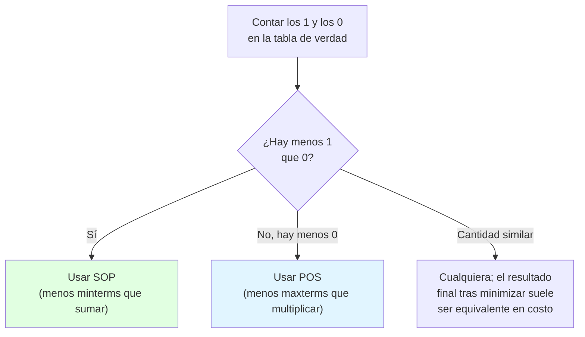
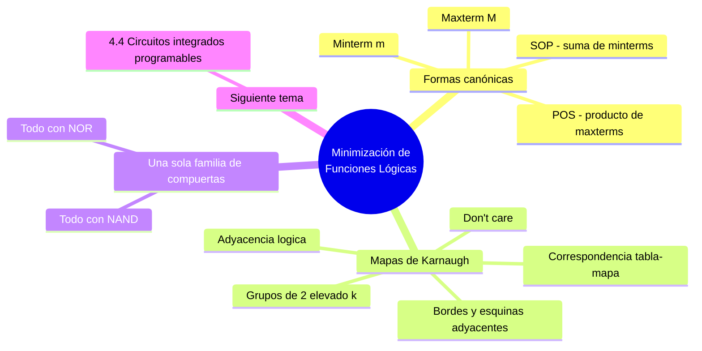

---
{"dg-publish":true,"permalink":"/universidad/3er-semestre/fundamentos-de-electricidad-y-sistemas-digitales/teorico/unidad-4-sistemas-digitales/02-minimizacion-de-funciones-logicas/","dg-note-properties":{}}
---

# 🧮 Minimización de Funciones Lógicas

## 🎯 Introducción

> [!info] 💡 ¿Por qué minimizar una función lógica?
> 
> Cuando se obtiene una función booleana directamente de una tabla de verdad (viendo [[Universidad/3er Semestre/Fundamentos de Electricidad y Sistemas Digitales/Teórico/Unidad 4 - Sistemas Digitales/01 - Introducción a la Electrónica Digital\|01 - Introducción a la Electrónica Digital]]), el resultado suele tener más términos y variables de los estrictamente necesarios. Cada término de más significa **una compuerta física adicional**: más costo, más consumo, más retardo de propagación y más puntos posibles de falla. La minimización busca la expresión booleana equivalente **más simple posible**, antes de construir el circuito real.
> 
> Esta idea no es exclusiva del papel y lápiz: las herramientas modernas de síntesis lógica (usadas para programar FPGAs o diseñar circuitos integrados completos) aplican exactamente estos mismos principios de simplificación booleana, solo que a una escala de millones de variables mediante algoritmos automatizados.
> 
> ```mermaid
> graph LR
>     A[Tabla de verdad] --> B["Función lógica<br/>(SOP o POS)"]
>     B --> C["Minimización<br/>(Álgebra de Boole o<br/>Mapas de Karnaugh)"]
>     C --> D[Circuito con el<br/>mínimo de compuertas]
> 
>     style B fill:#fff4e1
>     style C fill:#e1f5ff
>     style D fill:#e1ffe1
> ```

---

## 🧩 De Tabla de Verdad a Función Lógica

> [!note] 📋 Minterm (m) y Maxterm (M)
> 
> Para cada combinación de entradas de una tabla de verdad se puede construir dos tipos de término:
> 
> - **Minterm ($m$):** multiplicación (AND) de las variables de la combinación, **manteniendo** su valor de verdad (la variable aparece sin negar si vale 1, negada si vale 0).
> - **Maxterm ($M$):** suma (OR) de las variables de la combinación, **invirtiendo** su valor de verdad (la variable aparece negada si vale 1, sin negar si vale 0).
> 
> Por ejemplo, para la combinación $A=1, B=0, C=1$: el minterm es $m = A\overline{B}C$, y el maxterm es $M = \overline{A}+B+\overline{C}$.

> [!note] 📋 SOP — Sum of Products (Suma de Productos)
> 
> La forma **SOP** es la **suma de todos los minterms** cuya salida sea 1 en la tabla de verdad.
> 
> |A|B|C|$F_1$|
> |---|---|---|---|
> |0|0|0|0|
> |0|0|1|1|
> |0|1|0|1|
> |0|1|1|0|
> |1|0|0|0|
> |1|0|1|0|
> |1|1|0|1|
> |1|1|1|1|
> 
> $$F_1 = \sum(m_1,m_2,m_6,m_7) = \sum(1,2,6,7) = \overline{A},\overline{B}C + \overline{A}B\overline{C} + AB\overline{C} + ABC$$

> [!note] 📋 POS — Product of Sums (Producto de Sumas)
> 
> La forma **POS** es el **producto de todos los maxterms** cuya salida sea 0 en la tabla de verdad.
> 
> Usando la misma tabla anterior (los ceros están en las filas 0, 3, 4, 5):
> 
> $$F_1 = \prod(M_0,M_3,M_4,M_5) = \prod(0,3,4,5) = (A+B+C)(A+\overline{B}+C)(A+\overline{B}+\overline{C})(\overline{A}+\overline{B}+\overline{C})$$

> [!success] 📊 SOP vs. POS
> 
> |Característica|SOP (Suma de Productos)|POS (Producto de Sumas)|
> |---|---|---|
> |**Se construye a partir de**|Minterms (salidas en 1)|Maxterms (salidas en 0)|
> |**Operación externa**|Suma (OR) de términos|Producto (AND) de términos|
> |**Operación interna de cada término**|Producto (AND)|Suma (OR)|
> |**Conviene cuando...**|Hay pocos 1 en la tabla|Hay pocos 0 en la tabla|
> |**Compuerta de salida típica**|OR|AND|

---

## 🔀 ¿SOP o POS? Criterio de elección



---

## 🗺️ Mapas de Karnaugh (MK)

> [!info] 💡 ¿Qué es un mapa de Karnaugh?
> 
> Un **mapa de Karnaugh (MK)** es una representación gráfica de la tabla de verdad, ordenada de forma que **cada celda difiere de sus vecinas en solo 1 bit** (código Gray). Se crea un mapa por cada salida del sistema digital. En la práctica se usa hasta con **5 variables**; con más variables el mapa deja de ser manejable a mano y se prefieren métodos algorítmicos (como Quine-McCluskey).

> [!note] 📋 Adyacencia lógica
> 
> Si una función tiene $n$ variables de entrada, cada celda del mapa tiene exactamente $n$ celdas **vecinas** con adyacencia lógica (horizontal o vertical — nunca diagonal). Esta adyacencia es la representación visual del **teorema de adyacencia**:
> 
> $$AB + \overline{A}B = B$$
> 
> Es decir, dos minterms adyacentes que difieren en una sola variable se combinan eliminando esa variable.

> [!note] 📋 Reglas para formar grupos
> 
> - Se agrupan **1's** entre celdas vecinas (adyacencia horizontal o vertical).
> - Los grupos deben tener $2^k$ elementos: 1, 2, 4, 8, 16…
> - **Mientras más grande el grupo, mejor la minimización** (más variables se eliminan).
> - Los **bordes y esquinas** del mapa también son adyacentes entre sí (el mapa "se envuelve" como un cilindro/toro) — no lo olvides al buscar grupos.

> [!example]- 🟢 Ejemplo — Mapa de 2 variables
> 
> Tabla con $F=1$ en $A=1,B=0$ y $A=1,B=1$ (columna $A=1$ completa):
> 
> ||A=0|A=1|
> |---|---|---|
> |**B=0**|0|1|
> |**B=1**|0|1|
> 
> Los dos 1 son adyacentes verticalmente (mismo $A$, $B$ varía):
> 
> $$\overline{A}B + AB = B(\overline{A}+A) = B$$

> [!example]- 🟢 Ejemplo — Mapa de 3 variables ($A$, $B$, $C$)
> 
> |AB\C|0|1|
> |---|---|---|
> |**00**|①|0|
> |**01**|①|0|
> |**11**|0|0|
> |**10**|①|①|
> 
> Dos grupos posibles:
> 
> - $(AB=00,C=0)$ y $(AB=01,C=0)$: $A=0$, $C=0$ fijos, $B$ varía → $\overline{A},\overline{C}$
> - $(AB=10,C=0)$ y $(AB=10,C=1)$: $A=1$, $B=0$ fijos, $C$ varía → $A\overline{B}$
> 
> $$F = \overline{A},\overline{C} + A\overline{B}$$

> [!example]- 🟢 Ejemplo — Mapa de 4 variables, combinando grupos en dos pasos
> 
> Se identifican primero parejas y luego se combinan entre sí si son adyacentes:
> 
> $$G_1 = \overline{A},\overline{C},\overline{D} \qquad G_2 = \overline{A},\overline{C}D \qquad \Rightarrow \qquad G_{12} = G_1+G_2 = \overline{A},\overline{C}$$
> 
> $$G_3 = ABC \qquad G_4 = A\overline{B}C \qquad \Rightarrow \qquad G_{34} = G_3+G_4 = AC$$
> 
> Resultado final, combinando ambos grupos ya reducidos:
> 
> $$F = \overline{A},\overline{C} + AC$$
> 
> > 📌 Este ejemplo muestra el proceso en dos etapas: primero se combinan parejas adyacentes ($G_1$ con $G_2$, $G_3$ con $G_4$), y luego se observa que los grupos resultantes ($G_{12}$ y $G_{34}$) ya no pueden simplificarse más entre sí.

---

## ⚙️ Implementación Solo con NAND o Solo con NOR

> [!info] 💡 ¿Por qué usar una sola familia de compuertas?
> 
> Como ya viste en [[Universidad/3er Semestre/Fundamentos de Electricidad y Sistemas Digitales/Teórico/Unidad 3 - Introducción a los circuitos integrados/04 - Circuitos Integrados de Logica Fija y Tablas de Verdad\|04 - Circuitos Integrados de Logica Fija y Tablas de Verdad]] (Unidad 3), NAND y NOR son **funcionalmente completas**: cualquier función booleana puede construirse usando únicamente una de ellas. Esto simplifica el inventario de CI necesarios en un diseño real (menos referencias distintas que comprar, almacenar y soldar).

> [!success] 📊 Equivalencias: NOT, AND y OR con NAND / NOR únicamente
> 
> |Función|Con puertas NAND|Con puertas NOR|
> |---|---|---|
> |**NOT** ($\overline{A}$)|$NAND(A,A)$|$NOR(A,A)$|
> |**AND** ($A\cdot B$)|$NAND(NAND(A,B),NAND(A,B))$ — niega la salida de una NAND|$NAND(NAND(A,A),NAND(B,B))$ — niega cada entrada y las combina|
> |**OR** ($A+B$)|$NAND(NAND(A,A),NAND(B,B))$ — niega cada entrada y las combina|$NOR(NOR(A,B),NOR(A,B))$ — niega la salida de una NOR|
> 
> > 📌 El patrón general: con **NAND**, para obtener AND necesitas negar la salida; para obtener OR necesitas negar las entradas. Con **NOR** es al revés: para OR niegas la salida, para AND niegas las entradas.


---

## 📝 Ejercicios Propuestos

> [!question] 📋 Nivel 1 — Básico
> 
> **1.** Para la combinación $A=0, B=1, C=1$ (3 variables), escribe su minterm $m$ y su maxterm $M$.
> 
> **2.** Dada la tabla de verdad con $F=1$ solo en $A=0,B=1$ y $A=1,B=1$, aplica el teorema de adyacencia para simplificar $F$.
> 
> **3.** Escribe la expresión SOP directa (sin minimizar) de una función de 2 variables que vale 1 únicamente cuando $A=1,B=0$.

> [!success]- ✅ Respuestas — Nivel 1
> 
> **1.** $m = \overline{A}BC$; $M = A+\overline{B}+\overline{C}$.
> 
> **2.** $F = \overline{A}B + AB = B(\overline{A}+A) = B$.
> 
> **3.** $F = A\overline{B}$ (un único minterm, ya que solo hay una combinación en 1).

> [!question] 📋 Nivel 2 — Intermedio
> 
> **4.** Verifica algebraicamente que $F_1=\sum(1,2,6,7)$ (ver tabla de la sección SOP) corresponde efectivamente a $\overline{A},\overline{B}C+\overline{A}B\overline{C}+AB\overline{C}+ABC$, evaluando la expresión en $A=1,B=1,C=0$ (fila del minterm 6).
> 
> **5.** Dada $F(A,B,C)=\sum m(0,1,4,5)$, dibuja el mapa de Karnaugh de 3 variables, agrupa y obtén la función minimizada.
> 
> **6.** Implementa una compuerta OR de 2 entradas usando únicamente compuertas NOR (usa la tabla de equivalencias).

> [!success]- ✅ Respuestas — Nivel 2
> 
> **4.** En $A=1,B=1,C=0$: $\overline{A},\overline{B}C=0$, $\overline{A}B\overline{C}=0$, $AB\overline{C}=1\cdot1\cdot1=1$, $ABC=0$. Suma total $=1$, que coincide con $F_1=1$ en la fila $A=1,B=1,C=0$ (minterm 6) de la tabla. ✅
> 
> **5.** Minterms: $m_0=000,\ m_1=001,\ m_4=100,\ m_5=101$ — los cuatro tienen $B=0$; forman un grupo de 4 (todo el mapa con $B=0$). $$F = \overline{B}$$
> 
> **6.** $OR(A,B) = NOR(NOR(A,B),NOR(A,B))$ — es decir, se conecta una compuerta NOR normal, y su salida se vuelve a pasar por otra NOR con ambas entradas unidas (actuando como inversor), negando el resultado de la primera NOR.

> [!question] 📋 Nivel 3 — Avanzado
> 
> **7.** Minimiza $F(A,B,C,D)=\sum m(1,2,4,6,9)$ usando mapa de Karnaugh.
> 
> **8.** Un dígito BCD ($DCBA$, con $D$ como MSB) representa la hora de un reloj (0 a 9). Diseña, usando MK, el circuito que active la salida $F$ cuando la hora sea **mayor o igual a 7**. (Pista: los códigos BCD del 10 al 15 nunca ocurren — trátalos como **don't care**, "X", en el mapa.)
> 
> **9.** Retoma el circuito de la nota anterior ($N_1=A\cdot B$, $N_2=\overline{C}$, $N_3=\overline{A+B}$, $N_4=N_2\cdot N_3$, $F=N_1+N_4$) y describe, usando la tabla de equivalencias, cómo reimplementarlo empleando **únicamente** compuertas NAND.

> [!success]- ✅ Respuestas — Nivel 3
> 
> **7.** Ubicando los minterms 1, 2, 4, 6, 9 en el mapa de 4 variables se forman tres parejas primas (ninguna se puede agrandar a grupo de 4):
> 
> - $m_2,m_6$ (adyacentes, $A$ y $D$ fijos, $B$ varía) $\to \overline{A}CD'$… es decir $\overline{A}C\overline{D}$
> - $m_1,m_9$ (adyacentes por envoltura de bordes, $B,C,D$ fijos, $A$ varía) $\to \overline{B},\overline{C}D$
> - $m_4,m_6$ (adyacentes, $A,B$ fijos, $C$ varía) $\to \overline{A}B\overline{D}$
> 
> Las tres son esenciales (cada una cubre al menos un minterm que ninguna otra cubre):
> 
> $$F = \overline{A}B\overline{D} + \overline{A}C\overline{D} + \overline{B},\overline{C}D$$
> 
> **8.** Minterms en 1: decimal 7 (0111), 8 (1000), 9 (1001). Don't care: decimal 10–15. Agrupando $8,9$ con los don't-care $10,11$ (fila $D=1,C=0$ completa) se obtiene $D\overline{C}$. Agrupando $7$ con el don't-care $15$ (mismo $C,B,A$, $D$ libre) se obtiene $CBA$. Resultado:
> 
> $$F = D\overline{C} + CBA$$
> 
> **9.** $N_1=A\cdot B \to NAND(NAND(A,B),NAND(A,B))$ (AND vía NAND). $N_2=\overline{C} \to NAND(C,C)$. $N_3=\overline{A+B}$: primero obtener $A+B$ vía NAND $= NAND(NAND(A,A),NAND(B,B))$, y luego negar esa salida con otra $NAND(x,x)$. $N_4=N_2\cdot N_3 \to NAND(NAND(N_2,N_3),NAND(N_2,N_3))$. Finalmente $F=N_1+N_4 \to NAND(NAND(N_1,N_1),NAND(N_4,N_4))$ (OR vía NAND, negando cada entrada primero). Cada AND/OR/NOT del circuito original se sustituye por su bloque equivalente de la tabla de equivalencias.

---

## ✅ Metas de Aprendizaje

> [!note] 🎯 Nivel Básico
> 
> - [ ] Construyo el minterm y el maxterm correspondientes a una combinación de entrada dada.
> - [ ] Distingo la forma SOP de la forma POS y sé cuándo se construye cada una (a partir de 1's o de 0's).
> - [ ] Aplico el teorema de adyacencia ($AB+\overline{A}B=B$) para simplificar un par de términos.

> [!note] 🎯 Nivel Intermedio
> 
> - [ ] Construyo un mapa de Karnaugh de 3 o 4 variables a partir de una lista de minterms.
> - [ ] Identifico grupos válidos de $2^k$ celdas adyacentes, incluyendo adyacencias por borde/esquina.
> - [ ] Implemento AND, OR o NOT usando únicamente compuertas NAND o únicamente NOR.

> [!note] 🎯 Nivel Avanzado
> 
> - [ ] Minimizo una función de 4 variables completa usando MK, identificando los grupos primos esenciales.
> - [ ] Utilizo condiciones "don't care" en un mapa de Karnaugh para lograr una minimización más simple.
> - [ ] Reimplemento un circuito lógico de varias etapas usando una sola familia de compuertas (solo NAND o solo NOR).

---

## 📊 Resumen Visual



---

> [!quote] 📖 Fuentes consultadas
> 
> [1] Ing. Adriana Aguirre Alonso, _Fundamentos de Electricidad y Sistemas Digitales — EYAG1037_, Facultad de Ingeniería en Electricidad y Computación (FIEC), ESPOL, Sesión 14 (material de clase).
> 
> [2] M. M. Mano y M. D. Ciletti, _Digital Design_, 6th ed. Boston, USA: Pearson, 2018 — capítulos sobre mapas de Karnaugh y minimización booleana.

> [!quote] 🔗 Conexiones
> 
> - [[Universidad/3er Semestre/Fundamentos de Electricidad y Sistemas Digitales/Teórico/Unidad 4 - Sistemas Digitales/01 - Introducción a la Electrónica Digital\|01 - Introducción a la Electrónica Digital]] — tema previo de la unidad: sistemas de numeración, tablas de verdad y lógica positiva/negativa/mixta.
> - [[Universidad/3er Semestre/Fundamentos de Electricidad y Sistemas Digitales/Teórico/Unidad 3 - Introducción a los circuitos integrados/04 - Circuitos Integrados de Logica Fija y Tablas de Verdad\|04 - Circuitos Integrados de Logica Fija y Tablas de Verdad]] — compuertas lógicas y la propiedad de completitud funcional de NAND/NOR (Unidad 3).
> - Próxima nota (Unidad 4, punto 4): Circuitos integrados programables.

---

**Tags:** #minimizacionLogica #mapaKarnaugh #SOP #POS #minterm #maxterm #EYAG1037 #FESD #ESPOL #unidad4