---
{"dg-publish":true,"permalink":"/universidad/3er-semestre/matematicas-discretas/matematicas-discretas/","dg-note-properties":{}}
---

# 🟧 Matemáticas Discretas

**Código:** MATG1051 · **Semestre:** 3ro · [[Universidad/3er Semestre/Matemáticas Discretas/Bienvenida y Syllabus Matemáticas Discretas\|Ver Syllabus completo]]

---

## Progreso del Curso

```mermaid
graph LR
    U1[U1: Lógica y Conjuntos<br/>13 notas] --> U2[U2: Funciones y Relaciones<br/>5 notas]
    U2 --> U3[U3: Números y Conteo<br/>6 notas]
    U3 --> U4[U4: Recurrencia y Algoritmos<br/>5 notas]
    U4 --> U5[U5: Grafos y Árboles<br/>5 notas]
    U5 --> U6[U6: Lenguajes y Autómatas<br/>2 notas]
    style U1 fill:#37474F,color:#FFFFFF,stroke:#90A4AE,stroke-width:1px
    style U2 fill:#37474F,color:#FFFFFF,stroke:#90A4AE,stroke-width:1px
    style U3 fill:#37474F,color:#FFFFFF,stroke:#90A4AE,stroke-width:1px
    style U4 fill:#37474F,color:#FFFFFF,stroke:#90A4AE,stroke-width:1px
    style U5 fill:#37474F,color:#FFFFFF,stroke:#90A4AE,stroke-width:1px
    style U6 fill:#37474F,color:#FFFFFF,stroke:#90A4AE,stroke-width:1px
```

---

## Unidad I — Lógica y Conjuntos *(6h)* → [[Universidad/3er Semestre/Matemáticas Discretas/Unidad 1 - Logica y Conjuntos/00 - Índice Unidad 1\|📂 Índice]]

> [!note] I — Lógica Proposicional
> - [[Universidad/3er Semestre/Matemáticas Discretas/Unidad 1 - Logica y Conjuntos/I - Lógica Proporcional/01 - Proposiciones, conectivos lógicos, tablas de verdad , propiedades y circuitos combinatorio\|01 — Proposiciones y conectivos]]
> - [[Universidad/3er Semestre/Matemáticas Discretas/Unidad 1 - Logica y Conjuntos/I - Lógica Proporcional/02 - Proposiciones Condicionales y Equivalencia Lógica\|02 — Condicionales y equivalencia]]

> [!note] II — Álgebra Proposicional
> - [[Universidad/3er Semestre/Matemáticas Discretas/Unidad 1 - Logica y Conjuntos/II - Álgebra Proposicional/01 - Algebra de Proposiciones\|01 — Algebra de proposiciones]]
> - [[Universidad/3er Semestre/Matemáticas Discretas/Unidad 1 - Logica y Conjuntos/II - Álgebra Proposicional/02 - Cuantificadores\|02 — Cuantificadores]]
> - [[Universidad/3er Semestre/Matemáticas Discretas/Unidad 1 - Logica y Conjuntos/II - Álgebra Proposicional/03 - Demostraciones\|03 — Demostraciones]]

> [!note] III — Razonamiento Inductivo
> - [[Universidad/3er Semestre/Matemáticas Discretas/Unidad 1 - Logica y Conjuntos/III - Razonamiento Inductivo/01 - Reglas de Inferencia\|01 — Reglas de inferencia]]
> - [[Universidad/3er Semestre/Matemáticas Discretas/Unidad 1 - Logica y Conjuntos/III - Razonamiento Inductivo/02 - Reglas de Inferencia para Afirmaciones Cuantificadas\|02 — Afirmaciones cuantificadas]]
> - [[Universidad/3er Semestre/Matemáticas Discretas/Unidad 1 - Logica y Conjuntos/III - Razonamiento Inductivo/03 - Inducción Matemática\|03 — Inducción matemática]]

> [!note] IV — Teoría de Conjuntos
> - [[Universidad/3er Semestre/Matemáticas Discretas/Unidad 1 - Logica y Conjuntos/IV - Teoría de Conjuntos/01 - Conjuntos, Cardinalidad y Subconjuntos\|01 — Conjuntos y cardinalidad]]
> - [[Universidad/3er Semestre/Matemáticas Discretas/Unidad 1 - Logica y Conjuntos/IV - Teoría de Conjuntos/02 - Operaciones y Diagramas de Venn\|02 — Operaciones y Venn]]
> - [[Universidad/3er Semestre/Matemáticas Discretas/Unidad 1 - Logica y Conjuntos/IV - Teoría de Conjuntos/03 - Leyes de Conjuntos\|03 — Leyes de conjuntos]]
> - [[Universidad/3er Semestre/Matemáticas Discretas/Unidad 1 - Logica y Conjuntos/IV - Teoría de Conjuntos/04 - Cardinalidad y Leyes de Cardinalidad\|04 — Cardinalidad y leyes]]

---

## Unidad II — Funciones, Sucesiones y Relaciones *(5h)* → [[Universidad/3er Semestre/Matemáticas Discretas/Unidad 2 - Funciones y Relaciones/00 - Índice Unidad 2\|📂 Índice]]

> [!note] II — Funciones, Sucesiones y Relaciones
> - [[Universidad/3er Semestre/Matemáticas Discretas/Unidad 2 - Funciones y Relaciones/01 - Funciones\|01 — Funciones]]
> - [[Universidad/3er Semestre/Matemáticas Discretas/Unidad 2 - Funciones y Relaciones/02 - Relaciones\|02 — Relaciones]]
> - [[Universidad/3er Semestre/Matemáticas Discretas/Unidad 2 - Funciones y Relaciones/03 - Propiedades y Equivalencia\|03 — Propiedades y equivalencia]]
> - [[Universidad/3er Semestre/Matemáticas Discretas/Unidad 2 - Funciones y Relaciones/04 - Sucesiones y Cadenas\|04 — Sucesiones y cadenas]]

---

## Unidad III — Números y Conteo *(8h)* → [[Universidad/3er Semestre/Matemáticas Discretas/Unidad 3 - Números y Conteo/00 - Índice Unidad 3\|📂 Índice]]

> [!note] III — Divisibilidad y Conteo
> - [[Universidad/3er Semestre/Matemáticas Discretas/Unidad 3 - Números y Conteo/01 - Divisibilidad y Números Primos\|01 — Divisibilidad y primos]]
> - [[Universidad/3er Semestre/Matemáticas Discretas/Unidad 3 - Números y Conteo/02 - MCD, MCM y Algoritmo de Euclides\|02 — MCD, MCM y Euclides]]
> - [[Universidad/3er Semestre/Matemáticas Discretas/Unidad 3 - Números y Conteo/03 - Criterios de Divisibilidad y Sistemas de Numeración\|03 — Criterios y sistemas]]

> [!note] III — Principios y Enumeración
> - [[Universidad/3er Semestre/Matemáticas Discretas/Unidad 3 - Números y Conteo/04 - Principios de Multiplicación y Suma\|04 — Principios de suma y multiplicación]]
> - [[Universidad/3er Semestre/Matemáticas Discretas/Unidad 3 - Números y Conteo/05 - Permutaciones y Combinaciones\|05 — Permutaciones y combinaciones]]
> - [[Universidad/3er Semestre/Matemáticas Discretas/Unidad 3 - Números y Conteo/06 - Teorema del Binomio y Principio del Palomar\|06 — Binomio y Palomar]]

---

## Unidad IV — Recurrencia y Algoritmos *(7h)* → [[Universidad/3er Semestre/Matemáticas Discretas/Unidad 4 - Recurrencia y Algoritmos/00 - Índice Unidad 4\|📂 Índice]]

> [!note] IV — Recurrencia
> - [[Universidad/3er Semestre/Matemáticas Discretas/Unidad 4 - Recurrencia y Algoritmos/01 - Relaciones de Recurrencia\|01 — Relaciones de recurrencia]]
> - [[Universidad/3er Semestre/Matemáticas Discretas/Unidad 4 - Recurrencia y Algoritmos/02 - Recurrencia Homogénea\|02 — Recurrencia homogénea]]

> [!note] IV — Análisis de Algoritmos
> - [[Universidad/3er Semestre/Matemáticas Discretas/Unidad 4 - Recurrencia y Algoritmos/03 - Pseudocódigo y Algoritmos\|03 — Pseudocódigo y algoritmos]]
> - [[Universidad/3er Semestre/Matemáticas Discretas/Unidad 4 - Recurrencia y Algoritmos/04 - Análisis de Algoritmos I - Fundamentos y Funciones Matemáticas\|04 — Análisis I]]
> - [[Universidad/3er Semestre/Matemáticas Discretas/Unidad 4 - Recurrencia y Algoritmos/05 - Análisis de Algoritmos II - Pseudocódigo y Tiempo Real\|05 — Análisis II]]

---

## Unidad V — Grafos y Árboles *(12h)* → [[Universidad/3er Semestre/Matemáticas Discretas/Unidad 5 - Grafos y Árboles/00 - Índice Unidad 5\|📂 Índice]]

> [!note] V — Grafos
> - [[Universidad/3er Semestre/Matemáticas Discretas/Unidad 5 - Grafos y Árboles/01 - Grafos I - Conceptos Básicos y Recorridos\|01 — Grafos I]]
> - [[Universidad/3er Semestre/Matemáticas Discretas/Unidad 5 - Grafos y Árboles/02 - Grafos II - Subgrafos, Matrices y Algoritmos\|02 — Grafos II]]
> - [[Universidad/3er Semestre/Matemáticas Discretas/Unidad 5 - Grafos y Árboles/03 - Grafos III - Isomorfismo\|03 — Isomorfismo]]

> [!note] V — Árboles
> - [[Universidad/3er Semestre/Matemáticas Discretas/Unidad 5 - Grafos y Árboles/04 - Árboles I - Conceptos Básicos y Árboles de Expansión\|04 — Árboles I]]
> - [[Universidad/3er Semestre/Matemáticas Discretas/Unidad 5 - Grafos y Árboles/05 - Árboles II - Árboles Binarios, Recorridos y Códigos Huffman\|05 — Árboles II]]

---

## Unidad VI — Lenguajes y Autómatas *(4h)* → [[Universidad/3er Semestre/Matemáticas Discretas/Unidad 6 - Lenguajes y Autómatas/00 - Índice Unidad 6\|📂 Índice]]

> [!note] VI — Lenguajes y Autómatas
> - [[Universidad/3er Semestre/Matemáticas Discretas/Unidad 6 - Lenguajes y Autómatas/01 - Máquinas de Estado Finito - Definición y Estructura\|01 — Máquinas de estado finito]]
> - [[Universidad/3er Semestre/Matemáticas Discretas/Unidad 6 - Lenguajes y Autómatas/02 - Autómatas de Estado Finito - Diseño y Aceptación de Cadenas\|02 — Autómatas]]

---

## 📂 Ejercicios y Guías

> [!note] Guías de Ejercicios
> - [[Universidad/3er Semestre/Matemáticas Discretas/Unidad 1 - Logica y Conjuntos/Guía de Problemas 1 — Ejercicios Resueltos\|Guía 1]]
> - [[Universidad/3er Semestre/Matemáticas Discretas/Unidad 2 - Funciones y Relaciones/Guía de Problemas 2 - Ejercicios Resueltos\|Guía 2]]

---

**Tags:** #matematicas #discretas #ESPOL #MATG1051
