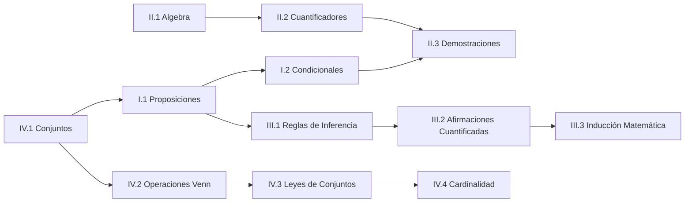

---
{"dg-publish":true,"permalink":"/universidad/3er-semestre/matematicas-discretas/unidad-1-logica-y-conjuntos/00-indice-unidad-1/","tags":["MATG1051","unidad1","indice","discretas"],"dg-note-properties":{"tags":["MATG1051","unidad1","indice","discretas"]}}
---

# 🗺️ Unidad 1 — Lógica y Conjuntos — Índice

> [!info] ℹ️ Índice auto-actualizable con Dataview
> Esta nota lista automáticamente todas las notas de esta unidad. No necesitas editarla al agregar una nueva: aparece sola al guardarla.

## 📑 Notas de la Unidad

| Nota                                                                                                                                                                                                                                                                                                         | Actualizado | Salientes | Entrantes |
| ------------------------------------------------------------------------------------------------------------------------------------------------------------------------------------------------------------------------------------------------------------------------------------------------------------ | ----------- | --------- | --------- |
| [[Universidad/3er Semestre/Matemáticas Discretas/Unidad 1 - Logica y Conjuntos/II - Álgebra Proposicional/01 - Algebra de Proposiciones\|01 — Algebra de Proposiciones]]                                                                                                                                  | 2026-08-28  | 1         | 4         |
| [[Universidad/3er Semestre/Matemáticas Discretas/Unidad 1 - Logica y Conjuntos/IV - Teoría de Conjuntos/01 - Conjuntos, Cardinalidad y Subconjuntos\|01 — Conjuntos, Cardinalidad y Subconjuntos]]                                                                                                        | 2026-08-28  | 1         | 7         |
| [[Universidad/3er Semestre/Matemáticas Discretas/Unidad 1 - Logica y Conjuntos/I - Lógica Proporcional/01 - Proposiciones, conectivos lógicos, tablas de verdad , propiedades y circuitos combinatorio\|01 — Proposiciones, conectivos lógicos, tablas de verdad , propiedades y circuitos combinatorio]] | 2026-08-28  | 1         | 1         |
| [[Universidad/3er Semestre/Matemáticas Discretas/Unidad 1 - Logica y Conjuntos/III - Razonamiento Inductivo/01 - Reglas de Inferencia\|01 — Reglas de Inferencia]]                                                                                                                                        | 2026-08-28  | 0         | 2         |
| [[Universidad/3er Semestre/Matemáticas Discretas/Unidad 1 - Logica y Conjuntos/II - Álgebra Proposicional/02 - Cuantificadores\|02 — Cuantificadores]]                                                                                                                                                    | 2026-08-28  | 0         | 4         |
| [[Universidad/3er Semestre/Matemáticas Discretas/Unidad 1 - Logica y Conjuntos/IV - Teoría de Conjuntos/02 - Operaciones y Diagramas de Venn\|02 — Operaciones y Diagramas de Venn]]                                                                                                                      | 2026-08-28  | 1         | 3         |
| [[Universidad/3er Semestre/Matemáticas Discretas/Unidad 1 - Logica y Conjuntos/I - Lógica Proporcional/02 - Proposiciones Condicionales y Equivalencia Lógica\|02 — Proposiciones Condicionales y Equivalencia Lógica]]                                                                                   | 2026-08-28  | 1         | 1         |
| [[Universidad/3er Semestre/Matemáticas Discretas/Unidad 1 - Logica y Conjuntos/III - Razonamiento Inductivo/02 - Reglas de Inferencia para Afirmaciones Cuantificadas\|02 — Reglas de Inferencia para Afirmaciones Cuantificadas]]                                                                        | 2026-08-28  | 2         | 1         |
| [[Universidad/3er Semestre/Matemáticas Discretas/Unidad 1 - Logica y Conjuntos/II - Álgebra Proposicional/03 - Demostraciones\|03 — Demostraciones]]                                                                                                                                                      | 2026-08-28  | 1         | 1         |
| [[Universidad/3er Semestre/Matemáticas Discretas/Unidad 1 - Logica y Conjuntos/III - Razonamiento Inductivo/03 - Inducción Matemática\|03 — Inducción Matemática]]                                                                                                                                        | 2026-08-28  | 1         | 2         |
| [[Universidad/3er Semestre/Matemáticas Discretas/Unidad 1 - Logica y Conjuntos/IV - Teoría de Conjuntos/03 - Leyes de Conjuntos\|03 — Leyes de Conjuntos]]                                                                                                                                                | 2026-08-28  | 1         | 4         |
| [[Universidad/3er Semestre/Matemáticas Discretas/Unidad 1 - Logica y Conjuntos/IV - Teoría de Conjuntos/04 - Cardinalidad y Leyes de Cardinalidad\|04 — Cardinalidad y Leyes de Cardinalidad]]                                                                                                            | 2026-08-28  | 6         | 13        |
| [[Universidad/3er Semestre/Matemáticas Discretas/Unidad 1 - Logica y Conjuntos/Guía de Problemas 1 — Ejercicios Resueltos\|Guía de Problemas 1 — Ejercicios Resueltos]]                                                                                                                                   | 2026-08-28  | 2         | 1         |

{ .block-language-dataview}

## ✅ Avance — Metas de Aprendizaje

# [[Universidad/3er Semestre/Matemáticas Discretas/Unidad 1 - Logica y Conjuntos/IV - Teoría de Conjuntos/04 - Cardinalidad y Leyes de Cardinalidad\|04 - Cardinalidad y Leyes de Cardinalidad]]

    - [ ] Calculo |A ∪ B| usando el principio de inclusión-exclusión para 2 conjuntos.
    - [ ] Extiendo la inclusión-exclusión a 3 conjuntos.
    - [ ] Determino cardinalidad de diferencias y complementos.
    - [ ] Resuelvo problemas de conteo usando inclusión-exclusión generalizada.
    - [ ] Aplico cardinalidad a problemas de encuestas y grupos superpuestos.
    - [ ] Calculo cardinalidad de productos cartesianos |A × B|.
    - [ ] Resuelvo problemas complejos de conteo con 4 o más conjuntos.
    - [ ] Aplico el principio de inclusión-exclusión a problemas de probabilidad.
    - [ ] Combino cardinalidad con principios de multiplicación y suma.

{ .block-language-dataview}

## ⚠️ Notas huérfanas (sin enlaces entrantes)

{ .block-language-dataview}

## 📊 Mapa de conexiones

> [!quote] 🔗 Conexiones
> - Siguiente unidad: [[Universidad/3er Semestre/Matemáticas Discretas/Unidad 2 - Funciones y Relaciones/01 - Funciones\|01 - Funciones]] (Unidad 2)
> - MOC general: [[Universidad/3er Semestre/Matemáticas Discretas/Matemáticas Discretas\|Matemáticas Discretas]]

---
**Tags:** #MATG1051 #unidad1 #indice #discretas
