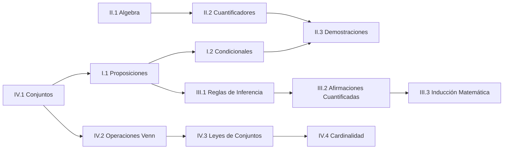

---
{"dg-publish":true,"permalink":"/universidad/3er-semestre/matematicas-discretas/unidad-1-logica-y-conjuntos/00-indice-unidad-1/","tags":["MATG1051","unidad1","indice","discretas"],"dg-note-properties":{"tags":["MATG1051","unidad1","indice","discretas"]}}
---

# 🗺️ Unidad 1 — Lógica y Conjuntos — Índice

> [!info] ℹ️ Índice manual
> Se actualiza a mano para que funcione igual en Obsidian y en Digital Garden.

## 📑 Notas de la Unidad

- [[Universidad/3er Semestre/Matemáticas Discretas/Unidad 1 - Logica y Conjuntos/Guía de Problemas 1 - Ejercicios Resueltos\|Guía de Problemas 1 - Ejercicios Resueltos]]

### I - Lógica Proporcional

- [[Universidad/3er Semestre/Matemáticas Discretas/Unidad 1 - Logica y Conjuntos/I - Lógica Proporcional/01 - Proposiciones, conectivos lógicos, tablas de verdad , propiedades y circuitos combinatorio\|01 - Proposiciones, conectivos lógicos, tablas de verdad , propiedades y circuitos combinatorio]]
- [[Universidad/3er Semestre/Matemáticas Discretas/Unidad 1 - Logica y Conjuntos/I - Lógica Proporcional/02 - Proposiciones Condicionales y Equivalencia Lógica\|02 - Proposiciones Condicionales y Equivalencia Lógica]]

### II - Álgebra Proposicional

- [[Universidad/3er Semestre/Matemáticas Discretas/Unidad 1 - Logica y Conjuntos/II - Álgebra Proposicional/01 - Algebra de Proposiciones\|01 - Algebra de Proposiciones]]
- [[Universidad/3er Semestre/Matemáticas Discretas/Unidad 1 - Logica y Conjuntos/II - Álgebra Proposicional/02 - Cuantificadores\|02 - Cuantificadores]]
- [[Universidad/3er Semestre/Matemáticas Discretas/Unidad 1 - Logica y Conjuntos/II - Álgebra Proposicional/03 - Demostraciones\|03 - Demostraciones]]

### III - Razonamiento Inductivo

- [[Universidad/3er Semestre/Matemáticas Discretas/Unidad 1 - Logica y Conjuntos/III - Razonamiento Inductivo/01 - Reglas de Inferencia\|01 - Reglas de Inferencia]]
- [[Universidad/3er Semestre/Matemáticas Discretas/Unidad 1 - Logica y Conjuntos/III - Razonamiento Inductivo/02 - Reglas de Inferencia para Afirmaciones Cuantificadas\|02 - Reglas de Inferencia para Afirmaciones Cuantificadas]]
- [[Universidad/3er Semestre/Matemáticas Discretas/Unidad 1 - Logica y Conjuntos/III - Razonamiento Inductivo/03 - Inducción Matemática\|03 - Inducción Matemática]]

### IV - Teoría de Conjuntos

- [[Universidad/3er Semestre/Matemáticas Discretas/Unidad 1 - Logica y Conjuntos/IV - Teoría de Conjuntos/01 - Conjuntos, Cardinalidad y Subconjuntos\|01 - Conjuntos, Cardinalidad y Subconjuntos]]
- [[Universidad/3er Semestre/Matemáticas Discretas/Unidad 1 - Logica y Conjuntos/IV - Teoría de Conjuntos/02 - Operaciones y Diagramas de Venn\|02 - Operaciones y Diagramas de Venn]]
- [[Universidad/3er Semestre/Matemáticas Discretas/Unidad 1 - Logica y Conjuntos/IV - Teoría de Conjuntos/03 - Leyes de Conjuntos\|03 - Leyes de Conjuntos]]
- [[Universidad/3er Semestre/Matemáticas Discretas/Unidad 1 - Logica y Conjuntos/IV - Teoría de Conjuntos/04 - Cardinalidad y Leyes de Cardinalidad\|04 - Cardinalidad y Leyes de Cardinalidad]]

## 📊 Mapa de conexiones

```mermaid
graph LR
    A[I.1 Proposiciones] --> B[I.2 Condicionales]
    C[II.1 Algebra] --> D[II.2 Cuantificadores]
    D --> E[II.3 Demostraciones]
    F[III.1 Reglas de Inferencia] --> G[III.2 Afirmaciones Cuantificadas]
    G --> H[III.3 Inducción Matemática]
    I[IV.1 Conjuntos] --> J[IV.2 Operaciones Venn]
    J --> K[IV.3 Leyes de Conjuntos]
    K --> L[IV.4 Cardinalidad]
    B --> E
    A --> F
    I --> A
```

> [!quote] 🔗 Conexiones
> - Siguiente unidad: [[Universidad/3er Semestre/Matemáticas Discretas/Unidad 2 - Funciones y Relaciones/01 - Funciones\|01 - Funciones]] (Unidad 2)
> - MOC general: [[Universidad/3er Semestre/Matemáticas Discretas/Matemáticas Discretas\|Matemáticas Discretas]]

---
**Tags:** #MATG1051 #unidad1 #indice #discretas
