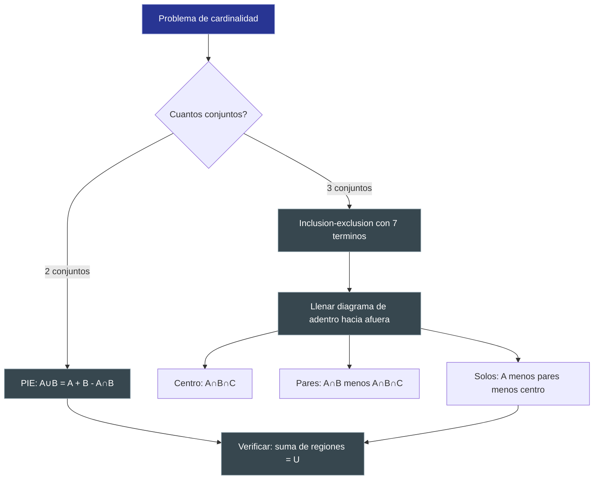

---
{"dg-publish":true,"permalink":"/universidad/3er-semestre/matematicas-discretas/unidad-1-logica-y-conjuntos/iv-teoria-de-conjuntos/04-cardinalidad-y-leyes-de-cardinalidad/","dg-note-properties":{}}
---


# 🔢 Cardinalidad y Leyes de Cardinalidad

## 🎯 Introducción

> [!info] 💡 ¿Qué estudia la cardinalidad?
>
> La **cardinalidad** no solo nos dice cuántos elementos tiene un [[Universidad/3er Semestre/Matemáticas Discretas/Unidad 1 - Logica y Conjuntos/IV - Teoría de Conjuntos/01 - Conjuntos, Cardinalidad y Subconjuntos\|conjunto]]: también nos permite *calcular* el tamaño de conjuntos formados por operaciones (unión, intersección, diferencia) sin tener que listar todos sus elementos. Es la herramienta clave para los problemas de conteo con diagramas de Venn.
>
> ```mermaid
> graph TD
>     A[Cardinalidad] --> B[Definición y propiedades básicas]
>     A --> C[Cardinalidad de operaciones]
>     A --> D[Principio de Inclusión-Exclusión]
>     A --> E[Problemas con Diagramas de Venn]
>
>     style B fill:#e1f5ff
>     style C fill:#e1ffe1
>     style D fill:#fff4e1
>     style E fill:#f5e1ff
> ```

---

## 📖 Definición y Propiedades Básicas

> [!note] 📖 Definición — Cardinal de un conjunto
>
> Si $A$ es un conjunto **finito**, el **cardinal** de $A$, denotado $|A|$, es el número de elementos distintos que contiene.
>
> $$A = \{2, 4, 6, 8\} \implies |A| = 4$$
>
> ### Casos especiales
>
> | Conjunto | Cardinal | Observación |
> |---|---|---|
> | $\emptyset$ | 0 | El único conjunto de cardinal 0 |
> | $\{0\}$ | 1 | Distinto del vacío — contiene el número cero |
> | $\{\emptyset\}$ | 1 | El vacío usado como elemento |
> | $U$ (universal) | $n$ | Depende del contexto del problema |

> [!tip] 💡 Observación — Elementos repetidos no se cuentan doble
>
> Los conjuntos no tienen elementos repetidos. Si se escribe $A = \{1, 2, 2, 3\}$, en realidad $A = \{1, 2, 3\}$ y $|A| = 3$, no 4.

---

## ⚖️ Leyes de Cardinalidad

> [!note] ⚖️ Leyes fundamentales de cardinalidad
>
> A continuación se presentan todas las leyes esenciales, desde las más simples hasta el principio de inclusión-exclusión.
>
> ### 1. Cardinal del conjunto vacío
>
> $$|\emptyset| = 0$$
>
> ### 2. Cardinal del complemento
>
> Dado un universo $U$ con $|U| = n$ y $A \subseteq U$:
>
> $$|A^c| = |U| - |A|$$
>
> **Ejemplo:** Si $|U| = 20$ y $|A| = 7$, entonces $|A^c| = 13$.
>
> ### 3. Ley de la diferencia
>
> $$|A - B| = |A| - |A \cap B|$$
>
> **Ejemplo:** Si $|A| = 10$, $|B| = 6$ y $|A \cap B| = 4$, entonces $|A - B| = 10 - 4 = 6$.
>
> ### 4. Unión de conjuntos disjuntos
>
> Si $A \cap B = \emptyset$ (conjuntos **disjuntos**):
>
> $$|A \cup B| = |A| + |B|$$
>
> ### 5. Principio de Inclusión-Exclusión — 2 conjuntos
>
> $$|A \cup B| = |A| + |B| - |A \cap B|$$
>
> Se resta $|A \cap B|$ porque esos elementos se contaron dos veces al sumar $|A| + |B|$.
>
> ### 6. Principio de Inclusión-Exclusión — 3 conjuntos
>
> $$|A \cup B \cup C| = |A| + |B| + |C| - |A \cap B| - |A \cap C| - |B \cap C| + |A \cap B \cap C|$$
>
> > [!tip]- 💡 ¿Por qué se suma $|A \cap B \cap C|$ al final?
> >
> > Al sumar los tres cardinales, los elementos en exactamente **dos** conjuntos se cuentan dos veces → se restan las intersecciones dobles.
> > Pero al restarlas, los elementos en los **tres** conjuntos quedan con cuenta 0 (se sumaron 3 veces y se restaron 3 veces) → se suma $|A \cap B \cap C|$ una vez más.
> >
> > | Elemento en... | Veces sumado | Veces restado | Veces sumado al final | Total |
> > |---|---|---|---|---|
> > | Solo 1 conjunto | 1 | 0 | 0 | **1** ✅ |
> > | Exactamente 2 conjuntos | 2 | 1 | 0 | **1** ✅ |
> > | Los 3 conjuntos | 3 | 3 | 1 | **1** ✅ |

---

## 🗺️ Las 4 Regiones del [[Universidad/3er Semestre/Matemáticas Discretas/Unidad 1 - Logica y Conjuntos/IV - Teoría de Conjuntos/02 - Operaciones y Diagramas de Venn\|Diagrama de Venn]] (2 conjuntos)

> [!note] 🗺️ Regiones del diagrama de Venn con 2 conjuntos
>
> Con dos conjuntos $A$, $B$ dentro de un universo $U$, se generan **4 regiones** disjuntas.
>
> | Región | Expresión | Descripción | Cálculo |
> |---|---|---|---|
> | **Solo A** | $A \cap B^c$ | En A, no en B | $\lvert A\rvert - \lvert A \cap B\rvert$ |
> | **Solo B** | $B \cap A^c$ | En B, no en A | $\lvert B\rvert - \lvert A \cap B\rvert$ |
> | **A y B** | $A \cap B$ | En ambos | $\lvert A \cap B\rvert$ |
> | **Ninguno** | $(A \cup B)^c$ | Fuera de todo | $\lvert U\rvert - \lvert A \cup B\rvert$ |
>
> > [!tip]- 💡 Verificación
> >
> > La suma de las 4 regiones siempre debe ser $\lvert U \rvert$:
> >
> > $$(\lvert A\rvert - \lvert A \cap B\rvert) + (\lvert B\rvert - \lvert A \cap B\rvert) + \lvert A \cap B\rvert + (\lvert U\rvert - \lvert A \cup B\rvert) = \lvert U\rvert$$

---

## 🗺️ Las 8 Regiones del Diagrama de Venn (3 conjuntos)

> [!note] 🗺️ Regiones del diagrama de Venn con 3 conjuntos
> 
> Con tres conjuntos $A$, $B$, $C$ dentro de un universo $U$, se generan **8 regiones** disjuntas. Conocer cómo expresar y calcular cada región es clave para resolver ejercicios.
> 
> |Región|Expresión|Descripción|Cálculo|
> |---|---|---|---|
> |**Solo A**|$A \cap B^c \cap C^c$|En A, no en B ni C|$\lvert A\rvert - \lvert A \cap B\rvert - \lvert A \cap C\rvert + \lvert A \cap B \cap C\rvert$|
> |**Solo B**|$B \cap A^c \cap C^c$|En B, no en A ni C|$\lvert B\rvert - \lvert A \cap B\rvert - \lvert B \cap C\rvert + \lvert A \cap B \cap C\rvert$|
> |**Solo C**|$C \cap A^c \cap B^c$|En C, no en A ni B|$\lvert C\rvert - \lvert A \cap C\rvert - \lvert B \cap C\rvert + \lvert A \cap B \cap C\rvert$|
> |**A y B solo**|$(A \cap B) \cap C^c$|En A y B, no en C|$\lvert A \cap B\rvert - \lvert A \cap B \cap C\rvert$|
> |**A y C solo**|$(A \cap C) \cap B^c$|En A y C, no en B|$\lvert A \cap C\rvert - \lvert A \cap B \cap C\rvert$|
> |**B y C solo**|$(B \cap C) \cap A^c$|En B y C, no en A|$\lvert B \cap C\rvert - \lvert A \cap B \cap C\rvert$|
> |**A, B y C**|$A \cap B \cap C$|En los tres|$\lvert A \cap B \cap C\rvert$|
> |**Ninguno**|$(A \cup B \cup C)^c$|Fuera de todo|$\lvert U\rvert - \lvert A \cup B \cup C\rvert$|
> 
> > [!tip]- 💡 Truco para no confundirse
> > 
> > Las regiones de **exactamente dos** conjuntos siempre se calculan como:
> > 
> > $$\lvert(A \cap B) \text{ solo}\rvert = \lvert A \cap B\rvert - \lvert A \cap B \cap C\rvert$$
> > 
> > Porque $\lvert A \cap B\rvert$ incluye a los que están en los tres; hay que restarlos.


---

## 🔁 Estrategia para Resolver Ejercicios con Diagramas de Venn

> [!note] 🔁 Estrategia — Llenado de adentro hacia afuera
>
> La estrategia más segura para resolver problemas de cardinalidad con diagramas de Venn es llenar las regiones **del centro hacia afuera**:
>
> **Paso 1:** Asigna el valor de la región central $|A \cap B \cap C|$.
>
> **Paso 2:** Calcula las regiones de exactamente dos conjuntos:
> $$|(A \cap B) \text{ solo}| = |A \cap B| - |A \cap B \cap C|$$
> $$|(A \cap C) \text{ solo}| = |A \cap C| - |A \cap B \cap C|$$
> $$|(B \cap C) \text{ solo}| = |B \cap C| - |A \cap B \cap C|$$
>
> **Paso 3:** Calcula las regiones de exactamente un conjunto:
> $$|\text{solo } A| = |A| - |(A \cap B) \text{ solo}| - |(A \cap C) \text{ solo}| - |A \cap B \cap C|$$
>
> *(Análogo para solo B y solo C)*
>
> **Paso 4:** Calcula la región exterior:
> $$|\text{ninguno}| = |U| - |A \cup B \cup C|$$
>
> **Verificación:** La suma de todas las regiones debe ser $|U|$.

---

## 🧩 Ejercicios Resueltos

> [!example] 📝 Ejercicio Resuelto 1 — Cardinalidad con 2 conjuntos
>
> **Problema:** En un grupo de 50 estudiantes, 30 estudian matemáticas (M), 22 estudian física (F), y 8 estudian ambas. ¿Cuántos no estudian ninguna?
>
> **Datos:**
> - $|U| = 50$
> - $|M| = 30$, $|F| = 22$, $|M \cap F| = 8$
>
> **Solución:**
>
> Aplicando inclusión-exclusión:
>
> $$|M \cup F| = |M| + |F| - |M \cap F| = 30 + 22 - 8 = 44$$
>
> Estudiantes que no estudian ninguna:
>
> $$|\text{ninguno}| = |U| - |M \cup F| = 50 - 44 = \mathbf{6}$$
>
> **Verificación con diagrama de Venn:**
>
> | Región | Cálculo | Valor |
> |---|---|---|
> | Solo M | $30 - 8 = 22$ | 22 |
> | Solo F | $22 - 8 = 14$ | 14 |
> | M y F | $8$ | 8 |
> | Ninguno | $50 - 44 = 6$ | 6 |
> | **Total** | $22 + 14 + 8 + 6$ | **50** ✅ |
>
> $\blacksquare$

> [!example] 📝 Ejercicio Resuelto 2 — Diagrama de Venn con 3 conjuntos (estilo examen)
>
> **Problema:** En una encuesta a **100 personas** sobre qué deportes practican:
> - 45 practican fútbol (F)
> - 38 practican básquet (B)
> - 30 practican natación (N)
> - 15 practican fútbol y básquet
> - 12 practican fútbol y natación
> - 10 practican básquet y natación
> - 5 practican los tres deportes
>
> Determina:
> a) ¿Cuántas personas practican al menos un deporte?
> b) ¿Cuántas no practican ninguno?
> c) ¿Cuántas practican exactamente un deporte?
> d) ¿Cuántas practican fútbol y básquet pero **no** natación?
>
> **Datos:**
>
> | Dato | Valor |
> |---|---|
> | $\lvert U \rvert$ | 100 |
> | $\lvert F \rvert$ | 45 |
> | $\lvert B \rvert$ | 38 |
> | $\lvert N \rvert$ | 30 |
> | $\lvert F \cap B \rvert$ | 15 |
> | $\lvert F \cap N \rvert$ | 12 |
> | $\lvert B \cap N \rvert$ | 10 |
> | $\lvert F \cap B \cap N \rvert$ | 5 |
>
> **Solución:**
>
> **Paso 1 — Llenado del diagrama de adentro hacia afuera:**
>
> Centro (los tres):
> $$|F \cap B \cap N| = 5$$
>
> Exactamente dos conjuntos:
> $$|(F \cap B) \text{ solo}| = 15 - 5 = 10$$
> $$|(F \cap N) \text{ solo}| = 12 - 5 = 7$$
> $$|(B \cap N) \text{ solo}| = 10 - 5 = 5$$
>
> Exactamente un conjunto:
> $$|\text{solo } F| = 45 - 10 - 7 - 5 = 23$$
> $$|\text{solo } B| = 38 - 10 - 5 - 5 = 18$$
> $$|\text{solo } N| = 30 - 7 - 5 - 5 = 13$$
>
> **Tabla resumen del diagrama:**
>
> | Región | Expresión | Valor |
> |---|---|---|
> | Solo F | $\lvert\text{solo } F\rvert$ | 23 |
> | Solo B | $\lvert\text{solo } B\rvert$ | 18 |
> | Solo N | $\lvert\text{solo } N\rvert$ | 13 |
> | F y B (no N) | $\lvert(F \cap B) \text{ solo}\rvert$ | 10 |
> | F y N (no B) | $\lvert(F \cap N) \text{ solo}\rvert$ | 7 |
> | B y N (no F) | $\lvert(B \cap N) \text{ solo}\rvert$ | 5 |
> | F, B y N | $\lvert F \cap B \cap N\rvert$ | 5 |
> | **Subtotal** | | **81** |
>
> **a) Al menos un deporte** (inclusión-exclusión):
>
> $$|F \cup B \cup N| = 45 + 38 + 30 - 15 - 12 - 10 + 5 = 81$$
>
> **81 personas** practican al menos un deporte.
>
> **b) Ningún deporte:**
>
> $$|\text{ninguno}| = 100 - 81 = \mathbf{19}$$
>
> **c) Exactamente un deporte:**
>
> $$|\text{solo F}| + |\text{solo B}| + |\text{solo N}| = 23 + 18 + 13 = \mathbf{54}$$
>
> **d) Fútbol y básquet pero NO natación:**
>
> $$|(F \cap B) \cap N^c| = |F \cap B| - |F \cap B \cap N| = 15 - 5 = \mathbf{10}$$
>
> **Verificación final:** $23 + 18 + 13 + 10 + 7 + 5 + 5 + 19 = 100$ ✅ $\blacksquare$

> [!example] 📝 Ejercicio Resuelto 3 — Encontrar dato faltante
>
> **Problema:** En un grupo de **80 personas**, se sabe que:
> - 50 tienen auto (A)
> - 35 tienen moto (M)
> - 20 no tienen ninguno
>
> ¿Cuántas personas tienen **ambos**?
>
> **Solución:**
>
> Primero encontramos $|A \cup M|$:
>
> $$|A \cup M| = |U| - |\text{ninguno}| = 80 - 20 = 60$$
>
> Luego despejamos $|A \cap M|$ de la fórmula de inclusión-exclusión:
>
> $$|A \cup M| = |A| + |M| - |A \cap M|$$
> $$60 = 50 + 35 - |A \cap M|$$
> $$|A \cap M| = 85 - 60 = \mathbf{25}$$
>
> **25 personas** tienen ambos. $\blacksquare$

> [!example] 📝 Ejercicio Resuelto 4 — Ley de la diferencia
>
> **Problema:** Sea $|A| = 15$, $|B| = 10$, $|A \cap B| = 4$. Calcula $|A - B|$, $|B - A|$ y $|A \triangle B|$ (diferencia [[Universidad/3er Semestre/Matemáticas Discretas/Unidad 2 - Funciones y Relaciones/02 - Relaciones\|simétrica]]).
>
> **Solución:**
>
> $$|A - B| = |A| - |A \cap B| = 15 - 4 = \mathbf{11}$$
>
> $$|B - A| = |B| - |A \cap B| = 10 - 4 = \mathbf{6}$$
>
> La **diferencia simétrica** $A \triangle B = (A - B) \cup (B - A)$ contiene los elementos que están en uno pero no en ambos:
>
> $$|A \triangle B| = |A - B| + |B - A| = 11 + 6 = \mathbf{17}$$
>
> O equivalentemente:
>
> $$|A \triangle B| = |A \cup B| - |A \cap B| = (15 + 10 - 4) - 4 = 21 - 4 = \mathbf{17}$$ ✅ $\blacksquare$

---

## 📝 Ejercicios Propuestos

> [!question] 📋 Ejercicios
>
> **1.** Sea $|U| = 60$, $|A| = 25$, $|B| = 30$, $|A \cap B| = 10$. Calcula $|A \cup B|$, $|A^c|$, $|A - B|$ y $|(A \cup B)^c|$.
>
> **2.** En una clase de 35 estudiantes, 20 hablan inglés (I) y 15 hablan francés (F). Si 5 hablan ambos idiomas, ¿cuántos no hablan ninguno?
>
> **3.** En una empresa de 200 empleados:
> - 120 usan correo corporativo (C)
> - 95 usan Slack (S)
> - 80 usan Zoom (Z)
> - 45 usan C y S
> - 40 usan C y Z
> - 35 usan S y Z
> - 20 usan los tres
>
> a) ¿Cuántos usan al menos una herramienta?
> b) ¿Cuántos no usan ninguna?
> c) ¿Cuántos usan exactamente dos herramientas?
> d) ¿Cuántos usan Slack y Zoom pero no correo?
>
> **4.** Si $|A \cup B| = 40$, $|A| = 25$ y $|A \cap B| = 8$, ¿cuánto es $|B|$?
>
> **5.** En un grupo, 30 personas leen novelas, 25 leen cómics, y 10 no leen nada. Si el grupo tiene 50 personas, ¿cuántas leen ambos tipos?

> [!success] ✅ Respuestas
>
> **1.**
> - $|A \cup B| = 25 + 30 - 10 = 45$
> - $|A^c| = 60 - 25 = 35$
> - $|A - B| = 25 - 10 = 15$
> - $|(A \cup B)^c| = 60 - 45 = 15$
>
> **2.**
> $|I \cup F| = 20 + 15 - 5 = 30$. Ninguno: $35 - 30 = \mathbf{5}$.
>
> **3.**
>
> a) $|C \cup S \cup Z| = 120 + 95 + 80 - 45 - 40 - 35 + 20 = 195$
>
> b) Ninguno: $200 - 195 = \mathbf{5}$
>
> c) Exactamente dos: $(45-20) + (40-20) + (35-20) = 25 + 20 + 15 = \mathbf{60}$
>
> d) $|S \cap Z \cap C^c| = |S \cap Z| - |S \cap Z \cap C| = 35 - 20 = \mathbf{15}$
>
> **4.**
> $|B| = |A \cup B| - |A| + |A \cap B| = 40 - 25 + 8 = \mathbf{23}$
>
> **5.**
> $|N \cup C| = 50 - 10 = 40$. Entonces $|N \cap C| = 30 + 25 - 40 = \mathbf{15}$.

---

## 📊 Resumen de Fórmulas

> [!abstract] 📋 Hoja de fórmulas — Cardinalidad
>
> | Fórmula | Expresión |
> |---|---|
> | Cardinal del complemento | $\lvert A^c\rvert = \lvert U\rvert - \lvert A\rvert$ |
> | Ley de la diferencia | $\lvert A - B\rvert = \lvert A\rvert - \lvert A \cap B\rvert$ |
> | Unión disjunta | $\lvert A \cup B\rvert = \lvert A\rvert + \lvert B\rvert$ (si $A \cap B = \emptyset$) |
> | Inclusión-exclusión 2 cjtos. | $\lvert A \cup B\rvert = \lvert A\rvert + \lvert B\rvert - \lvert A \cap B\rvert$ |
> | Inclusión-exclusión 3 cjtos. | $\lvert A \cup B \cup C\rvert = \lvert A\rvert + \lvert B\rvert + \lvert C\rvert - \lvert A \cap B\rvert - \lvert A \cap C\rvert - \lvert B \cap C\rvert + \lvert A \cap B \cap C\rvert$ |
> | Región "solo dos" | $\lvert(A \cap B) \text{ solo}\rvert = \lvert A \cap B\rvert - \lvert A \cap B \cap C\rvert$ |
> | Diferencia simétrica | $\lvert A \triangle B\rvert = \lvert A\rvert + \lvert B\rvert - 2\lvert A \cap B\rvert$ |
> | Conjunto potencia | $\lvert\mathcal{P}(A)\rvert = 2^{\lvert A\rvert}$ |



---


## Metas de Aprendizaje

> [!note] Nivel Básico
> - [ ] Calculo |A ∪ B| usando el principio de inclusión-exclusión para 2 conjuntos.
> - [ ] Extiendo la inclusión-exclusión a 3 conjuntos.
> - [ ] Determino cardinalidad de diferencias y complementos.

> [!note] Nivel Intermedio
> - [ ] Resuelvo problemas de conteo usando inclusión-exclusión generalizada.
> - [ ] Aplico cardinalidad a problemas de encuestas y grupos superpuestos.
> - [ ] Calculo cardinalidad de productos cartesianos |A × B|.

> [!note] Nivel Avanzado
> - [ ] Resuelvo problemas complejos de conteo con 4 o más conjuntos.
> - [ ] Aplico el principio de inclusión-exclusión a problemas de probabilidad.
> - [ ] Combino cardinalidad con principios de multiplicación y suma.


> [!quote] 🔗 Conexiones
> - Previo: [[Universidad/3er Semestre/Matemáticas Discretas/Unidad 1 - Logica y Conjuntos/IV - Teoría de Conjuntos/03 - Leyes de Conjuntos\|03 - Leyes de Conjuntos]] — leyes
> - Relacionado: [[Universidad/3er Semestre/Matemáticas Discretas/Unidad 3 - Números y Conteo/04 - Principios de Multiplicación y Suma\|04 - Principios de Multiplicación y Suma]] — principios de conteo
> - Relacionado: [[Universidad/3er Semestre/Matemáticas Discretas/Unidad 3 - Números y Conteo/05 - Permutaciones y Combinaciones\|05 - Permutaciones y Combinaciones]] — conteo avanzado

**Tags:** #matematicas-discretas #conjuntos #cardinalidad #inclusion-exclusion #venn #MATG1051
