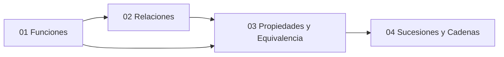

---
{"dg-publish":true,"permalink":"/universidad/3er-semestre/matematicas-discretas/unidad-2-funciones-y-relaciones/00-indice-unidad-2/","tags":["MATG1051","unidad2","indice","discretas"],"dg-note-properties":{"tags":["MATG1051","unidad2","indice","discretas"]}}
---

# 🗺️ Unidad 2 — Funciones y Relaciones — Índice

> [!info] ℹ️ Índice auto-actualizable con Dataview
> Esta nota lista automáticamente todas las notas de esta unidad. No necesitas editarla al agregar una nueva: aparece sola al guardarla.

## 📑 Notas de la Unidad

| Nota                                                                                                                                                                           | Actualizado | Salientes | Entrantes |
| ------------------------------------------------------------------------------------------------------------------------------------------------------------------------------ | ----------- | --------- | --------- |
| [[Universidad/3er Semestre/Matemáticas Discretas/Unidad 2 - Funciones y Relaciones/01 - Funciones\|01 — Funciones]]                                                         | 2026-08-28  | 1         | 12        |
| [[Universidad/3er Semestre/Matemáticas Discretas/Unidad 2 - Funciones y Relaciones/02 - Relaciones\|02 — Relaciones]]                                                       | 2026-08-28  | 1         | 10        |
| [[Universidad/3er Semestre/Matemáticas Discretas/Unidad 2 - Funciones y Relaciones/03 - Propiedades y Equivalencia\|03 — Propiedades y Equivalencia]]                       | 2026-08-28  | 0         | 5         |
| [[Universidad/3er Semestre/Matemáticas Discretas/Unidad 2 - Funciones y Relaciones/04 - Sucesiones y Cadenas\|04 — Sucesiones y Cadenas]]                                   | 2026-08-28  | 1         | 13        |
| [[Universidad/3er Semestre/Matemáticas Discretas/Unidad 2 - Funciones y Relaciones/Guía de Problemas 2 - Ejercicios Resueltos\|Guía de Problemas 2 — Ejercicios Resueltos]] | 2026-08-27  | 7         | 1         |

{ .block-language-dataview}

## ✅ Avance — Metas de Aprendizaje

# [[Universidad/3er Semestre/Matemáticas Discretas/Unidad 2 - Funciones y Relaciones/03 - Propiedades y Equivalencia\|03 - Propiedades y Equivalencia]]

    - [1] = {x ∈ X : xR₁1} = {1, 3}  (porque 1R₁1 y 3R₁1)
    - [3] = {x ∈ X : xR₁3} = {1, 3} = [1]  (misma clase)
    - [4] = {x ∈ X : xR₁4} = {4}

{ .block-language-dataview}

## ⚠️ Notas huérfanas (sin enlaces entrantes)

{ .block-language-dataview}

## 📊 Mapa de conexiones

> [!quote] 🔗 Conexiones
> - Previo: [[Universidad/3er Semestre/Matemáticas Discretas/Unidad 1 - Logica y Conjuntos/IV - Teoría de Conjuntos/04 - Cardinalidad y Leyes de Cardinalidad\|04 - Cardinalidad y Leyes de Cardinalidad]] (Unidad 1)
> - Siguiente: [[Universidad/3er Semestre/Matemáticas Discretas/Unidad 3 - Números y Conteo/01 - Divisibilidad y Números Primos\|01 - Divisibilidad y Números Primos]] (Unidad 3)
> - MOC general: [[Universidad/3er Semestre/Matemáticas Discretas/Matemáticas Discretas\|Matemáticas Discretas]]

---
**Tags:** #MATG1051 #unidad2 #indice #discretas
