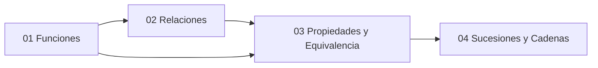

---
{"dg-publish":true,"permalink":"/universidad/3er-semestre/matematicas-discretas/unidad-2-funciones-y-relaciones/00-indice-unidad-2/","tags":["MATG1051","unidad2","indice","discretas"],"dg-note-properties":{"tags":["MATG1051","unidad2","indice","discretas"]}}
---

# 🗺️ Unidad 2 — Funciones y Relaciones — Índice

> [!info] ℹ️ Índice manual
> Se actualiza a mano para que funcione igual en Obsidian y en Digital Garden.

## 📑 Notas de la Unidad

- [[Universidad/3er Semestre/Matemáticas Discretas/Unidad 2 - Funciones y Relaciones/01 - Funciones\|01 - Funciones]]
- [[Universidad/3er Semestre/Matemáticas Discretas/Unidad 2 - Funciones y Relaciones/02 - Relaciones\|02 - Relaciones]]
- [[Universidad/3er Semestre/Matemáticas Discretas/Unidad 2 - Funciones y Relaciones/03 - Propiedades y Equivalencia\|03 - Propiedades y Equivalencia]]
- [[Universidad/3er Semestre/Matemáticas Discretas/Unidad 2 - Funciones y Relaciones/04 - Sucesiones y Cadenas\|04 - Sucesiones y Cadenas]]
- [[Universidad/3er Semestre/Matemáticas Discretas/Unidad 2 - Funciones y Relaciones/Guía de Problemas 2 - Ejercicios Resueltos\|Guía de Problemas 2 - Ejercicios Resueltos]]

## 📊 Mapa de conexiones

```mermaid
graph LR
    A[01 Funciones] --> B[02 Relaciones]
    B --> C[03 Propiedades y Equivalencia]
    C --> D[04 Sucesiones y Cadenas]
    A --> C
```

> [!quote] 🔗 Conexiones
> - Previo: [[Universidad/3er Semestre/Matemáticas Discretas/Unidad 1 - Logica y Conjuntos/IV - Teoría de Conjuntos/04 - Cardinalidad y Leyes de Cardinalidad\|04 - Cardinalidad y Leyes de Cardinalidad]] (Unidad 1)
> - Siguiente: [[Universidad/3er Semestre/Matemáticas Discretas/Unidad 3 - Números y Conteo/01 - Divisibilidad y Números Primos\|01 - Divisibilidad y Números Primos]] (Unidad 3)
> - MOC general: [[Universidad/3er Semestre/Matemáticas Discretas/Matemáticas Discretas\|Matemáticas Discretas]]

---
**Tags:** #MATG1051 #unidad2 #indice #discretas
