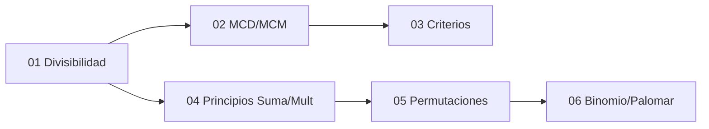

---
{"dg-publish":true,"permalink":"/universidad/3er-semestre/matematicas-discretas/unidad-3-numeros-y-conteo/00-indice-unidad-3/","tags":["MATG1051","unidad3","indice","discretas"],"dg-note-properties":{"tags":["MATG1051","unidad3","indice","discretas"]}}
---

# 🗺️ Unidad 3 — Números y Conteo — Índice

> [!info] ℹ️ Índice auto-actualizable con Dataview
> Esta nota lista automáticamente todas las notas de esta unidad. No necesitas editarla al agregar una nueva: aparece sola al guardarla.

## 📑 Notas de la Unidad

| Nota                                                                                                                                                                                                 | Actualizado | Salientes | Entrantes |
| ---------------------------------------------------------------------------------------------------------------------------------------------------------------------------------------------------- | ----------- | --------- | --------- |
| [[Universidad/3er Semestre/Matemáticas Discretas/Unidad 3 - Números y Conteo/01 - Divisibilidad y Números Primos\|01 — Divisibilidad y Números Primos]]                                           | 2026-08-28  | 3         | 6         |
| [[Universidad/3er Semestre/Matemáticas Discretas/Unidad 3 - Números y Conteo/02 - MCD, MCM y Algoritmo de Euclides\|02 — MCD, MCM y Algoritmo de Euclides]]                                       | 2026-08-28  | 5         | 3         |
| [[Universidad/3er Semestre/Matemáticas Discretas/Unidad 3 - Números y Conteo/03 - Criterios de Divisibilidad y Sistemas de Numeración\|03 — Criterios de Divisibilidad y Sistemas de Numeración]] | 2026-08-28  | 4         | 4         |
| [[Universidad/3er Semestre/Matemáticas Discretas/Unidad 3 - Números y Conteo/04 - Principios de Multiplicación y Suma\|04 — Principios de Multiplicación y Suma]]                                 | 2026-08-28  | 5         | 5         |
| [[Universidad/3er Semestre/Matemáticas Discretas/Unidad 3 - Números y Conteo/05 - Permutaciones y Combinaciones\|05 — Permutaciones y Combinaciones]]                                             | 2026-08-28  | 5         | 8         |
| [[Universidad/3er Semestre/Matemáticas Discretas/Unidad 3 - Números y Conteo/06 - Teorema del Binomio y Principio del Palomar\|06 — Teorema del Binomio y Principio del Palomar]]                 | 2026-08-28  | 3         | 4         |

{ .block-language-dataview}

## ✅ Avance — Metas de Aprendizaje

# [[Universidad/3er Semestre/Matemáticas Discretas/Unidad 3 - Números y Conteo/01 - Divisibilidad y Números Primos\|01 - Divisibilidad y Números Primos]]

    - [ ] Defino divisibilidad y uso notación a | b.
    - [ ] Identifico números primos usando criba de Eratóstenes.
    - [ ] Descompongo un número en factores primos.
    - [ ] Aplico el teorema fundamental de la aritmética.
    - [ ] Calculo el número de divisores de un entero.
    - [ ] Uso propiedades de primos para resolver problemas de divisibilidad.
    - [ ] Resuelvo problemas de distribución de primos.
    - [ ] Analizo algoritmos de primalidad y su complejidad.
# [[Universidad/3er Semestre/Matemáticas Discretas/Unidad 3 - Números y Conteo/02 - MCD, MCM y Algoritmo de Euclides\|02 - MCD, MCM y Algoritmo de Euclides]]

    - [ ] Calculo MCD y MCM de dos números por descomposición en primos.
    - [ ] Aplico el algoritmo de Euclides para hallar MCD.
    - [ ] Verifico que MCD(a,b) × LCM(a,b) = a × b.
    - [ ] Uso el algoritmo de Euclides extendido para hallar coeficientes de Bézout.
    - [ ] Resuelvo ecuaciones diofantineas lineales ax + by = c.
    - [ ] Calculo MCD y MCM de más de dos números.
    - [ ] Aplico el algoritmo de Euclides extendido para calcular inversos modulares.
    - [ ] Resuelvo sistemas de congruencias usando el teorema chino del residuo.
    - [ ] Analizo la complejidad temporal del algoritmo de Euclides.
# [[Universidad/3er Semestre/Matemáticas Discretas/Unidad 3 - Números y Conteo/03 - Criterios de Divisibilidad y Sistemas de Numeración\|03 - Criterios de Divisibilidad y Sistemas de Numeración]]

    - [ ] Aplico criterios de divisibilidad para 2, 3, 5, 9 y 11.
    - [ ] Convierto números entre decimal, binario, octal y hexadecimal.
    - [ ] Realizo operaciones básicas en sistema binario.
    - [ ] Uso criterios de divisibilidad para simplificar cálculos.
    - [ ] Convierto fracciones decimales a representación binaria.
    - [ ] Analizo ventajas de diferentes bases para computación.
    - [ ] Resuelvo problemas de representación en bases arbitrarias.
    - [ ] Aplico aritmética modular a sistemas de numeración.
    - [ ] Analizo el impacto de la precisión finita en computación.
# [[Universidad/3er Semestre/Matemáticas Discretas/Unidad 3 - Números y Conteo/04 - Principios de Multiplicación y Suma\|04 - Principios de Multiplicación y Suma]]

    - [ ] Aplico el principio de multiplicación para contar secuencias de eventos.
    - [ ] Aplico el principio de suma para contar eventos mutuamente excluyentes.
    - [ ] Distinguo cuándo usar multiplicación vs suma.
    - [ ] Resuelvo problemas de conteo con restricciones (permutaciones con repetición).
    - [ ] Aplico complemento para contar mediante la contrapositiva.
    - [ ] Combino ambos principios en problemas de múltiples pasos.
    - [ ] Resuelvo problemas de conteo con sobrerrepresentación (balls and bins).
    - [ ] Aplico principios a problemas de programación (backtracking).
    - [ ] Analizo la relación entre conteo y probabilidad.
# [[Universidad/3er Semestre/Matemáticas Discretas/Unidad 3 - Números y Conteo/05 - Permutaciones y Combinaciones\|05 - Permutaciones y Combinaciones]]

    - [ ] Calculo permutaciones P(n,r) = n!/(n-r)!
    - [ ] Calculo combinaciones C(n,r) = n!/(r!(n-r)!).
    - [ ] Distinguo cuándo importa el orden (permutación) vs cuándo no (combinación).
    - [ ] Resuelvo problemas de permutaciones con elementos repetidos.
    - [ ] Aplico combinaciones con restricciones (selección sin reemplazo).
    - [ ] Uso identidades de Pascal para simplificar cálculos.
    - [ ] Resuelvo problemas de distribución de objetos en categorías.
    - [ ] Aplico el principio de inclusión-exclusión a permutaciones con restricciones.
    - [ ] Conecto combinaciones con el triángulo de Pascal y el teorema del binomio.
# [[Universidad/3er Semestre/Matemáticas Discretas/Unidad 3 - Números y Conteo/06 - Teorema del Binomio y Principio del Palomar\|06 - Teorema del Binomio y Principio del Palomar]]

    - [ ] Expando (a+b)^n usando el teorema del binomio.
    - [ ] Identifico coeficientes binomiales en el triángulo de Pascal.
    - [ ] Aplico el principio del palomar para probar existencia.
    - [ ] Resuelvo problemas de conteo usando coeficientes binomiales.
    - [ ] Aplico el principio del palomar generalizado a problemas de distribución.
    - [ ] Uso identidades binomiales para simplificar sumatorias.
    - [ ] Resuelvo identidades binomiales usando el método combinatorio.
    - [ ] Aplico el principio del palomar a problemas de complejidad computacional.
    - [ ] Conecto el teorema del binomio con distribuciones de probabilidad.

{ .block-language-dataview}

## ⚠️ Notas huérfanas (sin enlaces entrantes)

{ .block-language-dataview}

## 📊 Mapa de conexiones

> [!quote] 🔗 Conexiones
> - Previo: [[Universidad/3er Semestre/Matemáticas Discretas/Unidad 2 - Funciones y Relaciones/04 - Sucesiones y Cadenas\|04 - Sucesiones y Cadenas]] (Unidad 2)
> - Siguiente: [[Universidad/3er Semestre/Matemáticas Discretas/Unidad 4 - Recurrencia y Algoritmos/01 - Relaciones de Recurrencia\|01 - Relaciones de Recurrencia]] (Unidad 4)
> - MOC general: [[Universidad/3er Semestre/Matemáticas Discretas/Matemáticas Discretas\|Matemáticas Discretas]]

---
**Tags:** #MATG1051 #unidad3 #indice #discretas
