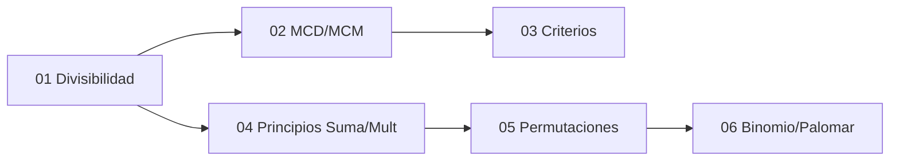

---
{"dg-publish":true,"permalink":"/universidad/3er-semestre/matematicas-discretas/unidad-3-numeros-y-conteo/00-indice-unidad-3/","tags":["MATG1051","unidad3","indice","discretas"],"dg-note-properties":{"tags":["MATG1051","unidad3","indice","discretas"]}}
---

# 🗺️ Unidad 3 — Números y Conteo — Índice

> [!info] ℹ️ Índice manual
> Se actualiza a mano para que funcione igual en Obsidian y en Digital Garden.

## 📑 Notas de la Unidad

- [[Universidad/3er Semestre/Matemáticas Discretas/Unidad 3 - Números y Conteo/01 - Divisibilidad y Números Primos\|01 - Divisibilidad y Números Primos]]
- [[Universidad/3er Semestre/Matemáticas Discretas/Unidad 3 - Números y Conteo/02 - MCD, MCM y Algoritmo de Euclides\|02 - MCD, MCM y Algoritmo de Euclides]]
- [[Universidad/3er Semestre/Matemáticas Discretas/Unidad 3 - Números y Conteo/03 - Criterios de Divisibilidad y Sistemas de Numeración\|03 - Criterios de Divisibilidad y Sistemas de Numeración]]
- [[Universidad/3er Semestre/Matemáticas Discretas/Unidad 3 - Números y Conteo/04 - Principios de Multiplicación y Suma\|04 - Principios de Multiplicación y Suma]]
- [[Universidad/3er Semestre/Matemáticas Discretas/Unidad 3 - Números y Conteo/05 - Permutaciones y Combinaciones\|05 - Permutaciones y Combinaciones]]
- [[Universidad/3er Semestre/Matemáticas Discretas/Unidad 3 - Números y Conteo/06 - Teorema del Binomio y Principio del Palomar\|06 - Teorema del Binomio y Principio del Palomar]]
- [[Universidad/3er Semestre/Matemáticas Discretas/Unidad 3 - Números y Conteo/Guía de Problemas 3 - Ejercicios Resueltos\|Guía de Problemas 3 - Ejercicios Resueltos]]

## 📊 Mapa de conexiones

```mermaid
graph LR
    A[01 Divisibilidad] --> B[02 MCD/MCM]
    B --> C[03 Criterios]
    D[04 Principios Suma/Mult] --> E[05 Permutaciones]
    E --> F[06 Binomio/Palomar]
    A --> D
```

> [!quote] 🔗 Conexiones
> - Previo: [[Universidad/3er Semestre/Matemáticas Discretas/Unidad 2 - Funciones y Relaciones/04 - Sucesiones y Cadenas\|04 - Sucesiones y Cadenas]] (Unidad 2)
> - Siguiente: [[Universidad/3er Semestre/Matemáticas Discretas/Unidad 4 - Recurrencia y Algoritmos/01 - Relaciones de Recurrencia\|01 - Relaciones de Recurrencia]] (Unidad 4)
> - MOC general: [[Universidad/3er Semestre/Matemáticas Discretas/Matemáticas Discretas\|Matemáticas Discretas]]

---
**Tags:** #MATG1051 #unidad3 #indice #discretas
