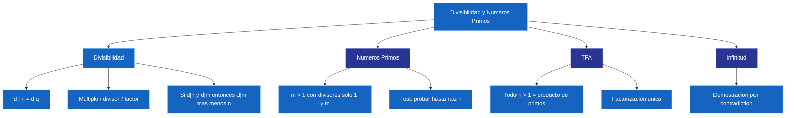

---
{"dg-publish":true,"permalink":"/universidad/3er-semestre/matematicas-discretas/unidad-3-numeros-y-conteo/01-divisibilidad-y-numeros-primos/","dg-note-properties":{}}
---

# 🔢 Divisibilidad y Números Primos

## 🎯 Introducción

> [!info] 💡 ¿Por qué estudiar divisibilidad y números primos?
> 
> La **teoría de números** es la rama de las matemáticas que estudia las propiedades del conjunto $\mathbb{Z}$ de los enteros. Sus conceptos fundamentales — divisibilidad, primos y factorización — son la base de la aritmética y tienen aplicaciones directas en criptografía, seguridad informática y computación.
> 
> - La **divisibilidad** define cuándo un número "cabe exactamente" dentro de otro.
> - Los **números primos** son los "átomos" de los enteros: todo número se construye a partir de ellos.
> - El **Teorema Fundamental de la Aritmética** garantiza que esa construcción es única.
> 
> **Analogía del mundo real:**
> 
> Imagina que quieres repartir $72$ caramelos en grupos iguales. ¿En cuántos grupos diferentes puedes hacerlo sin que sobre ninguno? Eso es divisibilidad: $72$ es divisible por $1, 2, 3, 4, 6, 8, 9, 12, 18, 24, 36, 72$ — exactamente $12$ formas.
> 
> ```mermaid
> graph TD
>     A[Divisibilidad y Numeros Primos] --> B[Divisibilidad]
>     A --> C[Numeros Primos]
>     A --> D[Teorema Fundamental de la Aritmetica]
>     A --> E[Infinitud de Primos]
>     B --> B1["d n = d q"]
>     B --> B2["Propiedades: d m mas menos n"]
>     C --> C1["m > 1 con divisores 1 y m"]
>     C --> C2["Test: probar hasta raiz n"]
>     D --> D1["Factorizacion unica en primos"]
>     E --> E1["Demostracion por contradiction"]
> 
>     style B fill:#e1f5ff
>     style C fill:#e1ffe1
>     style D fill:#fff4e1
>     style E fill:#f5e1ff
> 
    style A fill:#1565C0,color:#FFFFFF,stroke:#90CAF9,stroke-width:1px
    style B fill:#1565C0,color:#FFFFFF,stroke:#90CAF9,stroke-width:1px
    style B1 fill:#1565C0,color:#FFFFFF,stroke:#90CAF9,stroke-width:1px
    style B2 fill:#1565C0,color:#FFFFFF,stroke:#90CAF9,stroke-width:1px
    style C fill:#283593,color:#FFFFFF,stroke:#9FA8DA,stroke-width:1px
    style C1 fill:#1565C0,color:#FFFFFF,stroke:#90CAF9,stroke-width:1px
    style C2 fill:#1565C0,color:#FFFFFF,stroke:#90CAF9,stroke-width:1px
    style D fill:#283593,color:#FFFFFF,stroke:#9FA8DA,stroke-width:1px
    style D1 fill:#1565C0,color:#FFFFFF,stroke:#90CAF9,stroke-width:1px
    style E fill:#283593,color:#FFFFFF,stroke:#9FA8DA,stroke-width:1px
    style E1 fill:#1565C0,color:#FFFFFF,stroke:#90CAF9,stroke-width:1px```
> 
> |Concepto|Fórmula clave|
> |---|---|
> |**Divisibilidad**|$d \mid n \iff n = d \cdot q,\ q \in \mathbb{Z}$|
> |**Primo**|Divisores de $m > 1$: solo $1$ y $m$|
> |**Test primalidad**|Probar divisores hasta $\lfloor\sqrt{n}\rfloor$|
> |**TFA**|$n = p_1^{a_1} \cdot p_2^{a_2} \cdots p_k^{a_k}$, única|

---

## 🧠 El truco de examen (léelo antes que todo lo demás)

> [!important] 🧠 Así se identifican primos sin morir en el intento
> 
> Olvídate un momento de las definiciones formales. Para saber si un número $n$ es primo:
> 
> 1. Calcula $\lfloor\sqrt{n}\rfloor$.
> 2. Revisa si algún número de $2$ hasta $\lfloor\sqrt{n}\rfloor$ divide a $n$.
> 3. Si **ninguno** divide → es primo. Si alguno divide → es compuesto.
> 
> **Ejemplo con 91:**
> 
> ```
> √91 ≈ 9.54 → revisar 2, 3, 4, 5, 6, 7, 8, 9
> 91 ÷ 7 = 13  ← ¡encontrado!
> → 91 NO es primo (91 = 7 × 13)
> ```
> 
> No necesitas factorizar todo ni listar todos los divisores. Solo "sube desde 2 hasta $\lfloor\sqrt{n}\rfloor$ y detente si encuentras uno".
> 
> **Analogía para recordarlo:** imagina que $n$ es una puerta cerrada con llave. No necesitas probar todas las llaves del mundo — solo las que caben en la cerradura (hasta $\sqrt{n}$). Si ninguna abre, la puerta es "primo".

---

## 🔵 Divisibilidad

> [!note] 📋 Definición
> 
> **Definición.** Sean $n, d$ números enteros con $d \neq 0$. Diremos que $d$ **divide** a $n$, o que $n$ es **divisible** para $d$, si existe un entero $q$ tal que:
> 
> $$\boxed{n = d \cdot q}$$
> 
> - $q$ se llama **cociente**
> - $n$ se llama **múltiplo** de $d$
> - $d$ se llama **divisor** o **factor** de $n$
> - Notación: $d \mid n$ — se lee *"d divide a n"*
> 
> ---
> 
> ### 📌 Ejemplos
> 
> > |Operación|¿Divide?|Razón|
> > |---|---|---|
> > |$6 \mid 72$|✅|$72 = 6 \cdot 12$|
> > |$-8 \mid 24$|✅|$24 = (-8) \cdot (-3)$|
> > |$6 \mid 21$|❌|$21 = 6 \cdot 3 + 3$ (residuo ≠ 0)|
> 
> > 💡 Para cualquier $k \neq 0$: $0 = k \cdot 0$, es decir $q = 0 \in \mathbb{Z}$. Todo entero no nulo divide a cero.

---

## 🟢 Propiedades de la Divisibilidad

> [!note] 📋 Teorema — Propiedades básicas
> 
> **Teorema.** Sean $m, n$ y $d$ enteros:
> 
> 1. Si $d \mid n$ y $d \mid m$, entonces $d \mid m + n$
> 2. Si $d \mid n$ y $d \mid m$, entonces $d \mid m - n$
> 3. Si $d \mid n$, entonces $d \mid m \cdot n$
> 
> ---
> 
> ### 📐 Demostración de (2)
> 
> > Por hipótesis existen $q_1, q_2 \in \mathbb{Z}$ tal que $n = d \cdot q_1$ y $m = d \cdot q_2$. Entonces: $$m - n = d \cdot q_2 - d \cdot q_1 = d(q_2 - q_1) = d \cdot q$$ haciendo $q = q_2 - q_1 \in \mathbb{Z}$. Por lo tanto $d \mid m - n$. $\blacksquare$

---

## 🟡 Números Primos y Compuestos

> [!note] 📋 Definición
> 
> **Definición.** Diremos que un entero $m > 1$ es **primo** si sus únicos divisores positivos son $1$ y $m$. En caso contrario, diremos que $m$ es **compuesto**.
> 
> ---
> 
> ### 📌 Ejemplos
> 
> > |Número|Clasificación|Razón|
> > |---|---|---|
> > |$2$|Primo|El único primo par|
> > |$17$|Primo|Sus únicos divisores positivos son $1$ y $17$|
> > |$72$|Compuesto|Divisores: $2,3,4,6,8,9,12,18,24,36,72$|
> > |$1$|Ninguno|Por definición se requiere $m > 1$|
> 
> Los primeros números primos son: $2,\ 3,\ 5,\ 7,\ 11,\ 13,\ 17,\ 19,\ 23,\ \ldots$

---

## 🔍 Test de Primalidad

> [!note] 📋 Teorema — Cota $\sqrt{n}$ para divisores
> 
> **Teorema.** Un entero positivo $n > 1$ es **compuesto** si y sólo si tiene un divisor $d$ con:
> 
> $$\boxed{2 \leq d \leq \sqrt{n}}$$
> 
> Para probar si $n$ es primo **basta revisar los enteros hasta $\lfloor\sqrt{n}\rfloor$**.
> 
> ---
> 
> ### 🧮 Ejemplos resueltos
> 
> **¿Es primo 47?**
> 
> > $\lfloor\sqrt{47}\rfloor = 6$. Revisamos $d \in \{2, 3, 4, 5, 6\}$: ninguno divide a $47$. Por tanto **47 es primo**. ✅
> 
> **Determinar si 53, 85 y 91 son primos:**
> 
> > - $\lfloor\sqrt{53}\rfloor = 7$: revisar $2,3,4,5,6,7$. Ninguno divide a $53$. → **53 es primo** ✅
> > - $\lfloor\sqrt{85}\rfloor = 9$: $85 = 5 \times 17$. → **85 es compuesto** ❌
> > - $\lfloor\sqrt{91}\rfloor = 9$: $91 = 7 \times 13$. → **91 es compuesto** ❌

---

## 🏛️ Teorema Fundamental de la Aritmética

> [!important] 🏛️ TFA
> 
> **Teorema (TFA).** Cualquier entero mayor que $1$ se puede factorizar como producto de primos. Más aún, si los primos se escriben en orden no decreciente, la factorización es **única**.
> 
> ---
> 
> ### 📌 Ejemplos
> 
> **Factorización de 84:**
> 
> > $$84 = 4 \cdot 21 = 2 \cdot 2 \cdot 3 \cdot 7 = 2^2 \cdot 3 \cdot 7$$
> 
> **Factorización de 72:**
> 
> > $$72 = 8 \cdot 9 = 2^3 \cdot 3^2$$
> 
> ---
> 
> ### 🧮 Ejemplo resuelto — Factorizar 180
> 
> > $$180 = 2 \cdot 90 = 2^2 \cdot 45 = 2^2 \cdot 3^2 \cdot 5$$
> > 
> > Verificación: $2^2 \cdot 3^2 \cdot 5 = 4 \cdot 9 \cdot 5 = 180$ ✓

---

## ♾️ Infinitud de los Primos

> [!abstract] 📋 Teorema
> 
> **Teorema.** El conjunto de números primos es infinito.
> 
> ---
> 
> ### 📐 Demostración (por contradicción)
> 
> > Supongamos que los primos son finitos: $p_1, p_2, \ldots, p_k$. Definimos: $$m = p_1 \cdot p_2 \cdots p_k + 1$$ Como $m > p_i$ para todo $i$, $m$ no puede ser primo, así que es compuesto. Existe entonces $p_j$ que divide a $m$. Pero $p_j$ también divide a $p_1 \cdot p_2 \cdots p_k$. Por la propiedad de la divisibilidad: $$p_j \mid m - p_1 \cdot p_2 \cdots p_k = 1$$ lo que contradice que $p_j \geq 2$ sea primo. $\blacksquare$
> 
> ---
> 
> ### 📌 Ejemplo ilustrativo
> 
> > Supongamos que los primos son solo $\{2, 3, 5\}$. Entonces: $$m = 2 \cdot 3 \cdot 5 + 1 = 31$$ $31$ no es divisible por $2$ (residuo $1$), ni por $3$ (residuo $1$), ni por $5$ (residuo $1$). O $31$ es primo (¡nuevo primo!), o tiene un factor primo que no estaba en la lista. En ambos casos, la lista original estaba incompleta.

---

## 📊 Resumen Visual



---

## 📚 Referencias

> [!quote] 📖 Fuentes consultadas
> 
> [1] E. Pineda, _Elementos de teoría de números_, clase MATG1051, ESPOL, 2025.
> 
> [2] K. H. Rosen, _Discrete Mathematics and Its Applications_, 8th ed. New York, USA: McGraw-Hill, 2019, pp. 253–290.

---

## Metas de Aprendizaje

> [!note] Nivel Básico
> - [ ] Defino divisibilidad y uso notación a | b.
> - [ ] Identifico números primos usando criba de Eratóstenes.
> - [ ] Descompongo un número en factores primos.

> [!note] Nivel Intermedio
> - [ ] Aplico el teorema fundamental de la aritmética.
> - [ ] Calculo el número de divisores de un entero.
> - [ ] Uso propiedades de primos para resolver problemas de divisibilidad.

> [!note] Nivel Avanzado
> - [ ] Resuelvo problemas de distribución de primos.
> - [ ] Analizo algoritmos de primalidad y su complejidad.

---

> [!quote] 🔗 Conexiones
> - Siguiente: [[Universidad/3er Semestre/Matemáticas Discretas/Unidad 3 - Números y Conteo/02 - MCD, MCM y Algoritmo de Euclides\|02 - MCD, MCM y Algoritmo de Euclides]] — divisores comunes
> - Relacionado: [[Universidad/3er Semestre/Matemáticas Discretas/Unidad 3 - Números y Conteo/03 - Criterios de Divisibilidad y Sistemas de Numeración\|03 - Criterios de Divisibilidad y Sistemas de Numeración]]
> - Aplicación: [[Universidad/3er Semestre/Matemáticas Discretas/Unidad 3 - Números y Conteo/06 - Teorema del Binomio y Principio del Palomar\|06 - Teorema del Binomio y Principio del Palomar]]

**Tags:** #divisibilidad #primos #TFA #factorizacion #teoria-de-numeros #MATG1051 #unidad3
