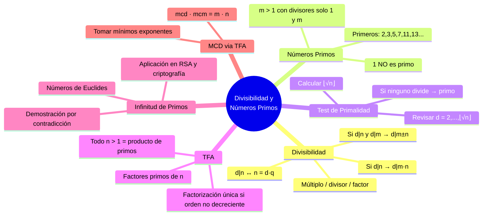

---
{"dg-publish":true,"permalink":"/universidad/3er-semestre/matematicas-discretas/unidad-3-numeros-y-conteo/01-divisibilidad-y-numeros-primos/","dg-note-properties":{}}
---


# 🔢 Divisibilidad y Números Primos

## 🎯 Introducción

> [!info] 💡 ¿Por qué estudiar divisibilidad y números primos?
> 
> La **teoría de números** es la rama de las matemáticas que estudia las propiedades del conjunto $\mathbb{Z}$ de los enteros. Sus conceptos fundamentales — divisibilidad, primos y factorización — son la base de la aritmética y tienen aplicaciones directas en criptografía, seguridad informática y computación.
> 
> - La **divisibilidad** define cuándo un número "cabe exactamente" dentro de otro.
> - Los **números primos** son los "átomos" de los enteros: todo número se construye a partir de ellos.
> - El **Teorema Fundamental de la Aritmética** garantiza que esa construcción es única.
> 
> **Analogía del mundo real:**
> 
> Los números primos son como los elementos de la tabla periódica: así como toda molécula está formada por elementos puros combinados, todo número entero mayor que 1 está formado por primos multiplicados. Y así como un elemento no se puede descomponer en algo más simple, un primo no tiene divisores propios.
> 
> ```mermaid
> graph TD
>     A[Teoría de Números] --> B[Divisibilidad]
>     A --> C[Números Primos]
>     A --> D[Teorema Fundamental<br/>de la Aritmética]
> 
>     B --> E["Definición d|n"]
>     B --> F[Propiedades<br/>de divisibilidad]
>     C --> G[Primo vs Compuesto]
>     C --> H[Test de primalidad<br/>d ≤ √n]
>     D --> I[Factorización prima<br/>única]
>     D --> J[MCD via<br/>factorización]
> 
>     style B fill:#e1f5ff
>     style C fill:#e1ffe1
>     style D fill:#fff4e1
> ```
> 
> | Concepto | Descripción |
> |---|---|
> | **Divisibilidad** | $d \mid n$ si existe $q \in \mathbb{Z}$ tal que $n = d \cdot q$ |
> | **Número primo** | Entero $m > 1$ cuyos únicos divisores positivos son $1$ y $m$ |
> | **TFA** | Todo entero $> 1$ se factoriza como producto de primos de forma única |

---

## 🔵 Divisibilidad

> [!note] 🔵 Definición, notación y ejemplos
> 
> **Definición.**
> Sean $n, d$ números enteros con $d \neq 0$. Diremos que $d$ **divide** a $n$, o que $n$ es **divisible** para $d$, si existe un entero $q$ tal que:
> 
> $$\boxed{n = d \cdot q}$$
> 
> - $q$ se llama **cociente**
> - $n$ se llama **múltiplo** de $d$
> - $d$ se llama **divisor** o **factor** de $n$
> - Notación: $d \mid n$ — se lee *"d divide a n"*
> 
> > ⚠️ No confundir $d \mid n$ (divisibilidad) con $d/n$ (fracción). Son notaciones distintas.
> 
> ---
> 
> ### 📌 Ejemplo base
> 
> Como $72 = 6 \cdot 12$, tenemos $6 \mid 72$ donde $12$ es el cociente y $6$ el factor. También $12 \mid 72$ donde $6$ es el cociente y $12$ el divisor.
> 
> ---
> 
> ### 🧮 Ejemplos resueltos
> 
> **¿24 es divisible para $-8$?**
> 
> > $24 = (-8) \cdot (-3)$, existe $q = -3 \in \mathbb{Z}$. Por tanto $-8 \mid 24$. ✅
> 
> **¿Qué enteros $k$ dividen al cero?**
> 
> > Para cualquier $k \neq 0$: $0 = k \cdot 0$, es decir $q = 0 \in \mathbb{Z}$. **Todo entero no nulo divide a $0$**. ✅
> 
> **¿$6 \mid 21$?**
> 
> > $21 = 6 \cdot 3 + 3$. No existe $q \in \mathbb{Z}$ tal que $21 = 6q$ exactamente. Por tanto $6 \nmid 21$. ❌
> 
> **¿Cuáles son los factores (divisores) de $-28$?**
> 
> > $-28 = (\pm 1)(\mp 28) = (\pm 2)(\mp 14) = (\pm 4)(\mp 7)$
> > Los divisores de $-28$ son: $\pm 1,\ \pm 2,\ \pm 4,\ \pm 7,\ \pm 14,\ \pm 28$

---

## 🟢 Propiedades de la Divisibilidad

> [!tip] 🟢 Teorema — Propiedades básicas
> 
> **Teorema.** Sean $m, n$ y $d$ enteros:
> 
> 1. Si $d \mid n$ y $d \mid m$, entonces $d \mid m + n$
> 2. Si $d \mid n$ y $d \mid m$, entonces $d \mid m - n$
> 3. Si $d \mid n$, entonces $d \mid m \cdot n$
> 
> ---
> 
> ### 📐 Demostración de (2)
> 
> > Por hipótesis existen $q_1, q_2 \in \mathbb{Z}$ tal que $n = d \cdot q_1$ y $m = d \cdot q_2$. Entonces:
> > $$m - n = d \cdot q_2 - d \cdot q_1 = d(q_2 - q_1) = d \cdot q$$
> > haciendo $q = q_2 - q_1 \in \mathbb{Z}$. Por lo tanto $d \mid m - n$. $\blacksquare$
> 
> ### 📐 Demostración de (3)
> 
> > Por hipótesis existe $q_1 \in \mathbb{Z}$ tal que $n = d \cdot q_1$. Entonces:
> > $$m \cdot n = m \cdot d \cdot q_1 = d(m \cdot q_1) = d \cdot q$$
> > haciendo $q = m \cdot q_1 \in \mathbb{Z}$. Por lo tanto $d \mid m \cdot n$. $\blacksquare$
> 
> ---
> 
> ### 🧮 Ejercicios
> 
> 1. Sean $a, b, c \in \mathbb{Z}$. Demuestre que si $a \mid b$ y $b \mid c$, entonces $a \mid c$.
> 2. Pruebe que para todo par de enteros positivos $a$ y $b$: si $a \mid b$, entonces $a \leq b$.
> 3. Determine todos los divisores de $1$.

---

## 🟡 Números Primos y Compuestos

> [!tip] 🟡 Definición de primo y compuesto
> 
> Dado cualquier entero $m \neq 0$, es claro que $m = m \cdot 1$, así $1 \mid m$ y $m \mid m$. Esto es, $1$ y $m$ siempre dividen a $m$.
> 
> **Definición.**
> Diremos que un entero $m > 1$ es **primo** si sus únicos divisores positivos son $1$ y $m$. En caso contrario, diremos que $m$ es **compuesto**.
> 
> ---
> 
> ### 📌 Ejemplos
> 
> | Número | Clasificación | Razón |
> |---|---|---|
> | $2$ | Primo | El único primo par |
> | $17$ | Primo | Sus únicos divisores positivos son $1$ y $17$ |
> | $72$ | Compuesto | Divisores: $2,3,4,6,8,9,12,18,24,36,72$ |
> | $1$ | Ninguno | Por definición se requiere $m > 1$ |
> 
> Los primeros números primos son: $2,\ 3,\ 5,\ 7,\ 11,\ 13,\ 17,\ 19,\ 23,\ \ldots$

---

## 🔍 Test de Primalidad

> [!note] 🔍 Teorema — Cota $\sqrt{n}$ para divisores
> 
> Si $n, d$ son enteros positivos y $d \mid n$, entonces $1 \leq d \leq n$. Por lo tanto $2, 3, \ldots, n-1$ son candidatos a divisores propios de $n$.
> 
> **Teorema.** Un entero positivo $n > 1$ es **compuesto** si y sólo si tiene un divisor $d$ con:
> 
> $$\boxed{2 \leq d \leq \sqrt{n}}$$
> 
> Para probar si $n$ es primo **basta revisar los enteros hasta $\lfloor\sqrt{n}\rfloor$**.
> 
> ---
> 
> ### 📐 Demostración (idea clave)
> 
> $(\Leftarrow)$ Si $n$ tiene divisor $d$ con $2 \leq d \leq \sqrt{n}$, ese divisor es distinto de $1$ y $n$, luego $n$ es compuesto.
> 
> $(\Rightarrow)$ Si $n$ es compuesto, existe divisor $d_1$ con $2 \leq d_1 < n$.
> - Si $d_1 \leq \sqrt{n}$: tomamos $d = d_1$. ✅
> - Si $d_1 > \sqrt{n}$: como $d_1 \mid n$ existe $q$ con $n = d_1 \cdot q$. Si $q > \sqrt{n}$ entonces $n = d_1 q > \sqrt{n}\cdot\sqrt{n} = n$, contradicción. Por tanto $q \leq \sqrt{n}$ y tomamos $d = q$. ✅
> 
> En cualquier caso existe divisor $d$ con $2 \leq d \leq \sqrt{n}$. $\blacksquare$
> 
> ---
> 
> ### ⚙️ Procedimiento
> 
> ```mermaid
> graph TD
>     P1[1️⃣ Calcular ⌊√n⌋] --> P2
>     P2[2️⃣ Probar divisibilidad<br/>para d = 2, 3, ..., ⌊√n⌋] --> P3
>     P3{¿Algún d divide a n?}
>     P3 -->|Sí| P4[n es COMPUESTO<br/>d es un factor]
>     P3 -->|No| P5[n es PRIMO ✅]
> 
>     style P1 fill:#e1f5ff
>     style P2 fill:#e1f5ff
>     style P4 fill:#ffe1e1
>     style P5 fill:#e1ffe1
> ```
> 
> ---
> 
> ### 🧮 Ejemplos resueltos
> 
> **¿Es primo 47?**
> 
> > $\lfloor\sqrt{47}\rfloor = 6$. Revisamos $d \in \{2, 3, 4, 5, 6\}$:
> > ninguno divide a $47$. Por tanto **47 es primo**. ✅
> 
> **Determinar si 53, 85 y 91 son primos:**
> 
> > - $\lfloor\sqrt{53}\rfloor = 7$: revisar $2,3,4,5,6,7$. Ninguno divide a $53$. → **53 es primo** ✅
> > - $\lfloor\sqrt{85}\rfloor = 9$: $85 = 5 \times 17$. → **85 es compuesto** ❌
> > - $\lfloor\sqrt{91}\rfloor = 9$: $91 = 7 \times 13$. → **91 es compuesto** ❌

---

## 🏛️ Teorema Fundamental de la Aritmética

> [!important] 🏛️ TFA — Existencia y unicidad de la factorización prima
> 
> **Teorema (TFA).** Cualquier entero mayor que $1$ se puede factorizar como producto de primos. Más aún, si los primos se escriben en orden no decreciente, la factorización es **única**.
> 
> Simbólicamente: si
> $$n = p_1 \cdot p_2 \cdots p_i \quad \text{con } p_1 \leq p_2 \leq \cdots \leq p_i$$
> y también
> $$n = q_1 \cdot q_2 \cdots q_j \quad \text{con } q_1 \leq q_2 \leq \cdots \leq q_j$$
> entonces $i = j$ y $p_k = q_k$ para todo $k = 1, \ldots, i$.
> 
> A los $p_i$ los llamamos **factores primos** de $n$.
> 
> ---
> 
> ### 📌 Ejemplos
> 
> **Factorización de 84:**
> 
> > $$84 = 4 \cdot 21 = 2 \cdot 2 \cdot 3 \cdot 7 = 2^2 \cdot 3 \cdot 7$$
> > Factores primos de $84$: $2,\ 3,\ 7$.
> 
> **Factorización de 72:**
> 
> > $$72 = 8 \cdot 9 = 2^3 \cdot 3^2$$
> > Factores primos de $72$: $2,\ 3$.

---

## ♾️ Infinitud de los Primos

> [!abstract] ♾️ Teorema — Hay infinitos números primos
> 
> **Teorema.** El conjunto de números primos es infinito.
> 
> ---
> 
> ### 📐 Demostración (por contradicción)
> 
> > Supongamos que los primos son finitos: $p_1, p_2, \ldots, p_k$. Definimos:
> > $$m = p_1 \cdot p_2 \cdots p_k + 1, \qquad n = p_1 \cdot p_2 \cdots p_k$$
> > Como $m > p_i$ para todo $i$, $m$ no puede ser primo, así que es compuesto. Existe entonces $p_j$ que divide a $m$. Pero $p_j$ también divide a $n$. Por la propiedad de la divisibilidad:
> > $$p_j \mid m - n = 1$$
> > lo que contradice que $p_j \geq 2$ sea primo. $\blacksquare$
> 
> ---
> 
> ### 💡 Consecuencias para la Criptografía
> 
> | Consecuencia | Aplicación |
> |---|---|
> | Existen primos arbitrariamente grandes | Se generan claves seguras y únicas |
> | No se pueden probar todos | Ningún atacante puede romper la seguridad por fuerza bruta |
> | RSA usa $n = p \cdot q$ con $p, q$ primos grandes | La dificultad de factorizar $n$ garantiza la seguridad |
> | TFA garantiza representación única | La información se codifica con factorizaciones únicas |
> 
> ---
> 
> ### 📌 Números de Euclides
> 
> Usando la construcción de la demostración:
> 
> | Producto $+ 1$ | Resultado | ¿Primo? |
> |---|---|---|
> | $2 \cdot 3 + 1$ | $7$ | ✅ Primo |
> | $2 \cdot 3 \cdot 5 + 1$ | $31$ | ✅ Primo |
> | $2 \cdot 3 \cdot 5 \cdot 7 + 1$ | $211$ | ✅ Primo |
> | $2 \cdot 3 \cdot 5 \cdot 7 \cdot 11 + 1$ | $2311$ | ✅ Primo |
> | $2 \cdot 3 \cdot 5 \cdot 7 \cdot 11 \cdot 13 + 1$ | $30031 = 59 \cdot 509$ | ❌ Compuesto |
> | $2 \cdot 3 \cdot 5 \cdot 7 \cdot 11 \cdot 13 \cdot 17 + 1$ | $510511 = 19 \cdot 26869$ | ❌ Compuesto |
> 
> Los compuestos de esta forma se llaman **Números de Euclides**. Si existen infinitos es un **problema abierto** en matemáticas.

---

## 🔗 MCD mediante Factorización Prima

> [!note] 🔗 Máximo Común Divisor via TFA
> 
> **Definición.** Un **divisor común** de $m$ y $n$ es un entero que divide tanto a $m$ como a $n$. El **máximo común divisor** $\text{mcd}(m, n)$ es el divisor común más grande.
> 
> **Teorema.** Sean $m, n > 1$ con factorizaciones:
> $$m = p_1^{a_1} \cdots p_k^{a_k}, \quad n = p_1^{b_1} \cdots p_k^{b_k}$$
> (donde $a_i = 0$ si $p_i \nmid m$ y $b_i = 0$ si $p_i \nmid n$). Entonces:
> $$\boxed{\text{mcd}(m, n) = p_1^{\min\{a_1,b_1\}} \cdot p_2^{\min\{a_2,b_2\}} \cdots p_k^{\min\{a_k,b_k\}}}$$
> 
> ---
> 
> ### 📌 Ejemplo
> 
> Divisores positivos de $30$: $1,2,3,5,6,10,15,30$
> Divisores positivos de $105$: $1,3,5,7,15,21,35,105$
> Divisores comunes: $1,3,5,15$
> 
> > $$\text{mcd}(30,105) = 15$$
> 
> **Via factorización:**
> 
> > $$30 = 2^1 \cdot 3^1 \cdot 5^1 \cdot 7^0 \qquad 105 = 2^0 \cdot 3^1 \cdot 5^1 \cdot 7^1$$
> > $$\text{mcd}(30,105) = 2^{\min\{1,0\}} \cdot 3^{\min\{1,1\}} \cdot 5^{\min\{1,1\}} \cdot 7^{\min\{0,1\}} = 2^0 \cdot 3^1 \cdot 5^1 \cdot 7^0 = 15 \checkmark$$
> 
> ---
> 
> ### 🧮 Ejercicios propuestos
> 
> 1. Determine si $71$, $97$, $189$ son primos o compuestos.
> 2. Encuentre la factorización prima de $68$, $147$, $279$.
> 3. Encuentre $\text{mcd}(64, 112)$, $\text{mcd}(56, 32)$ y $\text{mcd}(36, 455)$.

---

## 📊 Resumen Visual



---

## 📚 Referencias

> [!quote] 📖 Fuentes consultadas
> 
> [1] E. Pineda, *Elementos de teoría de números*, clase MATG1051, ESPOL, 2025.
> 
> [2] K. H. Rosen, *Discrete Mathematics and Its Applications*, 8th ed. New York, USA: McGraw-Hill, 2019, pp. 253–290.
> 
> [3] R. Johnsonbaugh, *Discrete Mathematics*, 8th ed. Hoboken, NJ, USA: Pearson, 2018, pp. 195–230.

---

**Tags:** #divisibilidad #primos #TFA #factorizacion #MCD #teoria-de-numeros #MATG1051 #unidad3 #ESPOL
