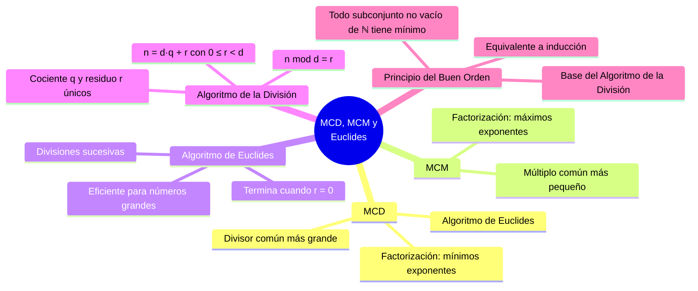

---
{"dg-publish":true,"permalink":"/universidad/3er-semestre/matematicas-discretas/unidad-3-numeros-y-conteo/02-mcd-mcm-y-algoritmo-de-euclides/","dg-note-properties":{}}
---


# 📐 MCD, MCM y Algoritmo de Euclides

## 🎯 Introducción

> [!info]- 💡 ¿Por qué son importantes el MCD y el MCM?
> 
> El **máximo común divisor** y el **mínimo común múltiplo** son herramientas fundamentales de la teoría de números con aplicaciones en simplificación de fracciones, sincronización de ciclos, criptografía y algoritmos computacionales.
> 
> - El **MCD** responde: ¿cuál es el número más grande que divide exactamente a dos enteros?
> - El **MCM** responde: ¿cuál es el número más pequeño que es múltiplo de ambos a la vez?
> - El **Algoritmo de Euclides** permite calcular el MCD eficientemente sin necesidad de factorizar.
> 
> **Analogía del mundo real:**
> 
> Imagina dos engranajes con $30$ y $105$ dientes. El MCD es el tamaño del engranaje auxiliar más grande que encaja perfectamente en ambos. El MCM es el número mínimo de dientes que deben girar para que ambos engranajes vuelvan simultáneamente a su posición inicial.
> 
> ```mermaid
> graph TD
>     A[Dos enteros m y n] --> B[MCD]
>     A --> C[MCM]
>     B --> D[Divisor común<br/>más grande]
>     C --> E[Múltiplo común<br/>más pequeño]
>     B --> F[Método 1:<br/>Factorización prima<br/>mínimos exponentes]
>     B --> G[Método 2:<br/>Algoritmo de Euclides<br/>divisiones sucesivas]
>     C --> H[Factorización prima<br/>máximos exponentes]
>     C --> I[Relación con MCD:<br/>mcd · mcm = m · n]
> 
>     style B fill:#e1f5ff
>     style C fill:#e1ffe1
>     style F fill:#e1f5ff
>     style G fill:#fff4e1
>     style H fill:#e1ffe1
>     style I fill:#f5e1ff
> ```
> 
> | Concepto | Fórmula clave |
> |---|---|
> | **MCD via factorización** | $\text{mcd}(m,n) = \prod p_i^{\min\{a_i,b_i\}}$ |
> | **MCM via factorización** | $\text{mcm}(m,n) = \prod p_i^{\max\{a_i,b_i\}}$ |
> | **Relación MCD–MCM** | $\text{mcd}(m,n) \cdot \text{mcm}(m,n) = m \cdot n$ |
> | **Algoritmo de Euclides** | $\text{mcd}(a,b) = \text{mcd}(b,\ a \bmod b)$ |

---

## 🔵 Máximo Común Divisor (MCD)

> [!note]- 🔵 Definición y cálculo por factorización
> 
> **Definición.** Sean $m$ y $n$ enteros diferentes de cero. Un **divisor común** de $m$ y $n$ es un entero que divide tanto a $m$ como a $n$. El **máximo común divisor**, denotado $\text{mcd}(m, n)$, es el divisor común más grande.
> 
> ---
> 
> ### 📌 Ejemplo por inspección
> 
> > Divisores positivos de $30$: $1,2,3,5,6,10,15,30$
> > Divisores positivos de $105$: $1,3,5,7,15,21,35,105$
> > Divisores comunes: $1,3,5,15$
> > $$\text{mcd}(30,105) = 15$$
> 
> ---
> 
> ### 📐 Teorema — MCD via factorización prima
> 
> Sean $m, n > 1$ con factorizaciones primas $m = p_1^{a_1} \cdots p_k^{a_k}$ y $n = p_1^{b_1} \cdots p_k^{b_k}$ (donde $a_i = 0$ si $p_i \nmid m$ y $b_i = 0$ si $p_i \nmid n$). Entonces:
> 
> $$\boxed{\text{mcd}(m, n) = p_1^{\min\{a_1,b_1\}} \cdot p_2^{\min\{a_2,b_2\}} \cdots p_k^{\min\{a_k,b_k\}}}$$
> 
> ---
> 
> ### 🧮 Ejemplo resuelto
> 
> **Encontrar $\text{mcd}(82320,\ 950796)$:**
> 
> > $$82320 = 2^4 \cdot 3^1 \cdot 5^1 \cdot 7^3 \cdot 11^0$$
> > $$950796 = 2^2 \cdot 3^2 \cdot 5^0 \cdot 7^4 \cdot 11^1$$
> > 
> > | primo $p_i$ | exp. en $m\ (a_i)$ | exp. en $n\ (b_i)$ | $\min\{a_i,b_i\}$ |
> > |---|---|---|---|
> > | $2$ | $4$ | $2$ | $2$ |
> > | $3$ | $1$ | $2$ | $1$ |
> > | $5$ | $1$ | $0$ | $0$ |
> > | $7$ | $3$ | $4$ | $3$ |
> > | $11$ | $0$ | $1$ | $0$ |
> > 
> > $$\text{mcd}(82320,\ 950796) = 2^2 \cdot 3^1 \cdot 7^3 = 4 \cdot 3 \cdot 343 = 4116$$

---

## 🟢 Mínimo Común Múltiplo (MCM)

> [!tip]- 🟢 Definición y cálculo por factorización
> 
> **Definición.** Sean $m$ y $n$ enteros positivos. Un **múltiplo común** de $m$ y $n$ es un entero divisible tanto por $m$ como por $n$. El **mínimo común múltiplo**, denotado $\text{mcm}(m, n)$, es el múltiplo común positivo más pequeño.
> 
> ---
> 
> ### 📌 Ejemplo por inspección
> 
> > Múltiplos de $30$: $30, 60, 90, 120, 150, 180, 210, 240, \ldots$
> > Múltiplos de $105$: $105, 210, 315, \ldots$
> > $$\text{mcm}(30,105) = 210$$
> 
> ---
> 
> ### 📐 Teorema — MCM via factorización prima
> 
> Con la misma notación que para el MCD:
> 
> $$\boxed{\text{mcm}(m, n) = p_1^{\max\{a_1,b_1\}} \cdot p_2^{\max\{a_2,b_2\}} \cdots p_k^{\max\{a_k,b_k\}}}$$
> 
> ---
> 
> ### 🧮 Ejemplo resuelto
> 
> **Encontrar $\text{mcm}(30,\ 105)$:**
> 
> > $$30 = 2^1 \cdot 3^1 \cdot 5^1 \cdot 7^0 \qquad 105 = 2^0 \cdot 3^1 \cdot 5^1 \cdot 7^1$$
> > 
> > | primo $p_i$ | exp. en $30$ | exp. en $105$ | $\max$ |
> > |---|---|---|---|
> > | $2$ | $1$ | $0$ | $1$ |
> > | $3$ | $1$ | $1$ | $1$ |
> > | $5$ | $1$ | $1$ | $1$ |
> > | $7$ | $0$ | $1$ | $1$ |
> > 
> > $$\text{mcm}(30,105) = 2^1 \cdot 3^1 \cdot 5^1 \cdot 7^1 = 210$$

---

## 🟡 Relación entre MCD y MCM

> [!important]- 🟡 Teorema — Producto MCD · MCM
> 
> **Teorema.** Para cualquier par de enteros positivos $m, n$:
> 
> $$\boxed{\text{mcd}(m, n) \cdot \text{mcm}(m, n) = m \cdot n}$$
> 
> Esta relación permite obtener uno conociendo el otro sin necesidad de factorizar dos veces.
> 
> ---
> 
> ### 📌 Verificación
> 
> > $\text{mcd}(30,105) = 15$ y $\text{mcm}(30,105) = 210$
> > $$15 \cdot 210 = 3150 = 30 \cdot 105 \checkmark$$
> 
> ---
> 
> ### 🧮 Ejemplo resuelto — mcd(54, 36) y mcm(54, 36)
> 
> **Por factorización:**
> 
> > $$54 = 2^1 \cdot 3^3 \qquad 36 = 2^2 \cdot 3^2$$
> > $$\text{mcd}(54,36) = 2^{\min\{1,2\}} \cdot 3^{\min\{3,2\}} = 2^1 \cdot 3^2 = 18$$
> 
> **Por la relación:**
> 
> > $$\text{mcm}(54,36) = \frac{54 \cdot 36}{\text{mcd}(54,36)} = \frac{1944}{18} = 108$$
> > 
> > ✅ Verificación: $18 \cdot 108 = 1944 = 54 \cdot 36$ ✓

---

## 🏛️ Algoritmo de la División

> [!abstract]- 🏛️ Principio del Buen Orden y Teorema del Cociente-Residuo
> 
> ### Principio del Buen Orden
> 
> **Teorema.** Todo conjunto no vacío de enteros no negativos tiene un elemento mínimo.
> 
> Este axioma es equivalente a los principios de inducción y es la base teórica del Algoritmo de la División.
> 
> ---
> 
> ### Teorema del Cociente-Residuo
> 
> **Teorema.** Si $d$ y $n$ son enteros con $d > 0$, entonces existen enteros únicos $q$ (cociente) y $r$ (residuo) que satisfacen:
> 
> $$\boxed{n = d \cdot q + r, \quad 0 \leq r < d}$$
> 
> **Demostración de unicidad:**
> 
> > Si $n = dq_1 + r_1 = dq_2 + r_2$ con $0 \leq r_1, r_2 < d$, entonces:
> > $$d(q_1 - q_2) = r_2 - r_1$$
> > Como $-d < r_2 - r_1 < d$, se tiene $-1 < q_1 - q_2 < 1$, luego $q_1 = q_2$ y $r_1 = r_2$. $\blacksquare$
> 
> ---
> 
> ### Definición: operador mod
> 
> **Definición.** Sean $n, d$ enteros con $d > 0$. La expresión $n \bmod d$ asigna al par $(n, d)$ el residuo $r$ único del teorema anterior.
> 
> > Si $d \mid n$, entonces $n \bmod d = 0$
> 
> | Expresión | Cálculo | Resultado |
> |---|---|---|
> | $14 \bmod 3$ | $14 = 3 \cdot 4 + 2$ | $2$ |
> | $29 \bmod 5$ | $29 = 5 \cdot 5 + 4$ | $4$ |
> | $-19 \bmod 4$ | $-19 = 4 \cdot (-5) + 1$ | $1$ |
> | $28 \bmod 7$ | $28 = 7 \cdot 4 + 0$ | $0$ |

---

## ⚙️ Algoritmo de Euclides

> [!tip]- ⚙️ Cálculo eficiente del MCD por divisiones sucesivas
> 
> Dado cualquier entero $n \neq 0$: $0 = n \cdot 0$, así $n \mid 0$. Por tanto:
> $$\text{mcd}(n, 0) = n \qquad \text{mcd}(n, 1) = 1$$
> 
> **Teorema.** Sean $a, b \in \mathbb{Z}$ con $a \geq 0$ y $b > 0$. Si $r = a \bmod b$, entonces:
> $$\boxed{\text{mcd}(a, b) = \text{mcd}(b, r)}$$
> 
> ---
> 
> ### ⚙️ Procedimiento
> 
> ```mermaid
> graph TD
>     P1["1️⃣ Inicio: par (a, b)"] --> P2
>     P2["2️⃣ Calcular r = a mod b"] --> P3
>     P3{¿r = 0?}
>     P3 -->|Sí| P4["mcd = b ✅"]
>     P3 -->|No| P5["Nuevo par: (b, r)"]
>     P5 --> P2
> 
>     style P1 fill:#e1f5ff
>     style P2 fill:#e1f5ff
>     style P4 fill:#e1ffe1
>     style P5 fill:#fff4e1
> ```
> 
> ---
> 
> ### 🧮 Ejemplo resuelto — mcd(360, 156)
> 
> > | Paso | División | Residuo | Nuevo par |
> > |---|---|---|---|
> > | 1 | $360 = 156 \cdot 2 + 48$ | $r = 48$ | $\text{mcd}(156,\ 48)$ |
> > | 2 | $156 = 48 \cdot 3 + 12$ | $r = 12$ | $\text{mcd}(48,\ 12)$ |
> > | 3 | $48 = 12 \cdot 4 + 0$ | $r = 0$ | $\text{mcd}(12,\ 0) = 12$ |
> > 
> > $$\text{mcd}(360,156) = 12$$
> 
> > 💡 El Algoritmo de Euclides es mucho más eficiente que la factorización para números grandes, ya que no requiere encontrar los factores primos.

---

## 🔗 Comparación de Métodos para MCD

> [!success]- 📊 ¿Cuándo usar cada método?
> 
> | Método | Procedimiento | Ideal cuando… |
> |---|---|---|
> | **Inspección directa** | Listar divisores de ambos, tomar el mayor común | Números pequeños |
> | **Factorización prima** | Factorizar ambos, tomar mínimos exponentes | Se necesita también el MCM |
> | **Algoritmo de Euclides** | Divisiones sucesivas hasta residuo $0$ | Números grandes, solo se necesita el MCD |
> 
> ```mermaid
> graph TD
>     A[Calcular mcd o mcm] --> B{¿Números<br/>pequeños?}
>     B -->|Sí| C[Inspección directa<br/>o factorización]
>     B -->|No| D{¿Solo MCD<br/>o también MCM?}
>     D -->|Solo MCD| E[Algoritmo de Euclides<br/>más eficiente]
>     D -->|Ambos| F[Factorización prima<br/>luego mcd·mcm = m·n]
> 
>     style C fill:#e1ffe1
>     style E fill:#e1f5ff
>     style F fill:#fff4e1
> ```

---

## 🧮 Ejercicios Propuestos

> [!example]- 🧮 Ejercicios de práctica
> 
> Encuentre $\text{mcd}$ y $\text{mcm}$ para cada par:
> 
> 1. $\text{mcd}(8400,\ 6195)$ y $\text{mcm}(8400,\ 6195)$
> 2. $\text{mcd}(816,\ 1071)$ y $\text{mcm}(816,\ 1071)$
> 3. $\text{mcd}(5880,\ 2832)$ y $\text{mcm}(5880,\ 2832)$
> 4. $\text{mcd}(1176,\ 1092)$ y $\text{mcm}(1176,\ 1092)$
> 5. $\text{mcd}(4368,\ 3553)$ y $\text{mcm}(4368,\ 3553)$
> 
> > 💡 Para pares con números grandes: usar primero el Algoritmo de Euclides para el MCD y luego obtener el MCM con $\text{mcm} = \dfrac{m \cdot n}{\text{mcd}}$.

---

## 📊 Resumen Visual



---

## 📚 Referencias

> [!quote]- 📖 Fuentes consultadas
> 
> [1] E. Pineda, *Elementos de teoría de números*, clase MATG1051, ESPOL, 2025.
> 
> [2] K. H. Rosen, *Discrete Mathematics and Its Applications*, 8th ed. New York, USA: McGraw-Hill, 2019, pp. 291–320.
> 
> [3] R. Johnsonbaugh, *Discrete Mathematics*, 8th ed. Hoboken, NJ, USA: Pearson, 2018, pp. 231–255.

---

**Tags:** #MCD #MCM #euclides #algoritmo #division #modulo #factorizacion #teoria-de-numeros #MATG1051 #unidad3 #ESPOL
