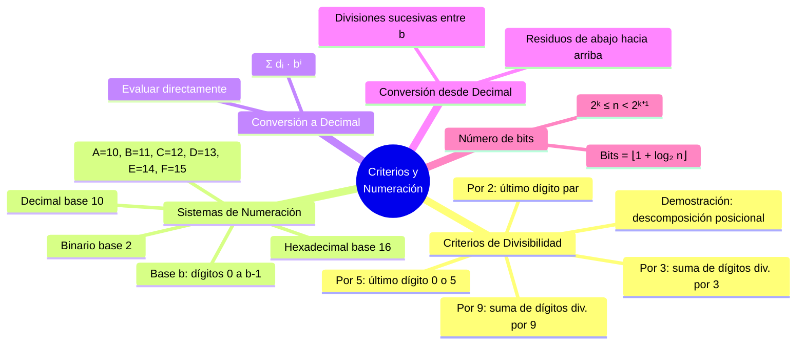

---
{"dg-publish":true,"permalink":"/universidad/3er-semestre/matematicas-discretas/unidad-3-numeros-y-conteo/03-criterios-de-divisibilidad-y-sistemas-de-numeracion/","dg-note-properties":{}}
---


# 🔣 Criterios de Divisibilidad y Sistemas de Numeración

## 🎯 Introducción

> [!info] 💡 ¿Por qué son útiles estos temas?
> 
> Los **criterios de divisibilidad** permiten determinar si un número es divisible por otro sin realizar la división completa, simplemente analizando sus dígitos. Los **sistemas de numeración** permiten representar el mismo entero en distintas bases, lo cual es fundamental en computación.
> 
> - Los **criterios de divisibilidad** son atajos prácticos basados en propiedades de las potencias de 10.
> - Los **sistemas de numeración** generalizan la idea de representar cantidades usando una base arbitraria.
> - La conexión entre ambos temas es el **Algoritmo de la División**: la conversión de base se hace mediante divisiones sucesivas, y los criterios se demuestran descomponiendo potencias de la base.
> 
> **Analogía del mundo real:**
> 
> Un criterio de divisibilidad es como mirar solo el último dígito de un precio para saber si es divisible entre 2 o 5, sin necesidad de hacer la división. Y un sistema de numeración es como cambiar de moneda: el valor es el mismo, solo cambia la forma de representarlo.
> 
> ```mermaid
> graph TD
>     A[Representación de Enteros] --> B[Criterios de<br/>Divisibilidad]
>     A --> C[Sistemas de<br/>Numeración]
> 
>     B --> D[Divisible por 3 y 9<br/>suma de dígitos]
>     B --> E[Divisible por 2 y 5<br/>último dígito]
>     C --> F[Base 2: binario<br/>dígitos 0,1]
>     C --> G[Base 10: decimal<br/>dígitos 0–9]
>     C --> H[Base 16: hexadecimal<br/>dígitos 0–9, A–F]
>     C --> I[Conversión entre bases<br/>divisiones sucesivas]
> 
>     style B fill:#e1f5ff
>     style C fill:#e1ffe1
>     style D fill:#e1f5ff
>     style E fill:#e1f5ff
>     style F fill:#e1ffe1
>     style G fill:#e1ffe1
>     style H fill:#e1ffe1
>     style I fill:#fff4e1
> ```
> 
> | Tema | Idea central |
> |---|---|
> | **Criterio del 3 y del 9** | $n$ divisible por $3$ (o $9$) $\iff$ suma de sus dígitos divisible por $3$ (o $9$) |
> | **Sistema binario** | Base $2$, dígitos $\{0,1\}$, potencias de $2$ |
> | **Sistema hexadecimal** | Base $16$, dígitos $\{0,\ldots,9,A,\ldots,F\}$, potencias de $16$ |
> | **Conversión decimal → base $b$** | Divisiones sucesivas entre $b$, los residuos forman la representación |

---

## 🔵 Criterios de Divisibilidad

> [!note] 🔵 Teorema — Criterios para 3 y 9
> 
> **Teorema.** Sea $n \in \mathbb{N}$.
> - La suma de los dígitos de $n$ es divisible para $9$ si y sólo si $n$ es divisible para $9$.
> - La suma de los dígitos de $n$ es divisible para $3$ si y sólo si $n$ es divisible para $3$.
> 
> ---
> 
> ### 📐 Demostración (caso 4 dígitos)
> 
> La prueba general es completamente análoga para cualquier número de dígitos.
> 
> **Caso divisible por 9:**
> 
> > Supongamos $n = \overline{abcd}$ y que $9 \mid a+b+c+d$, entonces existe $k \in \mathbb{Z}$ tal que $a+b+c+d = 9k$.
> > $$n = a \cdot 1000 + b \cdot 100 + c \cdot 10 + d$$
> > $$= 999a + a + 99b + b + 9c + c + d$$
> > $$= 9(111a + 11b + c) + (a+b+c+d)$$
> > $$= 9(111a + 11b + c) + 9k = 9m$$
> > donde $m = 111a + 11b + c + k \in \mathbb{Z}$. Por tanto $9 \mid n$. $\blacksquare$
> 
> **Caso divisible por 3:**
> 
> > Si $3 \mid a+b+c+d$, existe $k \in \mathbb{Z}$ tal que $a+b+c+d = 3k$. Entonces:
> > $$n = 9(111a + 11b + c) + (a+b+c+d) = 9(111a+11b+c) + 3k$$
> > $$= 3\bigl[3(111a+11b+c) + k\bigr] = 3m$$
> > donde $m \in \mathbb{Z}$. Por tanto $3 \mid n$. $\blacksquare$
> 
> ---
> 
> ### 🧮 Ejemplos resueltos
> 
> **Estudiar la divisibilidad de $279$, $3464361$ y $121134054$:**
> 
> > - $2+7+9 = 18$, y $9 \mid 18$ → $9 \mid 279$ ✅
> > - $3+4+6+4+3+6+1 = 27$, y $9 \mid 27$ → $9 \mid 3464361$ ✅
> > - $1+2+1+1+3+4+0+5+4 = 21$, y $3 \mid 21$ pero $9 \nmid 21$ → $3 \mid 121134054$ pero $9 \nmid 121134054$ ⚠️
> 
> ---
> 
> ### 📌 Resumen de criterios comunes
> 
> | Divisor | Criterio |
> |---|---|
> | $2$ | El último dígito es par ($0,2,4,6,8$) |
> | $3$ | La suma de los dígitos es divisible por $3$ |
> | $5$ | El último dígito es $0$ o $5$ |
> | $9$ | La suma de los dígitos es divisible por $9$ |
> | $10$ | El último dígito es $0$ |

---

## 🟢 Sistemas de Numeración

> [!tip] 🟢 Bases numéricas y representación posicional
> 
> En el sistema **decimal** (base $10$), cada posición representa una potencia de $10$. Por ejemplo:
> $$3854 = 3 \cdot 10^3 + 8 \cdot 10^2 + 5 \cdot 10^1 + 4 \cdot 10^0$$
> 
> Este principio se generaliza a cualquier base $b$: cada posición representa una potencia de $b$, y los dígitos permitidos van de $0$ a $b-1$.
> 
> | Sistema | Base | Dígitos permitidos |
> |---|---|---|
> | **Binario** | $2$ | $\{0,\ 1\}$ |
> | **Decimal** | $10$ | $\{0,\ 1,\ \ldots,\ 9\}$ |
> | **Hexadecimal** | $16$ | $\{0,\ldots,9,\ A,B,C,D,E,F\}$ |
> 
> > En hexadecimal, los símbolos $A$ a $F$ representan los valores decimales $10$ a $15$.
> 
> ---
> 
> ### 📐 Representación general en base $b$
> 
> Si un número tiene representación $d_k d_{k-1} \cdots d_1 d_0$ en base $b$, su valor decimal es:
> 
> $$\boxed{n = d_k \cdot b^k + d_{k-1} \cdot b^{k-1} + \cdots + d_1 \cdot b^1 + d_0 \cdot b^0}$$
> 
> Se escribe $n_b$ para indicar que $n$ está en base $b$.

---

## 🟡 Conversión entre Bases

> [!tip] 🟡 De cualquier base a decimal y de decimal a cualquier base
> 
> ### De base $b$ a decimal — evaluación directa
> 
> Se multiplica cada dígito por la potencia de $b$ correspondiente a su posición y se suman.
> 
> **Ejemplo — binario a decimal:**
> 
> > $$101101_2 = 1\cdot2^5 + 0\cdot2^4 + 1\cdot2^3 + 1\cdot2^2 + 0\cdot2^1 + 1\cdot2^0$$
> > $$= 32 + 0 + 8 + 4 + 0 + 1 = 45_{10}$$
> 
> **Ejemplo — hexadecimal a decimal:**
> 
> > $$\text{DFA}_{16} = 13 \cdot 16^2 + 15 \cdot 16^1 + 10 \cdot 16^0$$
> > $$= 13 \cdot 256 + 15 \cdot 16 + 10$$
> > $$= 3328 + 240 + 10 = 3578_{10}$$
> 
> ---
> 
> ### De decimal a base $b$ — divisiones sucesivas
> 
> Se divide repetidamente el número entre $b$. Los **residuos leídos de abajo hacia arriba** forman la representación en base $b$.
> 
> ```mermaid
> graph TD
>     P1["1️⃣ Dividir n entre b<br/>anotar residuo r₀"] --> P2
>     P2["2️⃣ Dividir cociente entre b<br/>anotar residuo r₁"] --> P3
>     P3{¿Cociente = 0?}
>     P3 -->|No| P4["Continuar dividiendo"]
>     P4 --> P2
>     P3 -->|Sí| P5["Leer residuos<br/>de abajo hacia arriba ✅"]
> 
>     style P1 fill:#e1f5ff
>     style P2 fill:#e1f5ff
>     style P5 fill:#e1ffe1
>     style P4 fill:#fff4e1
> ```
> 
> **Ejemplo — decimal 146 a binario:**
> 
> > | División | Cociente | Residuo |
> > |---|---|---|
> > | $146 \div 2$ | $73$ | $0$ |
> > | $73 \div 2$ | $36$ | $1$ |
> > | $36 \div 2$ | $18$ | $0$ |
> > | $18 \div 2$ | $9$ | $0$ |
> > | $9 \div 2$ | $4$ | $1$ |
> > | $4 \div 2$ | $2$ | $0$ |
> > | $2 \div 2$ | $1$ | $0$ |
> > | $1 \div 2$ | $0$ | $1$ |
> > 
> > Leyendo residuos de abajo hacia arriba: $146_{10} = 10010010_2$
> > 
> > ✅ Verificación: $1\cdot2^7 + 0\cdot2^6 + 0\cdot2^5 + 1\cdot2^4 + 0\cdot2^3 + 0\cdot2^2 + 1\cdot2^1 + 0\cdot2^0 = 128+16+2 = 146$ ✓

---

## 🔢 Número de Dígitos en Binario

> [!note] 🔢 ¿Cuántos bits necesita un número?
> 
> **Teorema.** Si la representación binaria de un entero positivo $n$ es $1b_{k-1}\cdots b_1 b_0$, entonces:
> $$2^k \leq n < 2^{k+1}$$
> y el número de dígitos (bits) necesarios para representar $n$ es $\lfloor 1 + \log_2 n \rfloor$.
> 
> ---
> 
> ### 📐 Demostración
> 
> > Como el bit más significativo es $1$:
> > $$n = 1\cdot2^k + b_{k-1}\cdot2^{k-1} + \cdots + b_0\cdot2^0 \geq 2^k$$
> > Y como todos los bits son a lo sumo $1$:
> > $$n \leq 2^k + 2^{k-1} + \cdots + 2^0 = 2^{k+1}-1 < 2^{k+1}$$
> > Por tanto $2^k \leq n < 2^{k+1}$, lo que implica $k \leq \log_2 n < k+1$.
> > Sumando $1$: $k+1 \leq 1+\log_2 n < k+2$, es decir $\lfloor 1+\log_2 n\rfloor = k+1$ bits. $\blacksquare$
> 
> ---
> 
> ### 📌 Ejemplos
> 
> | $n$ | $\lfloor\log_2 n\rfloor$ | Bits necesarios | Representación |
> |---|---|---|---|
> | $7$ | $2$ | $3$ | $111_2$ |
> | $8$ | $3$ | $4$ | $1000_2$ |
> | $45$ | $5$ | $6$ | $101101_2$ |
> | $146$ | $7$ | $8$ | $10010010_2$ |

---

## 🔗 Comparación de Métodos de Conversión

> [!success] 📊 ¿Qué método usar según la situación?
> 
> | Conversión | Método | Proceso |
> |---|---|---|
> | Base $b$ → decimal | Evaluación directa | Multiplicar dígitos por potencias de $b$ y sumar |
> | Decimal → base $b$ | Divisiones sucesivas | Dividir entre $b$, leer residuos de abajo hacia arriba |
> | Binario → hexadecimal | Agrupar bits de 4 en 4 | Cada grupo de 4 bits = 1 dígito hex |
> | Hexadecimal → binario | Expandir cada dígito | Cada dígito hex = 4 bits |
> 
> ```mermaid
> graph LR
>     A[Número en base b] -->|Evaluación directa<br/>Σ dᵢ · bⁱ| B[Decimal]
>     B -->|Divisiones sucesivas<br/>residuos de abajo arriba| A
>     C[Binario] -->|Agrupar de 4 en 4| D[Hexadecimal]
>     D -->|Expandir cada dígito<br/>en 4 bits| C
> 
>     style A fill:#e1f5ff
>     style B fill:#e1ffe1
>     style C fill:#fff4e1
>     style D fill:#f5e1ff
> ```

---

## 📊 Resumen Visual



---

## 📚 Referencias

> [!quote] 📖 Fuentes consultadas
> 
> [1] E. Pineda, *Elementos de teoría de números*, clase MATG1051, ESPOL, 2025.
> 
> [2] K. H. Rosen, *Discrete Mathematics and Its Applications*, 8th ed. New York, USA: McGraw-Hill, 2019, pp. 253–260.
> 
> [3] R. Johnsonbaugh, *Discrete Mathematics*, 8th ed. Hoboken, NJ, USA: Pearson, 2018, pp. 195–200.

---

**Tags:** #divisibilidad #criterios #binario #hexadecimal #decimal #bases #numeracion #conversion #teoria-de-numeros #MATG1051 #unidad3 #ESPOL
