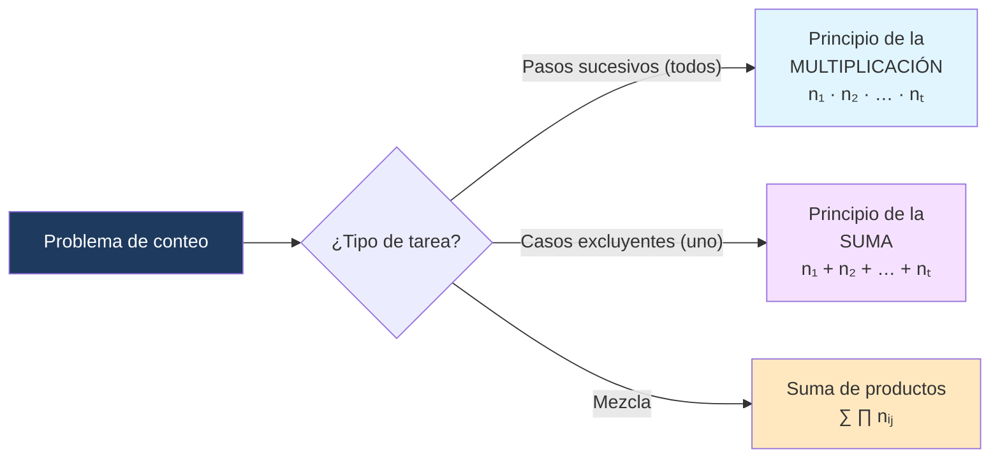

---
{"dg-publish":true,"permalink":"/universidad/3er-semestre/matematicas-discretas/unidad-3-numeros-y-conteo/04-principios-de-multiplicacion-y-suma/","dg-note-properties":{}}
---


# ✖️ Principios de Multiplicación y Suma

## 🎯 Introducción

> [!info] 💡 ¿Qué son los métodos de conteo?
> 
> Los **métodos de conteo** permiten determinar cuántos elementos tiene un conjunto o cuántas formas existen de realizar una tarea, **sin listarlos todos**. Los dos principios fundamentales son:
> 
> ```mermaid
> graph TD
>     A[Métodos de Conteo] --> B[Principio de la Multiplicación]
>     A --> C[Principio de la Suma]
>     B --> D["Tarea en pasos SUCESIVOS<br/>(se hacen todos)"]
>     C --> E["Tarea en casos EXCLUYENTES<br/>(se hace uno u otro)"]
>     D --> F["n₁ · n₂ · … · nₜ"]
>     E --> G["n₁ + n₂ + … + nₜ"]
>     style A fill:#1e3a5f,color:#fff
>     style B fill:#e1f5ff
>     style C fill:#f5e1ff
>     style F fill:#e1ffe1
>     style G fill:#ffe1e1
> ```

---

## ✖️ Principio de la Multiplicación

> [!note] 📋 Definición — Principio de la Multiplicación
> 
> Si una actividad se puede construir en $t$ **pasos sucesivos** donde el paso $i$ se puede realizar de $n_i$ maneras (independientemente de las elecciones anteriores), entonces el número total de actividades diferentes posibles es:
> 
> $$n_1 \cdot n_2 \cdots n_t$$

> [!tip] 💡 ¿Cuándo usarlo?
> 
> Cuando la tarea se realiza **en etapas** y hay que completar **todas** las etapas. La palabra clave es **"y"**: elegir A **y** luego B **y** luego C.

> [!example]- 📝 Ejemplo 1 — Cadenas sin repetición
> 
> **¿Cuántas cadenas de longitud 4 se pueden formar con las letras ABCDE sin repeticiones?**
> 
> Construimos la cadena en 4 pasos sucesivos:
> 
> | Posición | Opciones disponibles | Razón |
> |---|---|---|
> | 1ª letra | 5 | Cualquiera de ABCDE |
> | 2ª letra | 4 | Una ya fue usada |
> | 3ª letra | 3 | Dos ya fueron usadas |
> | 4ª letra | 2 | Tres ya fueron usadas |
> 
> Por el principio de la multiplicación:
> $$5 \cdot 4 \cdot 3 \cdot 2 = 120$$

> [!example]- 📝 Ejemplo 2 — Número de subconjuntos
> 
> **Pruebe que un conjunto $\{x_1, \ldots, x_n\}$ de $n$ elementos tiene $2^n$ subconjuntos.**
> 
> Construimos un subconjunto en $n$ pasos sucesivos: para cada $x_i$ decidimos si lo **incluimos** o **no** → 2 opciones por paso.
> 
> Por el principio de la multiplicación:
> $$\underbrace{2 \cdot 2 \cdots 2}_{n \text{ veces}} = 2^n \quad \blacksquare$$
> 
> > [!tip]- 💡 Conexión con combinatoria
> > 
> > Este resultado explica por qué $\displaystyle\sum_{k=0}^{n}\binom{n}{k} = 2^n$: cada subconjunto tiene exactamente un tamaño $k$, y los subconjuntos de tamaño $k$ son $\binom{n}{k}$.

> [!example]- 📝 Ejemplo 3 — Torres en tablero de ajedrez
> 
> **¿De cuántas maneras pueden colocarse una torre blanca y una torre negra de modo que se ataquen?**
> 
> Dos torres se atacan si están en la **misma fila** o la **misma columna**.
> 
> - Colocamos la torre blanca en cualquiera de las 64 casillas.
> - Para cada posición de la blanca, la negra debe estar en la misma fila (7 casillas restantes) o la misma columna (7 casillas restantes) → **14 opciones**.
> 
> Total: $64 \cdot 14 = \mathbf{896}$ maneras.
> 
> **¿Y para que NO se ataquen?**
> 
> Sin restricción hay $64 \cdot 63$ formas. Restamos las que sí se atacan:
> $$64 \cdot 63 - 896 = 4032 - 896 = \mathbf{3136}$$

---

## ➕ Principio de la Suma

> [!note] 📋 Definición — Principio de la Suma
> 
> Sean $X_1, X_2, \ldots, X_t$ conjuntos **disjuntos** (es decir, $X_i \cap X_j = \emptyset$ para $i \neq j$) con $|X_i| = n_i$ elementos. Entonces el número de maneras de seleccionar un elemento de $X_1$ **o** $X_2$ **o** $\cdots$ **o** $X_t$ es:
> 
> $$n_1 + n_2 + \cdots + n_t$$
> 
> De manera equivalente: $|X_1 \cup X_2 \cup \cdots \cup X_t| = n_1 + n_2 + \cdots + n_t$.

> [!tip] 💡 ¿Cuándo usarlo?
> 
> Cuando la tarea se divide en **casos mutuamente excluyentes** y basta con realizar **uno** de los casos. La palabra clave es **"o"**: elegir de A **o** de B **o** de C.

> [!example]- 📝 Ejemplo 4 — Comité con restricción de presidente
> 
> **Un comité de 6 personas (Alicia, Benjamín, Consuelo, Adolfo, Eduardo, Francisco) debe elegir presidente, secretario y tesorero. ¿De cuántas maneras si Alicia o Benjamín debe ser el presidente?**
> 
> Dividimos en dos **casos disjuntos**:
> 
> - **Caso A:** Alicia es presidente → quedan 5 personas para secretario y 4 para tesorero: $5 \cdot 4 = 20$.
> - **Caso B:** Benjamín es presidente → igualmente $5 \cdot 4 = 20$.
> 
> Como los casos son disjuntos (no puede haber dos presidentes), por el principio de la suma:
> $$20 + 20 = \mathbf{40} \text{ posibilidades}$$

> [!example]- 📝 Ejemplo 5 — Eduardo ocupa un puesto
> 
> **¿De cuántas maneras si Eduardo debe ocupar uno de los tres puestos?**
> 
> Dividimos según **qué puesto** ocupa Eduardo (tres casos disjuntos):
> 
> | Caso | Eduardo como... | Opciones para los otros 2 puestos | Total |
> |---|---|---|---|
> | A | Presidente | $5 \cdot 4$ | 20 |
> | B | Secretario | $5 \cdot 4$ | 20 |
> | C | Tesorero | $5 \cdot 4$ | 20 |
> 
> Por el principio de la suma: $20 + 20 + 20 = \mathbf{60}$ maneras.

---

## 🔗 Uso Combinado de Ambos Principios

En la práctica, la mayoría de los problemas requieren **ambos principios** juntos.

> [!tip] 💡 Estrategia general
> 
> 1. Identificar si la tarea se divide en **casos** (→ suma entre casos).
> 2. Dentro de cada caso, identificar si hay **pasos** (→ multiplicación entre pasos).
> 3. Combinar: $\text{Total} = \sum_{\text{casos}} \prod_{\text{pasos}}$

> [!example]- 📝 Ejemplo 6 — Contraseñas con restricción
> 
> **¿Cuántas contraseñas de exactamente 3 caracteres se pueden formar con letras {A,B,C} y dígitos {1,2}, si el primero debe ser letra o el último debe ser dígito?** (sin repetición)
> 
> Dividimos en dos casos disjuntos:
> 
> - **Caso A: el primero es letra** → 3 opciones para el 1º, 4 para el 2º, 3 para el 3º → $3 \cdot 4 \cdot 3 = 36$.
> - **Caso B: el último es dígito** (y el primero NO es letra, es decir es dígito) → 2 opciones para el 1º, 4 para el 2º, 1 para el 3º → $2 \cdot 4 \cdot 1 = 8$.
> 
> Total: $36 + 8 = \mathbf{44}$.

---

## 📊 Resumen Visual



| | Multiplicación | Suma |
|---|---|---|
| **Palabra clave** | "y" | "o" |
| **Estructura** | Pasos sucesivos | Casos excluyentes |
| **Operación** | $n_1 \cdot n_2 \cdots n_t$ | $n_1 + n_2 + \cdots + n_t$ |
| **Condición** | Pasos independientes | Conjuntos disjuntos |

---

## 📝 Ejercicios Propuestos

> [!question] 📋 Ejercicios
> 
> **1.** ¿Cuántas placas de auto se pueden formar con 3 letras seguidas de 3 dígitos, si no se permiten repeticiones?
> 
> **2.** ¿Cuántos números de 4 dígitos (sin cero al inicio) son pares?
> 
> **3.** Un restaurante ofrece 4 entradas, 6 platos fuertes y 3 postres. ¿De cuántas maneras se puede armar un menú de 3 tiempos?
> 
> **4.** ¿Cuántas cadenas binarias (de 0s y 1s) de longitud 5 empiezan con 1 **o** terminan con 0?

> [!success]- ✅ Respuestas
> 
> **1.** Letras: $26 \cdot 25 \cdot 24$. Dígitos: $10 \cdot 9 \cdot 8$. Total: $26 \cdot 25 \cdot 24 \cdot 10 \cdot 9 \cdot 8 = 11{,}232{,}000$.
> 
> **2.** Caso par → último dígito $\in \{0,2,4,6,8\}$. Si el último es 0: $9 \cdot 8 \cdot 7 \cdot 1 = 504$. Si el último es par ≠ 0 (4 opciones): primer dígito tiene 8 opciones (no 0 ni el último), segundo 8, tercero 7 → $8 \cdot 8 \cdot 7 \cdot 4 = 1792$. Total: $504 + 1792 = \mathbf{2296}$.
> 
> **3.** $4 \cdot 6 \cdot 3 = \mathbf{72}$ menús.
> 
> **4.** Empiezan con 1: $2^4 = 16$. Terminan con 0: $2^4 = 16$. Empiezan con 1 Y terminan con 0: $2^3 = 8$. Por inclusión-exclusión: $16 + 16 - 8 = \mathbf{24}$.

---

**Tags:** #matematicas-discretas #conteo #combinatoria #principio-multiplicacion #principio-suma #MATG1051
