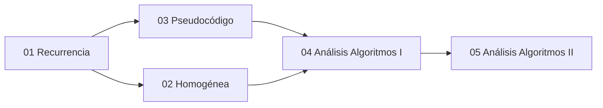

---
{"dg-publish":true,"permalink":"/universidad/3er-semestre/matematicas-discretas/unidad-4-recurrencia-y-algoritmos/00-indice-unidad-4/","tags":["MATG1051","unidad4","indice","discretas"],"dg-note-properties":{"tags":["MATG1051","unidad4","indice","discretas"]}}
---

# 🗺️ Unidad 4 — Recurrencia y Algoritmos — Índice

> [!info] ℹ️ Índice auto-actualizable con Dataview
> Esta nota lista automáticamente todas las notas de esta unidad. No necesitas editarla al agregar una nueva: aparece sola al guardarla.

## 📑 Notas de la Unidad

| Nota                                                                                                                                                                                                                               | Actualizado | Salientes | Entrantes |
| ---------------------------------------------------------------------------------------------------------------------------------------------------------------------------------------------------------------------------------- | ----------- | --------- | --------- |
| [[Universidad/3er Semestre/Matemáticas Discretas/Unidad 4 - Recurrencia y Algoritmos/01 - Relaciones de Recurrencia\|01 — Relaciones de Recurrencia]]                                                                           | 2026-08-28  | 7         | 5         |
| [[Universidad/3er Semestre/Matemáticas Discretas/Unidad 4 - Recurrencia y Algoritmos/02 - Recurrencia Homogénea\|02 — Recurrencia Homogénea]]                                                                                   | 2026-08-28  | 7         | 3         |
| [[Universidad/3er Semestre/Matemáticas Discretas/Unidad 4 - Recurrencia y Algoritmos/03 - Pseudocódigo y Algoritmos\|03 — Pseudocódigo y Algoritmos]]                                                                           | 2026-08-28  | 7         | 7         |
| [[Universidad/3er Semestre/Matemáticas Discretas/Unidad 4 - Recurrencia y Algoritmos/04 - Análisis de Algoritmos I - Fundamentos y Funciones Matemáticas\|04 — Análisis de Algoritmos I — Fundamentos y Funciones Matemáticas]] | 2026-08-28  | 7         | 7         |
| [[Universidad/3er Semestre/Matemáticas Discretas/Unidad 4 - Recurrencia y Algoritmos/05 - Análisis de Algoritmos II - Pseudocódigo y Tiempo Real\|05 — Análisis de Algoritmos II — Pseudocódigo y Tiempo Real]]                 | 2026-08-28  | 17        | 5         |

{ .block-language-dataview}

## ✅ Avance — Metas de Aprendizaje

# [[Universidad/3er Semestre/Matemáticas Discretas/Unidad 4 - Recurrencia y Algoritmos/01 - Relaciones de Recurrencia\|01 - Relaciones de Recurrencia]]

    - [ ] Defino una relación de recurrencia a partir de un problema.
    - [ ] Escribo los primeros términos dados la recurrencia y condiciones iniciales.
    - [ ] Identifico recurrencias lineales de primer y segundo orden.
    - [ ] Resuelvo recurrencias lineales con constantes por sustitución iterativa.
    - [ ] Construyo la solución homogénea y particular.
    - [ ] Aplico recurrencias a problemas de conteo (torres de Hanoi, Fibonacci).
    - [ ] Resuelvo recurrencias no lineales usando transformaciones.
    - [ ] Aplico el método generador de funciones a recurrencias complejas.
    - [ ] Analizo el comportamiento asintótico de recurrencias.
# [[Universidad/3er Semestre/Matemáticas Discretas/Unidad 4 - Recurrencia y Algoritmos/02 - Recurrencia Homogénea\|02 - Recurrencia Homogénea]]

    - [ ] Escribo la ecuación característica de una recurrencia homogénea.
    - [ ] Resuelvo recurrencias con raíces reales distintas.
    - [ ] Aplico condiciones iniciales para encontrar constantes.
    - [ ] Resuelvo recurrencias con raíces repetidas (caso especial).
    - [ ] Resuelvo recurrencias con raíces complejas.
    - [ ] Verifico la solución sustituyendo en la recurrencia original.
    - [ ] Resuelvo sistemas de recurrencias acopladas.
    - [ ] Aplico transformadas Z a recurrencias lineales.
    - [ ] Analizo estabilidad de recurrencias según las raíces características.
# [[Universidad/3er Semestre/Matemáticas Discretas/Unidad 4 - Recurrencia y Algoritmos/03 - Pseudocódigo y Algoritmos\|03 - Pseudocódigo y Algoritmos]]

    - [ ] Leo y escribo pseudocódigo para algoritmos secuenciales.
    - [ ] Identifico estructuras de control (if, while, for, repeat).
    - [ ] Trazeo la ejecución de un algoritmo paso a paso.
    - [ ] Diseño algoritmos que resuelven problemas de búsqueda y ordenamiento.
    - [ ] Identifico recursión en pseudocódigo y la expreso como recurrencia.
    - [ ] Comparo algoritmos iterativos vs recursivos para el mismo problema.
    - [ ] Diseño algoritmos divide y vencerás y expreso su recurrencia.
    - [ ] Analizo la corrección de algoritmos usando invariantes.
    - [ ] Optimizo algoritmos eliminando llamadas recursivas innecesarias.
# [[Universidad/3er Semestre/Matemáticas Discretas/Unidad 4 - Recurrencia y Algoritmos/04 - Análisis de Algoritmos I - Fundamentos y Funciones Matemáticas\|04 - Análisis de Algoritmos I - Fundamentos y Funciones Matemáticas]]

    - [ ] Defino notación O, Ω y Θ para complejidad temporal.
    - [ ] Clasifico algoritmos en O(1), O(log n), O(n), O(n log n), O(n²).
    - [ ] Cuento operaciones básicas para determinar la complejidad.
    - [ ] Aplico reglas de la O grande (suma, producto, composición).
    - [ ] Comparo funciones usando límites (regla de L'Hôpital para complejidad).
    - [ ] Analizo la complejidad de algoritmos con ciclos anidados.
    - [ ] Determino la complejidad exacta de algoritmos recursivos usando recurrencias.
    - [ ] Aplico teorema maestro para análisis de divide y vencerás.
    - [ ] Analizo complejidad espacial junto con la temporal.
# [[Universidad/3er Semestre/Matemáticas Discretas/Unidad 4 - Recurrencia y Algoritmos/05 - Análisis de Algoritmos II - Pseudocódigo y Tiempo Real\|05 - Análisis de Algoritmos II - Pseudocódigo y Tiempo Real]]

    - [ ] Analizo algoritmos de búsqueda lineal y binaria.
    - [ ] Analizo algoritmos de ordenamiento (bubble, selection, insertion).
    - [ ] Determino peor caso, mejor caso y caso promedio.
    - [ ] Analizo algoritmos de ordenamiento eficientes (merge sort, quicksort).
    - [ ] Comparo algoritmos de ordenamiento por complejidad.
    - [ ] Identifico el caso promedio y su relación con el peor caso.
    - [ ] Analizo algoritmos de grafos (BFS, DFS) y su complejidad.
    - [ ] Aplico análisis amortizado a estructuras de datos (pilas, colas).
    - [ ] Resuelvo problemas de diseño de algoritmos óptimos.

{ .block-language-dataview}

## ⚠️ Notas huérfanas (sin enlaces entrantes)

{ .block-language-dataview}

## 📊 Mapa de conexiones

> [!quote] 🔗 Conexiones
> - Previo: [[Universidad/3er Semestre/Matemáticas Discretas/Unidad 3 - Números y Conteo/06 - Teorema del Binomio y Principio del Palomar\|06 - Teorema del Binomio y Principio del Palomar]] (Unidad 3)
> - Siguiente: [[Universidad/3er Semestre/Matemáticas Discretas/Unidad 5 - Grafos y Árboles/01 - Grafos I - Conceptos Básicos y Recorridos\|01 - Grafos I - Conceptos Básicos y Recorridos]] (Unidad 5)
> - MOC general: [[Universidad/3er Semestre/Matemáticas Discretas/Matemáticas Discretas\|Matemáticas Discretas]]

---
**Tags:** #MATG1051 #unidad4 #indice #discretas
