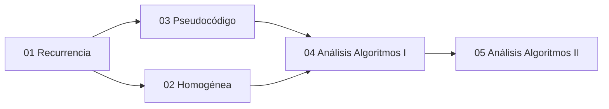

---
{"dg-publish":true,"permalink":"/universidad/3er-semestre/matematicas-discretas/unidad-4-recurrencia-y-algoritmos/00-indice-unidad-4/","tags":["MATG1051","unidad4","indice","discretas"],"dg-note-properties":{"tags":["MATG1051","unidad4","indice","discretas"]}}
---

# 🗺️ Unidad 4 — Recurrencia y Algoritmos — Índice

> [!info] ℹ️ Índice manual
> Se actualiza a mano para que funcione igual en Obsidian y en Digital Garden.

## 📑 Notas de la Unidad

- [[Universidad/3er Semestre/Matemáticas Discretas/Unidad 4 - Recurrencia y Algoritmos/01 - Relaciones de Recurrencia\|01 - Relaciones de Recurrencia]]
- [[Universidad/3er Semestre/Matemáticas Discretas/Unidad 4 - Recurrencia y Algoritmos/02 - Recurrencia Homogénea\|02 - Recurrencia Homogénea]]
- [[Universidad/3er Semestre/Matemáticas Discretas/Unidad 4 - Recurrencia y Algoritmos/03 - Pseudocódigo y Algoritmos\|03 - Pseudocódigo y Algoritmos]]
- [[Universidad/3er Semestre/Matemáticas Discretas/Unidad 4 - Recurrencia y Algoritmos/04 - Análisis de Algoritmos I - Fundamentos y Funciones Matemáticas\|04 - Análisis de Algoritmos I - Fundamentos y Funciones Matemáticas]]
- [[Universidad/3er Semestre/Matemáticas Discretas/Unidad 4 - Recurrencia y Algoritmos/05 - Análisis de Algoritmos II - Pseudocódigo y Tiempo Real\|05 - Análisis de Algoritmos II - Pseudocódigo y Tiempo Real]]
- [[Universidad/3er Semestre/Matemáticas Discretas/Unidad 4 - Recurrencia y Algoritmos/Guía de Problemas 4 - Ejercicios Resueltos\|Guía de Problemas 4 - Ejercicios Resueltos]]

## 📊 Mapa de conexiones

```mermaid
graph LR
    A[01 Recurrencia] --> B[02 Homogénea]
    C[03 Pseudocódigo] --> D[04 Análisis Algoritmos I]
    D --> E[05 Análisis Algoritmos II]
    A --> C
    B --> D
```

> [!quote] 🔗 Conexiones
> - Previo: [[Universidad/3er Semestre/Matemáticas Discretas/Unidad 3 - Números y Conteo/06 - Teorema del Binomio y Principio del Palomar\|06 - Teorema del Binomio y Principio del Palomar]] (Unidad 3)
> - Siguiente: [[Universidad/3er Semestre/Matemáticas Discretas/Unidad 5 - Grafos y Árboles/01 - Grafos I - Conceptos Básicos y Recorridos\|01 - Grafos I - Conceptos Básicos y Recorridos]] (Unidad 5)
> - MOC general: [[Universidad/3er Semestre/Matemáticas Discretas/Matemáticas Discretas\|Matemáticas Discretas]]

---
**Tags:** #MATG1051 #unidad4 #indice #discretas
