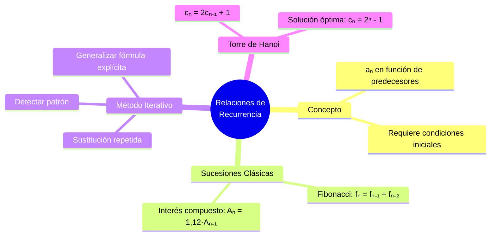

---
{"dg-publish":true,"permalink":"/universidad/3er-semestre/matematicas-discretas/unidad-4-recurrencia-y-algoritmos/01-relaciones-de-recurrencia/","dg-note-properties":{}}
---

# 🔁 Relaciones de Recurrencia

## 🎯 Introducción

> [!info] 💡 ¿Por qué son útiles las relaciones de recurrencia?
> 
> Una **relación de recurrencia** describe una sucesión definiendo cada término en función de los términos anteriores. En vez de dar una fórmula directa, se da una "receta" que construye el término $n$ a partir de sus predecesores.
> 
> - Permiten **modelar procesos que evolucionan paso a paso**: interés compuesto, poblaciones, algoritmos recursivos.
> - Son la base matemática detrás del análisis de algoritmos recursivos (ver [[Universidad/3er Semestre/Matemáticas Discretas/Unidad 4 - Recurrencia y Algoritmos/04 - Análisis de Algoritmos\|04 - Análisis de Algoritmos]]).
> - Toda relación de recurrencia necesita **condiciones iniciales** para quedar completamente determinada.
> 
> **Analogía del mundo real:**
> 
> Una relación de recurrencia es como una receta de cocina que dice "para preparar la porción $n$, toma la porción $n-1$ y agrégale un ingrediente". Sin saber cómo se ve la primera porción (condición inicial), no puedes reconstruir ninguna de las siguientes.
> 
> ```mermaid
> graph TD
>     A[Relación de Recurrencia] --> B[Concepto y<br/>Condiciones Iniciales]
>     A --> C[Modelado de<br/>Sucesiones Clásicas]
>     A --> D[Método Iterativo<br/>de Resolución]
>     A --> E[Torre de Hanoi]
> 
>     C --> F[Fibonacci<br/>fₙ = fₙ₋₁ + fₙ₋₂]
>     C --> G[Interés Compuesto<br/>Aₙ = 1,12·Aₙ₋₁]
>     D --> H[Fórmula explícita<br/>por sustitución]
>     E --> I[cₙ = 2cₙ₋₁ + 1<br/>solución: 2ⁿ - 1]
> 
>     style B fill:#e1f5ff
>     style C fill:#e1ffe1
>     style D fill:#fff4e1
>     style E fill:#f5e1ff
>     style F fill:#e1ffe1
>     style G fill:#e1ffe1
>     style H fill:#fff4e1
>     style I fill:#f5e1ff
> ```
> 
> |Tema|Idea central|
> |---|---|
> |**Definición**|$a_n$ se expresa en función de términos anteriores, más condiciones iniciales|
> |**Fibonacci**|$f_n = f_{n-1} + f_{n-2}$, con $f_0=0,\ f_1=1$|
> |**Interés compuesto**|$A_n = (1{,}12)A_{n-1}$|
> |**Método iterativo**|Sustituir repetidamente hasta detectar el patrón y generalizar|
> |**Torre de Hanoi**|$c_n = 2c_{n-1}+1 \implies c_n = 2^n - 1$|

---

## 🔵 Concepto y Condiciones Iniciales

> [!note] 🔵 Definición — Ecuación de recurrencia
> 
> Una **ecuación de recurrencia** para una sucesión ${a_n}$ es una fórmula que expresa $a_n$ en términos de uno o más de sus antecesores $a_{n-1}, a_{n-2}, \dots$
> 
> $$a_n = f(a_{n-1}, a_{n-2}, \dots, a_{n-k})$$
> 
> Para que la sucesión quede **completamente determinada**, se necesitan las **condiciones iniciales**: valores explícitos para los primeros $k$ términos (ej. $a_0$, $a_1$, …).
> 
> ---
> 
> ### 📌 Por qué no basta la recurrencia sola
> 
> > La ecuación $a_n = a_{n-1} + 2$ describe infinitas sucesiones distintas dependiendo de $a_0$: si $a_0 = 0$ se obtiene $0,2,4,6,\dots$; si $a_0=1$ se obtiene $1,3,5,7,\dots$ Sin condición inicial, la recurrencia solo describe el _patrón de crecimiento_, no la sucesión exacta.

---

## 🟢 Modelado de Sucesiones Clásicas

> [!tip] 🟢 Construcción de relaciones de recurrencia a partir de un problema
> 
> ### Sucesión de Fibonacci
> 
> Cada término es la suma de los dos anteriores:
> 
> $$f_n = f_{n-1} + f_{n-2}, \qquad f_0 = 0,\ f_1 = 1$$
> 
> |$n$|0|1|2|3|4|5|6|
> |---|---|---|---|---|---|---|---|
> |$f_n$|0|1|1|2|3|5|8|
> 
> ---
> 
> ### Interés compuesto
> 
> Si un capital $A_{n-1}$ gana un 12% de interés cada periodo, el nuevo monto es:
> 
> $$A_n = (1{,}12)\cdot A_{n-1}$$
> 
> > El factor $1{,}12$ combina el capital original ($1$) más el interés ganado ($0{,}12$). Este tipo de recurrencia es la base de los modelos de crecimiento exponencial.

---

## 🟡 El Método Iterativo de Resolución

> [!tip] 🟡 De la recurrencia a la fórmula explícita
> 
> El **método iterativo** consiste en sustituir repetidamente la relación en sí misma hasta detectar un patrón generalizable.
> 
> ```mermaid
> graph TD
>     P1["1️⃣ Escribir aₙ en función<br/>de aₙ₋₁"] --> P2
>     P2["2️⃣ Sustituir aₙ₋₁ por su<br/>propia expresión"] --> P3
>     P3["3️⃣ Repetir la sustitución<br/>varias veces"] --> P4
>     P4{"¿Se reconoce<br/>el patrón?"}
>     P4 -->|No| P3
>     P4 -->|Sí| P5["4️⃣ Generalizar en<br/>función de n ✅"]
> 
>     style P1 fill:#e1f5ff
>     style P2 fill:#e1f5ff
>     style P3 fill:#fff4e1
>     style P5 fill:#e1ffe1
> ```
> 
> ### 🧮 Ejemplo resuelto — interés compuesto
> 
> > $$A_n = (1{,}12)A_{n-1} = (1{,}12)^2 A_{n-2} = (1{,}12)^3 A_{n-3} = \cdots$$
> > 
> > Tras $n$ sustituciones se llega a $A_{n-n} = A_0$, por lo que:
> > 
> > $$\boxed{A_n = (1{,}12)^n A_0}$$

---

## 🔴 El Problema de la Torre de Hanoi

> [!note] 🔴 Planteamiento y solución óptima
> 
> **Planteamiento.** Para mover $n$ discos de una varilla a otra (sin apilar un disco grande sobre uno pequeño), se necesita:
> 
> 1. Mover los $n-1$ discos superiores a la varilla auxiliar ($c_{n-1}$ movimientos).
> 2. Mover el disco más grande a la varilla destino ($1$ movimiento).
> 3. Mover los $n-1$ discos de la varilla auxiliar a la varilla destino ($c_{n-1}$ movimientos).
> 
> $$c_n = 2c_{n-1} + 1, \qquad c_0 = 0$$
> 
> ---
> 
> ### 📐 Resolución por método iterativo
> 
> > $$c_n = 2c_{n-1}+1 = 2(2c_{n-2}+1)+1 = 4c_{n-2}+3 = 4(2c_{n-3}+1)+3 = 8c_{n-3}+7$$
> > 
> > Tras $k$ sustituciones: $c_n = 2^k c_{n-k} + (2^k - 1)$.
> > 
> > Con $k = n$ y $c_0 = 0$:
> > 
> > $$\boxed{c_n = 2^n - 1}$$
> 
> ### 🧮 Verificación
> 
> |$n$ (discos)|$c_n$ (movimientos)|
> |---|---|
> |1|1|
> |2|3|
> |3|7|
> |4|15|
> |10|1023|

---

## 📊 Resumen Visual



---

## 📚 Referencias

> [!quote] 📖 Fuentes consultadas
> 
> [1] E. Pineda, _Relaciones de recurrencia_, clase MATG1051, ESPOL, 2026.
> 
> [2] K. H. Rosen, _Discrete Mathematics and Its Applications_, 8th ed. New York, USA: McGraw-Hill, 2019, pp. 501–510.
> 
> [3] R. Johnsonbaugh, _Discrete Mathematics_, 8th ed. Hoboken, NJ, USA: Pearson, 2018, pp. 380–388.

---

**Tags:** #recurrencia #relacionesderecurrencia #fibonacci #interescompuesto #torredehanoi #metodoiterativo #MATG1051 #unidad4 #ESPOL