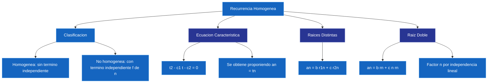

---
{"dg-publish":true,"permalink":"/universidad/3er-semestre/matematicas-discretas/unidad-4-recurrencia-y-algoritmos/02-recurrencia-homogenea/","dg-note-properties":{}}
---

# 🧩 Recurrencia Homogénea

## 🎯 Introducción

> [!info] 💡 ¿Por qué necesitamos un método formal de resolución?
> 
> El **método iterativo** visto en [[Universidad/3er Semestre/Matemáticas Discretas/Unidad 4 - Recurrencia y Algoritmos/01 - Relaciones de Recurrencia\|01 - Relaciones de Recurrencia]] funciona bien para casos sencillos, pero no siempre es práctico. Para las **relaciones lineales homogéneas de orden 2 con coeficientes constantes**, existe un método sistemático basado en resolver una simple ecuación cuadrática: la **ecuación característica**.
> 
> - **Homogénea**: no tiene términos independientes adicionales, solo combinaciones de términos anteriores.
> - La **ecuación característica** convierte el problema de resolver una recurrencia en resolver un polinomio.
> - El tipo de raíces (distintas o repetidas) determina la **forma de la solución general**.
> 
> **Analogía del mundo real:**
> 
> Resolver una recurrencia con la ecuación característica es como usar una llave maestra: en vez de ir probando manualmente término por término (método iterativo), planteas una ecuación cuadrática, la resuelves una sola vez, y esa solución abre la fórmula para _cualquier_ $n$.
> 
> ```mermaid
> graph TD
>     A[Recurrencia lineal<br/>de orden 2] --> B{¿Homogénea?}
>     B -->|Sí| C[Ecuación característica<br/>t² - c₁t - c₂ = 0]
>     B -->|No| D[Términos independientes<br/>fuera de este alcance]
>     C --> E{Tipo de raíces}
>     E -->|Distintas r₁ ≠ r₂| F[aₙ = b·r₁ⁿ + c·r₂ⁿ]
>     E -->|Raíz doble r| G[aₙ = b·rⁿ + c·n·rⁿ]
> 
>     style C fill:#e1f5ff
>     style F fill:#e1ffe1
>     style G fill:#fff4e1
> 
    style C fill:#1565C0,color:#FFFFFF,stroke:#90CAF9,stroke-width:1px
    style E fill:#1565C0,color:#FFFFFF,stroke:#90CAF9,stroke-width:1px```
> 
> |Tema|Idea central|
> |---|---|
> |**Homogénea vs no homogénea**|Homogénea: sin término independiente $f(n)$|
> |**Ecuación característica**|$t^2 - c_1 t - c_2 = 0$, asociada a $a_n = c_1 a_{n-1} + c_2 a_{n-2}$|
> |**Raíces distintas**|$a_n = b\cdot r_1^n + c\cdot r_2^n$|
> |**Raíz doble**|$a_n = b\cdot r^n + c\cdot n\cdot r^n$|

---

## 🔵 Clasificación de Relaciones

> [!note] 🔵 Homogénea vs. No Homogénea
> 
> Una [[Universidad/3er Semestre/Matemáticas Discretas/Unidad 2 - Funciones y Relaciones/02 - Relaciones\|relación]] lineal de orden $k$ con coeficientes constantes tiene la forma:
> 
> - **Homogénea**: $$a_n = c_1 a_{n-1} + c_2 a_{n-2} + \cdots + c_k a_{n-k}$$
>     
> - **No homogénea** (incluye un término independiente $f(n)$ que no depende de la [[Universidad/3er Semestre/Matemáticas Discretas/Unidad 2 - Funciones y Relaciones/04 - Sucesiones y Cadenas\|sucesión]]): $$a_n = c_1 a_{n-1} + c_2 a_{n-2} + \cdots + c_k a_{n-k} + f(n)$$
>     
> 
> > [!example]- Ejemplo de cada tipo
> > 
> > - Homogénea: $a_n = 5a_{n-1} - 6a_{n-2}$
> > - No homogénea: $a_n = 5a_{n-1} - 6a_{n-2} + 3^n$ (el término $3^n$ no depende de $a_{n-1}$ ni $a_{n-2}$)

---

## 🟢 La Ecuación Característica

> [!tip] 🟢 De la recurrencia a un polinomio
> 
> Para una recurrencia lineal homogénea de **orden 2**:
> 
> $$a_n = c_1 a_{n-1} + c_2 a_{n-2}$$
> 
> se propone una solución de la forma $a_n = t^n$ (con $t \neq 0$) y se sustituye:
> 
> $$t^n = c_1 t^{n-1} + c_2 t^{n-2}$$
> 
> Dividiendo entre $t^{n-2}$ se obtiene la **ecuación característica**:
> 
> $$\boxed{t^2 - c_1 t - c_2 = 0}$$
> 
> > [!warning] 📌 Por qué funciona
> > 
> > Si $t^n$ es solución de la recurrencia, cualquier [[Universidad/3er Semestre/Matemáticas Discretas/Unidad 3 - Números y Conteo/05 - Permutaciones y Combinaciones\|combinación]] lineal $b\cdot r_1^n + c\cdot r_2^n$ de dos soluciones también lo es (la recurrencia es lineal). Por eso las raíces de la ecuación característica generan toda la familia de soluciones.

---

## 🟡 Resolución con Raíces Reales Distintas

> [!tip] 🟡 Teorema — Caso $r_1 \neq r_2$
> 
> Si la ecuación característica $t^2 - c_1 t - c_2 = 0$ tiene dos raíces reales **distintas** $r_1$ y $r_2$, la solución general es:
> 
> $$\boxed{a_n = b\cdot r_1^n + c\cdot r_2^n}$$
> 
> donde $b$ y $c$ se determinan a partir de las condiciones iniciales.
> 
> ---
> 
> ### 🧮 Ejemplo resuelto
> 
> > Resolver $a_n = a_{n-1} + 2a_{n-2}$, con $a_0 = 2,\ a_1 = 7$.
> > 
> > **Ecuación característica:** $t^2 - t - 2 = 0 \implies (t-2)(t+1) = 0 \implies r_1 = 2,\ r_2 = -1$
> > 
> > **Solución general:** $a_n = b\cdot 2^n + c\cdot(-1)^n$
> > 
> > **Aplicando condiciones iniciales:** $$a_0 = b + c = 2$$ $$a_1 = 2b - c = 7$$
> > 
> > Sumando ambas ecuaciones: $3b = 9 \implies b = 3,\ c = -1$
> > 
> > $$\boxed{a_n = 3\cdot 2^n - (-1)^n}$$

---

## 🔴 Resolución con Raíces Reales Iguales

> [!note] 🔴 Teorema — Caso de raíz doble
> 
> Si la ecuación característica tiene una **raíz doble** $r$ (es decir, $r_1 = r_2 = r$), la solución general es:
> 
> $$\boxed{a_n = b\cdot r^n + c\cdot n\cdot r^n}$$
> 
> > [!warning] 📌 ¿Por qué aparece el factor $n$?
> > 
> > Cuando la raíz se repite, $r^n$ solo aporta **una** solución independiente, pero una recurrencia de orden 2 necesita **dos** soluciones independientes para formar la solución general. Multiplicar por $n$ genera esa segunda solución independiente ($n\cdot r^n$).
> 
> ---
> 
> ### 🧮 Ejemplo resuelto
> 
> > Resolver $a_n = 6a_{n-1} - 9a_{n-2}$, con $a_0 = 1,\ a_1 = 9$.
> > 
> > **Ecuación característica:** $t^2 - 6t + 9 = 0 \implies (t-3)^2 = 0 \implies r = 3$ (raíz doble)
> > 
> > **Solución general:** $a_n = b\cdot 3^n + c\cdot n\cdot 3^n$
> > 
> > **Aplicando condiciones iniciales:** $$a_0 = b = 1$$ $$a_1 = 3b + 3c = 9 \implies 3 + 3c = 9 \implies c = 2$$
> > 
> > $$\boxed{a_n = 3^n + 2n\cdot 3^n}$$

!ChatGPT Image 18 ago 2026, 20_21_32.png

---

## 📊 Resumen Visual



---

## 📚 Referencias

> [!quote] 📖 Fuentes consultadas
> 
> [1] E. Pineda, _Recurrencia homogénea y ecuación característica_, clase MATG1051, ESPOL, 2026.
> 
> [2] K. H. Rosen, _Discrete Mathematics and Its Applications_, 8th ed. New York, USA: McGraw-Hill, 2019, pp. 511–520.
> 
> [3] R. Johnsonbaugh, _Discrete Mathematics_, 8th ed. Hoboken, NJ, USA: Pearson, 2018, pp. 389–397.

---


## Metas de Aprendizaje

> [!note] Nivel Básico
> - [ ] Escribo la ecuación característica de una recurrencia homogénea.
> - [ ] Resuelvo recurrencias con raíces reales distintas.
> - [ ] Aplico condiciones iniciales para encontrar constantes.

> [!note] Nivel Intermedio
> - [ ] Resuelvo recurrencias con raíces repetidas (caso especial).
> - [ ] Resuelvo recurrencias con raíces complejas.
> - [ ] Verifico la solución sustituyendo en la recurrencia original.

> [!note] Nivel Avanzado
> - [ ] Resuelvo sistemas de recurrencias acopladas.
> - [ ] Aplico transformadas Z a recurrencias lineales.
> - [ ] Analizo estabilidad de recurrencias según las raíces características.


> [!quote] 🔗 Conexiones
> - Previo: [[Universidad/3er Semestre/Matemáticas Discretas/Unidad 4 - Recurrencia y Algoritmos/01 - Relaciones de Recurrencia\|01 - Relaciones de Recurrencia]] — definición
> - Relacionado: [[Universidad/3er Semestre/Matemáticas Discretas/Unidad 4 - Recurrencia y Algoritmos/04 - Análisis de Algoritmos I - Fundamentos y Funciones Matemáticas\|04 - Análisis de Algoritmos I - Fundamentos y Funciones Matemáticas]] — complejidad
> - Aplicación: [[Universidad/3er Semestre/Matemáticas Discretas/Unidad 4 - Recurrencia y Algoritmos/05 - Análisis de Algoritmos II - Pseudocódigo y Tiempo Real\|05 - Análisis de Algoritmos II - Pseudocódigo y Tiempo Real]]

**Tags:** #recurrencia #recurrenciahomogenea #ecuacioncaracteristica #raicesdistintas #raizdoble #MATG1051 #unidad4 #ESPOL