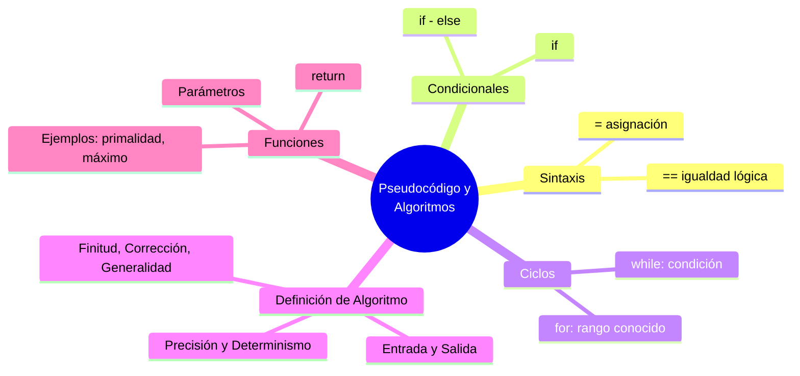

---
{"dg-publish":true,"permalink":"/universidad/3er-semestre/matematicas-discretas/unidad-4-recurrencia-y-algoritmos/03-pseudocodigo-y-algoritmos/","dg-note-properties":{}}
---

# 💻 Pseudocódigo y Algoritmos

## 🎯 Introducción

> [!info] 💡 ¿Por qué escribir en pseudocódigo?
> 
> El **pseudocódigo** es una forma de describir algoritmos usando una sintaxis simplificada, independiente de cualquier lenguaje de programación. Permite razonar sobre la lógica de un algoritmo antes de preocuparse por los detalles de implementación.
> 
> - Sirve como **puente** entre la idea matemática de un algoritmo y su implementación real en código.
> - Es la base para poder **analizar la complejidad** de un algoritmo (ver [[Universidad/3er Semestre/Matemáticas Discretas/Unidad 4 - Recurrencia y Algoritmos/04 - Análisis de Algoritmos\|04 - Análisis de Algoritmos]]).
> - Un buen algoritmo debe cumplir ciertas propiedades formales, sin importar en qué lenguaje se termine escribiendo.
> 
> **Analogía del mundo real:**
> 
> El pseudocódigo es como los planos de una casa: no es la casa terminada (el código real), pero captura toda la estructura y lógica necesaria para construirla en cualquier lenguaje.
> 
> ```mermaid
> graph TD
>     A[Pseudocódigo y<br/>Algoritmos] --> B[Sintaxis Básica<br/>y Asignación]
>     A --> C[Estructuras<br/>Condicionales]
>     A --> D[Estructuras<br/>Cíclicas]
>     A --> E[Definición Formal<br/>de Algoritmo]
>     A --> F[Funciones y<br/>Ejemplos]
> 
>     B --> G["= asignación<br/>== igualdad"]
>     C --> H["if / if-else"]
>     D --> I["while / for"]
>     E --> J[7 características<br/>fundamentales]
> 
>     style B fill:#e1f5ff
>     style C fill:#e1ffe1
>     style D fill:#fff4e1
>     style E fill:#f5e1ff
>     style F fill:#ffe1e8
> ```
> 
> |Tema|Idea central|
> |---|---|
> |**Asignación vs igualdad**|<code>=</code> asigna, <code>==</code> compara|
> |**Condicionales**|`if`, `if-else`|
> |**Ciclos**|`while` (condición), `for` (rango conocido)|
> |**Algoritmo**|Debe cumplir 7 características: entrada, salida, precisión, determinismo, finitud, corrección, generalidad|
> |**Funciones**|Reciben parámetros y devuelven resultado con `return`|

---

## 🔵 Sintaxis Básica y Asignación

> [!note] 🔵 Asignación (<code>=</code>) vs. Igualdad Lógica (<code>==</code>)
> 
> - **<code>=</code>** (asignación): guarda un valor en una variable. `x = 5` significa "x ahora vale 5".
>     
> - **<code>==</code>** (igualdad lógica): compara dos valores y devuelve verdadero o falso, sin modificar nada. `x == 5` pregunta "¿x vale 5?".
>     
> 
> > [!warning] 📌 Error común
> > 
> > Confundir <code>=</code> con <code>==</code> es una de las fuentes más frecuentes de errores al rastrear algoritmos a mano, especialmente dentro de condiciones (`if x = 5` no es lo mismo que `if x == 5`).

---

## 🟢 Estructuras de Control Condicionales

> [!tip] 🟢 `if` e `if - else`
> 
> ```
> if condición:
>     # bloque A (se ejecuta si condición es verdadera)
> else:
>     # bloque B (se ejecuta si condición es falsa)
> ```
> 
> ```mermaid
> graph TD
>     A[Evaluar condición] -->|Verdadera| B[Ejecutar bloque A]
>     A -->|Falsa| C[Ejecutar bloque B]
>     B --> D[Continuar]
>     C --> D
> 
>     style A fill:#e1f5ff
>     style B fill:#e1ffe1
>     style C fill:#fff4e1
> ```

---

## 🟡 Estructuras de Control Cíclicas

> [!tip] 🟡 `while` y `for`
> 
> - `while`: repite mientras la condición sea verdadera. El número de iteraciones no siempre se conoce de antemano.
> - `for`: repite un número determinado de veces, típicamente recorriendo un rango o colección.
> 
> ```
> for i = 1 hasta n:
>     # bloque
> 
> while condición:
>     # bloque
> ```
> 
> > [!example]- ¿Cuándo usar cada uno?
> > 
> > Usa `for` cuando sabes de antemano cuántas veces se repetirá algo (ej. recorrer una lista de tamaño $n$). Usa `while` cuando la repetición depende de una condición que puede cambiar de forma impredecible (ej. buscar hasta encontrar un valor).

---

## 🔴 Definición de Algoritmos

> [!note] 🔴 Las 7 características fundamentales
> 
> Un algoritmo formal debe cumplir con:
> 
> |#|Característica|Descripción|
> |---|---|---|
> |1|**Entrada**|Recibe cero o más valores|
> |2|**Salida**|Produce al menos un resultado|
> |3|**Precisión**|Cada paso está definido sin ambigüedad|
> |4|**Determinismo**|Mismos datos → mismos resultados, siempre|
> |5|**Carácter finito**|Termina tras un número finito de pasos|
> |6|**Corrección**|Resuelve correctamente el problema planteado|
> |7|**Generalidad**|Aplica a toda una clase de problemas, no a un caso aislado|

---

## 🟣 Funciones y Ejemplos Prácticos

> [!tip] 🟣 Parámetros y `return`
> 
> - **Parámetros**: valores de entrada que recibe una función para operar.
> - `return`: entrega el resultado y **termina** la ejecución de la función en ese punto.
> 
> ---
> 
> ### 🧮 Ejemplo — Prueba de primalidad
> 
> > ```
> > función esPrimo(n):
> >     si n < 2:
> >         return falso
> >     para i = 2 hasta raiz(n):
> >         si n % i == 0:
> >             return falso
> >     return verdadero
> > ```
> > 
> > **Rastreo con $n=7$:** $i$ recorre desde $2$ hasta $\sqrt{7}\approx 2{,}6$, es decir solo $i=2$. Como $7 % 2 \neq 0$, el ciclo termina sin encontrar divisor → `return verdadero`.
> 
> ### 🧮 Ejemplo — Máximo de una sucesión
> 
> > ```
> > función maximo(lista):
> >     max = lista[0]
> >     para cada x en lista:
> >         si x > max:
> >             max = x
> >     return max
> > ```
> > 
> > **Rastreo con `[3, 7, 2, 9, 4]`:** `max` inicia en $3$, luego se actualiza a $7$, se mantiene en $7$ frente a $2$, se actualiza a $9$, se mantiene frente a $4$ → `return 9`.

---

## 📊 Resumen Visual



---

## 📚 Referencias

> [!quote] 📖 Fuentes consultadas
> 
> [1] E. Pineda, _Pseudocódigo y diseño de algoritmos_, clase MATG1051, ESPOL, 2026.
> 
> [2] K. H. Rosen, _Discrete Mathematics and Its Applications_, 8th ed. New York, USA: McGraw-Hill, 2019, pp. 173–184.
> 
> [3] R. Johnsonbaugh, _Discrete Mathematics_, 8th ed. Hoboken, NJ, USA: Pearson, 2018, pp. 240–248.

---

**Tags:** #pseudocodigo #algoritmos #estructurascondicionales #estructurasciclicas #funciones #MATG1051 #unidad4 #ESPOL