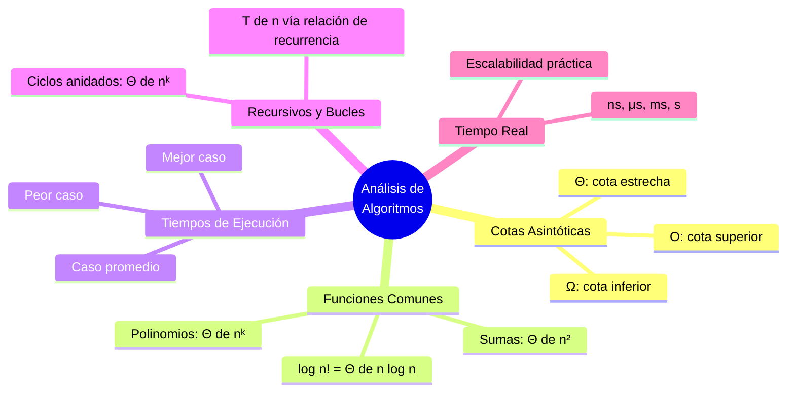
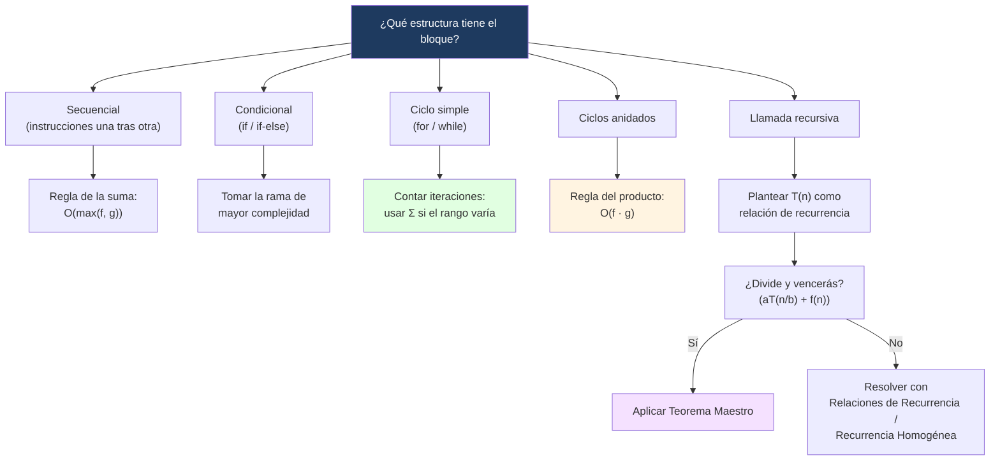

---
{"dg-publish":true,"permalink":"/universidad/3er-semestre/matematicas-discretas/unidad-4-recurrencia-y-algoritmos/04-analisis-de-algoritmos/","dg-note-properties":{}}
---

# 📈 Análisis de Algoritmos

## 🎯 Introducción

> [!info] 💡 ¿Por qué medir la eficiencia de un algoritmo?
> 
> El **análisis de algoritmos** estudia cuántos recursos (principalmente tiempo) consume un algoritmo a medida que crece el tamaño de la entrada $n$. En lugar de medir tiempo real (que depende de la máquina), se usa **notación asintótica** para describir el crecimiento de forma independiente del hardware.
> 
> - Las **cotas asintóticas** ($\mathcal{O}$, $\Omega$, $\Theta$) describen el comportamiento de un algoritmo cuando $n$ es grande.
> - Se conecta directamente con [[Universidad/3er Semestre/Matemáticas Discretas/Unidad 4 - Recurrencia y Algoritmos/03 - Pseudocódigo y Algoritmos\|03 - Pseudocódigo y Algoritmos]]: cada estructura de control (ciclos, recursión) tiene un costo que se puede analizar.
> - Los algoritmos **recursivos** se analizan planteando una relación de recurrencia para $T(n)$ y resolviéndola (ver [[Universidad/3er Semestre/Matemáticas Discretas/Unidad 4 - Recurrencia y Algoritmos/01 - Relaciones de Recurrencia\|01 - Relaciones de Recurrencia]] y [[Universidad/3er Semestre/Matemáticas Discretas/Unidad 4 - Recurrencia y Algoritmos/02 - Recurrencia Homogénea\|02 - Recurrencia Homogénea]]).
> 
> **Contexto histórico:**
> 
> La notación $\mathcal{O}$ no nació en ciencias de la computación: la introdujo el matemático **Paul Bachmann** en 1894 para teoría de números, y la popularizó **Edmund Landau** poco después — por eso también se le llama _notación de Landau_. Fue **Donald Knuth**, en _The Art of Computer Programming_ (1968), quien la adaptó al análisis formal de algoritmos, estableciendo el estándar que se usa hoy. Antes de esto, comparar algoritmos dependía de cronometrar ejecuciones en una máquina específica — poco confiable, porque el mismo algoritmo corre distinto según el hardware. La notación asintótica resolvió esto al abstraerse por completo de la máquina.
> 
> **Analogía del mundo real:**
> 
> Comparar dos algoritmos por su notación asintótica es como comparar dos corredores no por la distancia que recorrieron en una carrera específica, sino por qué tan rápido crece su tiempo de llegada a medida que la carrera se hace más y más larga.
> 
> ```mermaid
> graph TD
>     A[Análisis de<br/>Algoritmos] --> B[Cotas Asintóticas<br/>O, Ω, Θ]
>     A --> C[Funciones Comunes<br/>polinomios, sumas, logs]
>     A --> D[Mejor, Peor y<br/>Caso Promedio]
>     A --> E[Recursivos y<br/>Bucles Anidados]
>     A --> F[Tiempo Real<br/>ns, μs, ms, s]
> 
>     E --> G[Relación de recurrencia<br/>para T n]
>     G -.->|se resuelve con| H[Ecuación<br/>Característica]
> 
>     style B fill:#e1f5ff
>     style C fill:#e1ffe1
>     style D fill:#fff4e1
>     style E fill:#f5e1ff
>     style F fill:#ffe1e8
>     style H fill:#e1f5ff
> ```
> 
> |Tema|Idea central|
> |---|---|
> |**$\mathcal{O}$**|Cota superior: "no crece más rápido que"|
> |**$\Omega$**|Cota inferior: "no crece más lento que"|
> |**$\Theta$**|Cota estrecha: $\mathcal{O}$ y $\Omega$ a la vez|
> |**Polinomios**|$p(n) = \Theta(n^k)$ si $p$ tiene grado $k$|
> |**Recursión**|Se analiza con una relación de recurrencia para $T(n)$|

---

## 🔵 Cotas Asintóticas Fundamentales

> [!note] 🔵 Definiciones formales
> 
> Sea $f(n)$ el número de operaciones de un algoritmo.
> 
> - **Cota superior $\mathcal{O}$ (Big-O):** $f(n) = \mathcal{O}(g(n))$ si existen constantes $c>0$ y $n_0$ tales que $f(n) \leq c\cdot g(n)$ para todo $n \geq n_0$.
>     
> - **Cota inferior $\Omega$:** $f(n) = \Omega(g(n))$ si existen $c>0$ y $n_0$ tales que $f(n) \geq c\cdot g(n)$ para todo $n \geq n_0$.
>     
> - **Cota estrecha $\Theta$:** $f(n) = \Theta(g(n))$ si $f(n) = \mathcal{O}(g(n))$ **y** $f(n) = \Omega(g(n))$ simultáneamente.
>     
> 
> > [!tip] 📌 Intuición rápida
> > 
> > - $\mathcal{O}$ → cota máxima ("a lo sumo crece así")
> > - $\Omega$ → cota mínima ("al menos crece así")
> > - $\Theta$ → crecimiento exacto ("crece exactamente así")

---

## 🟢 Análisis Asintótico de Funciones Comunes

> [!tip] 🟢 Casos frecuentes
> 
> |Función|Comportamiento asintótico|
> |---|---|
> |Polinomio de grado $k$: $p(n)$|$p(n) = \Theta(n^k)$|
> |Suma aritmética: $\sum_{i=1}^{n} i$|$\dfrac{n(n+1)}{2} = \Theta(n^2)$|
> |Factorial logarítmico: $\log n!$|$\Theta(n\log n)$|
> 
> > [!example]- ¿Por qué $\log n! = \Theta(n\log n)$?
> >
> >Por la aproximación de Stirling, $n! \approx \sqrt{2\pi n}\left(\frac{n}{e}\right)^n$, y al aplicar logaritmo, los términos dominantes dan $\log n! \approx n\log n - n$, cuyo término dominante es $n\log n$.

---

## 📊 Órdenes de Crecimiento Comunes

> [!note] 📋 Tabla comparativa — de menor a mayor crecimiento
> 
> |Notación|Nombre|Ejemplo típico|¿Cómo se ve en código?|
> |---|---|---|---|
> |$\mathcal{O}(1)$|Constante|Acceder a `lista[i]`|Sin ciclos dependientes de $n$|
> |$\mathcal{O}(\log n)$|Logarítmica|Búsqueda binaria|Se descarta la mitad del problema en cada paso|
> |$\mathcal{O}(n)$|Lineal|Recorrer una lista una vez|Un `for` simple de tamaño $n$|
> |$\mathcal{O}(n \log n)$|Linearítmica|Mergesort, Quicksort (caso promedio)|Dividir y combinar|
> |$\mathcal{O}(n^2)$|Cuadrática|Bubble sort, dos `for` anidados|Ciclo dentro de otro ciclo, ambos de tamaño $n$|
> |$\mathcal{O}(n^3)$|Cúbica|Multiplicación de matrices (algoritmo ingenuo)|Tres `for` anidados|
> |$\mathcal{O}(2^n)$|Exponencial|Fuerza bruta sobre subconjuntos|Recursión que se ramifica en 2 por cada elemento|
> |$\mathcal{O}(n!)$|Factorial|Fuerza bruta sobre permutaciones (viajante)|Probar todas las ordenaciones posibles|
> 
> > [!warning]- ⚠️ Error común: "más rápido en la práctica" no es lo mismo que "mejor orden de crecimiento"
> > 
> > Un algoritmo $\mathcal{O}(n^2)$ puede ser **más rápido en la práctica** que uno $\mathcal{O}(n \log n)$ si $n$ es pequeño y las constantes ocultas del segundo son grandes. La notación asintótica solo garantiza superioridad cuando $n$ crece **lo suficiente** — no dice nada sobre valores pequeños de $n$.

---

## 🟡 Tiempos de Ejecución

> [!tip] 🟡 Mejor caso, peor caso y caso promedio
> 
> Al analizar un algoritmo (por ejemplo, de búsqueda), se distinguen tres escenarios:
> 
> - **Mejor caso**: la menor cantidad de operaciones posible (ej. el elemento buscado está en la primera posición).
>     
> - **Peor caso**: la mayor cantidad de operaciones posible (ej. el elemento no está en la lista, o está al final).
>     
> - **Caso promedio**: cantidad esperada de operaciones considerando todas las entradas posibles con su probabilidad.
>     
> 
> > [!example]- Búsqueda lineal en una lista de tamaño $n$
> > 
> > - Mejor caso: $\Theta(1)$ (el elemento está en la primera posición)
> > - Peor caso: $\Theta(n)$ (el elemento está al final o no existe)
> > - Caso promedio: $\Theta(n)$ (en promedio se revisa la mitad de la lista)

---

## 🔴 Algoritmos Recursivos y Bucles

> [!note] 🔴 Analizando recursión con relaciones de recurrencia
> 
> Para un algoritmo recursivo, se plantea $T(n)$ como una relación de recurrencia y se resuelve con las técnicas de [[Universidad/3er Semestre/Matemáticas Discretas/Unidad 4 - Recurrencia y Algoritmos/01 - Relaciones de Recurrencia\|01 - Relaciones de Recurrencia]] y [[Universidad/3er Semestre/Matemáticas Discretas/Unidad 4 - Recurrencia y Algoritmos/02 - Recurrencia Homogénea\|02 - Recurrencia Homogénea]].
> 
> ---
> 
> ### 🧮 Ejemplo — cálculo recursivo de $n!$
> 
> > Cada llamada hace una multiplicación (costo constante) y se reduce el problema en 1: $$T(n) = T(n-1) + \mathcal{O}(1)$$ Resolviendo por sustitución iterativa: $T(n) = T(0) + n\cdot\mathcal{O}(1) \implies T(n) = \Theta(n)$
> 
> ### 🧮 Ejemplo — caminata del robot
> 
> > Si en cada paso el robot puede dividir el problema en más de una sub-llamada, se plantea una relación de recurrencia análoga (ej. $T(n) = a\cdot T(n-1) + \mathcal{O}(1)$) y se resuelve con el mismo método, obteniendo un crecimiento que puede ser lineal o exponencial según el número de sub-llamadas $a$.
> 
> ---
> 
> ### 📌 Ciclos anidados (análisis iterativo)
> 
> |Estructura|Complejidad|
> |---|---|
> |Un `for` de $n$ iteraciones|$\Theta(n)$|
> |Dos `for` anidados, cada uno de $n$|$\Theta(n^2)$|
> |Tres `for` anidados, cada uno de $n$|$\Theta(n^3)$|

> [!note]- 🧮 ¿De dónde sale esta tabla? Regla de la suma y del producto
> 
> - **Regla de la suma** (bloques secuenciales): $\mathcal{O}(f(n)) + \mathcal{O}(g(n)) = \mathcal{O}(\max(f(n), g(n)))$. Dos `for` independientes (uno tras otro) de tamaño $n$ dan $\mathcal{O}(n)$, no $\mathcal{O}(2n)$ ni $\mathcal{O}(n^2)$.
> - **Regla del producto** (bloques anidados): $\mathcal{O}(f(n)) \cdot \mathcal{O}(g(n)) = \mathcal{O}(f(n)\cdot g(n))$. Por eso dos `for` anidados dan $\mathcal{O}(n)\cdot\mathcal{O}(n) = \mathcal{O}(n^2)$.
> 
> **Verificación exacta con notación $\Sigma$** (ver [[Universidad/3er Semestre/Matemáticas Discretas/Unidad 2 - Funciones y Relaciones/04 - Sucesiones y Cadenas\|04 - Sucesiones y Cadenas]]): cuando el ciclo interno depende del externo, el conteo real de operaciones es una sumatoria:
> 
> ```
> para i = 1 hasta n:
>     para j = 1 hasta i:
>         # 1 operación
> ```
> 
> $$\sum_{i=1}^{n} i = \frac{n(n+1)}{2} = \Theta(n^2)$$
> 
> Es decir: el análisis de ciclos y la notación de sumatoria de [[Universidad/3er Semestre/Matemáticas Discretas/Unidad 2 - Funciones y Relaciones/04 - Sucesiones y Cadenas\|04 - Sucesiones y Cadenas]] no son temas separados — la sumatoria es la herramienta de conteo detrás de todo análisis de ciclos.

> [!example]- 🟢 Ejemplo aplicado — complejidad de `esPrimo(n)`
> 
> Retomando el algoritmo de [[Universidad/3er Semestre/Matemáticas Discretas/Unidad 4 - Recurrencia y Algoritmos/03 - Pseudocódigo y Algoritmos\|03 - Pseudocódigo y Algoritmos]]:
> 
> ```
> función esPrimo(n):
>     si n < 2:
>         return falso
>     para i = 2 hasta raiz(n):
>         si n % i == 0:
>             return falso
>     return verdadero
> ```
> 
> El ciclo recorre desde $2$ hasta $\sqrt{n}$: aproximadamente $\sqrt{n}$ iteraciones de trabajo constante, así que $T(n) = \mathcal{O}(\sqrt{n})$. Para $n = 1{,}000{,}000$, eso son mil iteraciones en vez de un millón — tres órdenes de magnitud de diferencia frente a un ciclo hasta $n$.

> [!tip]- 🖥️ Atajo para recursión "divide y vencerás": Teorema Maestro
> 
> Cuando la recurrencia tiene la forma $T(n) = aT(n/b) + \mathcal{O}(n^k)$ (en vez de $T(n) = T(n-1) + \ldots$ como en los ejemplos de arriba), puedes evitar resolverla paso a paso comparando $\log_b a$ con $k$:
> 
> |Comparación|Resultado|
> |---|---|
> |$\log_b a > k$|$T(n) = \mathcal{O}(n^{\log_b a})$|
> |$\log_b a = k$|$T(n) = \mathcal{O}(n^k \log n)$|
> |$\log_b a < k$|$T(n) = \mathcal{O}(n^k)$|
> 
> **Ejemplo — Mergesort:** $T(n) = 2T(n/2) + \mathcal{O}(n)$. Aquí $a=2$, $b=2$, $k=1$, y $\log_2 2 = 1 = k$ → caso medio → $T(n) = \mathcal{O}(n \log n)$. Para recurrencias que no son de este tipo (como las de esta nota), sigue usando [[Universidad/3er Semestre/Matemáticas Discretas/Unidad 4 - Recurrencia y Algoritmos/01 - Relaciones de Recurrencia\|01 - Relaciones de Recurrencia]] y [[Universidad/3er Semestre/Matemáticas Discretas/Unidad 4 - Recurrencia y Algoritmos/02 - Recurrencia Homogénea\|02 - Recurrencia Homogénea]].

---

## 🟣 Complejidad en Tiempo Real

> [!tip] 🟣 De $T(n)$ a segundos reales
> 
> Equivalencia práctica entre el número de operaciones $T(n)$ y el tiempo real que tomaría ejecutarlas, útil para evaluar la **escalabilidad** de un algoritmo:
> 
> |$T(n)$ (orden de magnitud)|Unidad aproximada|
> |---|---|
> |Cientos|nanosegundos (ns)|
> |Miles|microsegundos ($\mu$s)|
> |Millones|milisegundos (ms)|
> |Miles de millones|segundos (s)|
> 
> > [!warning] 📌 Por qué importa en la práctica
> >
> >Un algoritmo $\Theta(n^2)$ puede parecer aceptable para $n$ pequeño, pero para $n = 10^6$ implica del orden de $10^{12}$ operaciones (segundos u horas), mientras que un algoritmo $\Theta(n\log n)$ para el mismo $n$ apenas alcanza el orden de $10^7$ operaciones (milisegundos).

---

## 📊 Resumen Visual



---

## 🗺️ Diagrama de Decisión: ¿Cómo Analizar un Bloque de Código?



---

## ⚠️ Errores y Principios Lógicos Frecuentes

> [!warning]- ⚠️ "$\mathcal{O}(n)$ significa exactamente $n$ operaciones"
> 
> Falso. $\mathcal{O}(n)$ es una **cota superior asintótica**, no un conteo exacto. Un algoritmo con $3n+7$ operaciones, uno con $n/2$, y uno con exactamente $n$ son **todos** $\mathcal{O}(n)$ — la notación oculta constantes y detalles de bajo orden a propósito.

> [!note]- 📋 Principio lógico: la cota debe verificarse formalmente, no "a ojo"
> 
> Afirmar que $f(n) = \mathcal{O}(g(n))$ exige **exhibir** constantes $c$ y $n_0$ concretas que satisfagan $f(n) \leq c\cdot g(n)$ para todo $n \geq n_0$ — igual que una demostración por inducción exige verificar la base y el paso inductivo explícitamente.
> 
> **Ejemplo:** demostrar que $3n^2 + 5n = \mathcal{O}(n^2)$. Tomamos $c=8$, $n_0=1$. Para $n\geq 1$: $5n \leq 5n^2$, entonces $3n^2+5n \leq 3n^2+5n^2 = 8n^2$. ✅

---

## 🖥️ Aplicaciones Prácticas en Programación

> [!tip]- 🖥️ Complejidad de estructuras de datos comunes
> 
> |Estructura|Acceso|Búsqueda|Inserción|Eliminación|
> |---|---|---|---|---|
> |Arreglo/Lista|$\mathcal{O}(1)$|$\mathcal{O}(n)$|$\mathcal{O}(n)$|$\mathcal{O}(n)$|
> |Lista enlazada|$\mathcal{O}(n)$|$\mathcal{O}(n)$|$\mathcal{O}(1)$*|$\mathcal{O}(1)$*|
> |Tabla hash|—|$\mathcal{O}(1)$ promedio|$\mathcal{O}(1)$ promedio|$\mathcal{O}(1)$ promedio|
> |Árbol binario balanceado|—|$\mathcal{O}(\log n)$|$\mathcal{O}(\log n)$|$\mathcal{O}(\log n)$|
> 
> * _Asumiendo que ya se tiene una referencia al nodo._

> [!tip]- 🖥️ Medir complejidad empíricamente
> 
> Si el análisis teórico es difícil, mide el tiempo de ejecución para $n$ crecientes (ej. $1000, 2000, 4000, \ldots$): si al **duplicar** $n$ el tiempo se duplica → lineal; si se **cuadruplica** → cuadrático; si se multiplica por una constante fija cada vez → exponencial. Complementa, pero no reemplaza, la demostración formal.

---

## 📝 Ejercicios Progresivos

### 🟩 Nivel 1 — Identificación básica

> [!question] 📋 Ejercicios Nivel 1
> 
> **1.** Clasifica según su orden de crecimiento: $f(n) = 7$, $g(n) = 3n + \log n$, $h(n) = n^2\log n$.
> 
> **2.** Simplifica usando las reglas de constantes y términos de menor orden: $\mathcal{O}(4n^3 + 100n^2 + 50)$.
> 
> **3.** Un `for` recorre una lista de tamaño $n$ una sola vez, sin ciclos anidados. ¿Cuál es su complejidad?

> [!success] ✅ Respuestas — Nivel 1
> 
> **1.** $f(n) = \mathcal{O}(1)$; $g(n) = \mathcal{O}(n)$ ($\log n$ es dominado por $3n$); $h(n) = \mathcal{O}(n^2\log n)$.
> 
> **2.** $\mathcal{O}(n^3)$ — se descartan la constante $4$ y los términos de menor orden.
> 
> **3.** $\mathcal{O}(n)$ — un solo recorrido lineal.

### 🟨 Nivel 2 — Análisis de bloques de código

> [!question] 📋 Ejercicios Nivel 2
> 
> **4.** Calcula la complejidad de: un doble `for` de $n\times n$ seguido (no anidado) de un `for` simple de $n$.
> 
> **5.** Usando $\Sigma$, calcula el número exacto de operaciones de:
> 
> ```
> para i = 1 hasta n:
>     para j = i hasta n:
>         # operación constante
> ```
> 
> y exprésalo en notación $\mathcal{O}$.
> 
> **6.** ¿Cuál es el peor caso de una búsqueda binaria sobre $n$ elementos ordenados? Plantea su relación de recurrencia y resuélvela con el Teorema Maestro.

> [!success] ✅ Respuestas — Nivel 2
> 
> **4.** Doble `for`: $\mathcal{O}(n^2)$ (regla del producto). `for` simple: $\mathcal{O}(n)$. Por la regla de la suma: $\mathcal{O}(n^2) + \mathcal{O}(n) = \mathcal{O}(n^2)$.
> 
> **5.** $\displaystyle\sum_{i=1}^{n}(n-i+1) = \sum_{k=1}^{n}k = \frac{n(n+1)}{2} = \mathcal{O}(n^2)$.
> 
> **6.** $T(n) = T(n/2) + \mathcal{O}(1)$. Con $a=1$, $b=2$, $k=0$: $\log_2 1 = 0 = k$ → caso medio → $T(n) = \mathcal{O}(\log n)$.

### 🟥 Nivel 3 — Demostración y comparación

> [!question] 📋 Ejercicios Nivel 3
> 
> **7.** Demuestra formalmente, exhibiendo $c$ y $n_0$, que $n^2 + 10n = \mathcal{O}(n^2)$.
> 
> **8.** Sea $T(n) = 4T(n/2) + n^2$. Aplica el Teorema Maestro y determina $T(n)$.
> 
> **9.** Explica por qué $f(n) = 100n$ y $g(n) = n^2$ **no** cumplen $f(n) = \Theta(g(n))$, aunque para $n < 100$ se tenga $f(n) > g(n)$.

> [!success] ✅ Respuestas — Nivel 3
> 
> **7.** Con $c=11$, $n_0=1$: para $n\geq 1$, $10n \leq 10n^2$, entonces $n^2+10n \leq 11n^2$. ✅
> 
> **8.** $a=4$, $b=2$, $k=2$. Como $\log_2 4 = 2 = k$: caso medio → $T(n) = \mathcal{O}(n^2\log n)$.
> 
> **9.** $\Theta$ describe el comportamiento cuando $n\to\infty$, no en valores fijos pequeños. A partir de $n_0=100$, $n^2 \geq 100n$ para todo $n$ mayor, y la brecha crece sin límite — no existe $c_1$ tal que $c_1 n^2 \leq 100n$ se cumpla para $n$ arbitrariamente grande.

---

## 🔗 Conexiones

> [!note] 📋 Temas relacionados
> 
> - [[Universidad/3er Semestre/Matemáticas Discretas/Unidad 4 - Recurrencia y Algoritmos/03 - Pseudocódigo y Algoritmos\|03 - Pseudocódigo y Algoritmos]] — la sintaxis de los algoritmos que aquí se analizan.
> - [[Universidad/3er Semestre/Matemáticas Discretas/Unidad 2 - Funciones y Relaciones/04 - Sucesiones y Cadenas\|04 - Sucesiones y Cadenas]] — la notación $\Sigma$ es la base del análisis de ciclos.
> - [[Universidad/3er Semestre/Matemáticas Discretas/Unidad 4 - Recurrencia y Algoritmos/01 - Relaciones de Recurrencia\|01 - Relaciones de Recurrencia]] — resolución de $T(n)$ para recursión general.
> - [[Universidad/3er Semestre/Matemáticas Discretas/Unidad 4 - Recurrencia y Algoritmos/02 - Recurrencia Homogénea\|02 - Recurrencia Homogénea]] — técnica específica para recurrencias lineales homogéneas.

---

## 📚 Referencias

> [!quote] 📖 Fuentes consultadas
> 
> [1] E. Pineda, _Análisis asintótico de algoritmos_, clase MATG1051, ESPOL, 2026.
> 
> [2] K. H. Rosen, _Discrete Mathematics and Its Applications_, 8th ed. New York, USA: McGraw-Hill, 2019, pp. 185–210.
> 
> [3] R. Johnsonbaugh, _Discrete Mathematics_, 8th ed. Hoboken, NJ, USA: Pearson, 2018, pp. 249–268.

---

**Tags:** #analisisdealgoritmos #notacionasintotica #bigO #complejidad #recursividad #MATG1051 #unidad4 #ESPOL