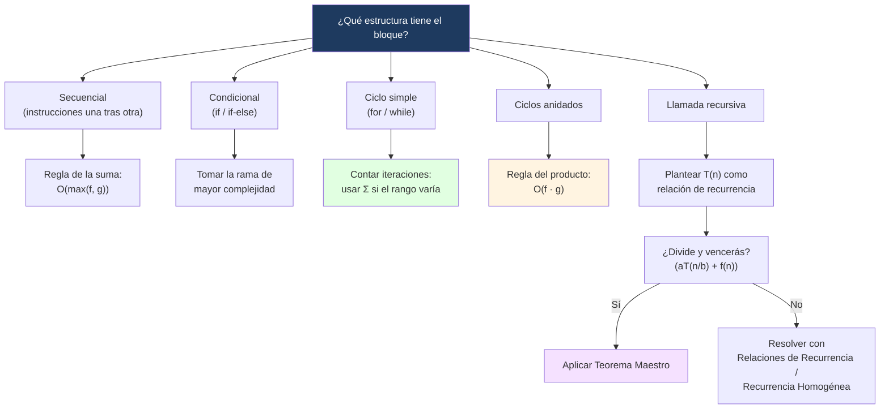
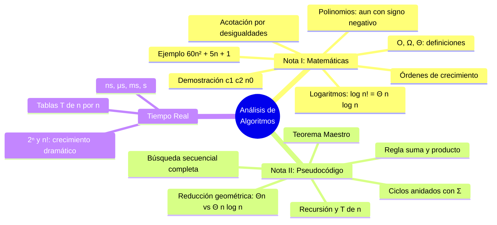

---
{"dg-publish":true,"permalink":"/universidad/3er-semestre/matematicas-discretas/unidad-4-recurrencia-y-algoritmos/05-analisis-de-algoritmos-pseudocodigo-y-tiempo-real/","dg-note-properties":{}}
---

# 📈 Análisis de Algoritmos II — Pseudocódigo y Tiempo Real

> [!success] ⬅️ Viene de la Nota I
> 
> Esta nota continúa [[Universidad/3er Semestre/Matemáticas Discretas/Unidad 4 - Recurrencia y Algoritmos/04 - Análisis de Algoritmos - Fundamentos y Funciones Matemáticas\|04 - Análisis de Algoritmos - Fundamentos y Funciones Matemáticas]], donde se cubrieron las definiciones formales de $\mathcal{O}$, $\Omega$, $\Theta$ y cómo obtenerlas a partir de una función matemática ya dada. Aquí se retoman esas mismas definiciones, pero aplicadas a **pseudocódigo**: contar operaciones en ciclos y recursión, mejor/peor/promedio caso, y su traducción a tiempo real.

## 💻 Cómo Obtener las Cotas en Pseudocódigo

> [!info] 📐 ¿Qué distingue a esta nota de la anterior?
> 
> Aquí **no** hay una fórmula $f(n)$ dada de entrada — el algoritmo (ver [[Universidad/3er Semestre/Matemáticas Discretas/Unidad 4 - Recurrencia y Algoritmos/03 - Pseudocódigo y Algoritmos\|03 - Pseudocódigo y Algoritmos]]) es el punto de partida, y el trabajo es **contar cuántas operaciones ejecuta** en función de $n$, según su estructura (secuencial, condicional, ciclos, recursión). Una vez que obtienes esa cuenta como una función, se le aplican exactamente las mismas técnicas de [[Universidad/3er Semestre/Matemáticas Discretas/Unidad 4 - Recurrencia y Algoritmos/04 - Análisis de Algoritmos - Fundamentos y Funciones Matemáticas\|04 - Análisis de Algoritmos - Fundamentos y Funciones Matemáticas]].

### 🧮 Reglas para Contar Operaciones: Suma y Producto

> [!note] 🧮 Regla de la suma y del producto
> 
> - **Regla de la suma** (bloques secuenciales): $\mathcal{O}(f(n)) + \mathcal{O}(g(n)) = \mathcal{O}(\max(f(n), g(n)))$. Dos `for` independientes (uno tras otro) de tamaño $n$ dan $\mathcal{O}(n)$, no $\mathcal{O}(2n)$ ni $\mathcal{O}(n^2)$.
> - **Regla del producto** (bloques anidados): $\mathcal{O}(f(n)) \cdot \mathcal{O}(g(n)) = \mathcal{O}(f(n)\cdot g(n))$. Por eso dos `for` anidados dan $\mathcal{O}(n)\cdot\mathcal{O}(n) = \mathcal{O}(n^2)$.
> 
> **Verificación exacta con notación $\Sigma$** (ver [[Universidad/3er Semestre/Matemáticas Discretas/Unidad 2 - Funciones y Relaciones/04 - Sucesiones y Cadenas\|04 - Sucesiones y Cadenas]]): cuando el ciclo interno depende del externo, el conteo real de operaciones es una sumatoria:
> 
> ```
> para i = 1 hasta n:
>     para j = 1 hasta i:
>         # 1 operación
> ```
> 
> $$\sum_{i=1}^{n} i = \frac{n(n+1)}{2} = \Theta(n^2)$$
> 
> Es decir: el análisis de ciclos y la notación de sumatoria de [[Universidad/3er Semestre/Matemáticas Discretas/Unidad 2 - Funciones y Relaciones/04 - Sucesiones y Cadenas\|04 - Sucesiones y Cadenas]] no son temas separados — la sumatoria es la herramienta de conteo detrás de todo análisis de ciclos, y una vez obtenida la fórmula exacta, se demuestra su $\Theta$ con la misma técnica de [[Universidad/3er Semestre/Matemáticas Discretas/Unidad 4 - Recurrencia y Algoritmos/04 - Análisis de Algoritmos - Fundamentos y Funciones Matemáticas\|04 - Análisis de Algoritmos - Fundamentos y Funciones Matemáticas]].

> [!note] 📌 Ciclos anidados (tabla de referencia rápida)
> 
> |Estructura|Complejidad|
> |---|---|
> |Un `for` de $n$ iteraciones|$\Theta(n)$|
> |Dos `for` anidados, cada uno de $n$|$\Theta(n^2)$|
> |Tres `for` anidados, cada uno de $n$|$\Theta(n^3)$|

> [!example]- 🟢 Ejemplo aplicado — complejidad de `esPrimo(n)`
> 
> Retomando el algoritmo de [[Universidad/3er Semestre/Matemáticas Discretas/Unidad 4 - Recurrencia y Algoritmos/03 - Pseudocódigo y Algoritmos\|03 - Pseudocódigo y Algoritmos]]:
> 
> ```
> función esPrimo(n):
>     si n < 2:
>         return falso
>     para i = 2 hasta raiz(n):
>         si n % i == 0:
>             return falso
>     return verdadero
> ```
> 
> El ciclo recorre desde $2$ hasta $\sqrt{n}$: aproximadamente $\sqrt{n}$ iteraciones de trabajo constante, así que $T(n) = \mathcal{O}(\sqrt{n})$. Para $n = 1{,}000{,}000$, eso son mil iteraciones en vez de un millón — tres órdenes de magnitud de diferencia frente a un ciclo hasta $n$.

### 🟡 Mejor Caso, Peor Caso y Caso Promedio

> [!note] 📋 Definiciones (como las plantea la clase)
> 
> - Si la entrada de un algoritmo es un conjunto que contiene $n$ elementos, se dice que el **tamaño de la entrada** es $n$.
> - El tiempo mínimo necesario para ejecutar el algoritmo se llama **tiempo del mejor caso** para entradas de tamaño $n$.
> - El tiempo máximo necesario se llama **tiempo del peor caso** para entradas de tamaño $n$.
> - El **tiempo del caso promedio** es el tiempo necesario promediando sobre todas las entradas posibles de tamaño $n$.

> [!example]- 🟢 Ejemplo completo — Búsqueda secuencial
> 
> **Entrada:** `clave`, `n`. **Salida:** `indice` (posición de la clave; si no se encuentra, devuelve $0$).
> 
> ```
> for i = 1 to n {
>     if (clave == s_i)
>         return i    // búsqueda exitosa
> }
> return 0    // búsqueda no exitosa
> ```
> 
> **Mejor caso:** si $s_1$ es la clave, la línea condicional se ejecuta una sola vez → $\Theta(1)$.
> 
> **Peor caso:** si la clave no está en la sucesión, la línea condicional se ejecuta $n$ veces → $\Theta(n)$.
> 
> **Caso promedio (cálculo completo):** si la clave está en la posición $i$-ésima, la línea condicional se ejecuta $i$ veces; si no está, se ejecuta $n$ veces. Promediando sobre las $n+1$ posibilidades (las $n$ posiciones más el caso "no está"):
> 
> $$f(n) = \frac{(1+2+\cdots+n)+n}{n+1}$$
> 
> _Cota superior:_ usando $1+2+\cdots+n \leq n^2$ (ya demostrado en [[Universidad/3er Semestre/Matemáticas Discretas/Unidad 4 - Recurrencia y Algoritmos/04 - Análisis de Algoritmos - Fundamentos y Funciones Matemáticas\|04 - Análisis de Algoritmos - Fundamentos y Funciones Matemáticas]]),
> 
> $$\frac{(1+2+\cdots+n)+n}{n+1} \leq \frac{n^2+n}{n+1} = \frac{n(n+1)}{n+1} = n \quad\implies\quad f(n)=\mathcal{O}(n)$$
> 
> _Cota inferior:_ usando $1+2+\cdots+n \geq \frac{n^2}{4}$ (la cota ajustada que ya demostramos en la Nota I),
> 
> $$\frac{(1+2+\cdots+n)+n}{n+1} \geq \frac{n^2/4+n}{n+1} \geq \frac{n^2/4+n/4}{n+1} = \frac{n}{4} \quad\implies\quad f(n)=\Omega(n)$$
> 
> **Conclusión:** el caso promedio es $f(n) = \Theta(n)$ — coincide en orden de crecimiento con el peor caso, aunque con una constante más chica.

> [!warning]- ⚠️ Cuidado: "peor caso" no es sinónimo automático de $\mathcal{O}$, ni "mejor caso" de $\Omega$
> 
> Es muy común (y en la práctica, útil) decir "el peor caso es $\mathcal{O}(n)$" y "el mejor caso es $\Omega(1)$" — pero técnicamente $\mathcal{O}$, $\Omega$ y $\Theta$ se pueden aplicar a **cualquier función**, incluyendo el tiempo del peor caso o del mejor caso por separado. Lo que realmente se quiere decir es: "la función que describe el **tiempo en el peor caso**, $T_{peor}(n)$, es $\Theta(n)$" — y por costumbre se resume como "$\mathcal{O}(n)$" porque, para reportar qué tan mal puede ir un algoritmo, basta con la cota superior de ese peor caso. Si $T_{peor}(n)$ y $T_{mejor}(n)$ coinciden asintóticamente (como en la búsqueda secuencial, donde promedio y peor caso son ambos $\Theta(n)$), se dice que el algoritmo es $\Theta(n)$ **en general**.
> 
> > [!tip]- 💡 Aplicación directa: si conoces $T(n)$, ya sabes el peor caso
> > 
> > Si un algoritmo toma $60n^2+5n+1$ unidades de tiempo en el peor caso, y ya demostramos arriba que $60n^2+5n+1=\Theta(n^2)$, entonces el tiempo del peor caso de ese algoritmo es directamente $\Theta(n^2)$ — no hace falta rehacer la demostración desde cero cada vez.

### 🔵 Ciclos con Reducción Geométrica — Dos Ejemplos que Parecen Iguales pero No Lo Son

> [!warning] ⚠️ La posición de la variable que se reduce cambia todo el resultado
> 
> Estos dos algoritmos lucen casi idénticos (un `while` que divide una variable entre 2, con un `for` adentro), pero dan resultados **distintos** — $\Theta(n)$ uno, $\Theta(n\log n)$ el otro. La diferencia: en el primero, el ciclo interno usa la variable que se **va reduciendo**; en el segundo, el ciclo interno siempre llega hasta $n$ **sin reducirse**.

> [!example]- 🟢 Caso 1 — El ciclo interno SÍ se reduce → $\Theta(n)$
> 
> ```
> j = n
> while (j ≥ 1) {
>     for i = 1 to j
>         x = x + 1
>     j = ⌊j/2⌋
> }
> ```
> 
> Sea $t(n)$ el número de veces que se ejecuta `x = x + 1`.
> 
> **Cota inferior:** la primera vez que se entra al `while`, la instrucción se ejecuta $n$ veces (con $j=n$). Como el resto de iteraciones solo puede sumar más, $t(n) \geq n$ para todo $n\geq1$ → $t(n) = \Omega(n)$.
> 
> **Cota superior:** el número total de ejecuciones es la suma geométrica
> 
> $$t(n) \leq n + \frac{n}{2} + \frac{n}{4} + \cdots + \frac{n}{2^{k-1}} = n\left(\frac{1-(1/2)^k}{1-1/2}\right) = 2n\left(1-\frac{1}{2^k}\right) \leq 2n$$
> 
> Por lo tanto $t(n) \leq 2n$ para todo $n\in\mathbb{N}$ → $t(n)=\mathcal{O}(n)$.
> 
> **Conclusión:** $t(n) = \Theta(n)$. Aunque el `while` se repite $\approx\log n$ veces, cada repetición hace la mitad de trabajo que la anterior — la suma geométrica converge, y el total sigue siendo lineal.

> [!example]- 🟢 Caso 2 — El ciclo interno NO se reduce → $\Theta(n\log n)$
> 
> ```
> i = n
> while (i ≥ 1) {
>     for j = 1 to n
>         x = x + 1
>     i = ⌊i/2⌋
> }
> ```
> 
> Aquí el `for` interno siempre corre de $1$ a $n$ **completo**, sin importar el valor de $i$ — solo $i$ (la condición del `while`) se reduce a la mitad cada vez.
> 
> **Demostración por inducción sobre potencias de 2:** se prueba que si $2^{k-1} \leq n < 2^k$, entonces $t(n) = kn$ (cada una de las $k$ veces que se entra al `while`, se ejecutan $n$ operaciones completas).
> 
> - _Base_ ($1\leq n<2$, o sea $k=1$): se entra una sola vez → $t(n)=n=1\cdot n$. ✅
> - _Paso inductivo_: si $2^k \leq n < 2^{k+1}$, se entra al `while` ejecutando $n$ operaciones, y luego $i=\lfloor n/2\rfloor$ cae en el rango $2^{k-1}\leq i<2^k$ — por hipótesis inductiva, desde ahí se ejecutan $kn$ operaciones más. Total: $t(n) = n+kn=(k+1)n$. ✅
> 
> **Conclusión asintótica:** de $2^{k-1}\leq n<2^k$ se deduce $k-1\leq \log n < k$, es decir $\log n < k \leq \log n+1 \leq 2\log n$ (para $n\geq2$). Sustituyendo en $t(n)=kn$:
> 
> $$n\log n < nk \leq 2n\log n, \quad \forall n\geq2 \quad\implies\quad t(n) = \Theta(n\log n)$$

> [!tip]- 🖥️ Ejercicio adicional relacionado — `for i=1 hasta n, for j=1 hasta ⌊i/2⌋`
> 
> Un tercer patrón (ciclo interno que llega hasta $\lfloor i/2\rfloor$, no hasta $i$ completo) también da $\Theta(n^2)$ — igual que el ejemplo triangular simple, porque $\lfloor i/2\rfloor$ sigue siendo una fracción constante de $i$. La demostración exacta usa los valores $t(2k)=k^2$ y $t(2k+1)=k(k+1)$ (verificables por inducción), acotados entre $\frac{(n-1)^2}{4}$ y $n^2$.

### 🔴 Recursión: Relaciones de Recurrencia y Teorema Maestro

> [!note] 🔴 Analizando recursión con relaciones de recurrencia
> 
> Para un algoritmo recursivo, se plantea $T(n)$ como una relación de recurrencia y se resuelve con las técnicas de [[Universidad/3er Semestre/Matemáticas Discretas/Unidad 4 - Recurrencia y Algoritmos/01 - Relaciones de Recurrencia\|01 - Relaciones de Recurrencia]] y [[Universidad/3er Semestre/Matemáticas Discretas/Unidad 4 - Recurrencia y Algoritmos/02 - Recurrencia Homogénea\|02 - Recurrencia Homogénea]].
> 
> ---
> 
> ### 🧮 Ejemplo — cálculo recursivo de $n!$
> 
> Por definición, $n! = n\cdot(n-1)!$ para $n\geq1$, y $0!=1$.
> 
> ```
> factorial(n) {
>     if (n == 0)
>         return 1
>     return n * factorial(n-1)
> }
> ```
> 
> **Correctitud (por inducción en $n$):**
> 
> - _Base_ ($n=0$): la línea 3 regresa $1=0!$. ✅
> - _Paso inductivo_: supongamos que `factorial(n-1) = (n-1)!` para algún $n>0$. Como $n\neq0$, se ejecuta la línea 4: `factorial(n) = n · factorial(n-1) = n·(n-1)! = n!`. ✅
> 
> Se concluye por inducción que `factorial(n) = n!` para todo $n\geq0$.
> 
> **Complejidad:** cada llamada hace una multiplicación (costo constante) y se reduce el problema en 1: $$T(n) = T(n-1) + \mathcal{O}(1)$$ Resolviendo por sustitución iterativa: $T(n) = T(0) + n\cdot\mathcal{O}(1) \implies T(n) = \Theta(n)$
> 
> ### 🧮 Ejemplo — caminata del robot y su relación con Fibonacci
> 
> Un robot puede dar pasos de 1 o 2 metros. Sea $walk(n)$ el número de formas de caminar $n$ metros: $walk(1)=1$, $walk(2)=2$. Para $n>2$, si el primer paso es de 1 metro, el resto se completa de $walk(n-1)$ formas; si es de 2 metros, de $walk(n-2)$ formas. Por el principio de la suma:
> 
> $$walk(n) = walk(n-1)+walk(n-2)$$
> 
> ```
> caminatas(n) {
>     if (n == 1 ∨ n == 2)
>         return n
>     return caminatas(n-1) + caminatas(n-2)
> }
> ```
> 
> Los primeros términos son $1,2,3,5,8,13,\ldots$ — la misma recurrencia que la sucesión de Fibonacci $f_n$ ($f_1=f_2=1$, $f_n=f_{n-1}+f_{n-2}$), desfasada en un índice: $walk(n) = f_{n+1}$ para todo $n\geq1$.
> 
> Si en cada paso el robot pudiera dividir el problema en más de dos sub-llamadas, se plantearía una recurrencia análoga (ej. $T(n) = a\cdot T(n-1) + \mathcal{O}(1)$) y se resolvería con el mismo método, obteniendo un crecimiento lineal o exponencial según el número de sub-llamadas $a$.
> 
> > [!tip]- 🖥️ ¿Por qué esta recurrencia, sin optimizar, es exponencial en tiempo?
> > 
> > Aunque $walk(n)$ crece linealmente en _valor_ (como Fibonacci), el algoritmo recursivo tal como está escrito **recalcula** los mismos sub-problemas muchas veces (ej. `caminatas(n-2)` se calcula por dos caminos distintos), lo que hace que su tiempo de ejecución sea $\Theta(\varphi^n)$ (exponencial, con $\varphi\approx1.618$), no $\Theta(n)$. Esto es un ejemplo real de por qué contar operaciones no siempre coincide con el tamaño del resultado — la técnica de _memoización_ resuelve este problema, pero es tema de otra nota.

> [!tip]- 🖥️ Atajo para recursión "divide y vencerás": Teorema Maestro
> 
> Cuando la recurrencia tiene la forma $T(n) = aT(n/b) + \mathcal{O}(n^k)$ (en vez de $T(n) = T(n-1) + \ldots$ como en los ejemplos de arriba), puedes evitar resolverla paso a paso comparando $\log_b a$ con $k$:
> 
> |Comparación|Resultado|
> |---|---|
> |$\log_b a > k$|$T(n) = \mathcal{O}(n^{\log_b a})$|
> |$\log_b a = k$|$T(n) = \mathcal{O}(n^k \log n)$|
> |$\log_b a < k$|$T(n) = \mathcal{O}(n^k)$|
> 
> **Ejemplo — Mergesort:** $T(n) = 2T(n/2) + \mathcal{O}(n)$. Aquí $a=2$, $b=2$, $k=1$, y $\log_2 2 = 1 = k$ → caso medio → $T(n) = \mathcal{O}(n \log n)$. Para recurrencias que no son de este tipo (como las de esta nota), sigue usando [[Universidad/3er Semestre/Matemáticas Discretas/Unidad 4 - Recurrencia y Algoritmos/01 - Relaciones de Recurrencia\|01 - Relaciones de Recurrencia]] y [[Universidad/3er Semestre/Matemáticas Discretas/Unidad 4 - Recurrencia y Algoritmos/02 - Recurrencia Homogénea\|02 - Recurrencia Homogénea]].

### ✏️ Ejercicios de Pseudocódigo — Notación $\mathcal{O}$, $\Omega$ y $\Theta$ desde el Código

> [!question] 📋 Analiza cada algoritmo y determina su complejidad
> 
> **1.** ¿Cuál es $\Theta(T(n))$ para el siguiente algoritmo?
> 
> ```
> función sumaLista(lista):
>     total = 0
>     para cada x en lista:
>         total = total + x
>     return total
> ```
> 
> **2.** Para el siguiente algoritmo, encuentra su cota $\mathcal{O}$ (peor caso) y su cota $\Omega$ (mejor caso) por separado:
> 
> ```
> función buscar(lista, objetivo):
>     para i = 0 hasta n-1:
>         si lista[i] == objetivo:
>             return i
>     return -1
> ```
> 
> **3.** Usando notación $\Sigma$, encuentra $\Theta(T(n))$ para:
> 
> ```
> función contarPares(n):
>     contador = 0
>     para i = 1 hasta n:
>         para j = 1 hasta i:
>             contador = contador + 1
>     return contador
> ```

> [!success]- ✅ Respuestas
> 
> **1.** El `for` recorre **siempre** los $n$ elementos de la lista sin importar su contenido — no hay mejor ni peor caso distintos, así que directamente $T(n) = \Theta(n)$.
> 
> **2.** **Peor caso** ($\mathcal{O}$): el objetivo no está en la lista o está en la última posición → se revisan los $n$ elementos → $T_{peor}(n) = \mathcal{O}(n)$. **Mejor caso** ($\Omega$): el objetivo está en `lista[0]` → una sola comparación → $T_{mejor}(n) = \Omega(1)$. Como el mejor y el peor caso **no coinciden** asintóticamente, este algoritmo **no tiene** una única $\Theta$ global (solo $\Theta(n)$ si te refieres específicamente al peor caso, o $\Theta(1)$ si te refieres específicamente al mejor caso).
> 
> **3.** Igual que el ejemplo de la Regla de la suma y el producto: $\displaystyle\sum_{i=1}^{n} i = \frac{n(n+1)}{2}$, cuyo término dominante es $n^2$, así que $T(n) = \Theta(n^2)$.

### 🗺️ Diagrama de Decisión: ¿Cómo Analizar un Bloque de Código?



### 🖥️ Aplicaciones Prácticas en Programación

> [!tip]- 🖥️ Complejidad de estructuras de datos comunes
> 
> |Estructura|Acceso|Búsqueda|Inserción|Eliminación|
> |---|---|---|---|---|
> |Arreglo/Lista|$\mathcal{O}(1)$|$\mathcal{O}(n)$|$\mathcal{O}(n)$|$\mathcal{O}(n)$|
> |Lista enlazada|$\mathcal{O}(n)$|$\mathcal{O}(n)$|$\mathcal{O}(1)$*|$\mathcal{O}(1)$*|
> |Tabla hash|—|$\mathcal{O}(1)$ promedio|$\mathcal{O}(1)$ promedio|$\mathcal{O}(1)$ promedio|
> |Árbol binario balanceado|—|$\mathcal{O}(\log n)$|$\mathcal{O}(\log n)$|$\mathcal{O}(\log n)$|
> 
> - _Asumiendo que ya se tiene una referencia al nodo._

> [!tip]- 🖥️ Medir complejidad empíricamente
> 
> Si el análisis teórico es difícil, mide el tiempo de ejecución para $n$ crecientes (ej. $1000, 2000, 4000, \ldots$): si al **duplicar** $n$ el tiempo se duplica → lineal; si se **cuadruplica** → cuadrático; si se multiplica por una constante fija cada vez → exponencial. Complementa, pero no reemplaza, la demostración formal.

---

## 🟣 Complejidad en Tiempo Real

> [!note] 📋 Número de operaciones $T(n)$ según la complejidad
> 
> Asumiendo $T(n) \in {1, \log_2 n, n, n\log_2 n, n^2, n^3}$:
> 
> |Complejidad|$T(n)$|$T(10)$|$T(100)$|$T(1000)$|
> |---|---|---|---|---|
> |$\Theta(1)$|$1$|$1$|$1$|$1$|
> |$\Theta(\log n)$|$\log_2 n$|$3{,}32$|$6{,}64$|$9{,}97$|
> |$\Theta(n)$|$n$|$10$|$100$|$1000$|
> |$\Theta(n\log n)$|$n\log_2 n$|$33{,}22$|$664{,}39$|$9965{,}78$|
> |$\Theta(n^2)$|$n^2$|$100$|$10,000$|$1,000,000$|
> |$\Theta(n^3)$|$n^3$|$1000$|$1,000,000$|$1,000,000,000$|
> 
> Cada entrada representa el número de operaciones — nota cómo, a partir de $n=100$, la brecha entre $\Theta(n\log n)$ y $\Theta(n^2)$ ya es de más de un orden de magnitud.

> [!note] 📋 Unidades de tiempo
> 
> |Símbolo|Nombre|Equivalencia|
> |---|---|---|
> |ns|nanosegundo|$1\text{ns}=10^{-9}\text{s}$|
> |µs|microsegundo|$1\text{µs}=10^{-6}\text{s} = 10^3\text{ns}$|
> |ms|milisegundo|$1\text{ms}=10^{-3}\text{s} = 10^3\text{µs}$|
> |s|segundo|unidad base SI|
> 
> Conversión completa: $1\text{s} = 1000\text{ms} = 10^6\text{µs} = 10^9\text{ns}$.

> [!tip] 🟣 De operaciones a tiempo real (asumiendo 1 operación = 1 ns)
> 
> |Complejidad|$n=10$|$n=100$|$n=1000$|
> |---|---|---|---|
> |$\Theta(1)$|$\approx1$ ns|$\approx1$ ns|$\approx1$ ns|
> |$\Theta(\log n)$|$\approx3{,}3$ ns|$\approx6{,}6$ ns|$\approx10$ ns|
> |$\Theta(n)$|$\approx10$ ns|$\approx100$ ns|$\approx1$ µs|
> |$\Theta(n\log n)$|$\approx33$ ns|$\approx0{,}66$ µs|$\approx10$ µs|
> |$\Theta(n^2)$|$\approx100$ ns|$\approx10$ µs|$\approx1$ ms|
> |$\Theta(n^3)$|$\approx1$ µs|$\approx1$ ms|$\approx1$ s|
> 
> > [!warning] 📌 Por qué importa en la práctica
> > 
> > Un algoritmo $\Theta(n^2)$ puede parecer aceptable para $n$ pequeño, pero para $n = 10^6$ implica del orden de $10^{12}$ operaciones (segundos u horas), mientras que un algoritmo $\Theta(n\log n)$ para el mismo $n$ apenas alcanza el orden de $10^7$ operaciones (milisegundos).

> [!warning]- ⚠️ Algoritmos exponenciales $\Theta(2^n)$: por qué se vuelven inútiles rápido
> 
> |$n$|$2^n$ (operaciones)|Tiempo aproximado|
> |---|---|---|
> |5|32|$\approx32$ ns|
> |10|1024|$\approx1$ µs|
> |15|32 768|$\approx33$ µs|
> |20|1 048 576|$\approx1$ ms|
> |30|$1{,}07\times10^9$|$\approx1$ s|
> |40|$1{,}10\times10^{12}$|$\approx18$ min|
> |50|$1{,}13\times10^{15}$|$\approx13$ días|
> 
> A partir de $n\approx50$, un algoritmo $\Theta(2^n)$ ya es **impracticable** — y $n=50$ es un tamaño de entrada modesto para muchos problemas reales.

> [!warning]- ⚠️ Algoritmos factoriales $\Theta(n!)$: crecen aún más rápido
> 
> |$n$|$n!$ (operaciones)|Tiempo aproximado|
> |---|---|---|
> |5|120|$\approx120$ ns|
> |10|$3{,}63\times10^6$|$\approx3{,}6$ ms|
> |15|$1{,}31\times10^{12}$|$\approx22$ min|
> |20|$2{,}43\times10^{18}$|$\approx77$ años|
> 
> Los algoritmos $\Theta(n!)$ (típicos de fuerza bruta sobre permutaciones, como el problema del viajante) solo son viables para $n$ muy pequeños — de ahí la importancia de encontrar algoritmos con mejor complejidad para este tipo de problemas.

---

## 📊 Resumen Visual



---

## ⚠️ Errores y Principios Lógicos Frecuentes

> [!warning]- ⚠️ "$\mathcal{O}(n)$ significa exactamente $n$ operaciones"
> 
> Falso. $\mathcal{O}(n)$ es una **cota superior asintótica**, no un conteo exacto. Un algoritmo con $3n+7$ operaciones, uno con $n/2$, y uno con exactamente $n$ son **todos** $\mathcal{O}(n)$ — la notación oculta constantes y detalles de bajo orden a propósito.

> [!note]- 📋 Principio lógico: la cota debe verificarse formalmente, no "a ojo"
> 
> Afirmar que $f(n) = \mathcal{O}(g(n))$ exige **exhibir** constantes $c$ y $n_0$ concretas que satisfagan $f(n) \leq c\cdot g(n)$ para todo $n \geq n_0$ — igual que una demostración por inducción exige verificar la base y el paso inductivo explícitamente.
> 
> **Ejemplo:** demostrar que $3n^2 + 5n = \mathcal{O}(n^2)$. Tomamos $c=8$, $n_0=1$. Para $n\geq 1$: $5n \leq 5n^2$, entonces $3n^2+5n \leq 3n^2+5n^2 = 8n^2$. ✅

---

## 📝 Ejercicios Progresivos (Repaso General)

### 🟩 Nivel 1 — Identificación básica

> [!question] 📋 Ejercicios Nivel 1
> 
> **1.** Clasifica según su orden de crecimiento: $f(n) = 7$, $g(n) = 3n + \log n$, $h(n) = n^2\log n$.
> 
> **2.** Simplifica usando las reglas de constantes y términos de menor orden: $\mathcal{O}(4n^3 + 100n^2 + 50)$.
> 
> **3.** Un `for` recorre una lista de tamaño $n$ una sola vez, sin ciclos anidados. ¿Cuál es su complejidad?

> [!success] ✅ Respuestas — Nivel 1
> 
> **1.** $f(n) = \mathcal{O}(1)$; $g(n) = \mathcal{O}(n)$ ($\log n$ es dominado por $3n$); $h(n) = \mathcal{O}(n^2\log n)$.
> 
> **2.** $\mathcal{O}(n^3)$ — se descartan la constante $4$ y los términos de menor orden.
> 
> **3.** $\mathcal{O}(n)$ — un solo recorrido lineal.

### 🟨 Nivel 2 — Análisis de bloques de código

> [!question] 📋 Ejercicios Nivel 2
> 
> **4.** Calcula la complejidad de: un doble `for` de $n\times n$ seguido (no anidado) de un `for` simple de $n$.
> 
> **5.** Usando $\Sigma$, calcula el número exacto de operaciones de:
> 
> ```
> para i = 1 hasta n:
>     para j = i hasta n:
>         # operación constante
> ```
> 
> y exprésalo en notación $\mathcal{O}$.
> 
> **6.** ¿Cuál es el peor caso de una búsqueda binaria sobre $n$ elementos ordenados? Plantea su relación de recurrencia y resuélvela con el Teorema Maestro.

> [!success] ✅ Respuestas — Nivel 2
> 
> **4.** Doble `for`: $\mathcal{O}(n^2)$ (regla del producto). `for` simple: $\mathcal{O}(n)$. Por la regla de la suma: $\mathcal{O}(n^2) + \mathcal{O}(n) = \mathcal{O}(n^2)$.
> 
> **5.** $\displaystyle\sum_{i=1}^{n}(n-i+1) = \sum_{k=1}^{n}k = \frac{n(n+1)}{2} = \mathcal{O}(n^2)$.
> 
> **6.** $T(n) = T(n/2) + \mathcal{O}(1)$. Con $a=1$, $b=2$, $k=0$: $\log_2 1 = 0 = k$ → caso medio → $T(n) = \mathcal{O}(\log n)$.

### 🟥 Nivel 3 — Demostración y comparación

> [!question] 📋 Ejercicios Nivel 3
> 
> **7.** Demuestra formalmente, exhibiendo $c$ y $n_0$, que $n^2 + 10n = \mathcal{O}(n^2)$.
> 
> **8.** Sea $T(n) = 4T(n/2) + n^2$. Aplica el Teorema Maestro y determina $T(n)$.
> 
> **9.** Explica por qué $f(n) = 100n$ y $g(n) = n^2$ **no** cumplen $f(n) = \Theta(g(n))$, aunque para $n < 100$ se tenga $f(n) > g(n)$.

> [!success] ✅ Respuestas — Nivel 3
> 
> **7.** Con $c=11$, $n_0=1$: para $n\geq 1$, $10n \leq 10n^2$, entonces $n^2+10n \leq 11n^2$. ✅
> 
> **8.** $a=4$, $b=2$, $k=2$. Como $\log_2 4 = 2 = k$: caso medio → $T(n) = \mathcal{O}(n^2\log n)$.
> 
> **9.** $\Theta$ describe el comportamiento cuando $n\to\infty$, no en valores fijos pequeños. A partir de $n_0=100$, $n^2 \geq 100n$ para todo $n$ mayor, y la brecha crece sin límite — no existe $c_1$ tal que $c_1 n^2 \leq 100n$ se cumpla para $n$ arbitrariamente grande.

---

## 🎯 Metas de Aprendizaje

> [!note] 📋 Autoevaluación por nivel (cubre esta nota y [[Universidad/3er Semestre/Matemáticas Discretas/Unidad 4 - Recurrencia y Algoritmos/04 - Análisis de Algoritmos - Fundamentos y Funciones Matemáticas\|04 - Análisis de Algoritmos - Fundamentos y Funciones Matemáticas]])
> 
> **Nivel Básico**
> 
> - [ ] Puedo explicar qué significa que un algoritmo sea $\mathcal{O}(n)$, $\mathcal{O}(n^2)$ o $\mathcal{O}(\log n)$ sin usar la definición formal.
> - [ ] Puedo encontrar la notación $\Theta$ de un polinomio identificando su término dominante (ver Nota I).
> - [ ] Puedo identificar la complejidad de un `for` simple sobre una lista de tamaño $n$.
> 
> **Nivel Intermedio**
> 
> - [ ] Puedo aplicar la regla de la suma y la regla del producto para bloques secuenciales y ciclos anidados.
> - [ ] Puedo expresar el número de operaciones de un ciclo usando $\Sigma$ y de ahí obtener su $\Theta$.
> - [ ] Puedo distinguir mejor caso, peor caso y caso promedio, y explicar por qué "peor caso" no siempre es sinónimo exacto de $\mathcal{O}$.
> - [ ] Puedo plantear la relación de recurrencia $T(n)$ de un algoritmo recursivo simple.
> 
> **Nivel Avanzado**
> 
> - [ ] Puedo demostrar formalmente que $f(n) = \Theta(g(n))$ exhibiendo $c_1$, $c_2$ y $n_0$ explícitas, tanto por álgebra directa como por acotación término a término.
> - [ ] Puedo acotar una suma o función racional reemplazando cada término por una cota más simple, cuidando la dirección de la desigualdad.
> - [ ] Puedo aplicar el Teorema Maestro para recurrencias tipo divide y vencerás, y sé cuándo usar en su lugar Relaciones de Recurrencia / Recurrencia Homogénea.
> - [ ] Puedo comparar dos algoritmos de igual complejidad asintótica pero distinto rendimiento práctico, explicando el rol de las constantes ocultas.
> - [ ] Puedo elegir, justificando con notación asintótica, la estructura de datos más adecuada para un problema dado.

---

## 🔗 Conexiones

> [!note] 📋 Temas relacionados
> 
> - [[Universidad/3er Semestre/Matemáticas Discretas/Unidad 4 - Recurrencia y Algoritmos/04 - Análisis de Algoritmos - Fundamentos y Funciones Matemáticas\|04 - Análisis de Algoritmos - Fundamentos y Funciones Matemáticas]] — primera parte de esta nota; las cotas se calculan aquí sobre resultados de pseudocódigo con las mismas técnicas.
> - [[Universidad/3er Semestre/Matemáticas Discretas/Unidad 4 - Recurrencia y Algoritmos/03 - Pseudocódigo y Algoritmos\|03 - Pseudocódigo y Algoritmos]] — la sintaxis de los algoritmos que se analizan en esta nota.
> - [[Universidad/3er Semestre/Matemáticas Discretas/Unidad 2 - Funciones y Relaciones/04 - Sucesiones y Cadenas\|04 - Sucesiones y Cadenas]] — la notación $\Sigma$ es la base del análisis de ciclos.
> - [[Universidad/3er Semestre/Matemáticas Discretas/Unidad 4 - Recurrencia y Algoritmos/01 - Relaciones de Recurrencia\|01 - Relaciones de Recurrencia]] — resolución de $T(n)$ para recursión general.
> - [[Universidad/3er Semestre/Matemáticas Discretas/Unidad 4 - Recurrencia y Algoritmos/02 - Recurrencia Homogénea\|02 - Recurrencia Homogénea]] — técnica específica para recurrencias lineales homogéneas.

---

## 📚 Referencias

> [!quote] 📖 Fuentes consultadas
> 
> [1] E. Pineda, _Análisis asintótico de algoritmos: Cotas asintóticas_, clase MATG1051, ESPOL, presentación 10/49, jul. 2026.
> 
> [2] K. H. Rosen, _Discrete Mathematics and Its Applications_, 8th ed. New York, USA: McGraw-Hill, 2019, pp. 185–210.
> 
> [3] R. Johnsonbaugh, _Discrete Mathematics_, 8th ed. Hoboken, NJ, USA: Pearson, 2018, pp. 249–268.

---

**Tags:** #analisisdealgoritmos #notacionasintotica #bigO #complejidad #recursividad #MATG1051 #unidad4 #ESPOL