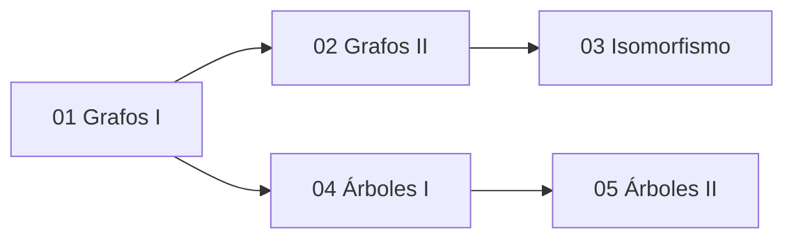

---
{"dg-publish":true,"permalink":"/universidad/3er-semestre/matematicas-discretas/unidad-5-grafos-y-arboles/00-indice-unidad-5/","tags":["MATG1051","unidad5","indice","discretas"],"dg-note-properties":{"tags":["MATG1051","unidad5","indice","discretas"]}}
---

# 🗺️ Unidad 5 — Grafos y Árboles — Índice

> [!info] ℹ️ Índice auto-actualizable con Dataview
> Esta nota lista automáticamente todas las notas de esta unidad. No necesitas editarla al agregar una nueva: aparece sola al guardarla.

## 📑 Notas de la Unidad

| Nota                                                                                                                                                                                                                                                                               | Actualizado | Salientes | Entrantes |
| ---------------------------------------------------------------------------------------------------------------------------------------------------------------------------------------------------------------------------------------------------------------------------------- | ----------- | --------- | --------- |
| [[Universidad/3er Semestre/Matemáticas Discretas/Unidad 5 - Grafos y Árboles/01 - Grafos I - Conceptos Básicos y Recorridos\|01 — Grafos I — Conceptos Básicos y Recorridos]]                                                                                                   | 2026-08-28  | 5         | 10        |
| [[Universidad/3er Semestre/Matemáticas Discretas/Unidad 5 - Grafos y Árboles/02 - Grafos II - Subgrafos, Matrices y Algoritmos\|02 — Grafos II — Subgrafos, Matrices y Algoritmos]]                                                                                             | 2026-08-28  | 8         | 4         |
| [[Universidad/3er Semestre/Matemáticas Discretas/Unidad 5 - Grafos y Árboles/03 - Grafos III - Isomorfismo\|03 — Grafos III — Isomorfismo]]                                                                                                                                     | 2026-08-28  | 7         | 4         |
| [[Universidad/3er Semestre/Matemáticas Discretas/Unidad 5 - Grafos y Árboles/04 - Árboles I - Conceptos Básicos y Árboles de Expansión\|04 — Árboles I — Conceptos Básicos y Árboles de Expansión]]                                                                             | 2026-08-28  | 9         | 4         |
| [[Universidad/3er Semestre/Matemáticas Discretas/Unidad 5 - Grafos y Árboles/05 - Árboles II - Árboles Binarios, Recorridos y Códigos Huffman\|05 — Árboles II — Árboles Binarios, Recorridos y Códigos Huffman]]                                                               | 2026-08-30  | 3         | 3         |
| [[Universidad/3er Semestre/Matemáticas Discretas/Unidad 5 - Grafos y Árboles/05 - Árboles II - Árboles Binarios, Recorridos y Códigos Huffman (conflict 2026-08-28-01-49-06)\|05 — Árboles II — Árboles Binarios, Recorridos y Códigos Huffman (conflict 2026-08-28-01-49-06)]] | 2026-08-06  | 4         | 0         |

{ .block-language-dataview}

## ✅ Avance — Metas de Aprendizaje

# [[Universidad/3er Semestre/Matemáticas Discretas/Unidad 5 - Grafos y Árboles/01 - Grafos I - Conceptos Básicos y Recorridos\|01 - Grafos I - Conceptos Básicos y Recorridos]]

    - [ ] Distinguir un grafo no dirigido de un digrafo
    - [ ] Identificar lazos, aristas paralelas y vértices aislados en un grafo dado
    - [ ] Calcular el grado de un vértice, recordando que los lazos cuentan doble
    - [ ] Reconocer un grafo simple, completo ($K_n$), bipartito y bipartito completo ($K_{m,n}$)
    - [ ] Determinar si un grafo es conexo o disconexo
    - [ ] Diferenciar trayectoria, trayectoria simple, ciclo y ciclo simple
    - [ ] Aplicar el Teorema de Euler (condición necesaria y suficiente) para decidir si un grafo tiene ciclo de Euler
    - [ ] Explicar el problema de los puentes de Königsberg como motivación histórica
    - [ ] Aplicar las condiciones necesarias para ciclos de Hamilton para descartar grafos
    - [ ] Usar los teoremas de Dirac y Ore para garantizar la existencia de un ciclo de Hamilton
    - [ ] Explicar por qué Hamilton no tiene un criterio necesario-y-suficiente simple, a diferencia de Euler
    - [ ] Construir contraejemplos que distingan grafos eulerianos de hamiltonianos
# [[Universidad/3er Semestre/Matemáticas Discretas/Unidad 5 - Grafos y Árboles/02 - Grafos II - Subgrafos, Matrices y Algoritmos\|02 - Grafos II - Subgrafos, Matrices y Algoritmos]]

    - [ ] Definir subgrafo y verificar si un candidato cumple ambas condiciones
    - [ ] Identificar las componentes de un grafo disconexo
    - [ ] Construir la matriz de adyacencia y de incidencia de un grafo pequeño
    - [ ] Aplicar el Teorema de suma de grados para verificar cálculos de grados
    - [ ] Usar el corolario de vértices de grado impar para descartar configuraciones imposibles
    - [ ] Leer una matriz de adyacencia para extraer grados sumando filas
    - [ ] Ejecutar manualmente el algoritmo de Dijkstra en un grafo pequeño
    - [ ] Plantear el problema del agente viajero a partir de un grafo ponderado
    - [ ] Demostrar formalmente el corolario de paridad de vértices de grado impar
    - [ ] Construir cotas inferiores para resolver instancias pequeñas de TSP sin fuerza bruta total
    - [ ] Explicar las limitaciones de Dijkstra con pesos negativos y proponer un contraejemplo
    - [ ] Comparar la complejidad de Dijkstra (polinomial) frente al TSP (NP-difícil)
# [[Universidad/3er Semestre/Matemáticas Discretas/Unidad 5 - Grafos y Árboles/03 - Grafos III - Isomorfismo\|03 - Grafos III - Isomorfismo]]

    - [ ] Enunciar la definición formal de isomorfismo entre dos grafos
    - [ ] Identificar el papel de las biyecciones $f$ (vértices) y $g$ (aristas)
    - [ ] Reconocer $|V|$, $|E|$ y los grados como invariantes básicos
    - [ ] Descartar isomorfismo cuando el número de vértices o aristas difiere
    - [ ] Comparar secuencias de grados ordenadas para descartar isomorfismo
    - [ ] Explicar por qué el isomorfismo es una relación de equivalencia
    - [ ] Aplicar el Teorema de matrices de adyacencia para verificar (o descartar) isomorfismo
    - [ ] Usar el Corolario de grafos simples para simplificar la verificación a una sola biyección $f$
    - [ ] Construir explícitamente una biyección $f$ que certifique un isomorfismo
    - [ ] Demostrar que una propiedad estructural (como ser bipartito) es invariante bajo isomorfismo
    - [ ] Distinguir entre condiciones necesarias (coincidencia de invariantes) y condiciones suficientes (biyección verificada) para isomorfismo
    - [ ] Diseñar contraejemplos de grafos con invariantes básicos iguales pero no isomorfos
# [[Universidad/3er Semestre/Matemáticas Discretas/Unidad 5 - Grafos y Árboles/04 - Árboles I - Conceptos Básicos y Árboles de Expansión\|04 - Árboles I - Conceptos Básicos y Árboles de Expansión]]

    - [ ] Puedo dar la definición formal de árbol (libre) y de árbol con raíz.
    - [ ] Puedo identificar el nivel de un vértice y la altura de un árbol dado.
    - [ ] Puedo identificar padre, hijos, ancestros, descendientes, hermanos, hojas y vértices internos en un árbol con raíz.
    - [ ] Sé que un árbol con $n$ vértices tiene exactamente $n-1$ aristas.
    - [ ] Puedo aplicar el teorema de caracterización de árboles (las 4 condiciones equivalentes) para determinar si un grafo dado es un árbol.
    - [ ] Puedo encontrar un árbol de expansión de un grafo conexo usando BFS.
    - [ ] Puedo encontrar un árbol de expansión de un grafo conexo usando DFS.
    - [ ] Entiendo la diferencia estructural entre los árboles que produce BFS y los que produce DFS.
    - [ ] Puedo aplicar el algoritmo de Prim para encontrar un árbol de expansión mínima en un grafo ponderado.
    - [ ] Puedo demostrar propiedades de árboles usando el teorema de caracterización (por ejemplo, unicidad del árbol de expansión de un árbol).
    - [ ] Puedo razonar sobre cuántos árboles de expansión mínima distintos existen en casos con pesos repetidos.
    - [ ] Puedo comparar y elegir el algoritmo adecuado (BFS, DFS o Prim) según el objetivo del problema.
# [[Universidad/3er Semestre/Matemáticas Discretas/Unidad 5 - Grafos y Árboles/05 - Árboles II - Árboles Binarios, Recorridos y Códigos Huffman (conflict 2026-08-28-01-49-06)\|05 - Árboles II - Árboles Binarios, Recorridos y Códigos Huffman (conflict 2026-08-28-01-49-06)]]

    - [ ] Puedo definir árbol binario y árbol binario completo, y distinguirlos con ejemplos.
    - [ ] Puedo aplicar la fórmula $2i+1$ vértices totales / $i+1$ terminales en un árbol binario completo.
    - [ ] Puedo identificar y ejecutar manualmente los recorridos preorden, entreorden y postorden en un árbol pequeño.
    - [ ] Puedo construir un árbol de búsqueda binaria insertando datos en un orden dado.
    - [ ] Puedo usar el recorrido entreorden para extraer datos ordenados de un árbol de búsqueda binaria.
    - [ ] Puedo construir paso a paso un árbol Huffman a partir de una tabla de frecuencias.
    - [ ] Puedo decodificar una cadena de bits usando un árbol Huffman dado.
    - [ ] Puedo demostrar propiedades estructurales de árboles binarios completos (por ejemplo, paridad del número de vértices).
    - [ ] Puedo reconstruir un árbol binario a partir de dos de sus recorridos (por ejemplo, preorden + entreorden).
    - [ ] Puedo explicar por qué un código Huffman óptimo no es necesariamente único, y en qué casos ocurren empates.
    - [ ] Puedo conectar la representación de árboles Huffman con lo visto en Computación y Sociedad, explicando la relación en mis propias palabras.
# [[Universidad/3er Semestre/Matemáticas Discretas/Unidad 5 - Grafos y Árboles/05 - Árboles II - Árboles Binarios, Recorridos y Códigos Huffman\|05 - Árboles II - Árboles Binarios, Recorridos y Códigos Huffman]]

    - [ ] Puedo definir árbol binario y árbol binario completo, y distinguirlos con ejemplos.
    - [ ] Puedo aplicar la fórmula $2i+1$ vértices totales / $i+1$ terminales en un árbol binario completo.
    - [ ] Puedo identificar y ejecutar manualmente los recorridos preorden, entreorden y postorden en un árbol pequeño.
    - [ ] Puedo construir un árbol de búsqueda binaria insertando datos en un orden dado.
    - [ ] Puedo usar el recorrido entreorden para extraer datos ordenados de un árbol de búsqueda binaria.
    - [ ] Puedo construir paso a paso un árbol Huffman a partir de una tabla de frecuencias.
    - [ ] Puedo decodificar una cadena de bits usando un árbol Huffman dado.
    - [ ] Puedo demostrar propiedades estructurales de árboles binarios completos (por ejemplo, paridad del número de vértices).
    - [ ] Puedo reconstruir un árbol binario a partir de dos de sus recorridos (por ejemplo, preorden + entreorden).
    - [ ] Puedo explicar por qué un código Huffman óptimo no es necesariamente único, y en qué casos ocurren empates.
    - [ ] Puedo conectar la representación de árboles Huffman con lo visto en Computación y Sociedad, explicando la relación en mis propias palabras.

{ .block-language-dataview}

## ⚠️ Notas huérfanas (sin enlaces entrantes)

- [[Universidad/3er Semestre/Matemáticas Discretas/Unidad 5 - Grafos y Árboles/05 - Árboles II - Árboles Binarios, Recorridos y Códigos Huffman (conflict 2026-08-28-01-49-06)\|05 - Árboles II - Árboles Binarios, Recorridos y Códigos Huffman (conflict 2026-08-28-01-49-06)]]

{ .block-language-dataview}

## 📊 Mapa de conexiones

> [!quote] 🔗 Conexiones
> - Previo: [[Universidad/3er Semestre/Matemáticas Discretas/Unidad 4 - Recurrencia y Algoritmos/05 - Análisis de Algoritmos II - Pseudocódigo y Tiempo Real\|05 - Análisis de Algoritmos II - Pseudocódigo y Tiempo Real]] (Unidad 4)
> - Siguiente: [[Universidad/3er Semestre/Matemáticas Discretas/Unidad 6 - Lenguajes y Autómatas/01 - Máquinas de Estado Finito - Definición y Estructura\|01 - Máquinas de Estado Finito - Definición y Estructura]] (Unidad 6)
> - MOC general: [[Universidad/3er Semestre/Matemáticas Discretas/Matemáticas Discretas\|Matemáticas Discretas]]

---
**Tags:** #MATG1051 #unidad5 #indice #discretas
