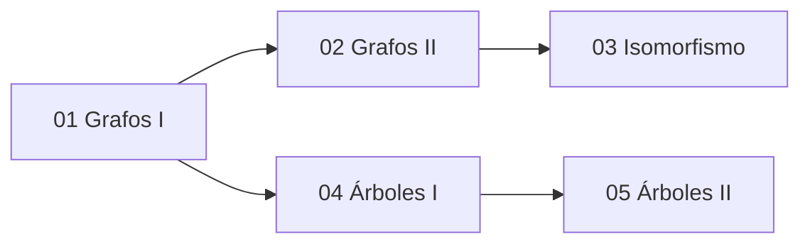

---
{"dg-publish":true,"permalink":"/universidad/3er-semestre/matematicas-discretas/unidad-5-grafos-y-arboles/00-indice-unidad-5/","tags":["MATG1051","unidad5","indice","discretas"],"dg-note-properties":{"tags":["MATG1051","unidad5","indice","discretas"]}}
---

# 🗺️ Unidad 5 — Grafos y Árboles — Índice

> [!info] ℹ️ Índice manual
> Se actualiza a mano para que funcione igual en Obsidian y en Digital Garden.

## 📑 Notas de la Unidad

- [[Universidad/3er Semestre/Matemáticas Discretas/Unidad 5 - Grafos y Árboles/01 - Grafos I - Conceptos Básicos y Recorridos\|01 - Grafos I - Conceptos Básicos y Recorridos]]
- [[Universidad/3er Semestre/Matemáticas Discretas/Unidad 5 - Grafos y Árboles/02 - Grafos II - Subgrafos, Matrices y Algoritmos\|02 - Grafos II - Subgrafos, Matrices y Algoritmos]]
- [[Universidad/3er Semestre/Matemáticas Discretas/Unidad 5 - Grafos y Árboles/03 - Grafos III - Isomorfismo\|03 - Grafos III - Isomorfismo]]
- [[Universidad/3er Semestre/Matemáticas Discretas/Unidad 5 - Grafos y Árboles/04 - Árboles I - Conceptos Básicos y Árboles de Expansión\|04 - Árboles I - Conceptos Básicos y Árboles de Expansión]]
- [[Universidad/3er Semestre/Matemáticas Discretas/Unidad 5 - Grafos y Árboles/05 - Árboles II - Árboles Binarios, Recorridos y Códigos Huffman\|05 - Árboles II - Árboles Binarios, Recorridos y Códigos Huffman]]
- [[Universidad/3er Semestre/Matemáticas Discretas/Unidad 5 - Grafos y Árboles/Guía de Problemas 5 - Ejercicios Resueltos\|Guía de Problemas 5 - Ejercicios Resueltos]]

## 📊 Mapa de conexiones

```mermaid
graph LR
    A[01 Grafos I] --> B[02 Grafos II]
    B --> C[03 Isomorfismo]
    D[04 Árboles I] --> E[05 Árboles II]
    A --> D
```

> [!quote] 🔗 Conexiones
> - Previo: [[Universidad/3er Semestre/Matemáticas Discretas/Unidad 4 - Recurrencia y Algoritmos/05 - Análisis de Algoritmos II - Pseudocódigo y Tiempo Real\|05 - Análisis de Algoritmos II - Pseudocódigo y Tiempo Real]] (Unidad 4)
> - Siguiente: [[Universidad/3er Semestre/Matemáticas Discretas/Unidad 6 - Lenguajes y Autómatas/01 - Máquinas de Estado Finito - Definición y Estructura\|01 - Máquinas de Estado Finito - Definición y Estructura]] (Unidad 6)
> - MOC general: [[Universidad/3er Semestre/Matemáticas Discretas/Matemáticas Discretas\|Matemáticas Discretas]]

---
**Tags:** #MATG1051 #unidad5 #indice #discretas
