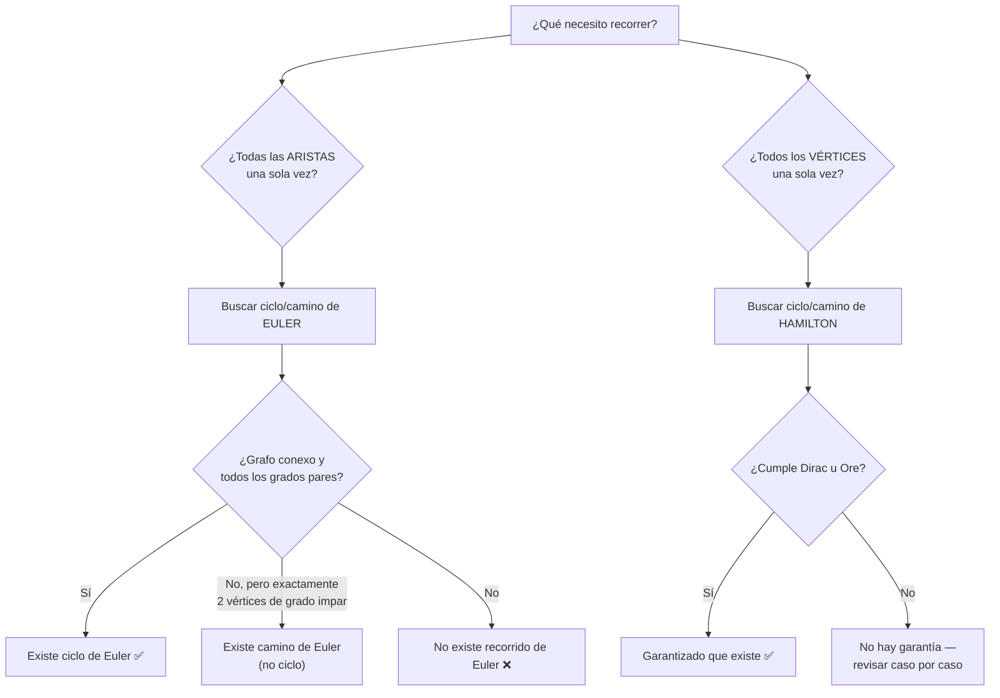
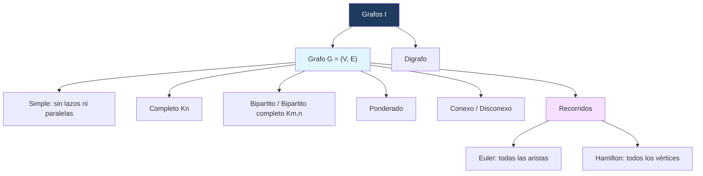

---
{"dg-publish":true,"permalink":"/universidad/3er-semestre/matematicas-discretas/unidad-5-grafos-y-arboles/01-grafos-i-conceptos-basicos-y-recorridos/","dg-note-properties":{}}
---

# 🕸️ Grafos I — Conceptos Básicos y Recorridos

## 🎯 Introducción

> [!info] 💡 ¿Por qué estudiar grafos?
> 
> Un **grafo** es una estructura que modela relaciones entre objetos: quién está conectado con quién, qué ciudades están unidas por carreteras, qué páginas web se enlazan entre sí. La teoría de grafos nació en 1736 con un artículo de **Leonhard Euler**, quien resolvió el problema de los puentes de Königsberg y sentó las bases de toda la disciplina.
> 
> **Aplicaciones modernas:**
> 
> - Redes sociales (¿quién sigue a quién?)
> - Sistemas de rutas y GPS (Google Maps usa algoritmos de caminos más cortos)
> - Redes de computadoras e Internet (routers como vértices, conexiones como aristas)
> - Diseño de circuitos y planificación de tareas (dependencias entre procesos)
> - Biología computacional (redes de interacción de proteínas)
> 
> ```mermaid
> graph TD
>     A["Teoría de Grafos"] --> B["Grafos no dirigidos"]
>     A --> C["Digrafos (dirigidos)"]
>     B --> D["Tipos: simples, completos, bipartitos, ponderados"]
>     B --> E["Recorridos: Euler y Hamilton"]
>     B --> F["Conectividad"]
>     style A fill:#1e3a5f,color:#fff
>     style B fill:#e1f5ff
>     style C fill:#f5e1ff
> ```

---

## 📋 Fundamentos: Grafos y Digrafos

> [!note] 📋 Definición 1 — Grafo no dirigido
> 
> Un **grafo (no dirigido)** $G$ consiste en un conjunto $V$ de **vértices** (o nodos) y un conjunto $E$ de **aristas**, tal que cada arista $e \in E$ se asocia con un **par no ordenado** de vértices.
> 
> Si existe una arista única $e$ asociada con los vértices $u, v \in V$, se escribe:
> 
> $$e = {u, v}$$
> 
> Aquí ${u, v}$ simplemente denota una arista entre $u$ y $v$.

> [!note] 📋 Definición 2 — Digrafo (grafo dirigido)
> 
> Un **digrafo** $G$ consiste en un conjunto $V$ de vértices y un conjunto $E$ de aristas (o **arcos**), tal que cada arista $e \in E$ está asociada con un **par ordenado** de vértices.
> 
> Si hay una arista única $e$ asociada con el par ordenado $(u, v)$, se escribe:
> 
> $$e = (u, v)$$
> 
> lo que denota una arista dirigida **de $u$ a $v$**.

> [!tip] 🖥️ Diferencia clave para programar
> 
> En un grafo no dirigido, la arista ${u,v}$ es equivalente a ${v,u}$ — si $u$ es adyacente a $v$, la relación es simétrica. En un digrafo, $(u,v) \neq (v,u)$: la arista tiene una dirección específica. Esto importa mucho al elegir la estructura de datos (lista/matriz de adyacencia simétrica vs. no simétrica).

---

## 🔗 Incidencia y Adyacencia

> [!note] 📋 Definición 3 — Incidencia y adyacencia
> 
> Sea $G = (V, E)$ un grafo (o digrafo).
> 
> - Una arista $e = {u, v}$ se dice **incidente** en los vértices $u$ y $v$.
> - Los vértices $u$ y $v$ se dicen **adyacentes**.
> 
> Se escribe $G = (V, E)$ para indicar explícitamente el conjunto de vértices y el conjunto de aristas.

---

## 🔁 Lazos, Aristas Paralelas y Grafos Simples

> [!note] 📋 Definición 4 — Lazos, aristas paralelas, vértices aislados
> 
> Sea $G = (V, E)$ un grafo.
> 
> - Si una arista incide **dos veces** en el mismo vértice $v$, se llama **lazo**.
> - Si dos aristas distintas $e_1, e_2 \in E$ se asocian con el **mismo par** de vértices, se llaman **aristas paralelas**.
> - Un vértice que **no incide** en ninguna arista se llama **vértice aislado**.
> - Un grafo **sin lazos ni aristas paralelas** se llama **grafo simple**.

> [!example]- 🟢 Ejemplo 1 — Identificando lazos, aristas paralelas y vértices aislados
> 
> ```mermaid
> graph LR
>     v1 ---|e1| v2
>     v1 ---|e2| v2
>     v2 ---|e3| v2
>     v2 ---|e4| v3
>     v4["v4 (aislado)"]
> ```
> 
> - $e_3$ es un **lazo** (incide dos veces en $v_2$).
> - $e_1$ y $e_2$ son **aristas paralelas** (ambas unen $v_1$ con $v_2$).
> - $v_4$ es un **vértice aislado**.
> - $v_1$ y $v_2$ son adyacentes; $v_1$ y $v_3$ **no** son adyacentes.
> - Este grafo **no** es simple (tiene lazo y aristas paralelas).

---

## 🛤️ Trayectorias o Rutas

> [!note] 📋 Definición 5 — Trayectoria (ruta)
> 
> Sean $u$ y $v$ vértices en un grafo. Una **trayectoria o ruta** de $u$ a $v$ de longitud $n$ es una sucesión alternante de $n+1$ vértices y $n$ aristas que comienza en $v_0 = u$ y termina en $v_n = v$:
> 
> $$(v_0, e_1, v_1, e_2, v_2, \ldots, v_{n-1}, e_n, v_n)$$
> 
> donde la arista $e_i$ es incidente sobre $v_{i-1}$ y $v_i$ para $i = 1, \ldots, n$.

---

## 🧩 Tipos de Grafos

> [!note] 📋 Definición 6 — Grafo completo $K_n$
> 
> El **grafo completo** sobre $n$ vértices, denotado $K_n$, es el grafo simple con $n$ vértices en el que hay una arista entre **cada par de vértices distintos**.

> [!example]- 🟢 Ejemplo 2 — $K_4$
> 
> ```mermaid
> graph LR
>     v1 --- v2
>     v1 --- v3
>     v1 --- v4
>     v2 --- v3
>     v2 --- v4
>     v3 --- v4
> ```
> 
> $K_4$ tiene $4$ vértices y $\binom{4}{2} = 6$ aristas — todos los pares están conectados.

> [!note] 📋 Definición 7 — Grafo bipartito
> 
> Un grafo $G = (V, E)$ es **bipartito** si existen subconjuntos $V_1$ y $V_2$ de $V$ (cualquiera de los dos posiblemente vacío) tales que:
> 
> - $V_1 \cap V_2 = \varnothing$
> - $V_1 \cup V_2 = V$
> - cada arista en $E$ es incidente sobre un vértice en $V_1$ y un vértice en $V_2$

> [!example]- 🟢 Ejemplo 3 — Grafo bipartito vs. no bipartito
> 
> **Bipartito** (con $V_1 = {v_1, v_2, v_3}$, $V_2 = {v_4, v_5}$):
> 
> ```mermaid
> graph LR
>     v1 --- v4
>     v1 --- v5
>     v2 --- v4
>     v3 --- v5
> ```
> 
> **No bipartito** (contiene un ciclo de longitud impar):
> 
> ```mermaid
> graph LR
>     v1 --- v2
>     v2 --- v3
>     v3 --- v4
>     v4 --- v5
>     v5 --- v1
> ```
> 
> $K_4$ tampoco es bipartito — inténtalo probar por qué.

> [!note] 📋 Definición 8 — Grafo ponderado
> 
> Un grafo $G$ es **ponderado** si se asigna un valor o etiqueta (llamado **peso**) a cada arista. Si el valor de la arista $e$ es $k$, decimos que el **peso** de $e$ es $k$.
> 
> > [!warning] ⚠️ Longitud en grafos ponderados En un grafo ponderado, la **longitud** de una ruta es la **suma de los pesos** de las aristas en la ruta — no el número de aristas.

> [!note] 📋 Definición 9 — Grafo bipartito completo $K_{m,n}$
> 
> El **grafo bipartito completo** sobre $m$ y $n$ vértices, denotado $K_{m,n}$, es el grafo simple donde el conjunto de vértices tiene una partición en $V_1$ (con $m$ vértices) y $V_2$ (con $n$ vértices), y donde el conjunto de aristas consiste en **todas** las aristas de la forma ${v_1, v_2}$ con $v_1 \in V_1$ y $v_2 \in V_2$.
> 
> > [!warning] ⚠️ Cuidado con la confusión Un grafo bipartito completo **no necesariamente** es un grafo completo. $K_{2,4}$ tiene $2 \times 4 = 8$ aristas, mientras que un grafo completo con $6$ vértices ($K_6$) tendría $\binom{6}{2}=15$.

---

## 🔗 Conexidad

> [!note] 📋 Definición 10 — Grafo conexo
> 
> Un grafo $G = (V, E)$ es **conexo** si para cualquier par de vértices $u, v \in V$ existe una trayectoria en $G$ de $u$ a $v$. En caso contrario, $G$ es **disconexo**.

---

## 🔄 Trayectorias Simples, Ciclos y Grado

> [!note] 📋 Definición 11 — Trayectoria simple, ciclo, ciclo simple y grado
> 
> - Una **trayectoria simple** de $u$ a $v$ es una ruta de $u$ a $v$ **sin vértices repetidos**.
> - Un **ciclo** es una trayectoria de longitud distinta de cero de $v$ a $v$ **sin aristas repetidas**.
> - Un **ciclo simple** es un ciclo de $v$ a $v$ en el que no hay vértices repetidos, excepto por el inicio y el fin que coinciden.
> - El **grado** de un vértice $v$, denotado $\delta(v)$, es el número de aristas que inciden en $v$ (**los lazos se cuentan doble**).

> [!example]- 🟢 Ejemplo 4 — Trayectorias, ciclos y grados
> 
> ```mermaid
> graph LR
>     v1 ---|e1| v2
>     v1 ---|e2| v2
>     v2 ---|e3| v2
>     v2 ---|e4| v3
>     v4["v4"]
>     v5 ---|e5| v6
> ```
> 
> - $(v_1, e_2, v_2, e_4, v_3)$ es una **trayectoria simple** de $v_1$ a $v_3$.
>     
> - $(v_1, e_2, v_2, e_3, v_2, e_1, v_1)$ es un **ciclo** de $v_1$ a $v_1$.
>     
> - Grados: $\delta(v_1)=2,\ \delta(v_2)=5,\ \delta(v_3)=1,\ \delta(v_4)=0,\ \delta(v_5)=1,\ \delta(v_6)=1$.
>     
> 
> > [!tip]- 💡 ¿Por qué $\delta(v_2) = 5$? $v_2$ incide en $e_1$ (1), $e_2$ (1), $e_3$ como lazo (**2**, porque los lazos cuentan doble) y $e_4$ (1). Total: $1+1+2+1 = 5$.

---

## 🌉 Ciclos de Euler

> [!note] 📋 Definición 12 — Camino y ciclo de Euler
> 
> - Un **camino de Euler** en un grafo $G$ es una trayectoria **sin aristas repetidas** que incluye **todas** las aristas y **todos** los vértices de $G$.
> - Un **ciclo de Euler** en un grafo $G$ es un ciclo que incluye todas las aristas y todos los vértices de $G$.
> - Un **grafo Euleriano** es un grafo que contiene un ciclo de Euler.

> [!success] ✅ Teorema de Euler (condición necesaria y suficiente)
> 
> - **(Necesaria)** Si un grafo $G$ contiene un ciclo de Euler, entonces $G$ es **conexo** y **todos** sus vértices tienen **grado par**.
> - **(Suficiente)** Si un grafo $G$ es **conexo** y **todos** sus vértices son de **grado par**, entonces $G$ contiene un ciclo de Euler.
> 
> Juntas, ambas condiciones forman un criterio **si y solo si**: un grafo conexo tiene ciclo de Euler exactamente cuando todos sus grados son pares.

> [!info] 🏛️ Contexto histórico — Los puentes de Königsberg
> 
> El primer artículo de teoría de grafos fue de **Leonhard Euler en 1736**. Dos islas en el río Pregel en Königsberg estaban conectadas entre sí y con las orillas por **7 puentes**. El problema: comenzar en cualquier lugar ($A$, $B$, $C$ o $D$), cruzar cada puente **exactamente una vez** y regresar al punto de inicio.
> 
> ```mermaid
> graph LR
>     A((A)) --- B((B))
>     A --- B
>     B --- C((C))
>     B --- C
>     B --- D((D))
>     C --- D
> ```
> 
> Al modelar el problema como grafo (vértices = regiones de tierra, aristas = puentes), se reduce a encontrar un **ciclo de Euler**. Como algunos vértices tienen grado impar, **el problema no tiene solución** — este fue precisamente el resultado que Euler demostró.

---

## 🎯 Caminos y Ciclos Hamiltonianos

> [!note] 📋 Definición 13 — Camino y ciclo hamiltoniano
> 
> - Un **camino hamiltoniano** en un grafo $G$ es una trayectoria simple que pasa por **todos** los vértices de $G$.
> - Un **ciclo hamiltoniano** es un ciclo simple que pasa por **todos** los vértices de $G$.
> - Un grafo que contiene un ciclo hamiltoniano se llama **grafo hamiltoniano**.

> [!example]- 🟢 Ejemplo 5 — Ciclo hamiltoniano
> 
> ```mermaid
> graph LR
>     v1 --- v2
>     v1 --- v4
>     v2 --- v3
>     v2 --- v5
>     v3 --- v4
>     v3 --- v5
> ```
> 
> El ciclo $(v_1, v_2, v_5, v_3, v_4, v_1)$ es un **ciclo hamiltoniano** — pasa por todos los vértices exactamente una vez y regresa al inicio. El grafo tiene además varios caminos hamiltonianos posibles.

> [!warning] ⚠️ Euler vs. Hamilton — no las confundas
> 
> - Un camino/ciclo de **Euler** recorre **todas las aristas** exactamente una vez.
> - Un camino/ciclo de **Hamilton** recorre **todos los vértices** exactamente una vez.
> - Las condiciones para Euler son **"locales"** (basta revisar los grados — criterio simple y completo).
> - Para Hamilton **no existe** un criterio tan sencillo: hay teoremas necesarios y otros suficientes, pero **ninguno** que sea ambas cosas a la vez (a diferencia de Euler).

> [!success] ✅ Condiciones necesarias para un ciclo de Hamilton
> 
> Si un grafo $G = (V, E)$ tiene un ciclo de Hamilton, entonces:
> 
> 1. $G$ es **conexo**.
>     
> 2. $\delta(v) \geq 2,\ \forall v \in V$.
>     
> 3. Si $G$ es bipartito con partición $V_1, V_2$: $|V_1| = |V_2|$.
>     
> 4. Si $|V| = n$, cualquier ciclo de Hamilton en $G$ tiene longitud $n$.
>     
> 
> > [!warning] ⚠️ Estas son condiciones necesarias, no suficientes Que un grafo cumpla estas 4 condiciones **no garantiza** que tenga ciclo de Hamilton. Solo sirven para **descartar** rápidamente grafos que NO pueden tenerlo.

> [!success] ✅ Teorema de Dirac (condición suficiente)
> 
> Sea $G = (V, E)$ un grafo simple con $|V| = n \geq 3$. Si $\delta(v) \geq n/2,\ \forall v \in V$, entonces $G$ posee un ciclo de Hamilton.

> [!success] ✅ Teorema de Ore (condición suficiente)
> 
> Sea $G = (V, E)$ un grafo con $|V| = n \geq 3$. Si para todo par de vértices no adyacentes $u, v \in V$ se cumple que $\delta(u) + \delta(v) \geq n$, entonces $G$ posee un ciclo de Hamilton.
> 
> > [!tip]- 💡 Dirac es un caso particular de Ore Si todos los vértices tienen grado $\geq n/2$ (Dirac), entonces cualquier par $u,v$ suma $\geq n$ (Ore). Por eso Dirac se puede deducir de Ore, pero no al revés — Ore es más general.


---

## 📊 Tabla Comparativa: Euler vs. Hamilton

> [!note] 📊 Comparación de recorridos
> 
> |Aspecto|Ciclo de Euler|Ciclo de Hamilton|
> |---|---|---|
> |Qué recorre|**Todas las aristas** una vez|**Todos los vértices** una vez|
> |Puede repetir vértices|Sí (varias veces)|No (excepto inicio = fin)|
> |Condición necesaria y suficiente|Sí: conexo + todos los grados pares|No existe una única condición N y S|
> |Condiciones conocidas|Locales (grados)|Necesarias (Dirac/Ore dan solo suficientes)|
> |Complejidad de decidir si existe|Fácil (polinomial)|Difícil (problema NP-completo)|
> |Origen histórico|Puentes de Königsberg (1736)|Juego icosiano de Hamilton (1857)|

---

## 🧭 Diagrama de Decisión — ¿Qué tipo de recorrido busco?



---

## 🗺️ Resumen Visual



---

## 📝 Ejercicios Progresivos

> [!question] 📋 Nivel 1 — Básico
> 
> **1.** Dado un grafo con vértices ${a,b,c,d}$ y aristas ${a,b}, {b,c}, {c,d}, {d,a}$, calcula el grado de cada vértice.
> 
> **2.** ¿Es $K_5$ un grafo bipartito? Justifica tu respuesta usando la Definición 7.
> 
> **3.** Un grafo tiene 6 vértices, todos de grado 4. ¿Es conexo necesariamente? ¿Podría tener ciclo de Euler? Explica qué condición sí puedes verificar con esta información.

> [!question] 📋 Nivel 2 — Intermedio
> 
> **4.** Considera el grafo de los puentes de Königsberg. Calcula el grado de cada vértice ($A, B, C, D$) y explica por qué no existe un ciclo de Euler.
> 
> **5.** Da un ejemplo de un grafo con 5 vértices que tenga ciclo de Hamilton pero **no** ciclo de Euler, y explica por qué falla la condición de Euler.
> 
> **6.** Para $K_{3,3}$: ¿cumple la condición necesaria de bipartitos para tener ciclo de Hamilton ($|V_1|=|V_2|$)? ¿Cumple el Teorema de Dirac?

> [!question] 📋 Nivel 3 — Avanzado
> 
> **7.** Demuestra que $K_4$ no es un grafo bipartito (pista: busca un ciclo de longitud impar).
> 
> **8.** Sea $G$ un grafo con $|V|=n\geq 3$ tal que $\delta(v) \geq n/2$ para todo $v$. Explica, usando el Teorema de Ore, por qué esta condición (Dirac) implica automáticamente la hipótesis de Ore.
> 
> **9.** Diseña un grafo conexo con exactamente 2 vértices de grado impar y explica (sin demostrarlo formalmente) por qué tiene un **camino** de Euler pero no un **ciclo** de Euler.

> [!success]- ✅ Respuestas
> 
> **1.** $\delta(a)=\delta(b)=\delta(c)=\delta(d)=2$ (cada vértice incide en exactamente 2 aristas del ciclo).
> 
> **2.** No. $K_5$ tiene ciclos de longitud impar (por ejemplo, un triángulo entre 3 de sus vértices), y un grafo bipartito no puede contener ciclos de longitud impar.
> 
> **3.** No necesariamente conexo — la condición de grado par por sí sola no garantiza conexidad (podrían ser dos componentes separadas, cada una con grados pares). Si además fuera conexo, sí podría tener ciclo de Euler, ya que se cumpliría la condición suficiente completa.
> 
> **4.** En el grafo simplificado de Königsberg: $\delta(A)=3$, $\delta(B)=5$, $\delta(C)=3$, $\delta(D)=3$ (según la configuración de 7 puentes). Como hay vértices de grado impar, no se cumple la condición necesaria del Teorema de Euler, así que no existe ciclo de Euler.
> 
> **5.** El ciclo simple $C_5$ (pentágono: $v_1-v_2-v_3-v_4-v_5-v_1$) tiene ciclo de Hamilton (el propio ciclo), pero cada vértice tiene grado 2 (par), así que en realidad SÍ tendría ciclo de Euler también. Un mejor ejemplo: el grafo de la rueda $W_4$ (un vértice central conectado a los 4 vértices de un ciclo $C_4$) tiene ciclo de Hamilton, pero el vértice central tiene grado 4 (par) y los demás grado 3 (impar) — al haber vértices de grado impar, no tiene ciclo de Euler.
> 
> **6.** $K_{3,3}$ tiene $|V_1|=|V_2|=3$, así que sí cumple la condición necesaria de bipartitos. Cada vértice tiene grado 3, y $n=6$, así que $\delta(v)=3 \geq 6/2=3$: sí cumple Dirac, por lo tanto tiene garantizado un ciclo de Hamilton.
> 
> **7.** En $K_4$, cualquier terna de vértices forma un triángulo (ciclo de longitud 3, impar), ya que todos los pares están conectados. Un grafo bipartito no puede tener ciclos de longitud impar, por lo tanto $K_4$ no es bipartito.
> 
> **8.** Si $\delta(v) \geq n/2$ para todo vértice, entonces para cualquier par $u,v$ (adyacentes o no) se cumple $\delta(u)+\delta(v) \geq n/2 + n/2 = n$, que es exactamente la hipótesis de Ore. Por lo tanto, cualquier grafo que cumpla Dirac automáticamente cumple Ore.
> 
> **9.** Por ejemplo, un grafo con 4 vértices en forma de "camino más un triángulo": si solo dos vértices ($v_1$ y $v_4$, los extremos) tienen grado impar y el resto grado par, el Teorema de Euler (versión extendida) garantiza un camino de Euler entre esos dos vértices de grado impar, pero no un ciclo, porque no todos los vértices tienen grado par.

---

## 🎓 Metas de Aprendizaje

> [!success] 🎯 Nivel Básico
> 
> - [ ] Distinguir un grafo no dirigido de un digrafo
> - [ ] Identificar lazos, aristas paralelas y vértices aislados en un grafo dado
> - [ ] Calcular el grado de un vértice, recordando que los lazos cuentan doble
> - [ ] Reconocer un grafo simple, completo ($K_n$), bipartito y bipartito completo ($K_{m,n}$)

> [!success] 🎯 Nivel Intermedio
> 
> - [ ] Determinar si un grafo es conexo o disconexo
> - [ ] Diferenciar trayectoria, trayectoria simple, ciclo y ciclo simple
> - [ ] Aplicar el Teorema de Euler (condición necesaria y suficiente) para decidir si un grafo tiene ciclo de Euler
> - [ ] Explicar el problema de los puentes de Königsberg como motivación histórica

> [!success] 🎯 Nivel Avanzado
> 
> - [ ] Aplicar las condiciones necesarias para ciclos de Hamilton para descartar grafos
> - [ ] Usar los teoremas de Dirac y Ore para garantizar la existencia de un ciclo de Hamilton
> - [ ] Explicar por qué Hamilton no tiene un criterio necesario-y-suficiente simple, a diferencia de Euler
> - [ ] Construir contraejemplos que distingan grafos eulerianos de hamiltonianos

---

> [!quote] 📖 Referencias [1] Pineda, E. (2025). _Teoría de grafos — Definiciones básicas_. Departamento de Matemáticas, FCNM-ESPOL.

> [!quote] 🔗 Conexiones
> 
> - [[Universidad/3er Semestre/Matemáticas Discretas/Unidad 5 - Grafos y Árboles/02 - Grafos II - Subgrafos, Matrices y Algoritmos\|02 - Grafos II - Subgrafos, Matrices y Algoritmos]] — continuación: subgrafos, componentes, matrices y algoritmos de rutas
> - [[Universidad/3er Semestre/Matemáticas Discretas/Unidad 5 - Grafos y Árboles/03 - Grafos III - Isomorfismo\|03 - Grafos III - Isomorfismo]] — cuándo dos grafos comparten exactamente la misma estructura
> - [[Sucesiones y Cadenas\|Sucesiones y Cadenas]] — la notación de sucesiones se usa para indexar vértices y aristas

---

**Tags:** #matematicas-discretas #grafos #teoria-de-grafos #euler #hamilton #konigsberg #MATG1051