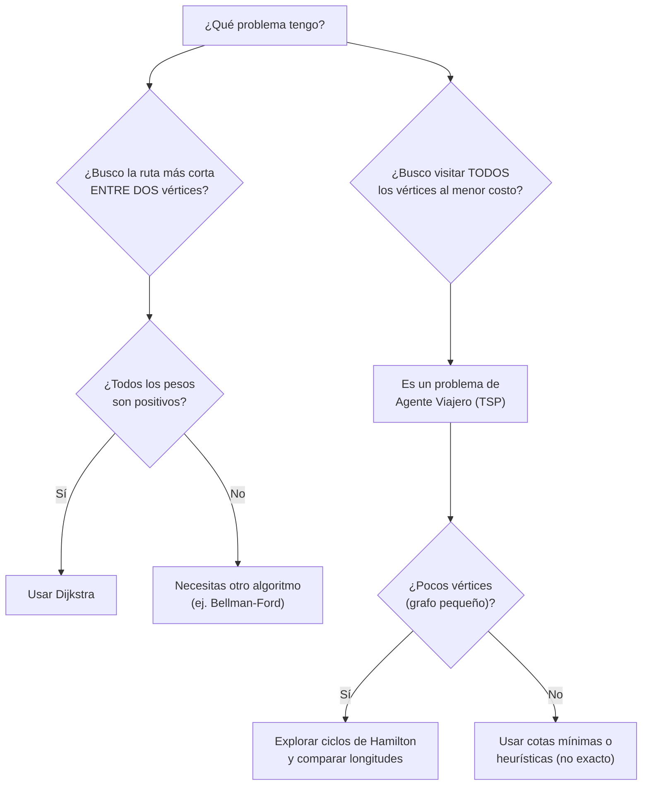
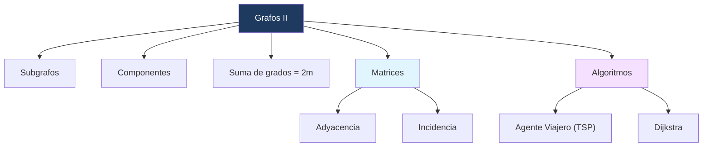

---
{"dg-publish":true,"permalink":"/universidad/3er-semestre/matematicas-discretas/unidad-5-grafos-y-arboles/02-grafos-ii-subgrafos-matrices-y-algoritmos/","dg-note-properties":{}}
---

# 🕸️ Grafos II — Subgrafos, Matrices y Algoritmos

## 🎯 Introducción

> [!info] 💡 De la teoría a la práctica
> 
> En [[Universidad/3er Semestre/Matemáticas Discretas/Unidad 5 - Grafos y Árboles/01 - Grafos I - Conceptos Básicos y Recorridos\|01 - Grafos I - Conceptos Básicos y Recorridos]] vimos cómo modelar relaciones con vértices y aristas, y cómo razonar sobre recorridos (Euler, Hamilton). Esta nota da el siguiente paso: representar grafos de forma **computable** (matrices) y resolver **problemas de optimización** sobre ellos (ruta más corta, agente viajero).
> 
> **Aplicaciones modernas:**
> 
> - GPS y Google Maps (ruta más corta entre dos puntos — algoritmo de Dijkstra)
> - Logística y reparto (problema del agente viajero — optimizar rutas de entrega)
> - Redes de telecomunicaciones (matrices de adyacencia para representar conexiones)
> - Diseño de circuitos impresos (minimizar el recorrido de un taladro entre agujeros, como en el ejemplo de la hoja de metal)
> 
> ```mermaid
> graph TD
>     A["Grafos II"] --> B["Subgrafos y Componentes"]
>     A --> C["Matrices: Adyacencia e Incidencia"]
>     A --> D["Algoritmos"]
>     D --> E["Agente Viajero (TSP)"]
>     D --> F["Dijkstra (ruta más corta)"]
>     style A fill:#1e3a5f,color:#fff
>     style C fill:#e1f5ff
>     style D fill:#f5e1ff
> ```

---

## 🧩 Subgrafos

> [!note] 📋 Definición 1 — Subgrafo
> 
> Sea $G = (V, E)$ un grafo. Un **subgrafo** de $G$ es un par $G' = (V', E')$ que satisface:
> 
> a) $V' \subseteq V$ y $E' \subseteq E$.
> 
> b) Para cada arista $e \in E'$, si $e$ incide en $v'$ y en $w'$, entonces $v', w' \in V'$.
> 
> > [!warning] ⚠️ La condición (b) es la que suele fallar No basta con tomar cualquier subconjunto de aristas: si una arista está en $E'$, **ambos** vértices que toca deben estar en $V'$. No puedes "recortar" una arista dejando uno de sus extremos afuera.

> [!example]- 🟢 Ejemplo 1 — Un subgrafo válido
> 
> Grafo original $G$ con vértices ${v_1,\ldots,v_8}$ y aristas ${e_1,\ldots,e_{11}}$. Un subgrafo $G'$ válido puede tomar solo algunas aristas y sus vértices incidentes, por ejemplo:
> 
> ```mermaid
> graph LR
>     v3 ---|e8| v4
>     v1 ---|e10| v6
>     v1 ---|e11| v7
>     v6 ---|e5| v7
>     v2["v2 (no incluido en E')"]
> ```
> 
> $G'$ conserva únicamente ${v_1,v_3,v_4,v_6,v_7}$ y las aristas ${e_5,e_8,e_{10},e_{11}}$ — cada arista incluida trae consigo sus dos vértices.

---

## 🔗 Componentes

> [!note] 📋 Definición 2 — Componente de un grafo
> 
> Sea $G$ un grafo y $v$ un vértice en $G$. El subgrafo $G'$ de $G$ que consiste en **todas** las aristas y vértices de $G$ que están contenidos en trayectorias que comienzan en $v$ se llama la **componente** de $G$ que contiene a $v$.
> 
> > [!success] ✅ Relación entre conexidad y componentes:
> > $G$ es **conexo** si y solo si $G$ posee **una sola componente**.

> [!example]- 🟢 Ejemplo 2 — Grafo disconexo y sus componentes
> 
> ```mermaid
> graph LR
>     v1 --- v2
>     v2 --- v3
>     v3 --- v1
>     v4["v4 (aislado)"]
>     v5 --- v6
> ```
> 
> Este grafo **no es conexo**: tiene 3 componentes:
> 
> - ${v_1, v_2, v_3}$ con sus aristas (triángulo)
> - ${v_4}$ sola (componente trivial)
> - ${v_5, v_6}$ con su arista

---

## ∑ Teorema de la Suma de Grados

> [!success] ✅ Teorema — Suma de grados
> 
> Si $G$ es un grafo con $m$ aristas y $n$ vértices ${v_1, \ldots, v_n}$, entonces:
> 
> $$\sum_{i=1}^{n} \delta(v_i) = 2m$$
> 
> Es decir, **la suma de los grados de todos los vértices es siempre un número par** — cada arista contribuye exactamente 2 al total (una unidad por cada extremo que toca).

> [!success] ✅ Corolario
> 
> En cualquier grafo $G$ existe un **número par** de vértices de **grado impar**.
> 
> > [!tip]- 💡 ¿Por qué se cumple el corolario? Si la suma total de grados es par (por el teorema) y los vértices de grado par no afectan la paridad de la suma, entonces la cantidad de vértices de grado impar debe ser par — de lo contrario, la suma total sería impar, lo cual contradice el teorema.

---

## 🔢 Matrices Asociadas a Grafos

> [!note] 📋 Definición 3 — Matriz de adyacencia
> 
> Sea $G$ un grafo con $m$ vértices y un orden fijo para ellos. La **matriz de adyacencia** de $G$ es la matriz cuadrada de orden $m$ cuya componente $ij$ es el **número de aristas** que inciden en los vértices $v_i$ y $v_j$, **contando los lazos dos veces**.
> 
> > [!tip] 🖥️ Propiedad útil para programar Dado $i \in {1,\ldots,m}$, la suma de los elementos en la fila $i$ es exactamente $\delta(v_i)$ — puedes calcular todos los grados sumando filas de la matriz.

> [!note] 📋 Definición 4 — Matriz de incidencia
> 
> Si $G$ tiene $m$ vértices y $n$ aristas, fijado un orden para ambos conjuntos, la **matriz de incidencia** es la matriz de orden $m \times n$ cuya componente $ij$ es $1$ si la arista $j$ incide en el vértice $i$, y $0$ en caso contrario.

> [!example]- 🟢 Ejemplo 3 — Matrices de adyacencia e incidencia
> 
> Para un grafo $G$ con $V={v_1,\ldots,v_5}$ y $E={e_1,\ldots,e_7}$:
> 
> $$A = \begin{pmatrix} 0&1&0&1&0 \ 1&2&0&2&1 \ 0&0&0&0&1 \ 1&2&0&0&0 \ 0&1&1&0&0 \end{pmatrix} \qquad I = \begin{pmatrix} 1&0&1&0&0&0&0 \ 0&1&1&1&1&0&1 \ 0&0&0&0&0&1&0 \ 1&1&0&1&0&0&0 \ 0&0&0&0&1&1&0 \end{pmatrix}$$
> 
> Nota que la fila 2 de $A$ suma $1+2+0+2+1=6=\delta(v_2)$, coincidiendo con la propiedad mencionada arriba. El valor $2$ en la posición $(2,2)$ de $A$ indica un **lazo** en $v_2$ (contado doble).

---

## 🧳 El Problema del Agente Viajero (TSP)

> [!note] 📋 Definición 5 — Problema del agente viajero
> 
> Dado un grafo ponderado $G$, el **problema del agente viajero (TSP)** consiste en encontrar un **ciclo de Hamilton de longitud mínima**.
> 
> Si los vértices son ciudades y los pesos son distancias, el problema consiste en encontrar la ruta más corta que visite cada ciudad exactamente una vez, comenzando y terminando en la misma ciudad.

> [!example]- 🟢 Ejemplo 4 — Resolviendo un TSP pequeño
> 
> En un grafo con vértices $a,b,c,d$ y pesos $2,3,2,3,11,11$ entre los distintos pares, el ciclo $(a,b,c,d,a)$ resulta ser un ciclo de Hamilton de **longitud 10**, y **resuelve** el problema del agente viajero para ese grafo.

> [!example]- 🟢 Ejemplo 5 — Ejercicio resuelto: verificación por cotas mínimas
> 
> **Problema:** Demostrar que el ciclo $(e,c,d,b,a,e)$ es solución al TSP en un grafo de 5 vértices con pesos de aristas: $ab=4, ac=7, ad=6, ae=5, bc=5, bd=8, be=6, cd=3, ce=7, de=4$.
> 
> **Estrategia (cota inferior por grados mínimos):**
> 
> Como el grafo tiene 5 vértices, cualquier ciclo de Hamilton debe tener exactamente **5 aristas**.
> 
> Los pesos mínimos disponibles en todo el grafo son: $3, 4, 4, 5, 5$.
> 
> En el vértice $d$ inciden aristas de peso $3, 4, 5$ — no se puede usar menos que eso en $d$. Las opciones mínimas posibles para todo el ciclo, revisando también qué incide en $a$ y $b$ (pesos $4,5,6$), llevan a que la combinación mínima alcanzable es $3,4,4,5,7$.
> 
> Estos son precisamente los pesos de las aristas del ciclo $(e,c,d,b,a,e)$, con **longitud total 23**.
> 
> **Conclusión:** como ninguna combinación de 5 aristas puede sumar menos que este mínimo teórico, el ciclo propuesto **es solución** al problema del agente viajero. $\blacksquare$
> 
> > [!tip]- 💡 La técnica clave Para acotar el TSP sin probar todos los ciclos posibles (que crecen factorialmente), identifica los pesos mínimos que **necesariamente** debe usar cada vértice del ciclo, y construye una cota inferior. Si un ciclo candidato alcanza esa cota, es óptimo.

---

## 🗺️ Algoritmo de Dijkstra

> [!note] 📋 Algoritmo de la ruta más corta de Dijkstra
> 
> Encuentra la longitud más corta de una ruta del vértice $a$ al vértice $z$ en un grafo ponderado **conexo**, con pesos **positivos** $w(i,j) > 0$.
> 
> - **Entrada:** un grafo conexo ponderado con pesos positivos; vértices $a$ y $z$.
> - **Salida:** $L(z)$, la longitud de la ruta más corta de $a$ a $z$.

> [!tip] 🖥️ Pseudocódigo de Dijkstra
> 
> ```
> dijkstra(w, a, z, L) {
>     L(a) = 0
>     para todos los vértices x != a:
>         L(x) = infinito
>     T = conjunto de todos los vértices
>     // T contiene vértices cuya distancia más corta desde a no se ha fijado
> 
>     while (z está en T) {
>         seleccionar v en T con L(v) mínimo
>         T = T - {v}
>         para cada x en T adyacente a v:
>             L(x) = min(L(x), L(v) + w(v, x))
>     }
> }
> ```
> 
> > [!warning] ⚠️ Requisito de pesos positivos Dijkstra **solo funciona correctamente con pesos positivos**. Si el grafo tiene pesos negativos, el algoritmo puede dar resultados incorrectos — para esos casos se necesita otro algoritmo (como Bellman-Ford, fuera del alcance de esta nota).

> [!example]- 🟢 Ejemplo 6 — Aplicando Dijkstra paso a paso
> 
> Grafo con vértices $a,b,f,d,c,g,z$ y pesos: $ab=2, af=1, bd=2, bc=4, fc=5, fg=6, dc=1, dz=7, cg=3, gz=1$ (valores ilustrativos según el grafo del curso).
> 
> **Inicialización:** $L(a)=0$, todos los demás $=\infty$. $T$ = todos los vértices.
> 
> **Iteración 1:** El mínimo en $T$ es $a$ ($L=0$). Se retira $a$ de $T$. Se actualizan sus vecinos: $L(b)=2$, $L(f)=1$.
> 
> **Iteración 2:** El mínimo en $T$ es $f$ ($L=1$). Se retira $f$. Se actualizan vecinos de $f$: $L(d)=5$, $L(g)=6$.
> 
> **Iteración 3:** El mínimo en $T$ es $b$ ($L=2$). Se retira $b$. Se actualizan vecinos: $L(c)=\min(\infty, 2+4)=\infty$ se compara y queda en $4$ vía otra arista, $L(g)=\min(6,\ldots)$ se mantiene o mejora según las aristas exactas del grafo.
> 
> **Iteraciones siguientes:** se continúa extrayendo el vértice de menor $L$ restante en $T$ y relajando sus vecinos, hasta que $z$ sale de $T$.
> 
> **Resultado final:** $L(z) = 5$.
> 
> > [!tip]- 💡 Idea central del algoritmo Dijkstra es **goloso** (greedy): en cada paso, fija la distancia del vértice más cercano ya conocido, y usa esa distancia fija para intentar **mejorar** (relajar) las distancias de sus vecinos. Una vez que un vértice sale de $T$, su distancia ya no cambia — por eso el algoritmo requiere pesos positivos.


---

## 📊 Tabla Comparativa: Matrices y Algoritmos

> [!note] 📊 Comparación de herramientas
> 
> |Herramienta|Qué representa|Tamaño|Cuándo usarla|
> |---|---|---|---|
> |Matriz de adyacencia|Relación vértice-vértice|$m \times m$|Consultas rápidas de adyacencia, grafos densos|
> |Matriz de incidencia|Relación vértice-arista|$m \times n$|Análisis de aristas individuales, grafos con muchas aristas paralelas|
> |Algoritmo de Dijkstra|Ruta más corta desde un origen|—|Un solo origen, pesos positivos (ej. GPS)|
> |Fuerza bruta / TSP|Ciclo de Hamilton mínimo|—|Pocos vértices; problema NP-difícil en general|

---

## 🧭 Diagrama de Decisión — ¿Qué algoritmo necesito?



---

## 🗺️ Resumen Visual



---

## 📝 Ejercicios Progresivos

> [!question] 📋 Nivel 1 — Básico
> 
> **1.** Dado un grafo $G$ con 5 vértices y 7 aristas, ¿cuánto vale $\sum_{i=1}^{5}\delta(v_i)$?
> 
> **2.** Si un grafo tiene exactamente un vértice de grado impar y todos los demás pares, ¿es esto posible según el corolario visto? Justifica.
> 
> **3.** Construye la matriz de adyacencia de un grafo simple con 3 vértices donde cada par está conectado (es decir, $K_3$).

> [!question] 📋 Nivel 2 — Intermedio
> 
> **4.** Dado un grafo $G'$ que es subgrafo de $G$, ¿puede $G'$ tener una arista que $G$ no tiene? Explica usando la Definición 1.
> 
> **5.** Un grafo disconexo tiene 3 componentes de tamaños 2, 3 y 4 vértices respectivamente. ¿Cuántas componentes tendría la matriz de adyacencia si la organizas por bloques?
> 
> **6.** Aplica manualmente las dos primeras iteraciones del algoritmo de Dijkstra a un grafo con vértice inicial $a$, donde $a$ tiene vecinos $b$ (peso 3) y $c$ (peso 1). ¿Cuál vértice se fija primero después de $a$, y por qué?

> [!question] 📋 Nivel 3 — Avanzado
> 
> **7.** Demuestra el corolario (número par de vértices de grado impar) a partir del Teorema de la suma de grados, sin usar el argumento intuitivo — hazlo formalmente separando la suma en vértices de grado par e impar.
> 
> **8.** En un TSP con $n$ vértices, ¿cuántos ciclos de Hamilton distintos existen en el peor caso (grafo completo $K_n$), sin contar reflexiones ni rotaciones como distintos? Explica por qué la fuerza bruta se vuelve impráctica rápidamente.
> 
> **9.** Explica por qué Dijkstra falla si se permite un peso negativo en una arista — construye un ejemplo pequeño (3 vértices) donde el algoritmo dé un resultado incorrecto.

> [!success]- ✅ Respuestas
> 
> **1.** Por el teorema de suma de grados, $\sum \delta(v_i) = 2m = 2(7) = 14$.
> 
> **2.** No es posible. El corolario garantiza que el número de vértices de grado impar es siempre par; tener exactamente uno contradice el teorema de suma de grados (la suma total sería impar).
> 
> **3.** $A = \begin{pmatrix} 0&1&1\1&0&1\1&1&0 \end{pmatrix}$ — cada par de vértices distintos está conectado por exactamente una arista, y no hay lazos (diagonal en ceros).
> 
> **4.** No. Por la Definición 1, $E' \subseteq E$: todas las aristas de $G'$ deben ser aristas que ya existían en $G$. Un subgrafo nunca puede "inventar" conexiones nuevas.
> 
> **5.** La matriz de adyacencia completa (9×9 para 2+3+4=9 vértices) tendría estructura de **bloques diagonales**: un bloque 2×2, uno 3×3 y uno 4×4 con valores no nulos, y ceros en todas las posiciones que cruzan entre componentes distintas (porque no hay aristas entre componentes).
> 
> **6.** Se fija $c$ primero, con $L(c)=1$, porque Dijkstra siempre selecciona el vértice de $T$ con menor $L$ actual, y $1 < 3$.
> 
> **7.** Sea $V_{par}$ el conjunto de vértices de grado par y $V_{impar}$ el de grado impar. Entonces $\sum_{v \in V_{par}} \delta(v) + \sum_{v \in V_{impar}} \delta(v) = 2m$. La primera suma es par (suma de pares). Como el total ($2m$) es par, la segunda suma también debe ser par. Pero una suma de números impares es par **solo si hay una cantidad par de sumandos** — por lo tanto $|V_{impar}|$ es par. $\blacksquare$
> 
> **8.** En $K_n$, el número de ciclos de Hamilton distintos (sin contar rotaciones ni reflexiones) es $\dfrac{(n-1)!}{2}$. Esto crece factorialmente: para $n=10$ ya son $181,440$ ciclos posibles, haciendo la fuerza bruta impráctica para grafos grandes — de ahí la importancia de heurísticas y cotas.
> 
> **9.** Ejemplo: vértices $a, b, c$ con $w(a,b)=1$, $w(b,c)=-5$, $w(a,c)=2$. Dijkstra fija $L(b)=1$ tras la primera iteración (parece óptimo), pero la ruta real más corta a $c$ es $a \to b \to c$ con longitud $1+(-5)=-4$, mucho menor que $L(a,c)=2$ directo. Sin embargo, como Dijkstra ya "cerró" a $b$ con el valor incorrecto de referencia antes de considerar el peso negativo, puede no propagar correctamente la mejora — el algoritmo asume que una vez fijado un vértice, su distancia no puede mejorar, lo cual es falso con pesos negativos.

---

## 🎓 Metas de Aprendizaje

> [!success] 🎯 Nivel Básico
> 
> - [ ] Definir subgrafo y verificar si un candidato cumple ambas condiciones
> - [ ] Identificar las componentes de un grafo disconexo
> - [ ] Construir la matriz de adyacencia y de incidencia de un grafo pequeño
> - [ ] Aplicar el Teorema de suma de grados para verificar cálculos de grados

> [!success] 🎯 Nivel Intermedio
> 
> - [ ] Usar el corolario de vértices de grado impar para descartar configuraciones imposibles
> - [ ] Leer una matriz de adyacencia para extraer grados sumando filas
> - [ ] Ejecutar manualmente el algoritmo de Dijkstra en un grafo pequeño
> - [ ] Plantear el problema del agente viajero a partir de un grafo ponderado

> [!success] 🎯 Nivel Avanzado
> 
> - [ ] Demostrar formalmente el corolario de paridad de vértices de grado impar
> - [ ] Construir cotas inferiores para resolver instancias pequeñas de TSP sin fuerza bruta total
> - [ ] Explicar las limitaciones de Dijkstra con pesos negativos y proponer un contraejemplo
> - [ ] Comparar la complejidad de Dijkstra (polinomial) frente al TSP (NP-difícil)

---

> [!quote] 📖 Referencias [1] Pineda, E. (2025). _Teoría de grafos: continuación_. FCNM-ESPOL.

> [!quote] 🔗 Conexiones
> 
> - [[Universidad/3er Semestre/Matemáticas Discretas/Unidad 5 - Grafos y Árboles/01 - Grafos I - Conceptos Básicos y Recorridos\|01 - Grafos I - Conceptos Básicos y Recorridos]] — fundamentos previos: definiciones, tipos de grafos, Euler y Hamilton
> - [[Universidad/3er Semestre/Matemáticas Discretas/Unidad 5 - Grafos y Árboles/03 - Grafos III - Isomorfismo\|03 - Grafos III - Isomorfismo]] — usa la matriz de adyacencia definida aquí para caracterizar isomorfismo
> - [[Sucesiones y Cadenas\|Sucesiones y Cadenas]] — la notación de sumatoria $\sum$ se reutiliza en el Teorema de suma de grados

---

**Tags:** #matematicas-discretas #grafos #matrices #dijkstra #agente-viajero #algoritmos #MATG1051