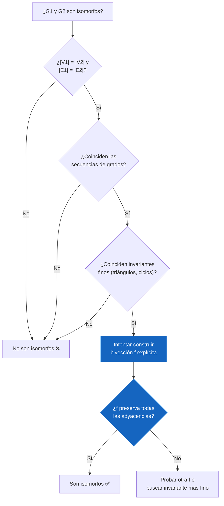
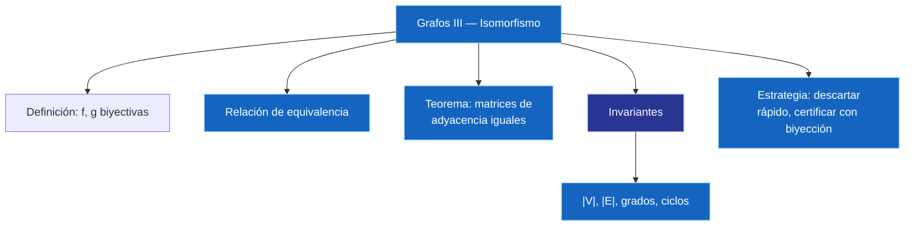

---
{"dg-publish":true,"permalink":"/universidad/3er-semestre/matematicas-discretas/unidad-5-grafos-y-arboles/03-grafos-iii-isomorfismo/","dg-note-properties":{}}
---

# 🕸️ Grafos III — Isomorfismo

## 🎯 Introducción

> [!info] 💡 ¿Cuándo dos grafos son "el mismo" grafo?
> 
> Dos grafos pueden verse completamente distintos al dibujarlos —con vértices en otras posiciones, otros nombres— y sin embargo tener **exactamente la misma estructura** de conexiones. El **isomorfismo de grafos** formaliza esta idea: nos permite decidir si dos grafos son, en esencia, la misma estructura relacional disfrazada con otra notación.
> 
> **Aplicaciones modernas:**
> 
> - Reconocimiento de moléculas químicas idénticas representadas de forma distinta
> - Verificación de equivalencia de circuitos electrónicos
> - Comparación de redes (¿esta red social tiene la misma estructura que aquella?)
> - Criptografía: el problema de isomorfismo de grafos es la base de algunos esquemas de conocimiento cero
> 
> ```mermaid
> graph TD
>     A["Isomorfismo de Grafos"] --> B["Definición: biyecciones f, g"]
>     A --> C["Relación de equivalencia"]
>     A --> D["Invariantes"]
>     D --> E["Descartar isomorfismo rápido"]
>     A --> F["Certificar isomorfismo:<br/>construir biyección"]
>     style A fill:#1e3a5f,color:#fff
>     style D fill:#e1f5ff
> 
    style A fill:#1565C0,color:#FFFFFF,stroke:#90CAF9,stroke-width:1px
    style C fill:#1565C0,color:#FFFFFF,stroke:#90CAF9,stroke-width:1px
    style D fill:#283593,color:#FFFFFF,stroke:#9FA8DA,stroke-width:1px
    style E fill:#1565C0,color:#FFFFFF,stroke:#90CAF9,stroke-width:1px
    style F fill:#1565C0,color:#FFFFFF,stroke:#90CAF9,stroke-width:1px```

---

## 📋 Definición Formal

> [!note] 📋 Definición 1 — Isomorfismo de grafos
> 
> Sean $G_1 = (V_1, E_1)$ y $G_2 = (V_2, E_2)$ dos grafos. Decimos que $G_1$ y $G_2$ son **isomorfos** si existen funciones
> 
> $$f: V_1 \to V_2, \qquad g: E_1 \to E_2$$
> 
> **biyectivas**, tales que una arista $e$ incide en $u$ y $v$ en $G_1$ **si y solo si** $g(e)$ incide en $f(u)$ y $f(v)$ en $G_2$.
> 
> Al par de funciones $(f, g)$ se le llama un **isomorfismo** de $G_1$ en $G_2$.
> 
> > [!warning] ⚠️ Se necesitan DOS biyecciones No basta con una biyección entre vértices: también se necesita una biyección $g$ entre aristas que sea **consistente** con $f$. Ambas funciones deben "viajar juntas" — la incidencia debe preservarse exactamente.

> [!example] 🟢 Ejemplo 1 — Un isomorfismo explícito
> 
> $G_1$ con vértices ${a,b,c,d,e}$ y aristas ${x_1,\ldots,x_5}$; $G_2$ con vértices ${A,B,C,D,E}$ y aristas ${y_1,\ldots,y_5}$.
> 
> Un isomorfismo viene dado por:
> 
> $$f(a)=A,\ f(b)=B,\ f(c)=C,\ f(d)=D,\ f(e)=E$$ $$g(x_i) = y_i \quad \text{para } i=1,\ldots,5$$
> 
> **Verificación:** basta comprobar que si $x_i$ incide en dos vértices de $G_1$, entonces $y_i$ incide en las **imágenes** (bajo $f$) de esos mismos vértices en $G_2$. Si esto se cumple para las 5 aristas, $(f,g)$ es efectivamente un isomorfismo.
> 
> > [!tip]- 💡 Cómo verificar en la práctica Arma una tabla: para cada arista $x_i = {u,v}$ de $G_1$, anota $g(x_i)$ y comprueba que sus extremos en $G_2$ sean exactamente $f(u)$ y $f(v)$. Si todas las filas calzan, terminaste la verificación.

---

## ⚖️ Isomorfismo como Relación de Equivalencia

> [!success] ✅ Observación — Relación de equivalencia
> 
> Si definimos una relación $R$ en el [[Universidad/3er Semestre/Matemáticas Discretas/Unidad 1 - Logica y Conjuntos/IV - Teoría de Conjuntos/04 - Cardinalidad y Leyes de Cardinalidad\|Cardinalidad]] de todos los grafos mediante:
> 
> $$G_1 \mathrel{R} G_2 \iff G_1 \text{ y } G_2 \text{ son isomorfos}$$
> 
> entonces $R$ es una **relación de equivalencia**: es [[Universidad/3er Semestre/Matemáticas Discretas/Unidad 2 - Funciones y Relaciones/02 - Relaciones\|reflexiva]] (todo grafo es isomorfo a sí mismo, con $f$ y $g$ identidad), simétrica (si $G_1$ es isomorfo a $G_2$, se puede invertir el isomorfismo) y transitiva (componer dos isomorfismos da otro isomorfismo).
> 
> > [!tip] 🖥️ Por qué importa esto Al ser relación de equivalencia, el isomorfismo particiona el conjunto de todos los grafos en **clases de equivalencia**: grafos "estructuralmente iguales" aunque tengan vértices con nombres distintos. Esto es justo lo que permite hablar de "el" grafo $K_4$ o "el" grafo $K_{2,3}$ sin importar cómo se etiqueten sus vértices.

---

## 🔢 Matrices de Adyacencia e Isomorfismo

> [!success] ✅ Teorema — Caracterización por matrices de adyacencia
> 
> Dos grafos $G_1$ y $G_2$ son isomorfos **si y solo si** para algún orden de sus vértices, sus matrices de adyacencia son **iguales**.
> 
> > [!tip]- 💡 Interpretación Cambiar el orden de los vértices equivale a **permutar simultáneamente filas y columnas** de la matriz de adyacencia. Buscar un isomorfismo equivale entonces a buscar un reordenamiento de filas/columnas que haga coincidir ambas matrices.

> [!success] ✅ Corolario — Caso de grafos simples
> 
> Sean $G_1 = (V_1, E_1)$ y $G_2 = (V_2, E_2)$ grafos **simples**. Los siguientes enunciados son equivalentes:
> 
> - $G_1$ y $G_2$ son isomorfos.
>     
> - Existe una [[Universidad/3er Semestre/Matemáticas Discretas/Unidad 2 - Funciones y Relaciones/01 - Funciones\|función]] biyectiva $f: V_1 \to V_2$ tal que $v$ y $w$ son adyacentes en $G_1$ $\iff$ $f(v)$ y $f(w)$ son adyacentes en $G_2$.
>     
> 
> > [!tip] 🖥️ Simplificación práctica Para grafos **simples** (sin lazos ni aristas paralelas), no hace falta construir explícitamente la biyección $g$ entre aristas — basta con encontrar $f$ entre vértices que preserve adyacencias. Esto simplifica mucho la verificación en ejercicios.

---

## 🧬 Propiedades Invariantes

> [!note] 📋 Definición 2 — Propiedad invariante
> 
> Una propiedad $P$ es **invariante** (bajo isomorfismo) si para cualquier par de grafos isomorfos $G_1$ y $G_2$: si $G_1$ tiene la propiedad $P$, entonces $G_2$ también la tiene.

> [!note] 📋 Ejemplos de invariantes
> 
> - Número de vértices $|V|$.
> - Número de aristas $|E|$.
> - Los grados de los vértices y el número de vértices con un grado determinado.
> - Existencia de ciclos de cierta longitud (por ejemplo, un ciclo simple de longitud $k$).

> [!success] ✅ Estrategia — Cómo descartar isomorfismo
> 
> Para probar que $G_1$ y $G_2$ **no** son isomorfos, basta encontrar **un solo invariante** que difiera:
> 
> - Si $|E_1| \neq |E_2|$, no pueden ser isomorfos.
>     
> - Si las secuencias de grados difieren, no pueden ser isomorfos.
>     
> - Si uno tiene un ciclo simple de cierta longitud y el otro no, no pueden ser isomorfos.
>     
> 
> > [!warning] ⚠️ Cuidado: los invariantes descartan, pero no certifican Que dos grafos **coincidan** en todos los invariantes que revisaste **no garantiza** que sean isomorfos — solo que no encontraste una diferencia (todavía). Para **certificar** isomorfismo, necesitas construir explícitamente la biyección $f$ (y verificar que preserva adyacencias), no solo comparar invariantes.

> [!example] 🟢 Ejemplo 2 — Descartando por número de aristas
> 
> Si $G_1$ tiene $|E(G_1)| = 7$ y $G_2$ tiene $|E(G_2)| = 6$, entonces **no son isomorfos** — el número de aristas es invariante bajo isomorfismo, y aquí difiere.

> [!example] 🟢 Ejemplo 3 — Descartando por secuencia de grados
> 
> Dados dos grafos $G_1$ (vértices $a,b,c,d,e,f$) y $G_2$ (vértices $g,h,i,j,k,l$), si al calcular los grados se obtiene, por ejemplo, la secuencia $(3,3,2,2,2,2)$ para $G_1$ y $(3,2,2,2,2,3)$ ordenada de forma distinta pero con un valor que no calza al comparar multiplicidades — en general, basta con que **la secuencia de grados ordenada** no coincida exactamente entre ambos grafos para concluir que no son isomorfos.
> 
> > [!tip]- 💡 Cómo comparar secuencias de grados correctamente Ordena los grados de cada grafo de menor a mayor (o mayor a menor) y compáralos posición por posición. Por ejemplo, $(1,2,2,3)$ y $(1,2,3,2)$ son la **misma** secuencia una vez ordenadas — no te dejes engañar por el orden en que aparecen los vértices originalmente.

---

## 📝 Ejercicios Resueltos del Curso

> [!example] 🟢 Ejercicio 1 — Determinar si $G_1$ y $G_2$ son isomorfos
> 
> **Datos:** $G_1$ con vértices ${a,b,c,d,e}$; $G_2$ con vértices ${1,2,3,4,5}$.
> 
> **Estrategia de solución (según la sugerencia del curso):**
> 
> 1. Comparar $|V|$ y $|E|$ de ambos grafos — si difieren, quedan descartados de inmediato.
>     
> 2. Calcular la secuencia de grados (ordenada) de cada grafo y compararlas.
>     
> 3. Si las secuencias calzan, buscar invariantes más finos: número de triángulos, ciclos de longitud 4, etc.
>     
> 4. Si todo coincide, intentar construir una biyección $f$ que respete grados y adyacencias — los vértices de un grado deben mapearse a vértices del mismo grado, respetando las vecindades.
>     
> 
> > [!tip]- 💡 Nota sobre este ejercicio Este ejercicio se deja propuesto en el curso para practicar el procedimiento completo: primero descartar con invariantes rápidos, y solo si sobreviven todas las pruebas, intentar construir la biyección explícita.

> [!example] 🟢 Ejercicio 2 — Determinar si $G_1$ y $G_2$ son isomorfos
> 
> **Datos:** $G_1$ con vértices ${a,b,c,d,e}$; $G_2$ con vértices ${1,2,3,4,5}$.
> 
> Se aplica la misma estrategia de 4 pasos del Ejercicio 1. La diferencia clave suele estar en un invariante más fino (como el número de triángulos) cuando el número de vértices, aristas y la secuencia de grados coinciden entre ambos candidatos — por eso el curso recalca revisar ciclos de longitud 3 y 4 antes de intentar construir la biyección.

!ChatGPT Image 18 ago 2026, 18_13_08.png

---

## 📊 Tabla Comparativa: Herramientas para Isomorfismo

> [!note] 📊 Comparación de técnicas
> 
> |Técnica|Sirve para|Certeza que da|
> |---|---|---|
> |Comparar $\lvert V\rvert$, $\lvert E\rvert$|Descartar rápido|Total si difieren|
> |Comparar secuencia de grados|Descartar rápido|Total si difieren|
> |Buscar ciclos de longitud $k$|Descartar con invariantes finos|Total si difieren|
> |Comparar matrices de adyacencia (todo orden)|Certificar isomorfismo|Total (si y solo si)|
> |Construir biyección $f$ explícita|Certificar isomorfismo|Total si se verifica completamente|

---

## 🧭 Diagrama de Decisión — ¿Son isomorfos $G_1$ y $G_2$?



---

## 🗺️ Resumen Visual



---

## 📝 Ejercicios Progresivos

> [!question] 📋 Nivel 1 — Básico
> 
> **1.** Dos grafos tienen $|V_1|=6$, $|V_2|=6$, $|E_1|=8$, $|E_2|=7$. ¿Pueden ser isomorfos? Justifica.
> 
> **2.** Escribe la definición de isomorfismo usando tus propias palabras, identificando claramente qué papel juega cada una de las dos biyecciones $f$ y $g$.
> 
> **3.** Si $G_1$ tiene un vértice de grado 5 y $G_2$ tiene como grado máximo 4, ¿son isomorfos? ¿Por qué?

> [!question] 📋 Nivel 2 — Intermedio
> 
> **4.** Dos grafos simples $G_1$ y $G_2$ tienen la misma secuencia de grados $(2,2,2,3,3)$. ¿Esto garantiza que son isomorfos? Da un argumento o busca un contraejemplo conceptual.
> 
> **5.** Explica, usando el Teorema de matrices de adyacencia, por qué "probar todos los órdenes posibles de vértices" es una forma válida pero computacionalmente costosa de verificar isomorfismo.
> 
> **6.** Dado que el isomorfismo es una relación de equivalencia, ¿qué representan las clases de equivalencia en el conjunto de todos los grafos con 4 vértices?

> [!question] 📋 Nivel 3 — Avanzado
> 
> **7.** Construye dos grafos simples con la misma secuencia de grados y el mismo número de triángulos, pero que **no** sean isomorfos (pista: revisa la existencia de ciclos de longitud 4).
> 
> **8.** Demuestra que la propiedad "ser un grafo bipartito" es invariante bajo isomorfismo.
> 
> **9.** Para grafos simples con $n$ vértices, ¿cuántas biyecciones $f: V_1 \to V_2$ existen en el [[Universidad/3er Semestre/Matemáticas Discretas/Unidad 4 - Recurrencia y Algoritmos/04 - Análisis de Algoritmos I - Fundamentos y Funciones Matemáticas\|peor caso]], y por qué la búsqueda de un isomorfismo por fuerza bruta es costosa a medida que $n$ crece?

> [!success] ✅ Respuestas
> 
> **1.** No. El número de aristas es un invariante bajo isomorfismo: si $|E_1| \neq |E_2|$ (8 vs. 7), los grafos no pueden ser isomorfos, sin importar que $|V_1|=|V_2|$.
> 
> **2.** $f$ es la biyección entre los conjuntos de vértices (dice "a qué vértice de $G_2$ corresponde cada vértice de $G_1$"), y $g$ es la biyección entre los conjuntos de aristas (dice "a qué arista de $G_2$ corresponde cada arista de $G_1$"). Ambas deben ser consistentes: la arista $g(e)$ debe unir precisamente las imágenes bajo $f$ de los vértices que unía $e$.
> 
> **3.** No son isomorfos. La secuencia de grados es invariante: si $G_1$ tiene un vértice de grado 5 y en $G_2$ el grado máximo es 4, no existe forma de que $f$ mapee ese vértice de grado 5 a un vértice de grado equivalente en $G_2$.
> 
> **4.** No lo garantiza. Coincidir en la secuencia de grados es una condición **necesaria**, no suficiente. Es posible construir dos grafos simples con la misma secuencia de grados pero con conexiones internas distintas (por ejemplo, uno con un ciclo de longitud 4 y otro sin él) que no sean isomorfos — hace falta revisar invariantes más finos o intentar construir la biyección directamente.
> 
> **5.** El teorema dice que basta con que **algún** orden de vértices haga coincidir las matrices. Probar "todos los órdenes posibles" significa probar todas las permutaciones de los $n$ vértices, es decir, hasta $n!$ posibilidades — un número que crece extremadamente rápido, por lo que en la práctica se prefieren invariantes rápidos antes de recurrir a esta fuerza bruta.
> 
> **6.** Cada [[Universidad/3er Semestre/Matemáticas Discretas/Unidad 2 - Funciones y Relaciones/03 - Propiedades y Equivalencia\|clase de equivalencia]] agrupa a todos los grafos con 4 vértices que comparten exactamente la misma estructura de adyacencias, sin importar cómo se etiqueten sus vértices. En otras palabras, cada clase corresponde a lo que informalmente llamamos "un grafo no etiquetado" distinto sobre 4 vértices.
> 
> **7.** Un ejemplo clásico: toma un grafo formado por dos triángulos que comparten un vértice (secuencia de grados con un vértice de grado 4) frente a otro grafo con la misma secuencia de grados pero organizado de forma que no comparte esa estructura de "dos triángulos unidos" — la presencia o ausencia de un ciclo de longitud 4 específico entre ambos permite distinguirlos aunque compartan grados y número de triángulos totales.
> 
> **8.** Sea $G_1$ bipartito con partición $V_1^a, V_1^b$, y sea $(f,g)$ un isomorfismo de $G_1$ a $G_2$. Definimos $V_2^a = f(V_1^a)$ y $V_2^b = f(V_1^b)$. Como $f$ es biyectiva, $V_2^a \cap V_2^b = \varnothing$ y $V_2^a \cup V_2^b = V_2$. Además, como toda arista de $G_1$ va de $V_1^a$ a $V_1^b$, y el isomorfismo preserva incidencia, toda arista de $G_2$ (imagen de alguna arista de $G_1$) va de $V_2^a$ a $V_2^b$. Por lo tanto $G_2$ también es bipartito. $\blacksquare$
> 
> **9.** En el peor caso hay $n!$ biyecciones posibles entre $V_1$ y $V_2$ (todas las formas de emparejar $n$ vértices con otros $n$). Como $n!$ crece factorialmente, revisar cada biyección por fuerza bruta se vuelve impráctico rápidamente para grafos grandes — de ahí la importancia de usar invariantes primero para reducir drásticamente el número de biyecciones candidatas antes de intentar verificar alguna en detalle.

---

## 🎓 Metas de Aprendizaje

> [!success] 🎯 Nivel Básico
> 
> - [ ] Enunciar la definición formal de isomorfismo entre dos grafos
> - [ ] Identificar el papel de las biyecciones $f$ (vértices) y $g$ (aristas)
> - [ ] Reconocer $|V|$, $|E|$ y los grados como invariantes básicos
> - [ ] Descartar isomorfismo cuando el número de vértices o aristas difiere

> [!success] 🎯 Nivel Intermedio
> 
> - [ ] Comparar secuencias de grados ordenadas para descartar isomorfismo
> - [ ] Explicar por qué el isomorfismo es una relación de equivalencia
> - [ ] Aplicar el Teorema de matrices de adyacencia para verificar (o descartar) isomorfismo
> - [ ] Usar el Corolario de grafos simples para simplificar la verificación a una sola biyección $f$

> [!success] 🎯 Nivel Avanzado
> 
> - [ ] Construir explícitamente una biyección $f$ que certifique un isomorfismo
> - [ ] Demostrar que una propiedad estructural (como ser bipartito) es invariante bajo isomorfismo
> - [ ] Distinguir entre condiciones necesarias (coincidencia de invariantes) y condiciones suficientes (biyección verificada) para isomorfismo
> - [ ] Diseñar contraejemplos de grafos con invariantes básicos iguales pero no isomorfos

---

> [!quote] 📖 Referencias [1] Pineda, E. (2025). _Isomorfismo de grafos_. Departamento de Matemáticas, FCNM-ESPOL.

> [!quote] 🔗 Conexiones
> 
> - [[Universidad/3er Semestre/Matemáticas Discretas/Unidad 5 - Grafos y Árboles/01 - Grafos I - Conceptos Básicos y Recorridos\|01 - Grafos I - Conceptos Básicos y Recorridos]] — fundamentos previos: definiciones, tipos de grafos, Euler y Hamilton
> - [[Universidad/3er Semestre/Matemáticas Discretas/Unidad 5 - Grafos y Árboles/02 - Grafos II - Subgrafos, Matrices y Algoritmos\|02 - Grafos II - Subgrafos, Matrices y Algoritmos]] — matriz de adyacencia, base para el Teorema de isomorfismo por matrices

---

**Tags:** #matematicas-discretas #grafos #isomorfismo #invariantes #relacion-de-equivalencia #MATG1051