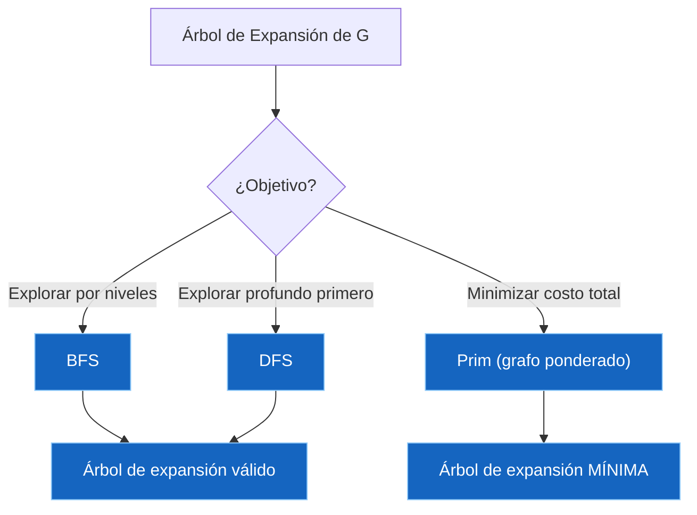
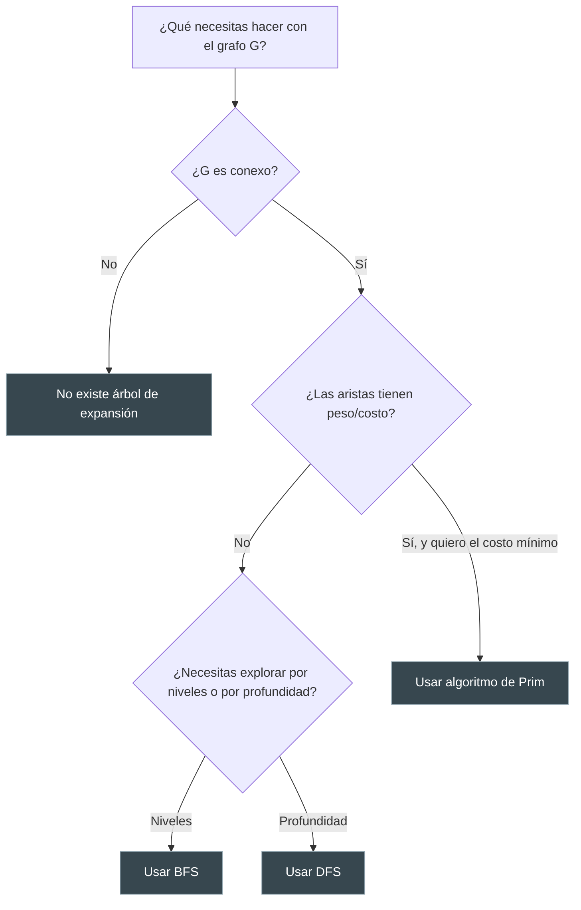

---
{"dg-publish":true,"permalink":"/universidad/3er-semestre/matematicas-discretas/unidad-5-grafos-y-arboles/04-arboles-i-conceptos-basicos-y-arboles-de-expansion/","dg-note-properties":{}}
---

# 🌳 Árboles I — Conceptos Básicos y Árboles de Expansión

## 🎯 Introducción

> [!info] 💡 ¿Qué son los árboles y por qué importan?
> 
> Un **árbol** es el tipo de [[Universidad/3er Semestre/Matemáticas Discretas/Unidad 5 - Grafos y Árboles/01 - Grafos I - Conceptos Básicos y Recorridos\|grafo]] más simple que sigue siendo útil: conexo, sin ciclos, y con una trayectoria única entre cualquier par de vértices. Esa simplicidad es justamente lo que los hace poderosos.
> 
> **Importancia histórica:** Arthur Cayley los estudió formalmente en 1857 para contar isómeros de hidrocarburos saturados en química orgánica — el primer uso serio de teoría de grafos aplicada. Gustav Kirchhoff los usó unos años antes para analizar circuitos eléctricos (leyes de Kirchhoff), sentando las bases de lo que hoy es la teoría de árboles de expansión.
> 
> **Aplicaciones modernas:** sistemas de archivos (carpetas y subcarpetas), bases de datos (índices B-tree), inteligencia artificial (árboles de decisión, minimax en juegos), redes de telecomunicaciones (árboles de expansión mínima para tender cableado al menor costo), y compresión de datos (códigos Huffman — tema que ya viste en Computación y Sociedad, y al que volveremos en la nota [[Universidad/3er Semestre/Matemáticas Discretas/Unidad 5 - Grafos y Árboles/05 - Árboles II - Árboles Binarios, Recorridos y Códigos Huffman\|Árboles II]]).
> 
> ```mermaid
> graph TD
>     A[Árbol T] --> B[Árbol libre]
>     A --> C[Árbol con raíz]
>     B --> D[Trayectoria simple única entre cualquier par de vértices]
>     C --> E[Un vértice designado como raíz]
>     C --> F[Nivel y Altura]
>     C --> G[Árbol de expansión de un grafo G]
>     G --> H["Búsqueda a lo ancho (BFS)"]
>     G --> I["Búsqueda a profundidad (DFS)"]
>     G --> J["Árbol de expansión mínima (Prim)"]
>     style A fill:#1e3a5f,color:#fff
>     style C fill:#e1f5ff
>     style G fill:#f5e1ff
> 
    style A fill:#1565C0,color:#FFFFFF,stroke:#90CAF9,stroke-width:1px
    style B fill:#1565C0,color:#FFFFFF,stroke:#90CAF9,stroke-width:1px
    style C fill:#283593,color:#FFFFFF,stroke:#9FA8DA,stroke-width:1px
    style D fill:#1565C0,color:#FFFFFF,stroke:#90CAF9,stroke-width:1px
    style E fill:#1565C0,color:#FFFFFF,stroke:#90CAF9,stroke-width:1px
    style F fill:#1565C0,color:#FFFFFF,stroke:#90CAF9,stroke-width:1px
    style G fill:#283593,color:#FFFFFF,stroke:#9FA8DA,stroke-width:1px
    style H fill:#1565C0,color:#FFFFFF,stroke:#90CAF9,stroke-width:1px
    style I fill:#1565C0,color:#FFFFFF,stroke:#90CAF9,stroke-width:1px
    style J fill:#1565C0,color:#FFFFFF,stroke:#90CAF9,stroke-width:1px```

---

## 🌲 Fundamentos y Definición Formal

> [!note] 📋 Definición — Árbol (libre)
> 
> Un **árbol (libre)** es un grafo simple $T$ que satisface lo siguiente: si $v$ y $w$ son vértices en $T$, existe una **trayectoria simple única** de $v$ a $w$.
> 
> Un **árbol con raíz** es un árbol en el que un vértice específico se designa como **raíz**.
> 
> > [!tip]- 💡 Convención de dibujo
> > 
> > Al contrario de los árboles naturales (cuyas raíces están abajo), en teoría de grafos los árboles con raíz suelen dibujarse con la raíz **hacia arriba**.

> [!example] 📝 Ejemplo 1 — Árbol libre vs. árbol con raíz
> 
> Dado el árbol $T$ con vértices $v_1, \ldots, v_7$, si se elige $v_1$ como raíz:
> 
> ```mermaid
> graph TD
>     v1((v1)) --> v2((v2))
>     v1 --> v3((v3))
>     v2 --> v4((v4))
>     v2 --> v5((v5))
>     v3 --> v6((v6))
>     v3 --> v7((v7))
> 
    style v1 fill:#1565C0,color:#FFFFFF,stroke:#90CAF9,stroke-width:1px
    style v2 fill:#1565C0,color:#FFFFFF,stroke:#90CAF9,stroke-width:1px
    style v3 fill:#283593,color:#FFFFFF,stroke:#9FA8DA,stroke-width:1px
    style v4 fill:#1565C0,color:#FFFFFF,stroke:#90CAF9,stroke-width:1px
    style v5 fill:#1565C0,color:#FFFFFF,stroke:#90CAF9,stroke-width:1px
    style v6 fill:#1565C0,color:#FFFFFF,stroke:#90CAF9,stroke-width:1px
    style v7 fill:#1565C0,color:#FFFFFF,stroke:#90CAF9,stroke-width:1px```
> 
> - $v_1$ está en el **nivel 0**
> - $v_2$ y $v_3$ están en el **nivel 1**
> - $v_4, v_5, v_6, v_7$ están en el **nivel 2**
> - La **altura** del árbol es $2$

---

## 📏 Nivel y Altura

> [!note] 📋 Definición — Nivel y Altura
> 
> Sea $T$ un árbol con raíz $v_0$. Como la trayectoria simple de la raíz a cualquier vértice dado es única, cada vértice está en un nivel determinado de manera única:
> 
> - El **nivel** de la raíz es el nivel $0$.
> - El **nivel** de un vértice $v$ es la longitud de la trayectoria simple de la raíz a $v$.
> - La **altura** de un árbol con raíz es el número máximo de nivel que ocurre.

> [!example] 📝 Ejemplo 2 — Árbol con raíz elegida arbitrariamente
> 
> Dado un árbol $T$ sobre los vértices $a, b, c, d, e, f, g, h, i, j$, si se escoge $e$ como raíz (obteniendo $T'$):
> 
> Los vértices $a, b, c, d, e, f, g, h, i, j$ quedan (respectivamente) en los niveles $2, 1, 2, 1, 0, 1, 1, 2, 2, 3$.
> 
> La **altura de $T'$ es 3** (nivel máximo alcanzado, por $j$).
> 
> > [!tip]- 💡 El nivel depende de la raíz elegida
> > 
> > Nota que el mismo árbol libre $T$ puede dar niveles distintos según qué vértice se elija como raíz — la **estructura** del árbol no cambia, pero la **jerarquía** sí.

---

## 🧬 Terminología: Padres, Hijos, Ancestros y Descendientes

> [!note] 📋 Definición — Relaciones de parentesco en un árbol
> 
> Sea $T$ un árbol con raíz $v_0$. Supón que ${v_0, v_1, \cdots, v_n}$ es una trayectoria simple en $T$. Entonces:
> 
> - $v_{n-1}$ es el **padre** de $v_n$.
> - $v_0, \cdots, v_{n-1}$ son **ancestros** de $v_n$.
> - $v_n$ es un **hijo** de $v_{n-1}$.
> - Si $x$ es ancestro de $y$, $y$ es **descendiente** de $x$.
> - Si $x$ y $y$ son hijos de $z$, $x$ y $y$ son **hermanos**.
> - Si $x$ no tiene hijos, $x$ es un **vértice terminal** (u **hoja**).
> - Si $x$ no es un vértice terminal, $x$ es un **vértice interno** (o **rama**).
> - El **subárbol de $T$ con raíz en $x$** es el grafo con [[Universidad/3er Semestre/Matemáticas Discretas/Unidad 1 - Logica y Conjuntos/IV - Teoría de Conjuntos/04 - Cardinalidad y Leyes de Cardinalidad\|Cardinalidad]] de vértices $V$ = $x$ junto con los descendientes de $x$, y conjunto de aristas $E$ = las aristas en una trayectoria simple de $x$ a algún vértice en $V$.

> [!example] 📝 Ejemplo 3 — Árbol genealógico de los dioses griegos
> 
> En el árbol con raíz Urano → {Afrodita, Cronos, Atlas, Prometeo} → ... → {Apolo, Atenea, Hermes, Heracles}:
> 
> - El **padre** de Eros es Afrodita.
> - Los **ancestros** de Hermes son Zeus, Cronos y Urano.
> - Los **hijos** de Zeus son Apolo, Atenea, Hermes y Heracles.
> - Los **descendientes** de Cronos son Zeus, Poseidón, Hades, Ares, Apolo, Atenea, Hermes y Heracles.
> - Afrodita y Prometeo son **hermanos**.
> - Los **vértices terminales** son Eros, Apolo, Atenea, Hermes, Heracles, Poseidón, Hades, Ares, Atlas y Prometeo.
> - Los **vértices internos** son Urano, Afrodita, Cronos y Zeus.
> - El **subárbol con raíz en Cronos** contiene a Cronos, Zeus, Poseidón, Hades, Ares, Apolo, Atenea, Hermes y Heracles.

---

## ✅ Teorema de Caracterización de Árboles

> [!success] ✅ Teorema — Condiciones equivalentes para ser árbol
> 
> Sea $T$ un grafo con $n$ vértices. Las siguientes proposiciones son **equivalentes** (si una se cumple, todas se cumplen):

> [!note] 📋 Las cuatro condiciones equivalentes
> 
> |Condición|Descripción|
> |---|---|
> |**a)**|$T$ es un árbol|
> |**b)**|$T$ es conexo y acíclico|
> |**c)**|$T$ es conexo y tiene $n-1$ aristas|
> |**d)**|$T$ es acíclico y tiene $n-1$ aristas|
> 
> > [!tip]- 💡 ¿Por qué es útil esto?
> > 
> > Este teorema te da **cuatro formas distintas** de verificar si algo es un árbol. Si te dan un grafo conexo con $n$ vértices y necesitas confirmar rápido si es árbol, basta con **contar las aristas**: si tiene exactamente $n-1$, ya sabes que es acíclico automáticamente (y viceversa).

---

## 🌐 Árboles de Expansión (Spanning Trees)

> [!note] 📋 Definición — Árbol de expansión
> 
> Un árbol $T$ es un **árbol de expansión** de un grafo $G$ si $T$ es un **subgrafo** de $G$ que contiene **todos los vértices** de $G$.

> [!success] ✅ Teorema — Existencia de árbol de expansión
> 
> Un grafo $G$ tiene un árbol de expansión **si y solo si** $G$ es **conexo**.

> [!example] 📝 Ejemplo 4 — Árboles de expansión de un mismo grafo
> 
> Un grafo $G$ sobre los vértices $a,b,c,d,e,f,g,h$ puede tener **varios** árboles de expansión distintos, dependiendo de qué aristas se conserven. Dos árboles de expansión diferentes de la misma gráfica siempre comparten los mismos vértices, pero usan subconjuntos distintos de aristas (ambos con exactamente $n-1$ aristas).
> 
> > [!warning] ⚠️ Error común
> > 
> > Un árbol de expansión **no es único**. Un grafo conexo con ciclos casi siempre admite múltiples árboles de expansión — todos válidos, todos con $n-1$ aristas, pero con conjuntos de aristas distintos.

---

## 🔍 Algoritmos para Encontrar un Árbol de Expansión

> [!note] 📋 Dos estrategias clásicas
> 
> Ambos algoritmos reciben un grafo conexo $G$ con vértices **ordenados** $v_1, \ldots, v_n$ (se elige $v_1$ como raíz) y producen un árbol de expansión $T$. La diferencia está en **cómo** exploran el grafo.

### 🔹 Búsqueda a lo ancho (BFS)

> [!note] 📋 Idea del algoritmo
> 
> Procesa **todos los vértices de un nivel** antes de moverse al siguiente nivel. Se elige el primer vértice $v_1$ como raíz. Se agregan a $T$ todas las aristas $(v_1, x)$ que no produzcan ciclos. Se repite el proceso con los vértices del nivel 1, luego nivel 2, y así sucesivamente, hasta que ya no se puedan agregar más aristas.

> [!example] 📝 Ejemplo 5 — BFS con orden $abcdefgh$
> 
> Partiendo de la raíz $a$: se agregan las aristas $(a,b)$, $(a,c)$ y $(a,g)$ (nivel 1).
> 
> Se repite con los vértices del nivel 1, en orden:
> 
> - $b$: se incluye $(b,d)$
> - $c$: se incluye $(c,e)$
> - $g$: ninguna arista nueva
> 
> Se repite con los vértices del nivel 2:
> 
> - $d$: se incluye $(d,f)$
> - $e$: ninguna arista nueva
> 
> Se repite con los vértices del nivel 3:
> 
> - $f$: se incluye $(f,h)$
> 
> Como no se pueden agregar más aristas al vértice $h$ en el nivel 4, el proceso termina. El árbol de expansión resultante tiene raíz $a$, con niveles definidos exactamente por el orden en que se agregaron las aristas.

### 🔹 Búsqueda a profundidad (DFS)

> [!note] 📋 Idea del algoritmo
> 
> También llamada **búsqueda de regreso** ("backtracking"). Avanza lo más posible por una sola rama antes de retroceder. Desde el vértice actual $w$ (empezando en la raíz $v_1$), mientras exista una arista $(w, v_k)$ con $k$ mínima que no cree un ciclo, se agrega y se avanza a $v_k$. Cuando ya no se puede avanzar, se **retrocede al padre** de $w$ en $T$ y se repite. Termina cuando se regresa a la raíz sin poder avanzar.

> [!example] 📝 Ejemplo 6 — DFS con orden $abcdefgh$
> 
> Se elige $a$ como raíz. Se agrega la arista $(a,b)$ (mínima disponible). Se repite el proceso avanzando: se agregan $(b,d)$, $(d,c)$, $(c,e)$, $(e,f)$ y $(f,h)$.
> 
> En este punto no se puede agregar ninguna arista $(h, x)$, así que se **retrocede** a $f$ (padre de $h$) y se intenta $(f, x)$ — tampoco es posible, así que se retrocede a $e$ (padre de $f$). Ahí sí se puede agregar $(e, g)$.
> 
> No hay más aristas que agregar, así que se retrocede hasta la raíz y el procedimiento termina.

> [!warning] ⚠️ BFS vs. DFS — no los confundas
> 
> |Aspecto|BFS (a lo ancho)|DFS (a profundidad)|
> |---|---|---|
> |**Estrategia**|Explora nivel por nivel|Avanza lo más posible por una rama antes de retroceder|
> |**Estructura de datos típica**|Cola (FIFO)|Pila (LIFO) — o recursión|
> |**Forma del árbol resultante**|Tiende a ser más "ancho" y de menor altura|Tiende a ser más "profundo" y angosto|
> |**Otro nombre**|—|Búsqueda de regreso / backtracking|

> [!tip] 🖥️ Aplicación en programación
> 
> En código, **BFS** se implementa con una **cola**: se procesan los vértices en el orden en que se descubrieron. **DFS** se implementa con una **pila** (o de forma más natural, con **recursión**), ya que "retroceder al padre" es exactamente lo que hace una pila de llamadas cuando una [[Universidad/3er Semestre/Matemáticas Discretas/Unidad 2 - Funciones y Relaciones/01 - Funciones\|función]] recursiva termina. Ambos algoritmos son la base de recorridos de árboles en estructuras de datos (`árbol.bfs()`, `árbol.dfs()`) y de búsqueda en grafos en general (por ejemplo, para encontrar componentes conexas o detectar ciclos).

---

## ⚖️ Árbol de Expansión Mínima y Algoritmo de Prim

> [!note] 📋 Definición — Árbol de expansión mínima
> 
> Sea $G$ un grafo **ponderado** (cada arista tiene un peso/costo). Un **árbol de expansión mínima** de $G$ es un árbol de expansión de $G$ con **peso total mínimo** (la suma de los pesos de sus aristas es la menor posible entre todos los árboles de expansión posibles).

> [!example] 📝 Ejemplo 7 — Seis ciudades y costos de carreteras
> 
> Dado un grafo ponderado $G$ con 6 ciudades (vértices 1 a 6) y costos de construir carreteras entre pares de ellas:
> 
> - Un árbol de expansión cualquiera podría tener **peso 20**.
> - El árbol de expansión **mínima** tiene **peso 12**.
> 
> La diferencia entre ambos no está en la cantidad de aristas (ambos tienen $n-1 = 5$), sino en **cuáles** aristas se eligieron para minimizar el costo total.

> [!note] 📋 Algoritmo de Prim — idea general
> 
> El algoritmo de Prim construye el árbol de expansión mínima **agregando un vértice a la vez**, siempre eligiendo la arista de **menor peso** que conecta un vértice ya incluido en el árbol con uno que todavía no está incluido:
> 
> 1. Se inicia con un solo vértice $s$ en el árbol.
>     
> 2. Se repite $n-1$ veces: de todas las aristas que conectan un vértice **dentro** del árbol con uno **fuera**, se elige la de **peso mínimo** y se agrega (tanto la arista como el nuevo vértice).
>     
> 3. Al terminar, se tienen $n-1$ aristas formando el árbol de expansión mínima.
>     
> 
> > [!tip]- 🖥️ Complejidad y variantes
> > 
> > La versión simple de Prim (revisando todas las aristas en cada paso) tiene complejidad $O(n^2)$, adecuada para grafos densos. Con una cola de prioridad (heap), se puede optimizar a $O(m \log n)$, mejor para grafos dispersos. Es uno de los algoritmos "greedy" (voraz) más citados en cursos de estructuras de datos, junto con el algoritmo de Kruskal (que en vez de crecer desde un vértice, ordena todas las aristas por peso y las va agregando si no forman ciclo).

!ChatGPT Image 18 ago 2026, 18_29_57.png

---

## 📊 Resumen Visual



---

## 🧭 Estrategia de Elección — Flujograma de Decisión



---

## 📝 Ejercicios Progresivos

> [!question] 📋 Nivel 1 — Básico
> 
> **1.** Dado un árbol $T$ con raíz $r$, si $v_1$ es hijo de $r$ y $v_2$ es hijo de $v_1$: ¿en qué nivel está $v_2$? ¿Es $v_2$ descendiente de $r$?
> 
> **2.** Un grafo $G$ conexo tiene 9 vértices. ¿Cuántas aristas tiene cualquier árbol de expansión de $G$?
> 
> **3.** Verifica: si un grafo tiene 7 vértices y 6 aristas y es conexo, ¿es necesariamente un árbol? Justifica usando el teorema de caracterización.

> [!question] 📋 Nivel 2 — Intermedio
> 
> **4.** Dado un grafo ponderado con vértices ${1,2,3,4}$ y aristas $(1,2)=2$, $(1,3)=5$, $(2,3)=1$, $(2,4)=4$, $(3,4)=3$: encuentra el árbol de expansión mínima usando el algoritmo de Prim, comenzando en el vértice 1.
> 
> **5.** Para el grafo del ejercicio 4, aplica BFS partiendo del vértice 1 (orden $1,2,3,4$) y compara el árbol resultante con el árbol de expansión mínima. ¿Son el mismo árbol?
> 
> **6.** Explica con tus propias palabras por qué un árbol de expansión mínima siempre tiene exactamente $n-1$ aristas, sin importar el algoritmo usado para construirlo.

> [!question] 📋 Nivel 3 — Avanzado
> 
> **7.** Demuestra que si un grafo $G$ es un árbol, entonces tiene **exactamente un** árbol de expansión (él mismo).
> 
> **8.** Dado un grafo conexo con un ciclo de longitud 4 donde todas las aristas tienen el mismo peso, ¿cuántos árboles de expansión mínima distintos existen? Generaliza tu respuesta para un ciclo de longitud $n$.
> 
> **9.** Diseña (en [[Universidad/3er Semestre/Matemáticas Discretas/Unidad 4 - Recurrencia y Algoritmos/03 - Pseudocódigo y Algoritmos\|pseudocódigo]] o descripción) una modificación del algoritmo de Prim que, además de encontrar el árbol de expansión mínima, calcule su peso total sin necesidad de un segundo recorrido.

> [!success] ✅ Respuestas
> 
> **1.** $v_2$ está en el nivel 2 (raíz = nivel 0, $v_1$ = nivel 1, $v_2$ = nivel 2). Sí, $v_2$ es descendiente de $r$ porque $r$ es ancestro de $v_1$, que a su vez es ancestro de $v_2$ — la [[Universidad/3er Semestre/Matemáticas Discretas/Unidad 2 - Funciones y Relaciones/02 - Relaciones\|relación]] ancestro/descendiente es transitiva a lo largo de la trayectoria.
> 
> **2.** $9 - 1 = 8$ aristas, por el teorema de caracterización (condición c).
> 
> **3.** Sí. $G$ es conexo y tiene $n - 1 = 7 - 1 = 6$ aristas, lo cual corresponde exactamente a la condición (c) del teorema de caracterización — por lo tanto $G$ es un árbol.
> 
> **4.** Prim desde el vértice 1: se agrega $(1,2)=2$ (mínima disponible desde 1). Desde ${1,2}$, la mínima hacia afuera es $(2,3)=1$. Desde ${1,2,3}$, la mínima hacia afuera es $(3,4)=3$ (vs. $(2,4)=4$). Árbol de expansión mínima: ${(1,2), (2,3), (3,4)}$ con peso total $2+1+3=6$.
> 
> **5.** BFS desde 1 en orden $1,2,3,4$: nivel 0 = ${1}$; se agregan $(1,2)$ y $(1,3)$ (todas las aristas de 1 hacia vértices no visitados); nivel 1 = ${2,3}$; se examina 2: se agrega $(2,4)$; se examina 3: $4$ ya está en el árbol, no se agrega nada. Árbol BFS: ${(1,2),(1,3),(2,4)}$, peso $2+5+4=11$. **No** es el mismo árbol que el de Prim (peso 6) — BFS no minimiza costo, solo respeta el orden de exploración por niveles.
> 
> **6.** Porque un árbol de expansión es, por definición, un **árbol** que contiene todos los vértices de $G$. Por el teorema de caracterización (condición c), todo árbol con $n$ vértices tiene exactamente $n-1$ aristas — esto es una propiedad estructural del árbol en sí, independiente de cómo se haya construido (BFS, DFS o Prim solo determinan **cuáles** $n-1$ aristas se eligen, no cuántas).
> 
> **7.** Si $G$ es un árbol, ya es conexo y acíclico (condición b). El único subgrafo de $G$ que contiene todos sus vértices y es conexo sin ciclos es $G$ mismo, porque quitar cualquier arista de un árbol lo desconecta (rompe la trayectoria única entre los dos extremos de esa arista), y agregar cualquier arista nueva crearía un ciclo (ya no habría unicidad de trayectorias). Por lo tanto $G$ es su propio y único árbol de expansión.
> 
> **8.** En un ciclo de longitud 4 con pesos iguales, cualquier árbol de expansión mínima se obtiene quitando exactamente **una** arista del ciclo (para romper el único ciclo y dejar $n-1$ aristas conexas). Como hay 4 aristas y todas tienen el mismo peso mínimo, hay **4** árboles de expansión mínima distintos. En general, para un ciclo de longitud $n$ con pesos iguales, hay **$n$** árboles de expansión mínima (uno por cada arista que se podría quitar).
> 
> **9.** Basta con mantener un acumulador `pesoTotal = 0` y, cada vez que el algoritmo agrega una arista $(j,k)$ al conjunto $E$ (línea 16 del pseudocódigo de Prim), sumar `pesoTotal += w(j,k)` en el mismo paso. Al finalizar el ciclo principal, `pesoTotal` contiene el peso del árbol de expansión mínima sin necesidad de recorrer las aristas nuevamente.

---

## 🎯 Metas de Aprendizaje

> [!note] 📋 Nivel Básico
> 
> - [ ] Puedo dar la definición formal de árbol (libre) y de árbol con raíz.
> - [ ] Puedo identificar el nivel de un vértice y la altura de un árbol dado.
> - [ ] Puedo identificar padre, hijos, ancestros, descendientes, hermanos, hojas y vértices internos en un árbol con raíz.
> - [ ] Sé que un árbol con $n$ vértices tiene exactamente $n-1$ aristas.

> [!note] 📋 Nivel Intermedio
> 
> - [ ] Puedo aplicar el teorema de caracterización de árboles (las 4 condiciones equivalentes) para determinar si un grafo dado es un árbol.
> - [ ] Puedo encontrar un árbol de expansión de un grafo conexo usando BFS.
> - [ ] Puedo encontrar un árbol de expansión de un grafo conexo usando DFS.
> - [ ] Entiendo la diferencia estructural entre los árboles que produce BFS y los que produce DFS.

> [!note] 📋 Nivel Avanzado
> 
> - [ ] Puedo aplicar el algoritmo de Prim para encontrar un árbol de expansión mínima en un grafo ponderado.
> - [ ] Puedo demostrar propiedades de árboles usando el teorema de caracterización (por ejemplo, unicidad del árbol de expansión de un árbol).
> - [ ] Puedo razonar sobre cuántos árboles de expansión mínima distintos existen en casos con pesos repetidos.
> - [ ] Puedo comparar y elegir el algoritmo adecuado (BFS, DFS o Prim) según el objetivo del problema.

---

## 📚 Referencias

> [!quote] 📖 Fuentes consultadas
> 
> [1] Pineda, E. (2025). _Árboles_ [Diapositivas de clase]. Departamento de Matemáticas, Facultad de Ciencias Naturales y Matemáticas, Escuela Superior Politécnica del Litoral (ESPOL).
> 
> [2] La numeración de figuras y algoritmos (9.1.x, 9.2.x, 9.3.x, 9.4.x) sugiere como texto base _Discrete and Combinatorial Mathematics_ de R. Grimaldi — útil como referencia complementaria si necesitas más ejemplos o las demostraciones completas de los teoremas.

---

## 🔗 Conexiones

> [!quote] 🔗 Notas relacionadas
> 
> - [[Universidad/3er Semestre/Matemáticas Discretas/Unidad 5 - Grafos y Árboles/03 - Grafos III - Isomorfismo\|03 - Grafos III - Isomorfismo]] — un árbol es, en particular, un grafo simple conexo y acíclico; los conceptos de isomorfismo de grafos aplican igual a árboles.
> - [[Universidad/3er Semestre/Matemáticas Discretas/Unidad 5 - Grafos y Árboles/02 - Grafos II - Subgrafos, Matrices y Algoritmos\|02 - Grafos II - Subgrafos, Matrices y Algoritmos]] — un árbol de expansión es un caso particular de subgrafo generador.
> - [[Universidad/3er Semestre/Matemáticas Discretas/Unidad 5 - Grafos y Árboles/05 - Árboles II - Árboles Binarios, Recorridos y Códigos Huffman\|05 - Árboles II - Árboles Binarios, Recorridos y Códigos Huffman]] — continúa con árboles binarios, sus teoremas, recorridos, y la conexión directa con los códigos Huffman de Computación y Sociedad.

---

**Tags:** #matematicas-discretas #grafos #arboles #arbol-expansion #algoritmo-prim #BFS #DFS #MATG1051