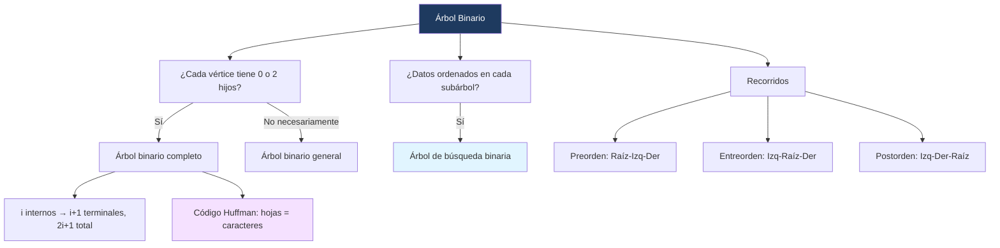
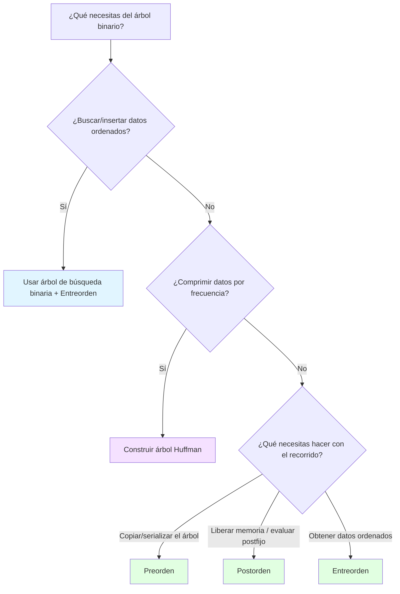

---
{"dg-publish":true,"permalink":"/universidad/3er-semestre/matematicas-discretas/unidad-5-grafos-y-arboles/05-arboles-ii-arboles-binarios-recorridos-y-codigos-huffman/","dg-note-properties":{}}
---

# 🌳 Árboles II — Árboles Binarios, Recorridos y Códigos Huffman

## 🎯 Introducción

> [!info] 💡 ¿Por qué árboles _binarios_ específicamente?
> 
> Los árboles binarios son el caso particular más usado en cómputo: cada vértice tiene **como máximo dos hijos**. Esta restricción, lejos de ser una limitación, es lo que permite construir algoritmos de búsqueda extremadamente eficientes (búsqueda binaria en forma de árbol) y sistemas de codificación óptimos (Huffman).
> 
> **Importancia histórica:** Los árboles binarios de búsqueda se popularizaron en los años 60 como estructura de datos fundamental; David Huffman publicó su algoritmo de codificación en 1952, mientras era estudiante de doctorado en el MIT, resolviendo un problema abierto por su profesor Robert Fano.
> 
> **Aplicaciones modernas:** compresión de archivos (ZIP, JPEG usan variantes de Huffman), bases de datos e índices, autocompletado y diccionarios, árboles de decisión en machine learning, y expresiones aritméticas en compiladores (donde los recorridos preorden/entreorden/postorden generan notación prefija, infija y postfija respectivamente).
> 
> ```mermaid
> graph TD
>     A[Árbol Binario] --> B[Árbol binario completo]
>     A --> C[Árbol de búsqueda binaria]
>     A --> D[Árbol de codificación Huffman]
>     A --> E[Recorridos]
>     E --> F[Preorden]
>     E --> G[Entreorden]
>     E --> H[Postorden]
>     style A fill:#1e3a5f,color:#fff
>     style D fill:#f5e1ff
>     style E fill:#e1f5ff
> ```

---

## 🌿 Árboles Binarios: Definición y Estructura

> [!note] 📋 Definición — Árbol binario
> 
> Un **árbol binario** es un árbol con raíz en el que cada vértice tiene **a lo más dos hijos**. Si el vértice tiene un solo hijo, se designa como **hijo izquierdo** o **hijo derecho** (pero no ambos). Si tiene dos hijos, uno se designa como **hijo izquierdo** y el otro como **hijo derecho**.
> 
> Un **árbol binario completo** es un árbol binario en el que cada vértice tiene **dos o cero hijos** (nunca exactamente uno).

> [!success] ✅ Teorema — Conteo de vértices en un árbol binario completo
> 
> Si $T$ es un árbol binario completo con $i$ vértices internos, entonces $T$ tiene:
> 
> $$i + 1 \text{ vértices terminales}, \qquad 2i + 1 \text{ vértices en total}$$
> 
> > [!tip]- 💡 Idea de la demostración
> > 
> > Todo vértice de $T$ es hijo de alguien, **excepto la raíz**. Como hay $i$ vértices internos y cada uno tiene exactamente 2 hijos (por ser árbol binario _completo_), hay $2i$ hijos en total. Sumando la raíz: $2i + 1$ vértices totales. Los vértices terminales son los que no son internos: $(2i+1) - i = i+1$.

> [!success] ✅ Teorema — Cota de altura según vértices terminales
> 
> Si un árbol binario de altura $h$ tiene $t$ vértices terminales, entonces:
> 
> $$\lg t \leq h$$
> 
> (donde $\lg$ es logaritmo base 2)

> [!example] 📝 Ejemplo 1 — Árbol binario completo con igualdad
> 
> Un árbol binario de altura $h=3$ con $t=8$ vértices terminales (cada nivel se llena completamente: 1 raíz, 2 en nivel 1, 4 en nivel 2, 8 en nivel 3). Aquí la desigualdad se vuelve **igualdad**: $\lg 8 = 3 = h$.
> 
> > [!tip]- 💡 ¿Cuándo se da la igualdad?
> > 
> > La igualdad $\lg t = h$ ocurre quando el árbol está **perfectamente balanceado**: cada nivel, excepto quizás el último, está completamente lleno. Esto es justo lo que buscan las estructuras de datos balanceadas (AVL, árboles rojo-negro) para garantizar búsquedas en tiempo $O(\log n)$.

---

## 🔤 Códigos Huffman: la Aplicación Estrella de los Árboles Binarios

> [!info] 🔗 Conexión con Computación y Sociedad
> 
> Este tema **ya lo trabajaste** en Computación y Sociedad, en la nota [[Universidad/2do Semestre/Computación y Sociedad/Unidad 3 - Representación de la información/II - Compresión de Datos/04 - Códigos Prefijos y Huffman Encoding\|04 - Códigos Prefijos y Huffman Encoding]] (Unidad 3 → II - Compresión de Datos). Ahí lo viste desde la perspectiva de compresión de datos; aquí lo retomamos desde la perspectiva formal de teoría de grafos, viendo el código Huffman como lo que realmente es: **un árbol binario completo con raíz**.
> 
> Si ya tienes esa nota escrita, vale la pena que revises ambas notas juntas — son el mismo objeto matemático visto desde dos ángulos distintos del pénsum.

> [!note] 📋 Motivación — Códigos de longitud variable
> 
> La forma más común de representar caracteres es con cadenas de bits de **longitud fija** (por ejemplo, ASCII usa 7 bits por carácter). Los **códigos Huffman** usan cadenas de bits de **longitud variable**: cadenas cortas para caracteres frecuentes y cadenas largas para caracteres poco frecuentes, reduciendo el espacio total necesario para representar un texto.
> 
> Un código Huffman se define con un **árbol binario completo con raíz**: los caracteres están en los vértices terminales (hojas). Moverse de un vértice a su hijo izquierdo corresponde al bit $1$; moverse a su hijo derecho corresponde al bit $0$.

> [!example] 📝 Ejemplo 2 — Decodificar una cadena de bits
> 
> Dado un árbol Huffman donde $A$ está a la izquierda de la raíz, y $R, O, T, S$ están más abajo por la derecha:
> 
> Se decodifica la cadena $01010111$ **comenzando siempre en la raíz**:
> 
> - Primer bit $0$ → se va a la derecha; luego $1$ → izquierda; luego $0$ → derecha. Se encuentra el carácter $R$.
> - Se regresa a la raíz. Siguiente bit $1$ → izquierda. Se encuentra el carácter $A$.
> - Se regresa a la raíz. Los bits restantes $0111$ se decodifican como $T$.
> 
> **Resultado:** la cadena $01010111$ representa las letras $RAT$.
> 
> > [!warning] ⚠️ Error común al decodificar
> > 
> > Cada vez que se encuentra un carácter (una hoja), hay que **regresar a la raíz** antes de seguir leyendo el siguiente bit. Un error frecuente es seguir bajando por el árbol sin reiniciar, lo cual produce una decodificación incorrecta — precisamente porque un código Huffman es un **código prefijo**: ningún código de un carácter es prefijo del código de otro, así que el punto donde llegas a una hoja siempre marca el fin de un carácter completo.

> [!note] 📋 Algoritmo para construir un código Huffman óptimo
> 
> **Entrada:** una sucesión de $n$ frecuencias, $n \geq 2$. **Salida:** un árbol con raíz que define un código Huffman óptimo.
> 
> $$huffman(f, n)$$
> 
> 1. Si $n = 2$: sean $f_1$ y $f_2$ las dos frecuencias; se construye $T$ con ambas como hojas directas de la raíz. Se retorna $T$.
> 2. Si no: sean $f_i$ y $f_j$ las **dos frecuencias más pequeñas**. Se sustituyen en la lista por $f_i + f_j$ (una sola frecuencia combinada).
> 3. Se llama recursivamente: $T' = huffman(f, n-1)$.
> 4. En $T'$, se sustituye el vértice etiquetado $f_i + f_j$ por un subárbol con $f_i$ y $f_j$ como hijos, obteniendo $T$.
> 5. Se retorna $T$.

> [!example] 📝 Ejemplo 3 — Construcción paso a paso
> 
> Dadas las frecuencias de los caracteres $!, @, \sharp, $, %$: $2, 3, 7, 8, 12$.
> 
> El algoritmo combina repetidamente las **dos frecuencias más pequeñas**:
> 
> $$2,3,7,8,12 ;\to; 5,7,8,12 ;\to; 8,12,12 ;\to; 12,20$$
> 
> Luego se reconstruye el árbol **hacia atrás**, sustituyendo cada frecuencia combinada por el subárbol correspondiente, hasta llegar al árbol final donde las hojas son los caracteres $!, @, \sharp, $, %$ con sus longitudes de código determinadas por su profundidad en el árbol (los más frecuentes, como $%=12$, quedan más cerca de la raíz — código más corto).
> 
> > [!tip]- 💡 Un código Huffman óptimo no es único
> > 
> > Al reconstruir el árbol, cuando hay empates entre frecuencias (por ejemplo, dos vértices con frecuencia 12), se puede elegir cuál va primero. Esto produce **árboles distintos pero igualmente óptimos** — todos con el mismo peso total (longitud esperada del código), aunque las cadenas de bits asignadas a cada carácter cambien.

---

## 🔎 Árboles de Búsqueda Binaria

> [!note] 📋 Definición — Árbol de búsqueda binaria
> 
> Un **árbol de búsqueda binaria** es un árbol binario $T$ en el que se asocian datos a los vértices, arreglados de manera que para cada vértice $v$ en $T$: cada dato en el **subárbol izquierdo** de $v$ es **menor** que el dato en $v$, y cada dato en el **subárbol derecho** de $v$ es **mayor** que el dato en $v$.

> [!example] 📝 Ejemplo 4 — Ordenando palabras alfabéticamente
> 
> Las palabras de la frase "OTRA PERSONA NO DIRÍA TODO JUNTO LO TENDRÍA MEMORIZADO" se insertan en un árbol de búsqueda binaria en el orden en que aparecen. Para cualquier vértice $v$, cada palabra en su subárbol izquierdo precede alfabéticamente a la palabra en $v$, y cada palabra en su subárbol derecho la sucede alfabéticamente.
> 
> Esto permite **buscar una palabra** recorriendo el árbol: en cada vértice, comparas alfabéticamente y decides si ir a la izquierda, a la derecha, o si ya la encontraste — el mismo principio que una búsqueda binaria en un arreglo ordenado, pero en forma de árbol.
> 
> > [!tip]- 🖥️ Aplicación en programación
> > 
> > Un árbol de búsqueda binaria bien balanceado permite buscar, insertar y eliminar en $O(\log n)$ en promedio — mucho mejor que $O(n)$ de una lista. Es la base de estructuras como `TreeMap`/`TreeSet` en Java o `std::map`/`std::set` en C++. El problema es que si insertas datos ya ordenados, el árbol degenera en una lista enlazada ($O(n)$) — por eso existen variantes autobalanceadas como AVL o árboles rojo-negro.

---

## 🔄 Recorridos de Árboles Binarios

> [!note] 📋 Definición — Preorden, Entreorden, Postorden
> 
> Hay tres métodos clásicos de recorrido de árboles binarios. Los prefijos **pre**, **entre** y **post** se refieren a la **posición de la raíz** en el recorrido:
> 
> - **Preorden:** la raíz **primero**, luego el subárbol izquierdo, luego el subárbol derecho.
> - **Entreorden:** el subárbol izquierdo primero, luego la raíz **en medio**, luego el subárbol derecho.
> - **Postorden:** el subárbol izquierdo primero, luego el subárbol derecho, luego la raíz **al final**.
> 
> Cada recorrido se define **recursivamente**: para recorrer un subárbol, se aplica la misma regla a sus propios subárboles.

> [!example] 📝 Ejemplo 5 — Los tres recorridos sobre el mismo árbol
> 
> Dado un árbol con raíz $A$, hijo izquierdo $B$ (con hijos $C, D$; $D$ tiene hijo $E$) e hijo derecho $F$ (con hijo $G$; $G$ tiene hijo $H$; $H$ tiene hijos $I, J$):
> 
> **Preorden** (raíz → izquierda → derecha, aplicado recursivamente):
> 
> $$A, B, C, D, E, F, G, H, I, J$$
> 
> **Entreorden** (izquierda → raíz → derecha):
> 
> $$C, B, E, D, A, F, I, H, J, G$$
> 
> **Postorden** (izquierda → derecha → raíz):
> 
> $$C, E, D, B, I, J, H, G, F, A$$
> 
> > [!tip]- 💡 Cómo verificarlo sin equivocarte
> > 
> > Dibuja el árbol y, para cada vértice, pregúntate: ¿en qué posición relativa a sus dos subárboles cae la letra? En preorden, cada letra aparece **antes** que todo lo que cuelga de ella. En postorden, cada letra aparece **después** de todo lo que cuelga de ella. En entreorden, aparece **entre** su subárbol izquierdo completo y su subárbol derecho completo.

> [!note] 📋 Comparación de los tres recorridos
> 
> |Recorrido|Orden de visita|Posición de la raíz|Uso típico|
> |---|---|---|---|
> |**Preorden**|Raíz, Izq, Der|Primero|Copiar/serializar un árbol; notación prefija (polaca)|
> |**Entreorden**|Izq, Raíz, Der|En medio|Recuperar datos ordenados de un árbol de búsqueda binaria; notación infija|
> |**Postorden**|Izq, Der, Raíz|Al final|Eliminar/liberar un árbol de forma segura; notación postfija (polaca inversa)|

> [!warning] ⚠️ Error común
> 
> No confundas "entreorden" con "el orden en que fueron insertados los datos". El **entreorden** de un árbol de búsqueda binaria siempre produce los datos en **orden alfabético/numérico ascendente**, sin importar en qué orden se insertaron originalmente — esa es justamente la propiedad que lo hace útil.


---

## 📊 Resumen Visual



---

## 🧭 Estrategia de Elección — Flujograma de Decisión



---

## 📝 Ejercicios Progresivos

> [!question] 📋 Nivel 1 — Básico
> 
> **1.** Un árbol binario completo tiene $i = 5$ vértices internos. ¿Cuántos vértices terminales y cuántos vértices totales tiene?
> 
> **2.** Dado el árbol con raíz $A$, hijos $B$ (izquierda) y $C$ (derecha), donde $B$ tiene hijo izquierdo $D$: escribe el recorrido **preorden**.
> 
> **3.** Para el mismo árbol del ejercicio 2, escribe el recorrido **postorden**.

> [!question] 📋 Nivel 2 — Intermedio
> 
> **4.** Un árbol binario tiene altura $h = 4$. ¿Cuál es el número **máximo** de vértices terminales que puede tener, según el teorema $\lg t \leq h$?
> 
> **5.** Dadas las frecuencias ${4, 5, 6, 9}$ para cuatro caracteres, construye el árbol Huffman paso a paso (indica en qué orden se combinan las frecuencias) y da la longitud en bits del código de cada carácter.
> 
> **6.** Inserta las palabras **PERRO, GATO, ZORRO, ARDILLA, LOBO** (en ese orden) en un árbol de búsqueda binaria. Dibuja el árbol resultante y da su recorrido entreorden.

> [!question] 📋 Nivel 3 — Avanzado
> 
> **7.** Decodifica la cadena de bits $011000010$ usando un árbol Huffman donde, de raíz hacia abajo por la izquierda ($1$) llegas a $S$, y por la derecha ($0$) hay una rama que baja hasta $A$, $N$, $P$, $D$, $L$, $E$ en distintas profundidades (usa el mismo árbol del Ejemplo 3 de la nota, adaptado). Muestra el proceso bit por bit.
> 
> **8.** Demuestra que en cualquier árbol binario completo, el número de vértices totales $n = 2i+1$ es siempre **impar**. ¿Qué implica esto sobre la posibilidad de que un árbol binario completo tenga un número par de vértices?
> 
> **9.** Dado el recorrido preorden $A, B, D, C, E, F$ y el recorrido entreorden $D, B, A, E, C, F$ de un mismo árbol binario, reconstruye el árbol original. (Pista: en preorden, el primer elemento siempre es la raíz; úsalo para dividir el entreorden en subárbol izquierdo y derecho, y repite recursivamente.)

> [!success] ✅ Respuestas
> 
> **1.** Vértices terminales $= i+1 = 6$. Vértices totales $= 2i+1 = 11$.
> 
> **2.** Preorden (raíz, izq, der): $A, B, D, C$.
> 
> **3.** Postorden (izq, der, raíz): $D, B, C, A$.
> 
> **4.** $\lg t \leq 4 \Rightarrow t \leq 2^4 = 16$. El máximo es **16 vértices terminales**.
> 
> **5.** Combinando las dos menores repetidamente: $4,5,6,9 \to 9,6,9 \to 15,9 \to 24$. El árbol final da: el carácter con frecuencia 9 (el original) queda a profundidad 1 (código de 1 bit); los de frecuencia 4 y 5 quedan a profundidad 3 (códigos de 3 bits); el otro 9 queda a profundidad 2 (código de 2 bits). En general: mientras menor la frecuencia, más profundo el carácter y más largo su código — exactamente lo que busca Huffman para minimizar el peso total.
> 
> **6.** Árbol resultante (PERRO es la raíz; alfabéticamente ARDILLA < GATO < LOBO < PERRO < ZORRO): PERRO (raíz) → izquierda: GATO → (izquierda: ARDILLA); PERRO → derecha: ZORRO → (izquierda: LOBO). Entreorden: **ARDILLA, GATO, LOBO, PERRO, ZORRO** (orden alfabético, como espera la propiedad del árbol de búsqueda binaria).
> 
> **7.** Siguiendo el árbol desde la raíz: $0$ → derecha; $1$ → izquierda; $1$ → izquierda; $0$ → derecha, se llega a un carácter (primer carácter decodificado). Se regresa a la raíz y se repite con los bits restantes. El proceso es análogo al Ejemplo 2 de esta nota: siempre se reinicia en la raíz después de cada carácter encontrado, y el resultado depende de la forma exacta del árbol dado en el ejercicio original de la diapositiva de clase — revisa el árbol específico del PDF para confirmar las hojas exactas.
> 
> **8.** $n = 2i+1$: para cualquier entero $i \geq 0$, $2i$ es par, por lo tanto $2i+1$ es impar. Esto implica que **ningún** árbol binario completo puede tener un número par de vértices totales — si alguien te presenta un árbol binario completo con, por ejemplo, 10 vértices, sabes de inmediato (sin dibujarlo) que hay un error en el enunciado o que el árbol no es realmente completo.
> 
> **9.** El primer elemento del preorden, $A$, es la raíz. En el entreorden $D, B, A, E, C, F$, todo lo que está **antes** de $A$ ($D, B$) es el subárbol izquierdo; todo lo que está **después** ($E, C, F$) es el subárbol derecho. Repitiendo: en el subárbol izquierdo, preorden da $B, D$ → $B$ es raíz del subárbol izquierdo, con $D$ como su único hijo (izquierdo, ya que $D$ precede a $B$ en el entreorden parcial $D, B$). En el subárbol derecho, preorden da $C, E, F$ → $C$ es la raíz; en el entreorden parcial $E, C, F$, $E$ queda a la izquierda de $C$ y $F$ a la derecha. **Árbol reconstruido:** $A$ (raíz) con hijo izquierdo $B$ (que tiene hijo izquierdo $D$) e hijo derecho $C$ (que tiene hijo izquierdo $E$ e hijo derecho $F$).

---

## 🎯 Metas de Aprendizaje

> [!note] 📋 Nivel Básico
> 
> - [ ] Puedo definir árbol binario y árbol binario completo, y distinguirlos con ejemplos.
> - [ ] Puedo aplicar la fórmula $2i+1$ vértices totales / $i+1$ terminales en un árbol binario completo.
> - [ ] Puedo identificar y ejecutar manualmente los recorridos preorden, entreorden y postorden en un árbol pequeño.

> [!note] 📋 Nivel Intermedio
> 
> - [ ] Puedo construir un árbol de búsqueda binaria insertando datos en un orden dado.
> - [ ] Puedo usar el recorrido entreorden para extraer datos ordenados de un árbol de búsqueda binaria.
> - [ ] Puedo construir paso a paso un árbol Huffman a partir de una tabla de frecuencias.
> - [ ] Puedo decodificar una cadena de bits usando un árbol Huffman dado.

> [!note] 📋 Nivel Avanzado
> 
> - [ ] Puedo demostrar propiedades estructurales de árboles binarios completos (por ejemplo, paridad del número de vértices).
> - [ ] Puedo reconstruir un árbol binario a partir de dos de sus recorridos (por ejemplo, preorden + entreorden).
> - [ ] Puedo explicar por qué un código Huffman óptimo no es necesariamente único, y en qué casos ocurren empates.
> - [ ] Puedo conectar la representación de árboles Huffman con lo visto en Computación y Sociedad, explicando la relación en mis propias palabras.

---

## 📚 Referencias

> [!quote] 📖 Fuentes consultadas
> 
> [1] Pineda, E. (2025). _Árboles_ [Diapositivas de clase]. Departamento de Matemáticas, Facultad de Ciencias Naturales y Matemáticas, Escuela Superior Politécnica del Litoral (ESPOL).
> 
> [2] La numeración de figuras (9.1.x en adelante) sugiere como texto base _Discrete and Combinatorial Mathematics_ de R. Grimaldi — útil como referencia complementaria para las demostraciones completas.

---

## 🔗 Conexiones

> [!quote] 🔗 Notas relacionadas
> 
> - [[Universidad/3er Semestre/Matemáticas Discretas/Unidad 5 - Grafos y Árboles/04 - Árboles I - Conceptos Básicos y Árboles de Expansión\|04 - Árboles I - Conceptos Básicos y Árboles de Expansión]] — fundamentos de árboles, terminología, árboles de expansión y algoritmos BFS/DFS/Prim que preceden a esta nota.
> - [[Universidad/2do Semestre/Computación y Sociedad/Unidad 3 - Representación de la información/II - Compresión de Datos/04 - Códigos Prefijos y Huffman Encoding\|04 - Códigos Prefijos y Huffman Encoding]] — la nota de Computación y Sociedad donde viste Huffman por primera vez, desde la perspectiva de compresión de datos. Vale la pena revisarlas juntas.
> - [[Universidad/2do Semestre/Computación y Sociedad/Unidad 3 - Representación de la información/II - Compresión de Datos/03 - Run Length Encoding\|03 - Run Length Encoding]] — otra técnica de compresión de la misma unidad de Computación y Sociedad, útil para contrastar con Huffman (RLE comprime por repetición, Huffman por frecuencia).

---

**Tags:** #matematicas-discretas #arboles #arboles-binarios #huffman #recorridos #MATG1051 #computacion-y-sociedad