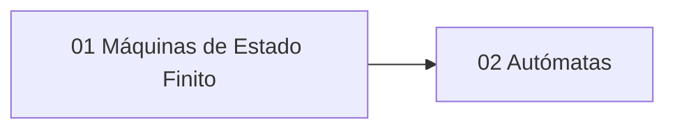

---
{"dg-publish":true,"permalink":"/universidad/3er-semestre/matematicas-discretas/unidad-6-lenguajes-y-automatas/00-indice-unidad-6/","tags":["MATG1051","unidad6","indice","discretas"],"dg-note-properties":{"tags":["MATG1051","unidad6","indice","discretas"]}}
---

# 🗺️ Unidad 6 — Lenguajes y Autómatas — Índice

> [!info] ℹ️ Índice auto-actualizable con Dataview
> Esta nota lista automáticamente todas las notas de esta unidad. No necesitas editarla al agregar una nueva: aparece sola al guardarla.

## 📑 Notas de la Unidad

| Nota                                                                                                                                                                                                                      | Actualizado | Salientes | Entrantes |
| ------------------------------------------------------------------------------------------------------------------------------------------------------------------------------------------------------------------------- | ----------- | --------- | --------- |
| [[Universidad/3er Semestre/Matemáticas Discretas/Unidad 6 - Lenguajes y Autómatas/01 - Máquinas de Estado Finito - Definición y Estructura\|01 — Máquinas de Estado Finito — Definición y Estructura]]                 | 2026-08-28  | 5         | 3         |
| [[Universidad/3er Semestre/Matemáticas Discretas/Unidad 6 - Lenguajes y Autómatas/02 - Autómatas de Estado Finito - Diseño y Aceptación de Cadenas\|02 — Autómatas de Estado Finito — Diseño y Aceptación de Cadenas]] | 2026-08-28  | 4         | 3         |

{ .block-language-dataview}

## ✅ Avance — Metas de Aprendizaje

# [[Universidad/3er Semestre/Matemáticas Discretas/Unidad 6 - Lenguajes y Autómatas/01 - Máquinas de Estado Finito - Definición y Estructura\|01 - Máquinas de Estado Finito - Definición y Estructura]]

    - [ ] Explico qué distingue un sistema combinacional de uno secuencial.
    - [ ] Describo la función de un retraso unitario de tiempo.
    - [ ] Identifico los seis componentes de $M=(I,O,S,f,g,\sigma)$.
    - [ ] Leo correctamente una tabla de transición ($f$ y $g$).
    - [ ] Construyo el diagrama de transición de una máquina de estado finito a partir de su tabla.
    - [ ] Calculo la cadena de salida correspondiente a una cadena de entrada dada.
    - [ ] Modelo el sumador en serie como MEF, identificando $I$, $O$, $S$, $f$, $g$, $\sigma$.
    - [ ] Justifico cuántos estados mínimos necesita una MEF para una tarea dada.
    - [ ] Diseño desde cero una MEF para un sistema secuencial nuevo, identificando la información mínima relevante del pasado.
    - [ ] Demuestro propiedades generales sobre MEF por inducción (p. ej. longitud de la cadena de salida).
    - [ ] Extiendo un diseño existente (como el sumador en serie) para manejar casos adicionales (overflow, señales de control).
    - [ ] Relaciono el concepto de MEF con su implementación en hardware y software.
# [[Universidad/3er Semestre/Matemáticas Discretas/Unidad 6 - Lenguajes y Autómatas/02 - Autómatas de Estado Finito - Diseño y Aceptación de Cadenas\|02 - Autómatas de Estado Finito - Diseño y Aceptación de Cadenas]]

    - [ ] Explico qué es un estado de aceptación y cómo se distingue en un diagrama.
    - [ ] Distingo la notación de sextupla ($O=\{0,1\}$) de la notación de quíntupla ($A=(I,S,f,\mathcal{A},\sigma)$).
    - [ ] Determino manualmente si una cadena corta es aceptada, siguiendo su trayectoria paso a paso.
    - [ ] Sé cuándo se acepta la cadena nula $\lambda$.
    - [ ] Diseño un autómata simple (2-3 estados) a partir de la descripción de un lenguaje en español.
    - [ ] Sigo el método de 6 pasos para diseñar un autómata de forma sistemática.
    - [ ] Comparo y explico las diferencias entre una MEF general y un autómata de estado finito.
    - [ ] Verifico un diseño propio probando cadenas aceptadas y rechazadas.
    - [ ] Diseño autómatas para lenguajes que requieren "contar" información (paridad, residuos módulo $n$, posiciones de patrones).
    - [ ] Demuestro formalmente por inducción propiedades sobre trayectorias y aceptación.
    - [ ] Determino el número **mínimo** de estados necesarios para un lenguaje dado, justificando por qué no se puede usar menos.
    - [ ] Conecto el concepto de autómata con su aplicación real en expresiones regulares y analizadores léxicos.

{ .block-language-dataview}

## ⚠️ Notas huérfanas (sin enlaces entrantes)

{ .block-language-dataview}

## 📊 Mapa de conexiones

> [!quote] 🔗 Conexiones
> - Previo: [[Universidad/3er Semestre/Matemáticas Discretas/Unidad 5 - Grafos y Árboles/05 - Árboles II - Árboles Binarios, Recorridos y Códigos Huffman\|05 - Árboles II - Árboles Binarios, Recorridos y Códigos Huffman]] (Unidad 5)
> - MOC general: [[Universidad/3er Semestre/Matemáticas Discretas/Matemáticas Discretas\|Matemáticas Discretas]]

---
**Tags:** #MATG1051 #unidad6 #indice #discretas
