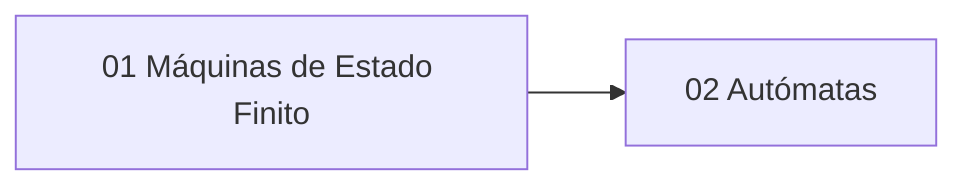

---
{"dg-publish":true,"permalink":"/universidad/3er-semestre/matematicas-discretas/unidad-6-lenguajes-y-automatas/00-indice-unidad-6/","tags":["MATG1051","unidad6","indice","discretas"],"dg-note-properties":{"tags":["MATG1051","unidad6","indice","discretas"]}}
---

# 🗺️ Unidad 6 — Lenguajes y Autómatas — Índice

> [!info] ℹ️ Índice manual
> Se actualiza a mano para que funcione igual en Obsidian y en Digital Garden.

## 📑 Notas de la Unidad

- [[Universidad/3er Semestre/Matemáticas Discretas/Unidad 6 - Lenguajes y Autómatas/01 - Máquinas de Estado Finito - Definición y Estructura\|01 - Máquinas de Estado Finito - Definición y Estructura]]
- [[Universidad/3er Semestre/Matemáticas Discretas/Unidad 6 - Lenguajes y Autómatas/02 - Autómatas de Estado Finito - Diseño y Aceptación de Cadenas\|02 - Autómatas de Estado Finito - Diseño y Aceptación de Cadenas]]
- [[Universidad/3er Semestre/Matemáticas Discretas/Unidad 6 - Lenguajes y Autómatas/Guía de Problemas 6 - Ejercicios Resueltos\|Guía de Problemas 6 - Ejercicios Resueltos]]

## 📊 Mapa de conexiones

```mermaid
graph LR
    A[01 Máquinas de Estado Finito] --> B[02 Autómatas]
```

> [!quote] 🔗 Conexiones
> - Previo: [[Universidad/3er Semestre/Matemáticas Discretas/Unidad 5 - Grafos y Árboles/05 - Árboles II - Árboles Binarios, Recorridos y Códigos Huffman\|05 - Árboles II - Árboles Binarios, Recorridos y Códigos Huffman]] (Unidad 5)
> - MOC general: [[Universidad/3er Semestre/Matemáticas Discretas/Matemáticas Discretas\|Matemáticas Discretas]]

---
**Tags:** #MATG1051 #unidad6 #indice #discretas
