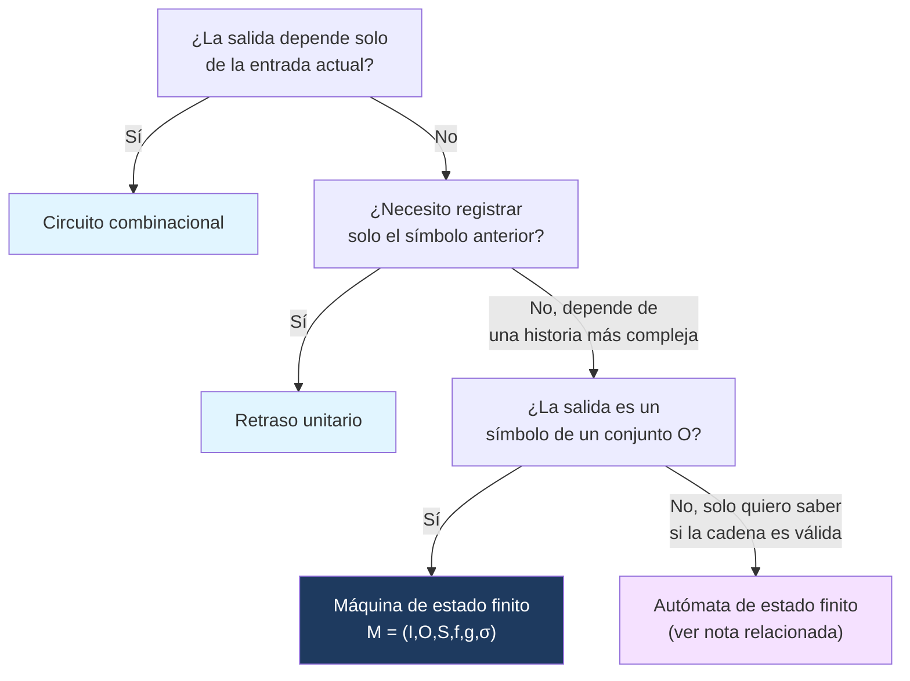

---
{"dg-publish":true,"permalink":"/universidad/3er-semestre/matematicas-discretas/unidad-6-lenguajes-y-automatas/01-maquinas-de-estado-finito-definicion-y-estructura/","dg-note-properties":{}}
---


# 🖥️ Máquinas de Estado Finito

## 🎯 Introducción

> [!info] 💡 ¿Por qué estudiar máquinas de estado finito?
>
> Las **máquinas de estado finito** (MEF) son uno de los modelos más influyentes de las matemáticas discretas y las ciencias de la computación. Su formalización en los años 1950 (Mealy, Moore) permitió describir con precisión sistemas que **recuerdan** información del pasado usando una cantidad *finita* de memoria — desde un simple sumador digital hasta un semáforo, un cajero automático o el analizador léxico de un compilador.
>
> La idea central que las distingue de un circuito combinacional es simple pero poderosa: **la salida ya no depende solo de la entrada actual, sino también de un estado interno que resume la historia relevante del sistema.**
>
> **Aplicaciones modernas:**
> - Diseño de circuitos secuenciales (registros, contadores, sumadores) — tema directamente conectado con Sistemas Digitales.
> - Analizadores léxicos y compiladores (reconocer tokens válidos).
> - Protocolos de red y validación de formatos (expresiones regulares).
> - Control industrial y sistemas embebidos (semáforos, ascensores, máquinas expendedoras).
>
> ```mermaid
> graph TD
>     A["Sistema secuencial"] --> B["Entrada actual"]
>     A --> C["Estado interno<br/>(memoria finita)"]
>     B --> D["Nueva salida"]
>     C --> D
>     C --> E["Nuevo estado"]
>     style A fill:#1e3a5f,color:#fff
>     style C fill:#f5e1ff
>     style D fill:#e1ffe1
>     style E fill:#e1f5ff
> ```

---

## 🧠 Fundamentos: Sistemas con Memoria

> [!note] 📋 Combinacional vs. Secuencial
>
> - En un **circuito combinacional**, la salida depende **únicamente** de las entradas actuales.
> - En un **sistema secuencial**, la salida puede depender de:
>     - la entrada actual;
>     - entradas anteriores;
>     - un **estado interno** que resume la historia relevante del sistema.
>
> **Idea central:** una máquina de estado finito modela un sistema con una cantidad **finita** de memoria.

---

## ⏱️ Retraso Unitario de Tiempo

> [!note] 📋 Definición — Retraso unitario
>
> Un **retraso unitario de tiempo** acepta como entrada un bit $x_t$ en el tiempo $t$ y produce como salida $x_{t-1}$, el bit recibido en el tiempo $t-1$.
>
> ```mermaid
> graph LR
>     A["x_t"] --> B["Retraso"] --> C["x_{t-1}"]
>     style B fill:#1e3a5f,color:#fff
> ```
>
> **Observación:** el retraso unitario permite almacenar información del instante anterior — es el bloque más simple que introduce "memoria" en un sistema digital.

> [!example]- 🟢 Ejemplo — Retraso unitario aplicado a una secuencia
>
> Sea la entrada en tiempos consecutivos:
>
> $$(x_0, x_1, x_2, x_3, x_4) = (1, 0, 1, 1, 0)$$
>
> Si inicialmente no hay bit almacenado, tomamos $x_{-1} = 0$.
>
> | $t$ | 0 | 1 | 2 | 3 | 4 |
> |---|---|---|---|---|---|
> | Entrada $x_t$ | 1 | 0 | 1 | 1 | 0 |
> | Salida $x_{t-1}$ | 0 | 1 | 0 | 1 | 1 |
>
> La salida en cada instante es el bit que entró en el instante anterior.

---

## ➕ Sumador en Serie: Sistema con Memoria

> [!note] 📋 Definición — Sumador en serie
>
> Un **sumador en serie** acepta dos números binarios
>
> $$x = 0x_Nx_{N-1}\cdots x_0, \qquad y = 0y_Ny_{N-1}\cdots y_0$$
>
> y produce la suma $z = z_{N+1}z_N\cdots z_0$. Los bits se introducen secuencialmente por pares:
>
> $$(x_0,y_0),(x_1,y_1),\ldots,(x_N,y_N),(0,0)$$

> [!note] 🔩 Estructura del sumador en serie
>
> ```mermaid
> graph LR
>     xt["x_t"] --> S["Sumador<br/>completo"]
>     yt["y_t"] --> S
>     ct1["c_{t-1}"] --> S
>     S --> zt["z_t"]
>     S --> ct["c_t"]
>     ct --> R["Retraso"]
>     R --> ct1
>     style S fill:#1e3a5f,color:#fff
>     style R fill:#f5e1ff
> ```
>
> El **sumador completo** calcula el bit de suma $z_t$ y el nuevo acarreo $c_t$. El **retraso** guarda $c_t$ para usarlo como $c_{t-1}$ en el siguiente instante — esto es exactamente lo que le da "memoria" al sumador.

> [!note] 📋 Reglas del sumador completo
>
> Para bits $x_t, y_t, c_{t-1} \in \{0,1\}$:
>
> $$c_t = 1 \iff x_t + y_t + c_{t-1} \geq 2$$
>
> | $x_t$ | $y_t$ | $c_{t-1}$ | $z_t$ | $c_t$ |
> |---|---|---|---|---|
> | 0 | 0 | 0 | 0 | 0 |
> | 0 | 0 | 1 | 1 | 0 |
> | 0 | 1 | 0 | 1 | 0 |
> | 0 | 1 | 1 | 0 | 1 |
> | 1 | 0 | 0 | 1 | 0 |
> | 1 | 0 | 1 | 0 | 1 |
> | 1 | 1 | 0 | 0 | 1 |
> | 1 | 1 | 1 | 1 | 1 |

> [!example]- 🟢 Ejemplo — Suma en serie de $010$ y $011$
>
> Tomamos $x = 010$, $y = 011$. Los bits se leen de derecha a izquierda:
>
> $$(x_0,y_0)=(0,1), \quad (x_1,y_1)=(1,1), \quad (x_2,y_2)=(0,0)$$
>
> | $t$ | $x_t$ | $y_t$ | $c_{t-1}$ | $z_t$ | $c_t$ |
> |---|---|---|---|---|---|
> | 0 | 0 | 1 | 0 | 1 | 0 |
> | 1 | 1 | 1 | 0 | 0 | 1 |
> | 2 | 0 | 0 | 1 | 1 | 0 |
>
> La salida es $z_2z_1z_0 = 101$.

---

## 🔢 Definición Formal: Máquina de Estado Finito

> [!note] 📋 Definición — Máquina de estado finito
>
> Una **máquina de estado finito** es una sextupla
>
> $$M = (I, O, S, f, g, \sigma)$$
>
> donde:
> 1. $I$ es un conjunto finito de **símbolos de entrada**.
> 2. $O$ es un conjunto finito de **símbolos de salida**.
> 3. $S$ es un conjunto finito de **estados**.
> 4. $f : S \times I \to S$ es la **función de siguiente estado**.
> 5. $g : S \times I \to O$ es la **función de salida**.
> 6. $\sigma \in S$ es el **estado inicial**.

> [!note] 📋 Interpretación de los componentes
>
> | Componente | Interpretación |
> |---|---|
> | $I$ | símbolos que la máquina puede leer |
> | $O$ | símbolos que la máquina puede producir |
> | $S$ | memoria finita del sistema |
> | $f$ | regla que actualiza el estado |
> | $g$ | regla que produce la salida |
> | $\sigma$ | estado desde el cual inicia el proceso |
>
> **Lectura dinámica:** si la máquina está en el estado $s$ y lee la entrada $i$, entonces pasa al estado $f(s,i)$ y produce la salida $g(s,i)$.

> [!example]- 🟢 Ejemplo — Máquina de estado finito con dos estados
>
> Sea $I=\{a,b\}$, $O=\{0,1\}$, $S=\{\sigma_0,\sigma_1\}$, con:
>
> | $S\backslash I$ | $f(\cdot,a)$ | $f(\cdot,b)$ | $g(\cdot,a)$ | $g(\cdot,b)$ |
> |---|---|---|---|---|
> | $\sigma_0$ | $\sigma_0$ | $\sigma_1$ | 0 | 1 |
> | $\sigma_1$ | $\sigma_1$ | $\sigma_1$ | 1 | 0 |
>
> Con estado inicial $\sigma_0$: $M = (I,O,S,f,g,\sigma_0)$.
>
> De la tabla: $f(\sigma_0,a)=\sigma_0$, $g(\sigma_0,a)=0$; $f(\sigma_0,b)=\sigma_1$, $g(\sigma_0,b)=1$; $f(\sigma_1,a)=\sigma_1$, $g(\sigma_1,a)=1$; $f(\sigma_1,b)=\sigma_1$, $g(\sigma_1,b)=0$.
>
> Si el estado actual es $\sigma_0$ y la entrada es $b$, la máquina cambia a $\sigma_1$ y emite $1$.

---

## 📊 Diagrama de Transición

> [!note] 📋 Definición — Diagrama de transición
>
> Sea $M=(I,O,S,f,g,\sigma)$ una máquina de estado finito. El **diagrama de transición** de $M$ es un digrafo cuyos vértices son los estados de $S$. Hay una arista dirigida de $s_1$ a $s_2$ con etiqueta $i/o$ si
>
> $$f(s_1,i)=s_2 \quad \text{y} \quad g(s_1,i)=o$$
>
> Una flecha entrante señala el estado inicial $\sigma$. Cada etiqueta tiene la forma **entrada/salida**.

> [!note] 📊 Diagrama del ejemplo de dos estados
>
> ```mermaid
> graph LR
>     start(( )) --> s0(("σ₀"))
>     s0 -->|"a/0"| s0
>     s0 -->|"b/1"| s1(("σ₁"))
>     s1 -->|"a/1"| s1
>     s1 -->|"b/0"| s1
>     style start fill:#fff,stroke:#fff
>     style s0 fill:#1e3a5f,color:#fff
>     style s1 fill:#f5e1ff
> ```

---

## 🔤 Cadenas de Entrada y Salida

> [!note] 📋 Definición — Cadena de salida
>
> Sea $\alpha = x_1x_2\cdots x_n$ una cadena de entrada. La cadena $y_1y_2\cdots y_n$ es la **salida correspondiente** si existen estados $\sigma_0,\sigma_1,\ldots,\sigma_n$ tales que
>
> $$\sigma_0=\sigma, \qquad \sigma_i=f(\sigma_{i-1},x_i), \qquad y_i=g(\sigma_{i-1},x_i)$$
>
> Una máquina de estado finito puede verse como una computadora sencilla: inicia en $\sigma$, lee una cadena sobre $I$, y produce una cadena de salida sobre $O$.

> [!example]- 🟢 Ejemplo — Salida para la cadena $aababba$
>
> Usando la máquina de dos estados anterior:
>
> | Paso | Estado actual | Entrada | Salida / Nuevo estado |
> |---|---|---|---|
> | 1 | $\sigma_0$ | $a$ | $0/\sigma_0$ |
> | 2 | $\sigma_0$ | $a$ | $0/\sigma_0$ |
> | 3 | $\sigma_0$ | $b$ | $1/\sigma_1$ |
> | 4 | $\sigma_1$ | $a$ | $1/\sigma_1$ |
> | 5 | $\sigma_1$ | $b$ | $0/\sigma_1$ |
> | 6 | $\sigma_1$ | $b$ | $0/\sigma_1$ |
> | 7 | $\sigma_1$ | $a$ | $1/\sigma_1$ |
>
> La cadena de salida es $0011001$.

---

## 🧮 El Sumador en Serie como Máquina de Estado Finito

> [!note] 📋 Modelado del sumador en serie
>
> El sumador en serie acepta pares de bits: $I=\{00,01,10,11\}$, $O=\{0,1\}$. El estado debe indicar si hay acarreo o no:
>
> $$S=\{NC, C\}$$
>
> donde $NC$: no hay acarreo, $C$: hay acarreo. El estado inicial es $NC$.
>
> ```mermaid
> graph LR
>     start(( )) --> nc(("NC"))
>     nc -->|"00/0"| nc
>     nc -->|"01/1, 10/1"| nc
>     nc -->|"11/0"| c(("C"))
>     c -->|"00/1"| nc
>     c -->|"01/0, 10/0"| c
>     c -->|"11/1"| c
>     style start fill:#fff,stroke:#fff
>     style nc fill:#1e3a5f,color:#fff
>     style c fill:#f5e1ff
> ```
>
> La salida de cada transición es el bit de suma; el nuevo estado indica si queda acarreo para el siguiente paso.

---

## 📋 Tabla Comparativa: Modelos de Sistemas Digitales

> [!note] 📋 Comparación entre modelos
>
> | Modelo | ¿Tiene memoria? | Salida depende de | Ejemplo típico |
> |---|---|---|---|
> | **Circuito combinacional** | No | Solo la entrada actual | Compuerta lógica, sumador de 1 bit sin acarreo |
> | **Retraso unitario** | Sí (1 instante) | Entrada del instante anterior | Registro de 1 bit |
> | **Máquina de estado finito (Mealy)** | Sí (finita) | Estado actual **y** entrada actual | Sumador en serie |
> | **Autómata de estado finito** | Sí (finita) | Solo el estado alcanzado (acepta/rechaza) | Validador de cadenas |

---

## 🔀 Diagrama de Decisión: ¿Qué modelo usar?



---

## ⚠️ Errores Comunes y Principios Lógicos

> [!warning] ⚠️ Errores frecuentes
>
> - **Confundir $f$ y $g$:** $f$ produce el *siguiente estado*, $g$ produce la *salida*. Ambas dependen de $(s,i)$, pero tienen codominios distintos ($S$ vs. $O$).
> - **Olvidar el estado inicial en el diagrama:** la flecha entrante sin origen (que apunta a $\sigma$) es obligatoria — sin ella el diagrama no indica dónde empieza la lectura.
> - **Mezclar el orden de lectura de bits en el sumador en serie:** los bits se leen de derecha a izquierda (del menos significativo al más significativo), porque así se propaga el acarreo de forma natural.
> - **Pensar que el número de estados debe ser grande:** el sumador en serie solo necesita **dos** estados ($NC$ y $C$) porque esa es toda la información del pasado relevante para calcular la salida futura.

> [!note] 📋 Principio clave
>
> Una máquina de estado finito **no** recuerda toda la cadena leída — solo recuerda la información estrictamente necesaria para producir salidas futuras correctas. Diseñar bien una MEF significa identificar **la menor cantidad de información** que hay que conservar del pasado.

---

## 🖥️ Aplicaciones Prácticas

> [!tip] 🖥️ En programación y hardware
>
> - **Hardware digital:** un sumador en serie con memoria (registro de acarreo) es la base de los sumadores secuenciales en circuitos integrados, más económicos en área que un sumador combinacional paralelo.
> - **Programación:** cualquier `enum` de estados junto con una función `transition(estado, evento) -> estado` (patrón *State Machine* / *State Pattern*) es una implementación directa de $f$. Es el patrón detrás de máquinas de estado en videojuegos, controladores de UI, y protocolos de red (TCP tiene una máquina de estados formal).
> - **Simulación:** implementar $M=(I,O,S,f,g,\sigma)$ en código es tan simple como una tabla (diccionario) `f[(estado, entrada)] = nuevo_estado` y otra para `g`, iterando sobre la cadena de entrada — exactamente el mismo procedimiento tabular usado en los ejemplos de esta nota.

---

## 📝 Ejercicios Progresivos

### 🟢 Nivel 1 — Básico

> [!question] 📋 Ejercicios Nivel 1
>
> 1. Para la máquina de dos estados del ejemplo ($\sigma_0,\sigma_1$), encuentra la salida correspondiente a la cadena $bbaba$.
> 2. Explica con tus propias palabras la diferencia entre $f$ y $g$ en $M=(I,O,S,f,g,\sigma)$.
> 3. Dado el retraso unitario, si la entrada es $(x_0,\ldots,x_3)=(0,1,1,0)$ y $x_{-1}=1$, calcula la salida $(x_{-1},\ldots,x_2)$.

> [!success]- ✅ Respuestas Nivel 1
>
> **1.** Partiendo de $\sigma_0$: $b\to 1/\sigma_1$, $b\to 0/\sigma_1$, $a\to 1/\sigma_1$, $b\to 0/\sigma_1$, $a\to 1/\sigma_1$. Salida: $10101$.
>
> **2.** $f:S\times I\to S$ decide a qué estado se mueve la máquina (memoria futura); $g:S\times I\to O$ decide qué símbolo se emite en ese paso (lo que "sale" al exterior). Ambas se evalúan sobre el mismo par $(s,i)$ pero responden preguntas distintas.
>
> **3.** Salida $x_{t-1}$ para $t=0,1,2,3$: $1,0,1,1$.

### 🟡 Nivel 2 — Intermedio

> [!question] 📋 Ejercicios Nivel 2
>
> 4. Construye la máquina de estado finito completa (tabla de $f$ y $g$) para un sumador en serie que procese los números $x=101$ y $y=110$, y calcula la salida completa incluyendo el bit de acarreo final.
> 5. Dibuja el diagrama de transición para una MEF con $I=\{0,1\}$, $O=\{0,1\}$, $S=\{P,I\}$ (paridad par/impar de unos leídos) donde $g$ emite el bit de paridad actual en cada paso.
> 6. Explica por qué el sumador en serie solo necesita dos estados y no, por ejemplo, cuatro.

> [!success]- ✅ Respuestas Nivel 2
>
> **4.** $x=101$, $y=110$ (leídos de derecha a izquierda): $(x_0,y_0)=(1,0)$, $(x_1,y_1)=(0,1)$, $(x_2,y_2)=(1,1)$, $(0,0)$ final.
>
> | $t$ | $x_t$ | $y_t$ | $c_{t-1}$ | $z_t$ | $c_t$ |
> |---|---|---|---|---|---|
> | 0 | 1 | 0 | 0 | 1 | 0 |
> | 1 | 0 | 1 | 0 | 1 | 0 |
> | 2 | 1 | 1 | 0 | 0 | 1 |
> | 3 | 0 | 0 | 1 | 1 | 0 |
>
> Salida: $z_3z_2z_1z_0 = 1011$ (que corresponde a $5+6=11$ en decimal ✓).
>
> **5.** Dos estados $P$ (paridad par de unos vistos hasta ahora) e $I$ (impar). Transiciones: $f(P,0)=P$, $f(P,1)=I$, $f(I,0)=I$, $f(I,1)=P$. La salida $g(s,i)$ es el estado *resultante* como bit de paridad ($P\to 0$, $I\to 1$).
>
> **6.** Porque la única información del pasado que afecta el resultado futuro es si hay o no un acarreo pendiente — un solo bit de información, es decir, dos posibilidades. Agregar más estados no cambiaría el comportamiento del sumador, solo lo haría redundante.

### 🔴 Nivel 3 — Avanzado

> [!question] 📋 Ejercicios Nivel 3
>
> 7. Diseña una máquina de estado finito sobre $I=\{0,1\}$ que reciba un flujo de bits y emita en cada instante el **XOR acumulado** de todos los bits leídos hasta el momento (equivalente a la paridad, pero justifica formalmente por qué basta con 2 estados usando el principio de "información relevante mínima").
> 8. Demuestra que, para cualquier máquina de estado finito $M=(I,O,S,f,g,\sigma)$ y cualquier cadena $\alpha$ de longitud $n$, la cadena de salida correspondiente tiene también longitud $n$ (usa la definición recursiva de $\sigma_i$ y $y_i$).
> 9. Extiende el sumador en serie para que también detecte **overflow** (acarreo final distinto de cero cuando se asume que el resultado debe caber en $N$ bits). ¿Cuántos estados necesitarías como mínimo y qué información debe distinguir cada uno?

> [!success]- ✅ Respuestas Nivel 3
>
> **7.** Es el mismo diseño del Ejercicio 5: el XOR acumulado *es* la paridad de unos vistos. Basta con 2 estados porque el conjunto de historias posibles se puede particionar en exactamente dos clases de equivalencia (paridad par / impar) tales que dos historias en la misma clase producen siempre el mismo comportamiento futuro — este es precisamente el criterio para decidir cuántos estados necesita una MEF.
>
> **8.** Por inducción sobre $n$. Base ($n=0$): la cadena vacía produce salida vacía, ambas de longitud 0. Paso inductivo: si $\alpha=x_1\cdots x_n$ produce $y_1\cdots y_n$ (longitud $n$ por HI), entonces $\alpha x_{n+1}$ define $\sigma_{n+1}=f(\sigma_n,x_{n+1})$ y $y_{n+1}=g(\sigma_n,x_{n+1})$, agregando exactamente un símbolo a la salida, dando longitud $n+1$. $\blacksquare$
>
> **9.** Se necesitan 4 estados: $(NC, \text{sin overflow})$, $(C, \text{sin overflow})$, $(NC, \text{con overflow detectado})$, $(C, \text{con overflow detectado})$ — porque ahora el sistema debe recordar simultáneamente dos bits de información independientes: si hay acarreo pendiente, y si en algún punto ya se produjo un acarreo más allá del bit $N$-ésimo esperado.

---

## 🎯 Metas de Aprendizaje

> [!note] 📋 Nivel Básico
>
> - [ ] Explico qué distingue un sistema combinacional de uno secuencial.
> - [ ] Describo la función de un retraso unitario de tiempo.
> - [ ] Identifico los seis componentes de $M=(I,O,S,f,g,\sigma)$.
> - [ ] Leo correctamente una tabla de transición ($f$ y $g$).

> [!note] 📋 Nivel Intermedio
>
> - [ ] Construyo el diagrama de transición de una máquina de estado finito a partir de su tabla.
> - [ ] Calculo la cadena de salida correspondiente a una cadena de entrada dada.
> - [ ] Modelo el sumador en serie como MEF, identificando $I$, $O$, $S$, $f$, $g$, $\sigma$.
> - [ ] Justifico cuántos estados mínimos necesita una MEF para una tarea dada.

> [!note] 📋 Nivel Avanzado
>
> - [ ] Diseño desde cero una MEF para un sistema secuencial nuevo, identificando la información mínima relevante del pasado.
> - [ ] Demuestro propiedades generales sobre MEF por inducción (p. ej. longitud de la cadena de salida).
> - [ ] Extiendo un diseño existente (como el sumador en serie) para manejar casos adicionales (overflow, señales de control).
> - [ ] Relaciono el concepto de MEF con su implementación en hardware y software.

---

## 📚 Referencias

> [!quote] 📖 Fuentes consultadas
>
> [1] Pineda, E. *Máquinas y autómatas de estado finito*. Material de clase, MATG 1051 — Matemática Discreta, ESPOL, FCNM.

---

## 🔗 Conexiones

> [!quote] 🔗 Notas relacionadas
>
> - [[Universidad/3er Semestre/Matemáticas Discretas/Unidad 6 - Lenguajes y Autómatas/02 - Autómatas de Estado Finito - Diseño y Aceptación de Cadenas\|02 - Autómatas de Estado Finito - Diseño y Aceptación de Cadenas]] — continuación directa: la máquina de estado finito se especializa en autómata cuando $O=\{0,1\}$ y el interés es aceptar o rechazar cadenas.
> - [[Universidad/3er Semestre/Matemáticas Discretas/Unidad 2 - Funciones y Relaciones/04 - Sucesiones y Cadenas\|04 - Sucesiones y Cadenas]] — las cadenas de entrada/salida de una MEF son cadenas en el sentido formal definido en esa nota ($X^*$, concatenación, longitud).
> - Ver también la nota de **Karnaugh maps / Sistemas Digitales (FESD, Unidad 4)** para la implementación física de circuitos secuenciales con memoria.

---

**Tags:** #matematicas-discretas #maquinas-estado-finito #sistemas-secuenciales #sumador-en-serie #MATG1051
