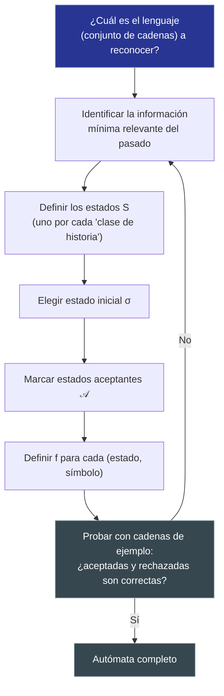

---
{"dg-publish":true,"permalink":"/universidad/3er-semestre/matematicas-discretas/unidad-6-lenguajes-y-automatas/02-automatas-de-estado-finito-diseno-y-aceptacion-de-cadenas/","dg-note-properties":{}}
---


# 🤖 Autómatas de Estado Finito

## 🎯 Introducción

> [!info] 💡 ¿Por qué estudiar autómatas de estado finito?
>
> Los **autómatas de estado finito** son una especialización de las máquinas de estado finito enfocada en una sola pregunta: **¿esta cadena pertenece o no a un lenguaje determinado?** Formalizados junto con las máquinas de estado finito en la teoría de la computación de mediados del siglo XX (Kleene, Rabin, Scott), se convirtieron en el modelo teórico detrás de herramientas que se usan a diario en programación.
>
> **Aplicaciones modernas:**
> - **Expresiones regulares** (regex): cada expresión regular corresponde a un autómata de estado finito equivalente.
> - **Analizadores léxicos** de compiladores e intérpretes: reconocer si una secuencia de caracteres forma un identificador, número o palabra clave válida.
> - **Validación de formatos**: correos electrónicos, números de tarjeta, protocolos de red.
> - **Videojuegos e IA simple**: NPCs con comportamientos que cambian según una secuencia de eventos aceptada o no.
>
> ```mermaid
> graph TD
>     A["Autómata de estado finito"] --> B["Lee una cadena α"]
>     B --> C["Sigue la trayectoria<br/>de estados"]
>     C --> D{"¿Termina en estado<br/>de aceptación?"}
>     D -->|"Sí"| E["α es ACEPTADA"]
>     D -->|"No"| F["α es RECHAZADA"]
>     style A fill:#1e3a5f,color:#fff
>     style E fill:#e1ffe1
>     style F fill:#ffe1e1
> ```

---

## 📋 Definición Formal

> [!note] 📋 Definición — Autómata de estado finito (como caso particular de MEF)
>
> Un **autómata de estado finito** es una máquina de estado finito
>
> $$A = (I, O, S, f, g, \sigma)$$
>
> con $O = \{0,1\}$, donde el estado actual determina la última salida. Los estados cuya última salida fue $1$ se llaman **estados de aceptación**.
>
> En un diagrama de autómata:
> - se suelen omitir los símbolos de salida;
> - los estados de aceptación se dibujan con **círculos dobles**.

> [!note] 📋 Definición alternativa — Quíntupla
>
> También se puede definir un autómata de estado finito como una quíntupla
>
> $$A = (I, S, f, \mathcal{A}, \sigma)$$
>
> donde:
> 1. $I$ es un [[Universidad/3er Semestre/Matemáticas Discretas/Unidad 1 - Logica y Conjuntos/IV - Teoría de Conjuntos/04 - Cardinalidad y Leyes de Cardinalidad\|Cardinalidad]] finito de **símbolos de entrada**.
> 2. $S$ es un conjunto finito de **estados**.
> 3. $f : S \times I \to S$ es la **[[Universidad/3er Semestre/Matemáticas Discretas/Unidad 2 - Funciones y Relaciones/01 - Funciones\|función]] de transición**.
> 4. $\mathcal{A} \subseteq S$ es el **conjunto de estados aceptantes**.
> 5. $\sigma \in S$ es el **estado inicial**.
>
> **Nota de notación:** se usa $\mathcal{A}$ (caligráfica) para el conjunto de estados aceptantes y $A$ para el autómata mismo — no confundir ambos símbolos.

> [!example] 🟢 Ejemplo — Autómata con $\mathcal{A} = \{\sigma_1, \sigma_2\}$
>
> Sea $I=\{a,b\}$, $S=\{\sigma_0,\sigma_1,\sigma_2\}$, con:
>
> | $S\backslash I$ | $f(\cdot,a)$ | $f(\cdot,b)$ |
> |---|---|---|
> | $\sigma_0$ | $\sigma_1$ | $\sigma_0$ |
> | $\sigma_1$ | $\sigma_2$ | $\sigma_0$ |
> | $\sigma_2$ | $\sigma_2$ | $\sigma_0$ |
>
> Como la última salida es $1$ en $\sigma_1$ y $\sigma_2$ (vista como MEF con $g$ dando 1 en la columna $a$), los estados de aceptación son $\mathcal{A}=\{\sigma_1,\sigma_2\}$.

---

## 📊 Diagrama de Autómata

> [!note] 📋 Diagrama del ejemplo — cadenas que terminan en $a$
>
> ```mermaid
> graph LR
>     start(( )) --> s0(("σ₀"))
>     s0 -->|"b"| s0
>     s0 -->|"a"| s1(("σ₁"))
>     s1 -->|"b"| s0
>     s1 -->|"a"| s2(("((σ₂))"))
>     s2 -->|"a"| s2
>     s2 -->|"b"| s0
>     style start fill:#fff,stroke:#fff
>     style s0 fill:#1e3a5f,color:#fff
>     style s1 fill:#e1f5ff
>     style s2 fill:#f5e1ff,stroke-width:3px
> ```
>
> **Lectura:** este diagrama acepta cadenas cuya trayectoria termina en $\sigma_1$ o $\sigma_2$ — es decir, cadenas cuyos últimos dos símbolos leídos no son ambos $b$ consecutivos, equivalentemente, cadenas que **no terminan en al menos dos símbolos $b$ consecutivos**.

---

## ✅ Aceptación de Cadenas

> [!note] 📋 Definición — Aceptación
>
> Sea $A=(I,S,f,\mathcal{A},\sigma)$ un autómata de estado finito y sea $\alpha=x_1x_2\cdots x_n$ una cadena sobre $I$. Decimos que **$A$ acepta $\alpha$** si existen estados $\sigma_0,\sigma_1,\ldots,\sigma_n$ tales que:
>
> 1. $\sigma_0=\sigma$;
> 2. $\sigma_i=f(\sigma_{i-1},x_i)$ para $i=1,\ldots,n$;
> 3. $\sigma_n \in \mathcal{A}$.
>
> La **cadena nula** ($\lambda$) se acepta si y solo si $\sigma \in \mathcal{A}$.

> [!note] 📋 Definición — Trayectoria
>
> La sucesión de estados $\sigma_0,\sigma_1,\ldots,\sigma_n$ que se obtiene al leer la cadena $\alpha=x_1\cdots x_n$ se llama **trayectoria** de $\alpha$ en $A$.
>
> **Procedimiento para decidir aceptación:**
> 1. Ubicar el estado inicial.
> 2. Leer la cadena símbolo por símbolo.
> 3. Seguir la transición indicada por cada símbolo.
> 4. Aceptar si el estado final es aceptante.

> [!example] 🟢 Ejemplo — Autómata que acepta cadenas con al menos dos $b$ consecutivos al final
>
> Sea $I=\{a,b\}$, $S=\{\sigma_0,\sigma_1,\sigma_2\}$, $\mathcal{A}=\{\sigma_2\}$, $\sigma=\sigma_0$, con:
>
> | $S\backslash I$ | $a$ | $b$ |
> |---|---|---|
> | $\sigma_0$ | $\sigma_0$ | $\sigma_1$ |
> | $\sigma_1$ | $\sigma_0$ | $\sigma_2$ |
> | $\sigma_2$ | $\sigma_0$ | $\sigma_2$ |
>
> **¿Se acepta $\alpha = abaa$?**
>
> | Símbolo leído | Estado actual | Nuevo estado |
> |---|---|---|
> | Inicio | — | $\sigma_0$ |
> | $a$ | $\sigma_0$ | $\sigma_0$ |
> | $b$ | $\sigma_0$ | $\sigma_1$ |
> | $a$ | $\sigma_1$ | $\sigma_0$ |
> | $a$ | $\sigma_0$ | $\sigma_0$ |
>
> Estado final: $\sigma_0 \notin \mathcal{A}$. **$abaa$ NO es aceptada.**
>
> **¿Se acepta $\alpha = abbabba$?**
>
> | Símbolo leído | Estado actual | Nuevo estado |
> |---|---|---|
> | Inicio | — | $\sigma_0$ |
> | $a$ | $\sigma_0$ | $\sigma_0$ |
> | $b$ | $\sigma_0$ | $\sigma_1$ |
> | $b$ | $\sigma_1$ | $\sigma_2$ |
> | $a$ | $\sigma_2$ | $\sigma_0$ |
> | $b$ | $\sigma_0$ | $\sigma_1$ |
> | $b$ | $\sigma_1$ | $\sigma_2$ |
> | $a$ | $\sigma_2$ | $\sigma_0$ |
>
> Estado final: $\sigma_0 \notin \mathcal{A}$. **$abbabba$ NO es aceptada** (los dos bloques de $bb$ quedan "interrumpidos" por una $a$ después).

---

## 🛠️ Método para Diseñar Autómatas

> [!note] 📋 Procedimiento general
>
> 1. Identificar qué información del pasado es **relevante**.
> 2. Crear estados que representen esa información.
> 3. Escoger el estado inicial.
> 4. Determinar cuáles estados deben ser aceptantes.
> 5. Definir las transiciones para cada símbolo de entrada.
> 6. Verificar con cadenas de prueba.
>
> **Principio clave:** un autómata **no** recuerda toda la cadena, sólo la información necesaria para decidir aceptación — el mismo principio de economía de estados que se vio en la nota de máquinas de estado finito.

---

## 🎨 Ejemplos de Diseño

> [!example] 🟢 Diseño 1 — Cadenas que no contienen $a$
>
> Diseñar un autómata sobre $I=\{a,b\}$ que acepte exactamente las cadenas que **no** contienen símbolos $a$.
>
> Se usan dos estados: $NA$ (no se ha encontrado una $a$) y $A$ (ya se encontró una $a$). El estado inicial y único estado aceptante es $NA$.
>
> ```mermaid
> graph LR
>     start(( )) --> na(("((NA))"))
>     na -->|"b"| na
>     na -->|"a"| a(("A"))
>     a -->|"a, b"| a
>     style start fill:#fff,stroke:#fff
>     style na fill:#1e3a5f,color:#fff,stroke-width:3px
>     style a fill:#f5e1ff
> ```

> [!example] 🟢 Diseño 2 — Número impar de símbolos $a$
>
> Diseñar un autómata sobre $I=\{a,b\}$ que acepte exactamente las cadenas con un número **impar** de símbolos $a$.
>
> Se usan dos estados: $E$ (número par de $a$ leídas) y $O$ (número impar). El estado inicial es $E$; el estado aceptante es $O$.
>
> ```mermaid
> graph LR
>     start(( )) --> e(("E"))
>     e -->|"b"| e
>     e -->|"a"| o(("((O))"))
>     o -->|"b"| o
>     o -->|"a"| e
>     style start fill:#fff,stroke:#fff
>     style e fill:#1e3a5f,color:#fff
>     style o fill:#f5e1ff,stroke-width:3px
> ```

---

## 📋 Tabla Comparativa: MEF vs. Autómata de Estado Finito

> [!note] 📋 Diferencias clave
>
> | Aspecto | Máquina de Estado Finito (Mealy) | Autómata de Estado Finito |
> |---|---|---|
> | **Notación** | $M=(I,O,S,f,g,\sigma)$ | $A=(I,S,f,\mathcal{A},\sigma)$ o $A=(I,O,S,f,g,\sigma)$ con $O=\{0,1\}$ |
> | **Conjunto de salida $O$** | Cualquier conjunto finito | Restringido a $\{0,1\}$ (o se omite) |
> | **Pregunta que responde** | ¿Qué salida se produce en cada paso? | ¿Se acepta o rechaza la cadena completa? |
> | **Elemento distintivo** | Función de salida $g$ | Conjunto de estados aceptantes $\mathcal{A}$ |
> | **Diagrama** | Etiquetas $i/o$ en cada [[Universidad/3er Semestre/Matemáticas Discretas/Unidad 5 - Grafos y Árboles/01 - Grafos I - Conceptos Básicos y Recorridos\|arista]] | Solo etiqueta $i$; aceptantes con doble círculo |
> | **Ejemplo típico** | Sumador en serie | Validador de patrones (regex) |

---

## 🔀 Diagrama de Decisión: Proceso de Diseño y Verificación



---

## ⚠️ Errores Comunes y Principios Lógicos

> [!warning] ⚠️ Errores frecuentes
>
> - **Olvidar transiciones para algún símbolo:** $f$ debe estar definida para **todo** par $(s,i) \in S \times I$; un autómata con "huecos" en la tabla no está completo (a menos que se use explícitamente un estado de error implícito).
> - **Confundir "estado aceptante" con "estado final del diagrama":** un estado se llama aceptante si **pertenece a $\mathcal{A}$**, sin importar si la lectura termina ahí o no en un caso particular — es una propiedad del estado, no del recorrido.
> - **Creer que más estados de aceptación implican un autómata más complejo:** lo relevante es cuántos estados totales se necesitan para distinguir todas las historias relevantes, no cuántos son aceptantes.
> - **Olvidar la cadena nula:** por definición, la cadena vacía $\lambda$ es aceptada si y solo si el propio estado inicial $\sigma$ es aceptante — un caso borde que se olvida con frecuencia al diseñar o verificar un autómata.

---

## 🖥️ Aplicaciones Prácticas

> [!tip] 🖥️ En programación
>
> - **Expresiones regulares:** cada patrón regex se compila internamente a un autómata finito (determinista o no determinista) antes de aplicarse a un texto — por eso el "método para diseñar autómatas" de esta nota es literalmente el proceso que sigue un motor de regex.
> - **Validación de entradas:** un formulario que valida "el campo debe tener exactamente un @ y terminar en un dominio válido" puede implementarse como un autómata con estados como `ANTES_DE_ARROBA`, `DESPUES_DE_ARROBA`, `EN_DOMINIO`.
> - **Máquinas de estado en frameworks de UI/juegos:** los mismos principios de "estado aceptante" se usan para modelar condiciones de victoria/derrota en un juego, o pasos completados en un flujo de checkout.

---

## 📝 Ejercicios Progresivos

### 🟢 Nivel 1 — Básico

> [!question] 📋 Ejercicios Nivel 1
>
> 1. Usando el autómata que acepta cadenas con número impar de símbolos $a$ (Diseño 2), determina si las siguientes cadenas son aceptadas: $\varepsilon$, $a$, $bba$.
> 2. Explica la diferencia entre la notación $A$ (el autómata) y $\mathcal{A}$ (el conjunto de estados aceptantes).
> 3. ¿Cuál es la condición exacta para que la cadena nula $\lambda$ sea aceptada por un autómata?

> [!success] ✅ Respuestas Nivel 1
>
> **1.** $\varepsilon$: se queda en $E$ (0 símbolos $a$, número par) → $E \notin \mathcal{A}$ → **rechazada**. $a$: pasa de $E$ a $O$ → $O \in \mathcal{A}$ → **aceptada**. $bba$: $E\to E\to E \to O$ → **aceptada** (una sola $a$, número impar).
>
> **2.** $A$ es el autómata completo (la quíntupla $(I,S,f,\mathcal{A},\sigma)$); $\mathcal{A}$ es únicamente el subconjunto de $S$ formado por los estados que, al alcanzarse al final de la lectura, hacen que la cadena sea aceptada.
>
> **3.** $\lambda$ se acepta si y solo si el estado inicial $\sigma$ pertenece a $\mathcal{A}$, ya que con cero símbolos leídos la trayectoria nunca sale de $\sigma_0=\sigma$.

### 🟡 Nivel 2 — Intermedio

> [!question] 📋 Ejercicios Nivel 2
>
> 4. Determina si las cadenas $abab$, $aaab$, $bbbabb$ son aceptadas por el autómata de número impar de símbolos $a$.
> 5. Diseña un autómata sobre $\{0,1\}$ que acepte exactamente las cadenas que terminan en $1$ (propón estados, estado inicial, estados de aceptación y dibuja el diagrama).
> 6. Diseña un autómata sobre $\{a,b\}$ que acepte exactamente las cadenas que contienen al menos una $a$.

> [!success] ✅ Respuestas Nivel 2
>
> **4.** $abab$: tiene dos $a$ (par) → **rechazada**. $aaab$: tiene tres $a$ (impar) → **aceptada**. $bbbabb$: tiene una $a$ (impar) → **aceptada**.
>
> **5.** Estados $S=\{S_0,S_1\}$: $S_0$ = "el último símbolo leído no fue 1 (o no se ha leído nada)", $S_1$ = "el último símbolo leído fue 1". Estado inicial $S_0$; estado aceptante $\{S_1\}$. Transiciones: $f(S_0,0)=S_0$, $f(S_0,1)=S_1$, $f(S_1,0)=S_0$, $f(S_1,1)=S_1$.
>
> ```mermaid
> graph LR
>     start(( )) --> s0(("S₀"))
>     s0 -->|"0"| s0
>     s0 -->|"1"| s1(("((S₁))"))
>     s1 -->|"1"| s1
>     s1 -->|"0"| s0
> ```
>
> **6.** Igual al "Diseño 1" pero invirtiendo los estados aceptantes: $NA$ (aún no se lee $a$, no aceptante) y $A$ (ya se leyó una $a$, **aceptante**). Estado inicial $NA$; $\mathcal{A}=\{A\}$. Transiciones: $f(NA,a)=A$, $f(NA,b)=NA$, $f(A,a)=A$, $f(A,b)=A$ (una vez en $A$ se permanece ahí, ya que la condición "contiene al menos una $a$" no puede dejar de cumplirse).

### 🔴 Nivel 3 — Avanzado

> [!question] 📋 Ejercicios Nivel 3
>
> 7. Diseña un autómata sobre $\{a,b\}$ que acepte exactamente las cadenas que terminan en $ab$. Justifica cuántos estados mínimos se necesitan y qué distingue a cada uno.
> 8. Construye la tabla de transición completa del autómata que acepta cadenas sin símbolos $a$ (Diseño 1), y demuestra formalmente (por inducción sobre la longitud de $\alpha$) que la trayectoria de cualquier cadena con al menos una $a$ termina en el estado $A$.
> 9. Un autómata debe aceptar cadenas binarias que representen múltiplos de 3 (leyendo el bit más significativo primero). Plantea qué información debe recordar cada estado (pista: piensa en el residuo módulo 3) y cuántos estados mínimos se necesitan.

> [!success] ✅ Respuestas Nivel 3
>
> **7.** Se necesitan 3 estados: $Q_0$ (el sufijo leído hasta ahora no coincide con ningún prefijo de "$ab$"), $Q_1$ (el último símbolo fue $a$, posible inicio de "$ab$"), $Q_2$ (los últimos dos símbolos fueron exactamente "$ab$", **aceptante**). Transiciones: $f(Q_0,a)=Q_1$, $f(Q_0,b)=Q_0$, $f(Q_1,a)=Q_1$, $f(Q_1,b)=Q_2$, $f(Q_2,a)=Q_1$, $f(Q_2,b)=Q_0$. Estado inicial $Q_0$; $\mathcal{A}=\{Q_2\}$.
>
> **8.** Tabla: $f(NA,a)=A$, $f(NA,b)=NA$, $f(A,a)=A$, $f(A,b)=A$. **Demostración (inducción sobre $n=|\alpha|$):** Base $n=1$: si $\alpha=a$, $\sigma_1=f(\sigma_0,a)=f(NA,a)=A$ ✓. Paso inductivo: supongamos que toda cadena de longitud $n$ con al menos una $a$ termina en $A$ (HI). Sea $\alpha'=\alpha x_{n+1}$ de longitud $n+1$ con al menos una $a$. Si $\alpha$ ya contiene una $a$, por HI $\sigma_n=A$, y como $f(A,a)=f(A,b)=A$, se sigue $\sigma_{n+1}=A$. Si $\alpha$ no contiene $a$ pero $x_{n+1}=a$, entonces $\sigma_n=NA$ y $\sigma_{n+1}=f(NA,a)=A$. En ambos casos $\sigma_{n+1}=A$. $\blacksquare$
>
> **9.** Se necesitan exactamente 3 estados, $S=\{R_0,R_1,R_2\}$, donde $R_k$ representa "el número binario leído hasta ahora, interpretado en base 2, es congruente con $k \pmod 3$". Estado inicial $R_0$ (cadena vacía representa 0). Al leer un bit $b$, el nuevo número es $2\cdot(\text{anterior})+b$, así que la transición es $f(R_k,b) = R_{(2k+b)\bmod 3}$. Estado aceptante: $\mathcal{A}=\{R_0\}$ (múltiplos de 3 tienen residuo 0).

---

## 🎯 Metas de Aprendizaje

> [!note] 📋 Nivel Básico
>
> - [ ] Explico qué es un estado de aceptación y cómo se distingue en un diagrama.
> - [ ] Distingo la notación de sextupla ($O=\{0,1\}$) de la notación de quíntupla ($A=(I,S,f,\mathcal{A},\sigma)$).
> - [ ] Determino manualmente si una cadena corta es aceptada, siguiendo su trayectoria paso a paso.
> - [ ] Sé cuándo se acepta la cadena nula $\lambda$.

> [!note] 📋 Nivel Intermedio
>
> - [ ] Diseño un autómata simple (2-3 estados) a partir de la descripción de un lenguaje en español.
> - [ ] Sigo el método de 6 pasos para diseñar un autómata de forma sistemática.
> - [ ] Comparo y explico las diferencias entre una MEF general y un autómata de estado finito.
> - [ ] Verifico un diseño propio probando cadenas aceptadas y rechazadas.

> [!note] 📋 Nivel Avanzado
>
> - [ ] Diseño autómatas para lenguajes que requieren "contar" información (paridad, residuos módulo $n$, posiciones de patrones).
> - [ ] Demuestro formalmente por inducción propiedades sobre trayectorias y aceptación.
> - [ ] Determino el número **mínimo** de estados necesarios para un lenguaje dado, justificando por qué no se puede usar menos.
> - [ ] Conecto el concepto de autómata con su aplicación real en expresiones regulares y analizadores léxicos.

---

## 📚 Referencias

> [!quote] 📖 Fuentes consultadas
>
> [1] Pineda, E. *Máquinas y autómatas de estado finito*. Material de clase, MATG 1051 — Matemática Discreta, ESPOL, FCNM.

---

## 🔗 Conexiones

> [!quote] 🔗 Notas relacionadas
>
> - [[Universidad/3er Semestre/Matemáticas Discretas/Unidad 6 - Lenguajes y Autómatas/01 - Máquinas de Estado Finito - Definición y Estructura\|01 - Máquinas de Estado Finito - Definición y Estructura]] — el autómata es un caso particular de máquina de estado finito con $O=\{0,1\}$; comparte diagrama de transición, tabla de $f$, y el mismo método de "información mínima relevante".
> - [[Universidad/3er Semestre/Matemáticas Discretas/Unidad 2 - Funciones y Relaciones/04 - Sucesiones y Cadenas\|04 - Sucesiones y Cadenas]] — las cadenas $\alpha=x_1x_2\cdots x_n$ leídas por un autómata son cadenas en el sentido formal de esa nota; el concepto de **subcadena** es útil para razonar sobre patrones como "termina en $ab$".
> - Ver también las notas de **Árboles** para comparar cómo distintas estructuras discretas (árboles vs. autómatas) modelan decisiones y trayectorias.

---

**Tags:** #matematicas-discretas #automatas-estado-finito #teoria-de-la-computacion #lenguajes-formales #MATG1051
