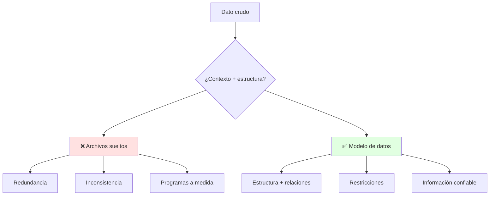

---
{"dg-publish":true,"permalink":"/universidad/3er-semestre/sistema-de-bases-de-datos/unidad-1-modelos-de-datos-y-er/01-dato-informacion-y-modelos-de-datos/","tags":["TICG1018","unidad1","datos","modelos","historia"],"dg-note-properties":{"tags":["TICG1018","unidad1","datos","modelos","historia"]}}
---


# 💾 Dato, Información y Modelos de Datos

## 🎯 Introducción

> [!info] 💡 ¿Por Qué Modelar Antes de Guardar?
>
> Todo sistema que uses — Aula Virtual, banca móvil, el inventario de una tienda — vive sobre un modelo decidido antes de escribir código. Equivocarse ahí cuesta reescrituras (los egipcios en papiros del 2000 a.C. ya registraban; el medio cambió, el costo de no modelar no). Esta nota responde qué se guarda, cómo se organiza y cómo evolucionó esa respuesta en 60 años.
>
> **¿Dónde se usa?**
> - **Diseño de BD:** todo sistema (notas 02-03, proyecto del curso).
> - **Migraciones:** pasar de Excel/archivos a tablas sin perder nada.
> - **Lección 1 (13-oct):** dato vs información + archivos vs BD, seguro evaluado.



---

## 📋 Definiciones Formales

> [!note] 📋 Definición — Dato, Información, Modelo
>
> - **Dato:** valor crudo sin contexto (ej. "19", "Irene").
> - **Información:** dato interpretado en contexto (ej. "19 estudiantes aprobaron SBD").
> - **Modelo de datos:** representación lógica y estructurada que define estructura, relaciones, restricciones y transformaciones. Es iterativo y es el lenguaje común entre cliente, analista y dev.
>
> **Por qué importa (diapositivas):** cubre requerimientos desde el diseño; minimiza cambios continuos, redundancia y problemas de acceso; sin buen diseño no hay hardware ni UI que salve el desempeño.
>
> ```mermaid
> graph LR
>     D["Dato: 19"] --> C["Información:<br/>19 aprobados"]
>     C --> M["Modelo:<br/>tabla ESTUDIANTE"]
>     style M fill:#e1ffe1
> ```

> [!note] 📋 Definición — Sistema de Archivos vs Base de Datos
>
> | Aspecto | Archivos Tradicionales | Base de Datos |
> |---|---|---|
> | **Redundancia** | Mismo dato en N archivos | Definido una vez |
> | **Consistencia** | Se desincroniza | Restricciones la garantizan |
> | **Acceso** | Programas a medida | Lenguaje común (SQL) |
> | **Escala** | Colapsa con usuarios | Concurrente y segura |
>
> **Historia real:** egipcios en papiros (2000 a.C.) — el medio cambia, la necesidad de registrar no.

---

## 🧵 Evolución de los Modelos (Coronel cap. 2)

> [!note] 📋 Un Modelo por Época
>
> | Generación | Época | Modelo | Idea |
> |---|---|---|---|
> | Archivos | 1960s-70s | VSAM, planos | Registros, no relaciones |
> | Segunda | 1970s | **Jerárquico** (IMS, Apollo 1969) | Árbol invertido: un padre, N hijos |
> | Segunda | 1970s | **Red** (ADABAS, IDS-II) | Grafo multipadre + schema/subschema/DML/DDL |
> | Tercera | 1970s-hoy | **Relacional** (Codd 1970) | Tablas + SQL declarativo |
> | Tercera | 1976-hoy | **ER** (Chen) | El plano gráfico del relacional |
> | Cuarta | 1980s-hoy | **OO / Objeto-Relacional** | Objetos con métodos; tipos extensibles |
> | Siguiente | Hoy-futuro | **XML, híbridas, nube** | No estructurado + servicios |
>
> **Detalles que evalúan:** el jerárquico duplica lo compartido; la red murió por falta de consultas ad hoc; Codd publicó en CACM (junio 1970); M:N existe en conceptual pero no va al relacional.
>
> ```mermaid
> graph TB
>     A[Archivos] --> B[Jerárquico/Red]
>     B --> C[Relacional + ER]
>     C --> D[Objetos / O-R]
>     D --> E[XML + Nube]
>     style C fill:#e1ffe1
> ```

---

## 🛠️ Método: Del Enunciado al Modelo

> [!note] 📋 Procedimiento General
>
> 1. Subraya sustantivos (candidatos a entidad) y verbos (candidatos a relación).
> 2. Pregunta por cada tabla futura: "¿qué decisión se toma con esto?" (sin pregunta, no hay tabla).
> 3. Dibuja ERD con claves desde el día 1.
> 4. Traduce a tablas y verifica con las reglas de negocio.
> 5. Itera: el modelo se refina, no nace perfecto.
>
> **Principio clave:** modela lo permanente (Estudiantes, Materias), no los formularios — las pantallas cambian, el negocio no.

---

## 🎨 Ejemplo Trabajado

> [!example] 🟢 Mini-caso SBD
>
> Enunciado: *"Irene dicta SBD1; cada estudiante toma varias materias."*
>
> | Paso | Resultado |
> |---|---|
> | Sustantivos | Irene→PROFESOR, SBD1→MATERIA, estudiante→ESTUDIANTE |
> | Verbos | *dicta*, *toma* |
> | Claves | carnet, código |
> | Clasificación | PROFESOR–MATERIA 1:M; ESTUDIANTE–MATERIA M:N (pide intermedia) |

---

## 📋 Tabla Comparativa: Archivos vs BD

> [!note] 📋 Diferencias Clave
>
> | Aspecto | Archivos | BD Modelada |
> |---|---|---|
> | **Preguntas** | A mano, programa por reporte | SQL declarativo |
> | **Cambios** | Riesgo total | Localizados y trazables |
> | **Diseño previo** | Ninguno | ERD primero |
> | **Cuándo usar** | Logs simples | Todo sistema |

---

## ⚠️ Errores Comunes y Principios Lógicos

> [!warning] ⚠️ Errores Frecuentes
>
> - **Modelar pantallas, no el negocio:** al cambiar la UI muere la BD — modela entidades permanentes.
> - **Tabla sin pregunta:** si ningún reporte/decisión la usa, sobra (todavía).
> - **Confundir dato con información:** guardar todo sin contexto es archivar, no diseñar.
> - **Saltarse el ERD:** ir directo a tablas garantiza N:M olvidadas y FKs inventadas.

---

## 🎯 Metas de Aprendizaje

> [!note] 📋 Nivel Básico
>
> - [ ] Defino dato, información y modelo sin mirar.
> - [ ] Explico archivos vs BD con 3 diferencias y 1 ejemplo propio.
> - [ ] Ubico los 6 modelos en su generación con un ejemplo cada uno.

> [!note] 📋 Nivel Intermedio
>
> - [ ] Aplico el método de 5 pasos a un enunciado nuevo.
> - [ ] Justifico por qué ganó el relacional (SQL + independencia).
> - [ ] Detecto qué modelo pide un caso dado.

---

## 📚 Referencias

> [!quote] 📖 Fuentes Consultadas
>
> - Diapositivas BD01 (Irene Cheung) + `BD01 Introducción_datamodel.pdf`.
> - C. Coronel, S. Morris, *Database Systems*, 9th ed., cap. 2 §§2.5.1–2.5.7.

---

## 🔗 Conexiones

> [!quote] 🔗 Notas Relacionadas
>
> - [[Universidad/3er Semestre/Sistema de Bases de Datos/Unidad 1 - Modelos de Datos y ER/02 - Entidades, atributos, claves y relaciones\|02 - Entidades, atributos, claves y relaciones]] — el vocabulario para dibujar lo de aquí.
> - Ver también [[Universidad/3er Semestre/Sistema de Bases de Datos/Unidad 1 - Modelos de Datos y ER/03 - Modelo relacional, ERM y casos Tiny College\|03 - Modelo relacional, ERM y casos Tiny College]] para la traducción a tablas.

---

**Tags:** #TICG1018 #unidad1 #datos #modelos #bd
