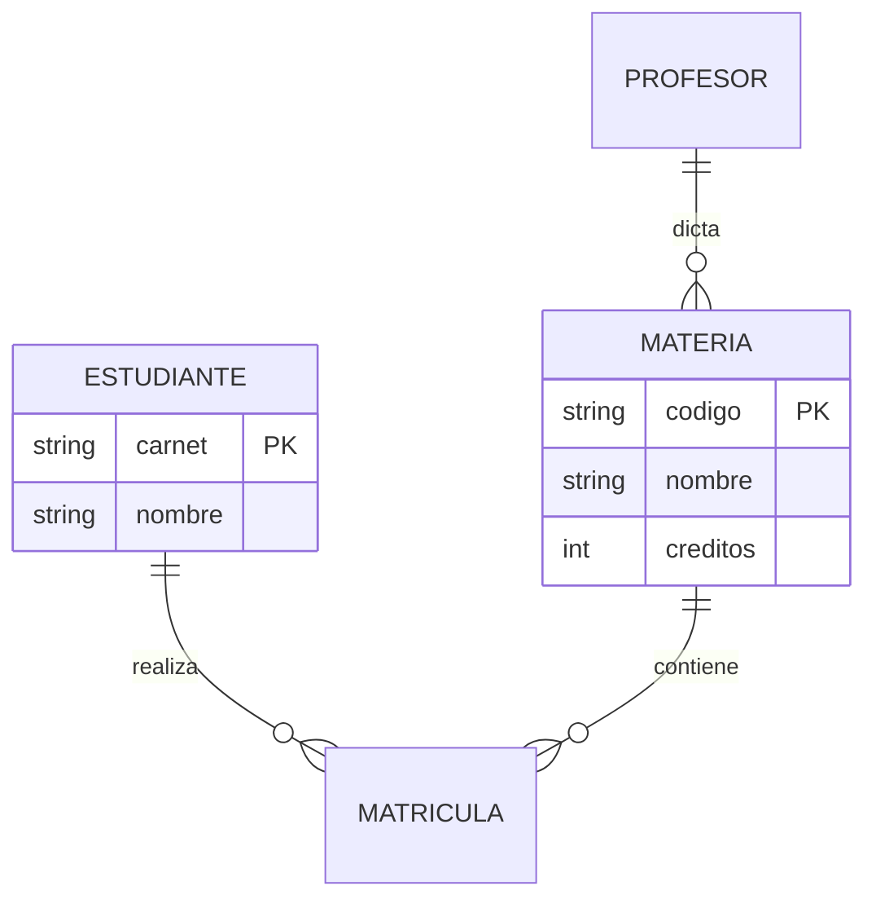

---
{"dg-publish":true,"permalink":"/universidad/3er-semestre/sistema-de-bases-de-datos/unidad-1-modelos-de-datos-y-er/02-entidades-atributos-claves-y-relaciones/","tags":["TICG1018","unidad1","er","claves","relaciones"],"dg-note-properties":{"tags":["TICG1018","unidad1","er","claves","relaciones"]}}
---


# 🧩 Entidades, Atributos, Claves y Relaciones

## 🎯 Introducción

> [!info] 💡 ¿Por Qué Todo Diagrama Empieza con Sustantivos y Verbos?
>
> Un ERD mal leído aprueba diagramas imposibles: relaciones sin verbo, tablas sin clave, cardinalidades adivinadas. Este vocabulario (5 piezas) es el filtro con el que validarás cada diagrama del curso, del proyecto y de la Lección 1 — leerlo en voz alta detecta relaciones falsas en segundos.
>
> **Aplicaciones:**
> - **Diseño de BD:** cada diagrama del curso y del proyecto usa estas piezas.
> - **Validación:** leer un ER en voz alta detecta relaciones falsas en segundos.
> - **Lección 1 (13-oct):** definir cada pieza con ejemplo propio es pregunta segura.



---

## 📋 Definiciones Formales

> [!note] 📋 Definición — Entidad, Atributo, Relación, Clave
>
> - **Entidad** (rectángulo): objeto distinguible del mundo real; cada instancia es única y se identifica por clave.
> - **Atributo** (óvalo/columna): propiedad que describe; la **clave (PK)** identifica, el resto describe.
> - **Relación** (rombo/verbo): asociación con significado entre entidades; se lee en voz alta ("¿quién toma qué?").
> - **Clave primaria (PK):** única + no nula + estable + mínima. **Foránea (FK):** referencia a la PK de otra tabla. **Candidata:** podría ser PK, no fue elegida. **Compuesta:** PK de 2+ atributos.
> - **Restricción:** límite que el diagrama debe cumplir (cardinalidad, cupo, prerrequisito); las **reglas de negocio** mandan sobre todo.
>
> **Verlo dibujado:**

<svg xmlns="http://www.w3.org/2000/svg" style="background: transparent; background-color: transparent; color-scheme: light dark;" xmlns:xlink="http://www.w3.org/1999/xlink" version="1.1" width="682px" height="207px" viewBox="0 0 682 207" id="ge-svg-d9TF0imsJgCSodimKBOz" content="&lt;mxfile host=&quot;localhost&quot;&gt;&lt;diagram name=&quot;ER-base&quot; id=&quot;d1&quot;&gt;xZZNb6MwEIZ/DZc9gR3ycUxT+qGqq2qTVc9ePAuWwBM5JiT99WvWpsEllaI0NJfI83rG+H08MQR0Ue7uFVvnz8ihCEjIdwG9DQiZhCPz2wh7K8RkYoVMCW6l6CAsxRs4MXRqJThsvESNWGix9sUUpYRUexpTCms/7S8W/lPXLIOesExZ0VdfBde5Vaeti0Z/AJHl7ZOj8czOlKxNdk42OeNYdySaBHShELUdlbsFFA27loutu/tk9n1jCqQ+pWB7pMJJG71v/SqsJIemJAzoTZ0LDcs1S5vZ2hyw0XJdFiaKzNBWb1lRuepkufp9+zj/uUoCMg4IjZpFUqYkaJP48uQKQGnYdXbgNnwPWIJWe5OSd5hOHcD6wD+aOc2tMnLhvm0eFzN3+tn7ygdAZuAYfcKLnMQrx/JPtTmDlcaSXYzH2OdBwyGA0OEb6Hm+Sn49zrvdg1xkOGj3xHQIWqNTaJkac5PBGaSk6TsFZyGJ4z4S6iOZxB4REl+CSDwsEeCM/xgKyMd/1GWIjO0awHsvoT4irFQK/lXexSb5vHndmUiihGOoNFMZaP9y6+A7jklBwbTY+tv7kufJmZ7Jlz3Tq3meXu2cR1fzPLua5/ibPJvw8Pn2f67zDUyTfw==&lt;/diagram&gt;&lt;/mxfile&gt;"><style type="text/css">@supports (color: light-dark(#000, #fff)) { #ge-svg-d9TF0imsJgCSodimKBOz { --ge-adaptive-bg: light-dark(#ffffff, var(--ge-dark-color, #121212)); } }</style><defs/><g><g data-cell-id="0"><g data-cell-id="1"><g data-cell-id="v1"><g transform="translate(0.5,0.5)"><rect x="0" y="0" width="190" height="80" fill="#ffffff" stroke="#000000" pointer-events="all" style="fill: var(--ge-adaptive-bg, #ffffff); stroke: light-dark(rgb(0, 0, 0), rgb(255, 255, 255));"/></g><g><g><switch><foreignObject style="overflow: visible; text-align: left;" pointer-events="none" width="100%" height="100%" requiredFeatures="http://www.w3.org/TR/SVG11/feature#Extensibility"><div xmlns="http://www.w3.org/1999/xhtml" style="display: flex; align-items: unsafe center; justify-content: unsafe center; width: 188px; height: 1px; padding-top: 40px; margin-left: 1px;"><div style="box-sizing: border-box; font-size: 0; text-align: center; color: #000000; "><div style="display: inline-block; font-size: 12px; font-family: Helvetica; color: light-dark(#000000, #ffffff); line-height: 1.2; pointer-events: all; white-space: normal; word-wrap: normal; ">ESTUDIANTE<br />carnet PK</div></div></div></foreignObject><text x="95" y="37" fill="#000000" font-family="Helvetica" font-size="12px" text-anchor="middle" style="fill: light-dark(rgb(0, 0, 0), rgb(255, 255, 255));"><tspan x="95" y="37">ESTUDIANTE</tspan><tspan x="95" y="51">carnet PK</tspan></text></switch></g></g></g><g data-cell-id="v2"><g transform="translate(0.5,0.5)"><path d="M 340 0 L 420 40 L 340 80 L 260 40 Z" fill="#ffffff" stroke="#000000" stroke-miterlimit="10" pointer-events="all" style="fill: var(--ge-adaptive-bg, #ffffff); stroke: light-dark(rgb(0, 0, 0), rgb(255, 255, 255));"/></g><g><g><switch><foreignObject style="overflow: visible; text-align: left;" pointer-events="none" width="100%" height="100%" requiredFeatures="http://www.w3.org/TR/SVG11/feature#Extensibility"><div xmlns="http://www.w3.org/1999/xhtml" style="display: flex; align-items: unsafe center; justify-content: unsafe center; width: 158px; height: 1px; padding-top: 40px; margin-left: 261px;"><div style="box-sizing: border-box; font-size: 0; text-align: center; color: #000000; "><div style="display: inline-block; font-size: 12px; font-family: Helvetica; color: light-dark(#000000, #ffffff); line-height: 1.2; pointer-events: all; white-space: normal; word-wrap: normal; ">toma</div></div></div></foreignObject><text x="340" y="44" fill="#000000" font-family="Helvetica" font-size="12px" text-anchor="middle" style="fill: light-dark(rgb(0, 0, 0), rgb(255, 255, 255));">toma</text></switch></g></g></g><g data-cell-id="v3"><g transform="translate(0.5,0.5)"><rect x="490" y="0" width="190" height="80" fill="#ffffff" stroke="#000000" pointer-events="all" style="fill: var(--ge-adaptive-bg, #ffffff); stroke: light-dark(rgb(0, 0, 0), rgb(255, 255, 255));"/></g><g><g><switch><foreignObject style="overflow: visible; text-align: left;" pointer-events="none" width="100%" height="100%" requiredFeatures="http://www.w3.org/TR/SVG11/feature#Extensibility"><div xmlns="http://www.w3.org/1999/xhtml" style="display: flex; align-items: unsafe center; justify-content: unsafe center; width: 188px; height: 1px; padding-top: 40px; margin-left: 491px;"><div style="box-sizing: border-box; font-size: 0; text-align: center; color: #000000; "><div style="display: inline-block; font-size: 12px; font-family: Helvetica; color: light-dark(#000000, #ffffff); line-height: 1.2; pointer-events: all; white-space: normal; word-wrap: normal; ">MATERIA<br />codigo PK</div></div></div></foreignObject><text x="585" y="37" fill="#000000" font-family="Helvetica" font-size="12px" text-anchor="middle" style="fill: light-dark(rgb(0, 0, 0), rgb(255, 255, 255));"><tspan x="585" y="37">MATERIA</tspan><tspan x="585" y="51">codigo PK</tspan></text></switch></g></g></g><g data-cell-id="v4"><g transform="translate(0.5,0.5)"><ellipse cx="100" cy="177.5" rx="65" ry="27.5" fill="#ffffff" stroke="#000000" pointer-events="all" style="fill: var(--ge-adaptive-bg, #ffffff); stroke: light-dark(rgb(0, 0, 0), rgb(255, 255, 255));"/></g><g><g><switch><foreignObject style="overflow: visible; text-align: left;" pointer-events="none" width="100%" height="100%" requiredFeatures="http://www.w3.org/TR/SVG11/feature#Extensibility"><div xmlns="http://www.w3.org/1999/xhtml" style="display: flex; align-items: unsafe center; justify-content: unsafe center; width: 128px; height: 1px; padding-top: 178px; margin-left: 36px;"><div style="box-sizing: border-box; font-size: 0; text-align: center; color: #000000; "><div style="display: inline-block; font-size: 12px; font-family: Helvetica; color: light-dark(#000000, #ffffff); line-height: 1.2; pointer-events: all; white-space: normal; word-wrap: normal; ">nombre</div></div></div></foreignObject><text x="100" y="181" fill="#000000" font-family="Helvetica" font-size="12px" text-anchor="middle" style="fill: light-dark(rgb(0, 0, 0), rgb(255, 255, 255));">nombre</text></switch></g></g></g><g data-cell-id="v5"><g transform="translate(0.5,0.5)"><ellipse cx="325" cy="177.5" rx="65" ry="27.5" fill="#ffffff" stroke="#000000" pointer-events="all" style="fill: var(--ge-adaptive-bg, #ffffff); stroke: light-dark(rgb(0, 0, 0), rgb(255, 255, 255));"/></g><g><g><switch><foreignObject style="overflow: visible; text-align: left;" pointer-events="none" width="100%" height="100%" requiredFeatures="http://www.w3.org/TR/SVG11/feature#Extensibility"><div xmlns="http://www.w3.org/1999/xhtml" style="display: flex; align-items: unsafe center; justify-content: unsafe center; width: 128px; height: 1px; padding-top: 178px; margin-left: 261px;"><div style="box-sizing: border-box; font-size: 0; text-align: center; color: #000000; "><div style="display: inline-block; font-size: 12px; font-family: Helvetica; color: light-dark(#000000, #ffffff); line-height: 1.2; pointer-events: all; white-space: normal; word-wrap: normal; ">edad*</div></div></div></foreignObject><text x="325" y="181" fill="#000000" font-family="Helvetica" font-size="12px" text-anchor="middle" style="fill: light-dark(rgb(0, 0, 0), rgb(255, 255, 255));">edad*</text></switch></g></g></g><g data-cell-id="v6"><g transform="translate(0.5,0.5)"><path d="M 190 40 L 260 40" fill="none" stroke="#000000" stroke-miterlimit="10" pointer-events="stroke" style="stroke: light-dark(rgb(0, 0, 0), rgb(255, 255, 255));"/></g></g><g data-cell-id="v7"><g transform="translate(0.5,0.5)"><path d="M 420 40 L 490 40" fill="none" stroke="#000000" stroke-miterlimit="10" pointer-events="stroke" style="stroke: light-dark(rgb(0, 0, 0), rgb(255, 255, 255));"/></g></g><g data-cell-id="v8"><g transform="translate(0.5,0.5)"><path d="M 96.45 80 L 99 150" fill="none" stroke="#000000" stroke-miterlimit="10" pointer-events="stroke" style="stroke: light-dark(rgb(0, 0, 0), rgb(255, 255, 255));"/></g></g><g data-cell-id="v9"><g transform="translate(0.5,0.5)"><path d="M 161.86 80 L 287.36 155.08" fill="none" stroke="#000000" stroke-miterlimit="10" pointer-events="stroke" style="stroke: light-dark(rgb(0, 0, 0), rgb(255, 255, 255));"/></g></g></g></g></g><switch><g requiredFeatures="http://www.w3.org/TR/SVG11/feature#Extensibility"/><a transform="translate(0,-5)" xlink:href="https://www.drawio.com/doc/faq/svg-export-text-problems" target="_blank"><text text-anchor="middle" font-size="10px" x="50%" y="100%">Text is not SVG - cannot display</text></a></switch></svg>

> [!note] 📋 Definición — Conectividad y Cardinalidad (Coronel 4.1.4)
>
> - **Conectividad:** clasificación 1:1, 1:M, M:N — siempre en **ambas direcciones** ("un CLIENTE genera muchas FACTURAS" + "cada FACTURA es de un CLIENTE" → 1:M).
> - **Cardinalidad (x,y):** mínimo y máximo asociados. `(1,4)` en CLASS = cada profesor dicta de 1 a 4; `(1,1)` en PROFESSOR = cada clase, un profesor.
> - Chen la ubica del lado de la entidad relacionada; Crow's Foot/UML junto a la entidad a la que aplica. El DBMS **no** la implementa en tablas: vive en la app o en triggers.
>
> ```mermaid
> graph LR
>     P["PROFESOR<br/>(1,1)"] -->|"dicta"| C["CLASE<br/>(1,4)"]
>     style P fill:#e1f5ff
>     style C fill:#e1ffe1
> ```

<svg xmlns="http://www.w3.org/2000/svg" style="background: transparent; background-color: transparent; color-scheme: light dark;" xmlns:xlink="http://www.w3.org/1999/xlink" version="1.1" width="611px" height="232px" viewBox="0 0 611 232" id="ge-svg-TFWchwPqoJGSVIs9WKI7" content="&lt;mxfile host=&quot;localhost&quot;&gt;&lt;diagram name=&quot;Conectividad&quot; id=&quot;d1&quot;&gt;1ZZNb4MwDIZ/DdJ2mASErtux7b4u3aWHnTPiQiTAKAmj7a+fA4GWrdOmrUPqpbJfxw5+rKTx2CLfPCpepksUkHmhLzYeu/PCcOpH9GuFbStMwmkrJEqKVgr2wkruwIm+UyspQA8WGsTMyHIoxlgUEJuBxpXCerhsjdlw15In8ElYxTz7rL5IYdJWvem6sPoTyCTtdg6ub9tIzrvFrhOdcoH1gcTuPbZQiKa18s0CMsuu49LmPXwR7T9MQWF+kvB2JMNJ2my7fhVWhQCb4ntsXqfSwKrksY3WNGDSUpNn5AVkttlvPKtc9ozcC4rMgkuyujgoA5uDDd33PQLmYNSWlqQHCCeOV73HHXSaqxI5dzt0uZt10hfe4yDDEfmCTjgineWYdAJ2CjxsJDxLwvM8Jp7+fP4JT/QTPNSI+Z4Lz2RSkB1TJVAkWASSbqSZC+RSCFtyrkDLHX9tylvgayyMu0GD6Bjh5mSS1Hh+VaBtu7cuSq55icT7qgSlseCXp5pBFA5nELJ/OMGTs5nB8sgM8ipOUTdjULgGjeqK/kJASa5HG8Nprorrs5hDc9H0c+jpfxgFPT5sa3b3HIQc70T85loid/+caGIHbzJ2/w4=&lt;/diagram&gt;&lt;/mxfile&gt;"><style type="text/css">@supports (color: light-dark(#000, #fff)) { #ge-svg-TFWchwPqoJGSVIs9WKI7 { --ge-adaptive-bg: light-dark(#ffffff, var(--ge-dark-color, #121212)); } }</style><defs/><g><g data-cell-id="0"><g data-cell-id="1"><g data-cell-id="v1"><g transform="translate(0.5,0.5)"><rect x="0" y="0" width="150" height="50" fill="#ffffff" stroke="#000000" pointer-events="all" style="fill: var(--ge-adaptive-bg, #ffffff); stroke: light-dark(rgb(0, 0, 0), rgb(255, 255, 255));"/></g><g><g><switch><foreignObject style="overflow: visible; text-align: left;" pointer-events="none" width="100%" height="100%" requiredFeatures="http://www.w3.org/TR/SVG11/feature#Extensibility"><div xmlns="http://www.w3.org/1999/xhtml" style="display: flex; align-items: unsafe center; justify-content: unsafe center; width: 148px; height: 1px; padding-top: 25px; margin-left: 1px;"><div style="box-sizing: border-box; font-size: 0; text-align: center; color: #000000; "><div style="display: inline-block; font-size: 12px; font-family: Helvetica; color: light-dark(#000000, #ffffff); line-height: 1.2; pointer-events: all; white-space: normal; word-wrap: normal; ">A (1:1) B</div></div></div></foreignObject><text x="75" y="29" fill="#000000" font-family="Helvetica" font-size="12px" text-anchor="middle" style="fill: light-dark(rgb(0, 0, 0), rgb(255, 255, 255));">A (1:1) B</text></switch></g></g></g><g data-cell-id="v2"><g transform="translate(0.5,0.5)"><rect x="0" y="90" width="150" height="50" fill="#ffffff" stroke="#000000" pointer-events="all" style="fill: var(--ge-adaptive-bg, #ffffff); stroke: light-dark(rgb(0, 0, 0), rgb(255, 255, 255));"/></g><g><g><switch><foreignObject style="overflow: visible; text-align: left;" pointer-events="none" width="100%" height="100%" requiredFeatures="http://www.w3.org/TR/SVG11/feature#Extensibility"><div xmlns="http://www.w3.org/1999/xhtml" style="display: flex; align-items: unsafe center; justify-content: unsafe center; width: 148px; height: 1px; padding-top: 115px; margin-left: 1px;"><div style="box-sizing: border-box; font-size: 0; text-align: center; color: #000000; "><div style="display: inline-block; font-size: 12px; font-family: Helvetica; color: light-dark(#000000, #ffffff); line-height: 1.2; pointer-events: all; white-space: normal; word-wrap: normal; ">A (1:M) B</div></div></div></foreignObject><text x="75" y="119" fill="#000000" font-family="Helvetica" font-size="12px" text-anchor="middle" style="fill: light-dark(rgb(0, 0, 0), rgb(255, 255, 255));">A (1:M) B</text></switch></g></g></g><g data-cell-id="v3"><g transform="translate(0.5,0.5)"><rect x="0" y="180" width="150" height="50" fill="#ffffff" stroke="#000000" pointer-events="all" style="fill: var(--ge-adaptive-bg, #ffffff); stroke: light-dark(rgb(0, 0, 0), rgb(255, 255, 255));"/></g><g><g><switch><foreignObject style="overflow: visible; text-align: left;" pointer-events="none" width="100%" height="100%" requiredFeatures="http://www.w3.org/TR/SVG11/feature#Extensibility"><div xmlns="http://www.w3.org/1999/xhtml" style="display: flex; align-items: unsafe center; justify-content: unsafe center; width: 148px; height: 1px; padding-top: 205px; margin-left: 1px;"><div style="box-sizing: border-box; font-size: 0; text-align: center; color: #000000; "><div style="display: inline-block; font-size: 12px; font-family: Helvetica; color: light-dark(#000000, #ffffff); line-height: 1.2; pointer-events: all; white-space: normal; word-wrap: normal; ">A (M:N) B</div></div></div></foreignObject><text x="75" y="209" fill="#000000" font-family="Helvetica" font-size="12px" text-anchor="middle" style="fill: light-dark(rgb(0, 0, 0), rgb(255, 255, 255));">A (M:N) B</text></switch></g></g></g><g data-cell-id="v4"><g><rect x="190" y="0" width="420" height="50" fill="none" stroke="none" pointer-events="all"/></g><g><g><switch><foreignObject style="overflow: visible; text-align: left;" pointer-events="none" width="100%" height="100%" requiredFeatures="http://www.w3.org/TR/SVG11/feature#Extensibility"><div xmlns="http://www.w3.org/1999/xhtml" style="display: flex; align-items: unsafe center; justify-content: unsafe center; width: 418px; height: 1px; padding-top: 25px; margin-left: 191px;"><div style="box-sizing: border-box; font-size: 0; text-align: center; color: #000000; "><div style="display: inline-block; font-size: 14px; font-family: Helvetica; color: light-dark(#000000, #ffffff); line-height: 1.2; pointer-events: all; white-space: normal; word-wrap: normal; ">1:1 = uno a uno (pasaporte-persona)</div></div></div></foreignObject><text x="400" y="29" fill="#000000" font-family="Helvetica" font-size="14px" text-anchor="middle" style="fill: light-dark(rgb(0, 0, 0), rgb(255, 255, 255));">1:1 = uno a uno (pasaporte-persona)</text></switch></g></g></g><g data-cell-id="v5"><g><rect x="190" y="90" width="420" height="50" fill="none" stroke="none" pointer-events="all"/></g><g><g><switch><foreignObject style="overflow: visible; text-align: left;" pointer-events="none" width="100%" height="100%" requiredFeatures="http://www.w3.org/TR/SVG11/feature#Extensibility"><div xmlns="http://www.w3.org/1999/xhtml" style="display: flex; align-items: unsafe center; justify-content: unsafe center; width: 418px; height: 1px; padding-top: 115px; margin-left: 191px;"><div style="box-sizing: border-box; font-size: 0; text-align: center; color: #000000; "><div style="display: inline-block; font-size: 14px; font-family: Helvetica; color: light-dark(#000000, #ffffff); line-height: 1.2; pointer-events: all; white-space: normal; word-wrap: normal; ">1:M = uno a muchos (profesor-materias)</div></div></div></foreignObject><text x="400" y="119" fill="#000000" font-family="Helvetica" font-size="14px" text-anchor="middle" style="fill: light-dark(rgb(0, 0, 0), rgb(255, 255, 255));">1:M = uno a muchos (profesor-materias)</text></switch></g></g></g><g data-cell-id="v6"><g><rect x="190" y="180" width="420" height="50" fill="none" stroke="none" pointer-events="all"/></g><g><g><switch><foreignObject style="overflow: visible; text-align: left;" pointer-events="none" width="100%" height="100%" requiredFeatures="http://www.w3.org/TR/SVG11/feature#Extensibility"><div xmlns="http://www.w3.org/1999/xhtml" style="display: flex; align-items: unsafe center; justify-content: unsafe center; width: 418px; height: 1px; padding-top: 205px; margin-left: 191px;"><div style="box-sizing: border-box; font-size: 0; text-align: center; color: #000000; "><div style="display: inline-block; font-size: 14px; font-family: Helvetica; color: light-dark(#000000, #ffffff); line-height: 1.2; pointer-events: all; white-space: normal; word-wrap: normal; ">M:N = muchos a muchos (pide intermedia)</div></div></div></foreignObject><text x="400" y="209" fill="#000000" font-family="Helvetica" font-size="14px" text-anchor="middle" style="fill: light-dark(rgb(0, 0, 0), rgb(255, 255, 255));">M:N = muchos a muchos (pide intermedia)</text></switch></g></g></g></g></g></g><switch><g requiredFeatures="http://www.w3.org/TR/SVG11/feature#Extensibility"/><a transform="translate(0,-5)" xlink:href="https://www.drawio.com/doc/faq/svg-export-text-problems" target="_blank"><text text-anchor="middle" font-size="10px" x="50%" y="100%">Text is not SVG - cannot display</text></a></switch></svg>

<svg xmlns="http://www.w3.org/2000/svg" style="background: transparent; background-color: transparent; color-scheme: light dark;" xmlns:xlink="http://www.w3.org/1999/xlink" version="1.1" width="662px" height="151px" viewBox="0 0 662 151" id="ge-svg-WpTlsBRC5W1Fzp6x8IDw" content="&lt;mxfile host=&quot;localhost&quot;&gt;&lt;diagram name=&quot;Cardinalidad&quot; id=&quot;d1&quot;&gt;xVZNc5swEP01zKQ3QHbcHB3qJId2kgmHnBW0Ac0gySOEwfn1lazFRsWZuk49uTDatx/SPu1qiUgm+ntN19UvxaCO0pj1EfkRpekintmvA7YemKcLD5SaMw8lByDn74BgjGjLGTSBoVGqNnwdgoWSEgoTYFRr1YVmb6oOd13TEiZAXtB6ir5wZiqPfh+ycPgD8LIadk6ub7xG0MEYM2kqylQ3gsgqIplWyviV6DOoHXcDL97v7gPt/mAapDnFYXPEA6HGbId8tWolA+cSR+S2q7iBfE0Lp+3sBVusMqK2UmKX3ntD6xa9n54f71b547NFr2zsLPmGJqAN9KM98Yj3oAQYvbUm1YjFBVLWHRhPY8QwygzF7VAuKFO873If+UCJXSArHzCUnsRQpcRr25zBDuOFof+LkCQNCSHJJRghl6+Z7OcyXw0FM7tYwczjS/CDrxuwySsyJUy1uoCwF0ckgmRL915ZSSoJx0gzVJdgwlodEXmcJg01NXwTHu9TOc/PzDn9dM7ky3K+PqUPbMWavzcArXkp7bqwkUBbwNU6txNniQrBGXMhbzU0/J2+7sK7znpT0uCETGbHWklwyYXa1bgbQL0XaKMKbmdPc1ZrkWlrkT9aa2+DrbUfef9AuRUPo3CnG/1PkNVv&lt;/diagram&gt;&lt;/mxfile&gt;"><style type="text/css">@supports (color: light-dark(#000, #fff)) { #ge-svg-WpTlsBRC5W1Fzp6x8IDw { --ge-adaptive-bg: light-dark(#ffffff, var(--ge-dark-color, #121212)); } }</style><defs/><g><g data-cell-id="0"><g data-cell-id="1"><g data-cell-id="v1"><g transform="translate(0.5,0.5)"><rect x="0" y="0" width="200" height="70" fill="#ffffff" stroke="#000000" pointer-events="all" style="fill: var(--ge-adaptive-bg, #ffffff); stroke: light-dark(rgb(0, 0, 0), rgb(255, 255, 255));"/></g><g><g><switch><foreignObject style="overflow: visible; text-align: left;" pointer-events="none" width="100%" height="100%" requiredFeatures="http://www.w3.org/TR/SVG11/feature#Extensibility"><div xmlns="http://www.w3.org/1999/xhtml" style="display: flex; align-items: unsafe center; justify-content: unsafe center; width: 198px; height: 1px; padding-top: 35px; margin-left: 1px;"><div style="box-sizing: border-box; font-size: 0; text-align: center; color: #000000; "><div style="display: inline-block; font-size: 12px; font-family: Helvetica; color: light-dark(#000000, #ffffff); line-height: 1.2; pointer-events: all; white-space: normal; word-wrap: normal; ">PROFESOR (1,1)</div></div></div></foreignObject><text x="100" y="39" fill="#000000" font-family="Helvetica" font-size="12px" text-anchor="middle" style="fill: light-dark(rgb(0, 0, 0), rgb(255, 255, 255));">PROFESOR (1,1)</text></switch></g></g></g><g data-cell-id="v2"><g transform="translate(0.5,0.5)"><path d="M 330 0 L 390 35 L 330 70 L 270 35 Z" fill="#ffffff" stroke="#000000" stroke-miterlimit="10" pointer-events="all" style="fill: var(--ge-adaptive-bg, #ffffff); stroke: light-dark(rgb(0, 0, 0), rgb(255, 255, 255));"/></g><g><g><switch><foreignObject style="overflow: visible; text-align: left;" pointer-events="none" width="100%" height="100%" requiredFeatures="http://www.w3.org/TR/SVG11/feature#Extensibility"><div xmlns="http://www.w3.org/1999/xhtml" style="display: flex; align-items: unsafe center; justify-content: unsafe center; width: 118px; height: 1px; padding-top: 35px; margin-left: 271px;"><div style="box-sizing: border-box; font-size: 0; text-align: center; color: #000000; "><div style="display: inline-block; font-size: 12px; font-family: Helvetica; color: light-dark(#000000, #ffffff); line-height: 1.2; pointer-events: all; white-space: normal; word-wrap: normal; ">dicta</div></div></div></foreignObject><text x="330" y="39" fill="#000000" font-family="Helvetica" font-size="12px" text-anchor="middle" style="fill: light-dark(rgb(0, 0, 0), rgb(255, 255, 255));">dicta</text></switch></g></g></g><g data-cell-id="v3"><g transform="translate(0.5,0.5)"><rect x="460" y="0" width="200" height="70" fill="#ffffff" stroke="#000000" pointer-events="all" style="fill: var(--ge-adaptive-bg, #ffffff); stroke: light-dark(rgb(0, 0, 0), rgb(255, 255, 255));"/></g><g><g><switch><foreignObject style="overflow: visible; text-align: left;" pointer-events="none" width="100%" height="100%" requiredFeatures="http://www.w3.org/TR/SVG11/feature#Extensibility"><div xmlns="http://www.w3.org/1999/xhtml" style="display: flex; align-items: unsafe center; justify-content: unsafe center; width: 198px; height: 1px; padding-top: 35px; margin-left: 461px;"><div style="box-sizing: border-box; font-size: 0; text-align: center; color: #000000; "><div style="display: inline-block; font-size: 12px; font-family: Helvetica; color: light-dark(#000000, #ffffff); line-height: 1.2; pointer-events: all; white-space: normal; word-wrap: normal; ">CLASE (1,4)</div></div></div></foreignObject><text x="560" y="39" fill="#000000" font-family="Helvetica" font-size="12px" text-anchor="middle" style="fill: light-dark(rgb(0, 0, 0), rgb(255, 255, 255));">CLASE (1,4)</text></switch></g></g></g><g data-cell-id="v4"><g transform="translate(0.5,0.5)"><path d="M 200 35 L 270 35" fill="none" stroke="#000000" stroke-miterlimit="10" pointer-events="stroke" style="stroke: light-dark(rgb(0, 0, 0), rgb(255, 255, 255));"/></g></g><g data-cell-id="v5"><g transform="translate(0.5,0.5)"><path d="M 390 35 L 460 35" fill="none" stroke="#000000" stroke-miterlimit="10" pointer-events="stroke" style="stroke: light-dark(rgb(0, 0, 0), rgb(255, 255, 255));"/></g></g><g data-cell-id="v6"><g><rect x="190" y="120" width="300" height="30" fill="none" stroke="none" pointer-events="all"/></g><g><g><switch><foreignObject style="overflow: visible; text-align: left;" pointer-events="none" width="100%" height="100%" requiredFeatures="http://www.w3.org/TR/SVG11/feature#Extensibility"><div xmlns="http://www.w3.org/1999/xhtml" style="display: flex; align-items: unsafe center; justify-content: unsafe center; width: 298px; height: 1px; padding-top: 135px; margin-left: 191px;"><div style="box-sizing: border-box; font-size: 0; text-align: center; color: #000000; "><div style="display: inline-block; font-size: 14px; font-family: Helvetica; color: light-dark(#000000, #ffffff); line-height: 1.2; pointer-events: all; white-space: normal; word-wrap: normal; ">minimo y maximo asociados</div></div></div></foreignObject><text x="340" y="139" fill="#000000" font-family="Helvetica" font-size="14px" text-anchor="middle" style="fill: light-dark(rgb(0, 0, 0), rgb(255, 255, 255));">minimo y maximo asociados</text></switch></g></g></g></g></g></g><switch><g requiredFeatures="http://www.w3.org/TR/SVG11/feature#Extensibility"/><a transform="translate(0,-5)" xlink:href="https://www.drawio.com/doc/faq/svg-export-text-problems" target="_blank"><text text-anchor="middle" font-size="10px" x="50%" y="100%">Text is not SVG - cannot display</text></a></switch></svg>

> [!note] 📋 Definición — Dependencia de Existencia (Coronel 4.1.5)
>
> - **Dependiente:** solo existe asociada a otra (FK obligatoria no nula). Ej.: DEPENDENT sin EMPLOYEE no existe.
> - **Fuerte (regular):** existe sola. Ej.: PART existe sin VENDOR si algunas partes son propias.
>
> ```mermaid
> graph TB
>     E["EMPLEADO<br/>fuerte"] -->|"tiene"| D2["DEPENDIENTE<br/>débil"]
>     style D2 fill:#ffe1e1
> ```

---

## 🛠️ Método para Construir el Vocabulario ER

> [!note] 📋 Procedimiento General
>
> 1. Subraya sustantivos (entidades) y verbos (relaciones) del enunciado.
> 2. Asigna PK a cada entidad (sin clave no hay entidad).
> 3. Nombra cada relación con verbo + lectura en ambos sentidos.
> 4. Escribe la clasificación en ambas direcciones (pregunta de vuelta si falta una).
> 5. Anota cardinalidades (x,y) y lista las reglas de negocio 1:1 con el dibujo.
> 6. Verifica: ¿todo se lee en voz alta? ¿toda tabla futura tiene PK?
>
> **Principio clave:** lo que no está dibujado no existe; lo que no tiene clave no es entidad.

---

## 🎨 Ejemplos Trabajados

> [!example] 🟢 Ejemplo — Clasificar DIVISION–EMPLOYEE
>
> Solo sabes: *"Una DIVISIÓN es manejada por un EMPLEADO"* — insuficiente (¿1:1 o 1:M?).
>
> | Paso | Acción |
> |---|---|
> | Pregunta de vuelta | ¿Puede un empleado manejar varias divisiones? |
> | Si sí | 1:M: "Un EMPLEADO maneja muchas DIVISIONes" |
> | Si no | 1:1: "Un EMPLEADO maneja una sola DIVISIÓN" |
>
> Sin la segunda frase, clasificar es adivinar.

> [!example] 🟢 Ejemplo — Claves de ESTUDIANTE–MATERIA
>
> | Decisión | Elección | Por Qué |
> |---|---|---|
> | PK ESTUDIANTE | `carnet` | Único, no nulo, estable (el email cambia) |
> | PK MATERIA | `codigo` | Identifica sin dudar |
> | FKs en MATRÍCULA | `carnet + codigo` (compuesta) | Conecta ambas + identifica la matrícula |
> | Nombres | `STU_LNAME`, `CRS_CODE` | Prefijo de entidad: autodocumenta (Coronel 2.4.3) |

<svg xmlns="http://www.w3.org/2000/svg" style="background: transparent; background-color: transparent; color-scheme: light dark;" xmlns:xlink="http://www.w3.org/1999/xlink" version="1.1" width="592px" height="281px" viewBox="0 0 592 281" id="ge-svg-SWIrDwdL9bPZJUM-IIfL" content="&lt;mxfile host=&quot;localhost&quot;&gt;&lt;diagram name=&quot;Claves&quot; id=&quot;d1&quot;&gt;vZXbbuMgEIafhnsbcmgvG/ewUlWpUlbaa9ZMbCQMFsZx0qffIeAEK63aXa17Y8E/B5iPMRBWNIcny9v6xQhQhGbiQNg9oXSdLfDrhWMQlnQdhMpKEaT8ImzlG0Qxi2ovBXQTR2eMcrKdiqXRGko30bi1Zpi67YyartryCq6EbcnVtfpLClcH9Waswus/QFb1uHK+ug2Who/OsZKu5sIMicQeCCusMS6MmkMByrMbuYS4xw+s541Z0O4rAft3IqLUueNYrzW9FuBDMsI2Qy0dbFteeuuAB4xa7RqFsxyHIXrPVR+jX58JXRHKch9MCkY2d1qWnNCNNuipe8UTB+gc/40LhyxgHRySbcUqnsA04OwRXeoE9G2kOlwOJV9HLWZZxGnsvFWc8tgR1TnxBRoOIrcPGNL5GT6mDC3sAJcqZcrNOIvTzMOehxxdzoCOzY+u4FpIwR2fEOzA7j2vtB9n6rjVDNwW38DNNG3v/8aEG7psTveq6huNBXxTq9HsfzBbfoUZVuI+h8WVrDSOS8wEFgXPAHtI3UVDI4XwKX2nybfThRZOYWe0iw9avngP+08jfF9iYmxa4e9Hv4nTW/bvvze7Zn5mPDLPp8zzv0eO08vLdbIlzz97+AM=&lt;/diagram&gt;&lt;/mxfile&gt;"><style type="text/css">@supports (color: light-dark(#000, #fff)) { #ge-svg-SWIrDwdL9bPZJUM-IIfL { --ge-adaptive-bg: light-dark(#ffffff, var(--ge-dark-color, #121212)); } }</style><defs/><g><g data-cell-id="0"><g data-cell-id="1"><g data-cell-id="v1"><g transform="translate(0.5,0.5)"><rect x="0" y="50" width="170" height="90" fill="#ffffff" stroke="#000000" pointer-events="all" style="fill: var(--ge-adaptive-bg, #ffffff); stroke: light-dark(rgb(0, 0, 0), rgb(255, 255, 255));"/></g><g><g><switch><foreignObject style="overflow: visible; text-align: left;" pointer-events="none" width="100%" height="100%" requiredFeatures="http://www.w3.org/TR/SVG11/feature#Extensibility"><div xmlns="http://www.w3.org/1999/xhtml" style="display: flex; align-items: unsafe center; justify-content: unsafe center; width: 168px; height: 1px; padding-top: 95px; margin-left: 1px;"><div style="box-sizing: border-box; font-size: 0; text-align: center; color: #000000; "><div style="display: inline-block; font-size: 12px; font-family: Helvetica; color: light-dark(#000000, #ffffff); line-height: 1.2; pointer-events: all; white-space: normal; word-wrap: normal; ">PK<br />única+no nula<br />estable</div></div></div></foreignObject><text x="85" y="85" fill="#000000" font-family="Helvetica" font-size="12px" text-anchor="middle" style="fill: light-dark(rgb(0, 0, 0), rgb(255, 255, 255));"><tspan x="85" y="85">PK</tspan><tspan x="85" y="99">única+no nula</tspan><tspan x="85" y="113">estable</tspan></text></switch></g></g></g><g data-cell-id="v2"><g transform="translate(0.5,0.5)"><rect x="210" y="50" width="170" height="90" fill="#ffffff" stroke="#000000" pointer-events="all" style="fill: var(--ge-adaptive-bg, #ffffff); stroke: light-dark(rgb(0, 0, 0), rgb(255, 255, 255));"/></g><g><g><switch><foreignObject style="overflow: visible; text-align: left;" pointer-events="none" width="100%" height="100%" requiredFeatures="http://www.w3.org/TR/SVG11/feature#Extensibility"><div xmlns="http://www.w3.org/1999/xhtml" style="display: flex; align-items: unsafe center; justify-content: unsafe center; width: 168px; height: 1px; padding-top: 95px; margin-left: 211px;"><div style="box-sizing: border-box; font-size: 0; text-align: center; color: #000000; "><div style="display: inline-block; font-size: 12px; font-family: Helvetica; color: light-dark(#000000, #ffffff); line-height: 1.2; pointer-events: all; white-space: normal; word-wrap: normal; ">FK<br />referencia<br />otra PK</div></div></div></foreignObject><text x="295" y="85" fill="#000000" font-family="Helvetica" font-size="12px" text-anchor="middle" style="fill: light-dark(rgb(0, 0, 0), rgb(255, 255, 255));"><tspan x="295" y="85">FK</tspan><tspan x="295" y="99">referencia</tspan><tspan x="295" y="113">otra PK</tspan></text></switch></g></g></g><g data-cell-id="v3"><g transform="translate(0.5,0.5)"><rect x="420" y="50" width="170" height="90" fill="#ffffff" stroke="#000000" pointer-events="all" style="fill: var(--ge-adaptive-bg, #ffffff); stroke: light-dark(rgb(0, 0, 0), rgb(255, 255, 255));"/></g><g><g><switch><foreignObject style="overflow: visible; text-align: left;" pointer-events="none" width="100%" height="100%" requiredFeatures="http://www.w3.org/TR/SVG11/feature#Extensibility"><div xmlns="http://www.w3.org/1999/xhtml" style="display: flex; align-items: unsafe center; justify-content: unsafe center; width: 168px; height: 1px; padding-top: 95px; margin-left: 421px;"><div style="box-sizing: border-box; font-size: 0; text-align: center; color: #000000; "><div style="display: inline-block; font-size: 12px; font-family: Helvetica; color: light-dark(#000000, #ffffff); line-height: 1.2; pointer-events: all; white-space: normal; word-wrap: normal; ">Candidata<br />reserva única</div></div></div></foreignObject><text x="505" y="92" fill="#000000" font-family="Helvetica" font-size="12px" text-anchor="middle" style="fill: light-dark(rgb(0, 0, 0), rgb(255, 255, 255));"><tspan x="505" y="92">Candidata</tspan><tspan x="505" y="106">reserva única</tspan></text></switch></g></g></g><g data-cell-id="v4"><g transform="translate(0.5,0.5)"><rect x="210" y="190" width="170" height="90" fill="#ffffff" stroke="#000000" pointer-events="all" style="fill: var(--ge-adaptive-bg, #ffffff); stroke: light-dark(rgb(0, 0, 0), rgb(255, 255, 255));"/></g><g><g><switch><foreignObject style="overflow: visible; text-align: left;" pointer-events="none" width="100%" height="100%" requiredFeatures="http://www.w3.org/TR/SVG11/feature#Extensibility"><div xmlns="http://www.w3.org/1999/xhtml" style="display: flex; align-items: unsafe center; justify-content: unsafe center; width: 168px; height: 1px; padding-top: 235px; margin-left: 211px;"><div style="box-sizing: border-box; font-size: 0; text-align: center; color: #000000; "><div style="display: inline-block; font-size: 12px; font-family: Helvetica; color: light-dark(#000000, #ffffff); line-height: 1.2; pointer-events: all; white-space: normal; word-wrap: normal; ">Compuesta<br />2+ columnas</div></div></div></foreignObject><text x="295" y="232" fill="#000000" font-family="Helvetica" font-size="12px" text-anchor="middle" style="fill: light-dark(rgb(0, 0, 0), rgb(255, 255, 255));"><tspan x="295" y="232">Compuesta</tspan><tspan x="295" y="246">2+ columnas</tspan></text></switch></g></g></g><g data-cell-id="v5"><g><rect x="170" y="0" width="250" height="30" fill="none" stroke="none" pointer-events="all"/></g><g><g><switch><foreignObject style="overflow: visible; text-align: left;" pointer-events="none" width="100%" height="100%" requiredFeatures="http://www.w3.org/TR/SVG11/feature#Extensibility"><div xmlns="http://www.w3.org/1999/xhtml" style="display: flex; align-items: unsafe center; justify-content: unsafe center; width: 248px; height: 1px; padding-top: 15px; margin-left: 171px;"><div style="box-sizing: border-box; font-size: 0; text-align: center; color: #000000; "><div style="display: inline-block; font-size: 14px; font-family: Helvetica; color: light-dark(#000000, #ffffff); line-height: 1.2; pointer-events: all; white-space: normal; word-wrap: normal; ">Toda entidad nace con PK</div></div></div></foreignObject><text x="295" y="19" fill="#000000" font-family="Helvetica" font-size="14px" text-anchor="middle" style="fill: light-dark(rgb(0, 0, 0), rgb(255, 255, 255));">Toda entidad nace con PK</text></switch></g></g></g></g></g></g><switch><g requiredFeatures="http://www.w3.org/TR/SVG11/feature#Extensibility"/><a transform="translate(0,-5)" xlink:href="https://www.drawio.com/doc/faq/svg-export-text-problems" target="_blank"><text text-anchor="middle" font-size="10px" x="50%" y="100%">Text is not SVG - cannot display</text></a></switch></svg>

---

## 📋 Tablas Comparativas

> [!note] 📋 Fuerte vs Dependiente · Simple vs Compuesta
>
> | Entidad | ¿Existe Sola? | Tipo |
> |---|---|---|
> | EMPLOYEE | Sí | Fuerte |
> | DEPENDENT | No, exige EMPLOYEE | Dependiente |
> | PART (propias + compradas) | Sí | Fuerte |
>
> | PK | Cuándo | Ejemplo |
> |---|---|---|
> | **Simple** | Una columna identifica | `CLASS_CODE` |
> | **Compuesta** | Solo combinadas identifican | `CRS_CODE + CLASS_SECTION` |
> | **Candidata no elegida** | Reserva única | `CLASS_CODE` si se elige la compuesta |

---

## ⚠️ Errores Comunes y Principios Lógicos

> [!warning] ⚠️ Errores Frecuentes
>
> - **Relación sin verbo ("línea muda"):** dos rectángulos unidos que nadie sabe leer — nómbrala con verbo o bórrala.
> - **Clasificar con una sola dirección:** sin la frase de vuelta es adivinanza.
> - **PK significativa que cambia:** email o nombre como PK → cascada de updates; usa código estable.
> - **Todo es entidad / todo es atributo:** revisa sustantivos (¿describe o existe por sí mismo?).
> - **FK que apunta a nada:** carga el lado 1 primero o violas integridad referencial.

---

## 🎯 Metas de Aprendizaje

> [!note] 📋 Nivel Básico
>
> - [ ] Defino entidad, atributo, relación, PK, FK y candidata sin mirar.
> - [ ] Leo un ERD en voz alta en ambas direcciones.
> - [ ] Elijo la PK correcta justificando unicidad, nulidad y estabilidad.

> [!note] 📋 Nivel Intermedio
>
> - [ ] Clasifico 1:1/1:M/M:N escribiendo ambas frases.
> - [ ] Escribo cardinalidades (x,y) del lado correcto según notación.
> - [ ] Distingo entidad fuerte de dependiente con ejemplo propio.

> [!note] 📋 Nivel Avanzado
>
> - [ ] Aplico el método de 6 pasos a un enunciado nuevo sin ayuda.
> - [ ] Detecto relaciones mudas y PKs cambiantes en diagramas ajenos.

---

## 📚 Referencias

> [!quote] 📖 Fuentes Consultadas
>
> - Diapositivas BD01 (Irene Cheung) + `unidad1.3-1.5.pdf`.
> - C. Coronel, S. Morris, *Database Systems*, 9th ed., cap. 4 §§4.1.3–4.1.5 y cap. 2 §2.4.3.

---

## 🔗 Conexiones

> [!quote] 🔗 Notas Relacionadas
>
> - [[Universidad/3er Semestre/Sistema de Bases de Datos/Unidad 1 - Modelos de Datos y ER/01 - Dato, información y modelos de datos\|01 - Dato, información y modelos de datos]] — el problema que este vocabulario resuelve.
> - [[Universidad/3er Semestre/Sistema de Bases de Datos/Unidad 1 - Modelos de Datos y ER/03 - Modelo relacional, ERM y casos Tiny College\|03 - Modelo relacional, ERM y casos Tiny College]] — donde estas piezas se vuelven tablas.
> - Ver también la nota de **Claves** integrada arriba si vienes de un link viejo: ahora vive aquí.

---

**Tags:** #TICG1018 #unidad1 #er #claves #relaciones #bd
